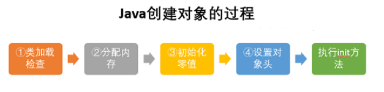
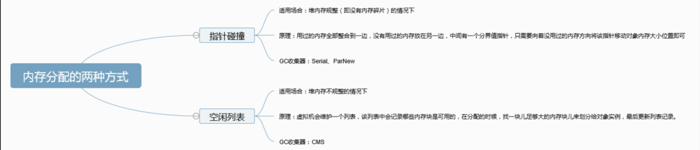
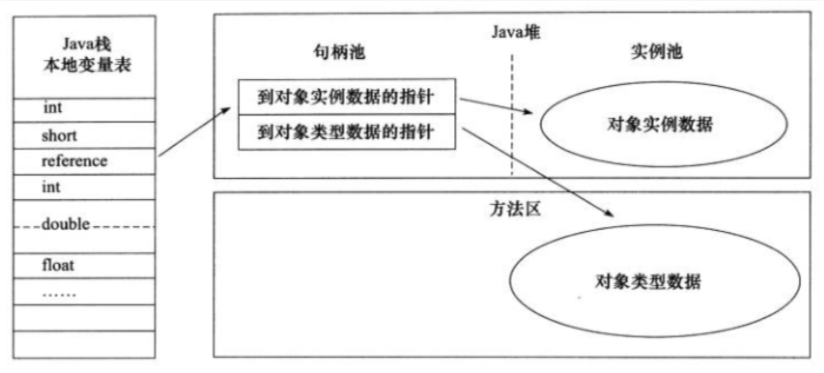
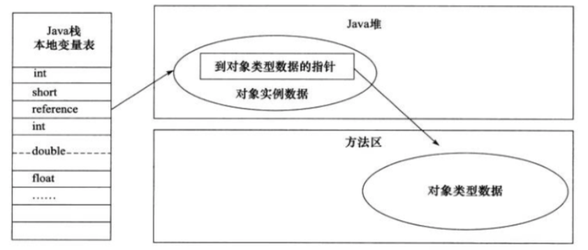
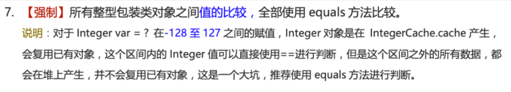

# HotSpot对象模型

## 1 对象的创建



### 1.1 类加载检查

​	当遇到一个new指令时，首先去检查这个指令的参数是否能在常量池中定位到这个类的符号引用，并且检查这个符号引用代表的类是否被加载过，解析过和初始化过。如果没有，则进行接下来的类加载过程。

### 1.2 分配内存

​	在类加载检查通过后，JVM将为新生对象`分配内存`。分配方式有`指针碰撞`和`空闲列表`两种。

​	**选择哪种分配方式由Java堆是否规整决定，而 Java 堆是否规整又由所采用的垃圾收集器是否带有压缩整理功能决定**。

**内存分配的两种方式**

**内存分配并发问题**	

​	由于创建对象是一件非常频繁的事情，作为虚拟机需要保证线程是安全的，采用以下两种方式来保证线程安全：

- **CAS+失败重试**：CAS是乐观锁的一种实现方式。所谓乐观锁就是，每次假设没有冲突而去完成某项操作，如果有冲突就重试，直到成功为止。**虚拟机采用CAS配上失败重试的方式保证更新操作的原子性**
- **TLAB**：为每一个线程预先在EDEN区分配一块内存，当请求的内存大于TLAB的剩余内存或TLAB的内存已用尽时，再采用上述的CAS进行内存分配。

### 1.3 初始化零值

​	内存分配完成后，需要将分配到的内存空间都初始化为零值，保证了对象的实例化字段在程序中不赋初值就可以使用，程序能访问到这些字段的数据类型所对应的零值。

### 1.4 设置对象头

​	初始化零值之后，虚拟机要对对象进行必要的设置，例如这个`对象是哪个类的实例`，`如何找到类的元数据信息`，`对象的哈希码`，`对象的GC分代年龄`等信息。这些信息存放在对象头中。另外，根据虚拟机当前运行状态的不同，如是否启用偏向锁等，对象头会有不同的设置方式

### 1.5 执行init方法

​	从虚拟机视角看，一个新的对象已经产生了。但对于Java程序而言，对象创建才刚开始，`inti`方法还没有执行，所有的字段都还为0.

## 2 对象的内存布局

​	在HotSpot中，对象在内存中的布局可以分为3块区域：`对象头`，`实例数据`和`对齐填充`。

​	`对象头`包含两部分信息，一部分是**用于存放对象自身运行时数据（哈希码，GC分代年龄，锁状态标志等等）**，另一部分是**类型指针**，即对象指向它的类元数据的指针，虚拟机通过这个指针来确定这个对象是哪个类的实例

​	`实例数据部分`是存放对象的真正有效信息，是该程序所定义的各种类型的字段内容。

​	`对齐填充部分`仅仅起着占位作用。因为Hotspot自动内存管理系统要求对象起始地址必须是8字节的整数倍。

## 3 对象的访问定位

​	建立对象就是为了使用对象，Java程序通过栈上的`referance`数据来操作堆上的具体对象。访问方式有**使用句柄**和**直接指针**两种。

1. 句柄：使用句柄的方式的话，Java堆中会划出一块内存来作为句柄池，`reference`中存储的就是对象的句柄地址，句柄包含对象实例数据与类型数据各自的具体地址信息

​	

2. 直接指针：如果使用直接指针访问，那么Java堆对象的布局中就必须考虑如何放置访问类型数据的相关信息，而`reference`中存储的就是对象的地址。

## 字符串常量池常见问题

```java
String str1 = "str";
String str2 = "ing";
String str3 = "str" + "ing";//常量池中的对象
String str4 = str1 + str2; //在堆上创建的新的对象
String str5 = "string";//常量池中的对象
System.out.println(str3 == str4);//false
System.out.println(str3 == str5);//true
System.out.println(str4 == str5);//false
```

> **注意** ：比较 String 字符串的值是否相等，可以使用 `equals()` 方法。 `String` 中的 `equals` 方法是被重写过的。 `Object` 的 `equals` 方法是比较的对象的内存地址，而 `String` 的 `equals` 方法比较的是字符串的值是否相等。

> 对于基本数据类型来说，\==比较的是值。对于引用数据类型来说，==比较的是对象的内存地址

对于编译期可以确定值的字符串，也就是常量字符串，jvm会将其存入字符串常量池

JDK1.7及之后，字符串常量池位于堆中，而运行时常量池位于方法区中。

由此可以知道，平时写代码，尽量避免多个字符串对象拼接，因为这样会重新创建对象。如果需要改变字符串的话，可以使用`StringBuilder`或`StringBuffer`。

不过，当字符串使用`final`关键字声明之后，可以让编译器当作常量处理

```java
final String str1 = "str";
final String str2 = "ing";
// 下面两个表达式其实是等价的
String c = "str" + "str2";// 常量池中的对象
String d = str1 + str2; // 常量池中的对象
System.out.println(c == d);// true
```

下面来看看两种创建字符串对象的方式

```java
// 从字符串常量池中拿对象
String str1 = "abcd";
```

​	这种情况下，jvm 会先检查字符串常量池中有没有"abcd"，如果字符串常量池中没有，则创建一个，然后 str1 指向字符串常量池中的对象，如果有，则直接将 str1 指向"abcd""；

```java
// 直接在堆内存空间创建一个新的对象。
String str2 = new String("abcd");
String str3 = new String("abcd");
```

**只要使用 new 的方式创建对象，便需要创建新的对象** 。

使用 new 的方式创建对象的方式如下，可以简单概括为 3 步：

1. 在堆中创建一个字符串对象
2. 检查字符串常量池中是否有和 new 的字符串值相等的字符串常量
3. 如果没有的话需要在字符串常量池中也创建一个值相等的字符串常量，如果有的话，就直接返回堆中的字符串实例对象地址。

因此，`str2` 和 `str3` 都是在堆中新创建的对象。

## 8 种基本类型的包装类和常量池

​	Java 基本类型的包装类的大部分都实现了常量池技术。

​	`Byte`,`Short`,`Integer`,`Long` 这 4 种包装类默认创建了数值 **[-128，127]** 的相应类型的缓存数据，`Character` 创建了数值在 **[0,127]** 范围的缓存数据，`Boolean` 直接返回 `True` Or `False`。

​	两种浮点数类型的包装类 `Float`,`Double` 并没有实现常量池技术。

**所有整型包装类对象之间值的比较，全部使用 equals 方法比较**。




