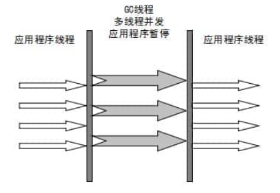

# JVM 垃圾回收


## 1. JVM内存分配与回收

​	Java的自动内存管理主要是针对**对象内存的回收和对象内存的分配**。而在JVM中，堆是管理内存的主要空间， 故自动内存管理最核心的功能是堆内存中对象的分配与回收

​	由于Java堆是垃圾收集器管理的主要区域，因此也被称为GC堆。

​	由于现在收集器都采用分代垃圾收集算法，所以Java堆还可以分为：新生代和老生代。再细致点有：**Eden空间，From Survivor，To Survivor空间**等。

**堆空间的基本结构**


如图所示，Eden区，From Survivor0区，To Survivor1区都属于新生代，Old Memory区属于老年代

​	大部分情况下，对象首先会在Eden区分配，在一次**新生代垃圾回收**后，如果对象还存活，则会进入`s0`或`s1`，并且对象的年龄+1（也就是**Eden区->Survivor区后对象的初始年龄变为1）**，当它的年龄到达一定阈值（默认是15），就会晋升到老年代中。

​	Eden:Survivor0:Survivor1 = 8：1：1，当新生代内存使用超过90%时，就会进行一次minor GC，如果`s1`不为空，则会交换`s0`和`s1`，因为JVM会保证名为To的To Survivor区域是空的。


### 1.1 对象优先在eden区分配

​	大多数情况下，对象在新生代中 eden 区分配。当 eden 区没有足够空间进行分配时，虚拟机将发起一次 Minor GC.下面我们来进行实际测试以下。

​	测试：

```java
package com.w1nd.jvm;

public class GCTest {
    public static void main(String[] args) {
        byte[] allocation1, allocation2;
        allocation1 = new byte[58900*1024];
        //allocation2 = new byte[900*1024];
    }
}

```


​	通过设置JVM参数，发现eden分配已经完全，假设在使用allocation2 分配内存将会发生minorGC.


### 1.2 大对象直接进入老年代

​	大对象就是需要大量连续内存空间的对象（比如：字符串，数组）。

​	为什么要这样？

​	为了避免大对象分配内存时由于minor GC带来的复制而降低效率

### 1.3 长期存活的对象将进入老年代

​	既然虚拟机采用了分代收集的思想来管理内存，那么内存回收时就必须能识别哪些对象应放在新生代，哪些对象应放在老年代中。为了做到这一点，虚拟机给每个对象一个对象年龄（Age）计数器。

​	前面说过，如果有对象经过一次minor GC后仍然存活，则会进入`s0`或`s1`.并且对象的年龄还会+1，当年龄增加到一定程度，就会晋升到老年代中。

​	对象晋升到老年代的年龄阈值，可以通过参数`-XX:MaxTenuringThreshold`来设置.

> 默认晋升年龄并不都是15，这个是要区分垃圾收集器的，CMS就是6

### 1.4 主要进行gc的区域

针对 HotSpot VM 的实现，它里面的 GC 其实准确分类只有两大种：

部分收集 (Partial GC)：

- 新生代收集（Minor GC / Young GC）：只对新生代进行垃圾收集；
- 老年代收集（Major GC / Old GC）：只对老年代进行垃圾收集。需要注意的是 Major GC 在有的语境中也用于指代整堆收集；
- 混合收集（Mixed GC）：对整个新生代和部分老年代进行垃圾收集。

整堆收集 (Full GC)：收集整个 Java 堆和方法区。

## 2. 对象已经死亡？


### 2.1 引用计数法

​	给对象中添加一个引用计数器，每当有一个地方引用它，计数器就加 1；当引用失效，计数器就减 1；任何时候计数器为 0 的对象就是不可能再被使用的。

​	**这个方法实现简单，效率高，但是目前主流的虚拟机中并没有选择这个算法来管理内存，其最主要的原因是它很难解决对象之间相互循环引用的问题。** 

### 2.2 可达性分析算法

​	这个算法的基本思想就是通过一系列的称为 **“GC Roots”** 的对象作为起点，从这些节点开始向下搜索，节点所走过的路径称为引用链，当一个对象到 GC Roots 没有任何引用链相连的话，则证明此对象是不可用的。


​	可作为 GC Roots 的对象包括下面几种:

- 虚拟机栈(栈帧中的本地变量表)中引用的对象
- 本地方法栈(Native 方法)中引用的对象
- 方法区中类静态属性引用的对象
- 方法区中常量引用的对象
- 所有被同步锁持有的对象

### 2.3 引用

​	无论是通过引用计数法判断对象引用数量，还是通过可达性分析法判断对象的引用链是否可达，判定对象的存活都与“引用”有关。

​	引用分为强引用、软引用、弱引用、虚引用四种（引用强度逐渐减弱）

1. **强引用（StrongReference）**

​		如果一个对象具有强引用，那就类似于**必不可少的生活用品**，垃圾回收器绝不会回收它。当内存空间不足，Java 虚拟机宁愿抛出 OutOfMemoryError 错误，使程序异常终止，也不会靠随意回收具有强引用的对象来解决内存不足问题。

2. **软引用（StrongReference）**

​		如果内存空间足够，垃圾回收器就不会回收它，如果内存空间不足了，就会回收这些对象的内存。只要垃圾回收器没有回收它，该对象就可以被程序使用。软引用可用来实现内存敏感的高速缓存。

3. **弱引用（WeakReference）**

​	弱引用与软引用的区别在于：只具有弱引用的对象拥有更短暂的生命周期。在垃圾回收器线程扫描它所管辖的内存区域的过程中，一旦发现了只具有弱引用的对象，不管当前内存空间足够与否，都会回收它的内存。不过，由于垃圾回收器是一个优先级很低的线程， 因此不一定会很快发现那些只具有弱引用的对象。

4. **虚引用（PhantomReference）**

​	"虚引用"顾名思义，就是形同虚设，与其他几种引用都不同，虚引用并不会决定对象的生命周期。如果一个对象仅持有虚引用，那么它就和没有任何引用一样，在任何时候都可能被垃圾回收。

**虚引用主要用来跟踪对象被垃圾回收的活动**。

​	**虚引用与软引用和弱引用的一个区别在于：** 虚引用必须和引用队列（ReferenceQueue）联合使用。当垃圾回收器准备回收一个对象时，如果发现它还有虚引用，就会在回收对象的内存之前，把这个虚引用加入到与之关联的引用队列中。程序可以通过判断引用队列中是否已经加入了虚引用，来了解被引用的对象是否将要被垃圾回收。程序如果发现某个虚引用已经被加入到引用队列，那么就可以在所引用的对象的内存被回收之前采取必要的行动。

​	特别注意，在程序设计中一般很少使用弱引用与虚引用，使用软引用的情况较多，这是因为**软引用可以加速 JVM 对垃圾内存的回收速度，可以维护系统的运行安全，防止内存溢出（OutOfMemory）等问题的产生**。

### 2.4 不可达的对象并非“非死不可”

​	即使在可达性分析法中不可达的对象，也并非是“非死不可”的，这时候它们暂时处于“缓刑阶段”，要真正宣告一个对象死亡，至少要经历两次标记过程：

1. 可达性分析法中不可达的对象被第一次标记并且进行一次筛选，筛选的条件是此对象**是否有必要执行 finalize 方法**。当对象没有覆盖 finalize 方法，或 finalize 方法已经被虚拟机调用过时，虚拟机将这两种情况视为没有必要执行。

2. 被判定为需要执行的对象将会被放在一个队列中进行第二次标记，除非这个对象与引用链上的任何一个对象建立关联，否则就会被真的回收。

### 2.5 如何判断一个常量是废弃变量？

> 1. JDK1.7 之前运行时常量池逻辑包含字符串常量池存放在方法区, 此时 hotspot 虚拟机对方法区的实现为永久代
> 2. JDK1.7 字符串常量池被从方法区拿到了堆中, 这里没有提到运行时常量池,也就是说字符串常量池被单独拿到堆,运行时常量池剩下的东西还在方法区, 也就是 hotspot 中的永久代 。
> 3. JDK1.8 hotspot 移除了永久代用元空间(Metaspace)取而代之, 这时候字符串常量池还在堆, 运行时常量池还在方法区, 只不过方法区的实现从永久代变成了元空间(Metaspace)

​	假如在字符串常量池中存在字符串 "abc"，如果当前没有任何 String 对象引用该字符串常量的话，就说明常量 "abc" 就是废弃常量，如果这时发生内存回收的话而且有必要的话，"abc" 就会被系统清理出常量池了

### 2.6 如何判断一个类是无用的类

​	方法区主要回收的是无用的类

- 该类所有的实例都已经被回收，也就是 Java 堆中不存在该类的任何实例。
- 加载该类的 `ClassLoader` 已经被回收。
- 该类对应的 `java.lang.Class` 对象没有在任何地方被引用，无法在任何地方通过反射访问该类的方法。

## 3. 垃圾收集算法


### 3.1 标记-清除算法

​	该算法分为“标记”和“清除”阶段：首先标记出所有不需要回收的对象，在标记完成后统一回收掉所有没有被标记的对象。它是最基础的收集算法，后续的算法都是对其不足进行改进得到。这种垃圾收集算法会带来两个明显的问题：

1. **效率问题**
2. **空间问题（标记清除后会产生大量不连续的碎片）**


### 3.2 标记-复制算法

​	“标记-复制”收集算法可以将内存分为大小相同的两块，每次使用其中的一块。当这一块的内存使用完后，就将还存活的对象复制到另一块去，然后再把使用的空间一次清理掉。这样就使每次的内存回收都是对内存区间的一半进行回收。


### 3.3 标记-整理算法

​	根据老年代的特点提出的一种标记算法，标记过程仍然与“标记-清除”算法一样，但后续步骤不是直接对可回收对象回收，而是让所有存活的对象向一端移动，然后直接清理掉端边界以外的内存。


### 3.4 分代收集算法

​	根据对象存活周期的不同将内存分为几块。一般将 java 堆分为新生代和老年代，这样我们就可以根据各个年代的特点选择合适的垃圾收集算法。

​	**比如在新生代中，每次收集都会有大量对象死去，所以可以选择”标记-复制“算法，只需要付出少量对象的复制成本就可以完成每次垃圾收集。而老年代的对象存活几率是比较高的，而且没有额外的空间对它进行分配担保，所以我们必须选择“标记-清除”或“标记-整理”算法进行垃圾收集。**

## 4. 垃圾收集器

​	**收集算法是内存回收的方法论，那么垃圾收集器就是内存回收的具体实现。**

### 4.1 Serial收集器

​	单线程收集器。 **“单线程”** 的意义不仅仅意味着它只会使用一条垃圾收集线程去完成垃圾收集工作，更重要的是它在进行垃圾收集工作的时候必须暂停其他所有的工作线程（ **"Stop The World"** ），直到它收集结束。

​	**新生代采用标记-复制算法，老年代采用标记-整理算法**

​	

缺点：不良用户体验

优点：**简单而高效（与其他收集器的单线程相比）**。Serial 收集器由于没有线程交互的开销，自然可以获得很高的单线程收集效率

### 4.2 ParNew收集器

​	Serial收集器的多线程版本。**除了使用多线程进行垃圾收集外，其余行为（控制参数、收集算法、回收策略等等）和 Serial 收集器完全一样。**

​	**新生代采用标记-复制算法，老年代采用标记-整理算法。**



​	除了 Serial 收集器外，只有它能与 CMS 收集器（真正意义上的并发收集器，后面会介绍到）配合工作。

### 4.3 Parallel Scavenge 收集器

​	Parallel Scavenge 收集器也是使用标记-复制算法的多线程收集器，它看上去几乎和 ParNew 都一样。

​	但是它关注的是**吞吐量（高效率的利用CPU）**。**CMS 等垃圾收集器的关注点更多的是用户线程的停顿时间（提高用户体验）**

​	**所谓吞吐量就是 CPU 中用于运行用户代码的时间与 CPU 总消耗时间的比值。**

​	**新生代采用标记-复制算法，老年代采用标记-整理算法。**


### 4.4 Serail Old收集器

​	**Serial 收集器的老年代版本**，它同样是一个单线程收集器。它主要有两大用途：一种用途是在 JDK1.5 以及以前的版本中与 Parallel Scavenge 收集器搭配使用，另一种用途是作为 CMS 收集器的后备方案

### 4.5 Parallel Old收集器

​	**Parallel Scavenge 收集器的老年代版本**。使用多线程和“标记-整理”算法。在注重吞吐量以及 CPU 资源的场合，都可以优先考虑 Parallel Scavenge 收集器和 Parallel Old 收集器。

### 4.6 CMS收集器

​	**CMS（Concurrent Mark Sweep）收集器是一种以获取最短回收停顿时间为目标的收集器。它非常符合在注重用户体验的应用上使用。**

​	实现了垃圾收集线程与用户线程同时工作。

​	CMS 收集器是一种 **“标记-清除”算法**实现的，它的运作过程相比于前面几种垃圾收集器来说更加复杂一些。整个过程分为四个步骤：

- **初始标记**：暂停所有的其他线程，并记录下直接与root相连的对象，速度很快
- **并发标记**：同时开启 GC 和用户线程，用一个闭包结构去记录可达对象。但在这个阶段结束，这个闭包结构并不能保证包含当前所有的可达对象。因为用户线程可能会不断的更新引用域，所以 GC 线程无法保证可达性分析的实时性。所以这个算法里会跟踪记录这些发生引用更新的地方。
- **重新标记**：重新标记阶段就是为了修正并发标记期间因为用户程序继续运行而导致标记产生变动的那一部分对象的标记记录，这个阶段的停顿时间一般会比初始标记阶段的时间稍长，远远比并发标记阶段时间短
- **并发清除**：开启用户线程，同时 GC 线程开始对未标记的区域做清扫。


从它的名字就可以看出它是一款优秀的垃圾收集器，主要优点：**并发收集、低停顿**。但是它有下面三个明显的缺点：

- **对 CPU 资源敏感；**
- **无法处理浮动垃圾；**
- **它使用的回收算法-“标记-清除”算法会导致收集结束时会有大量空间碎片产生**

### 4.7 G1收集器

​	**G1 (Garbage-First) 是一款面向服务器的垃圾收集器,主要针对配备多颗处理器及大容量内存的机器. 以极高概率满足 GC 停顿时间要求的同时,还具备高吞吐量性能特征.**

​	具备以下特点：

- 并行与并发
- 分代收集
- 空间整合
- 可预测的停顿

G1 收集器的运作大致分为以下几个步骤：

- **初始标记**
- **并发标记**
- **最终标记**
- **筛选回收**
