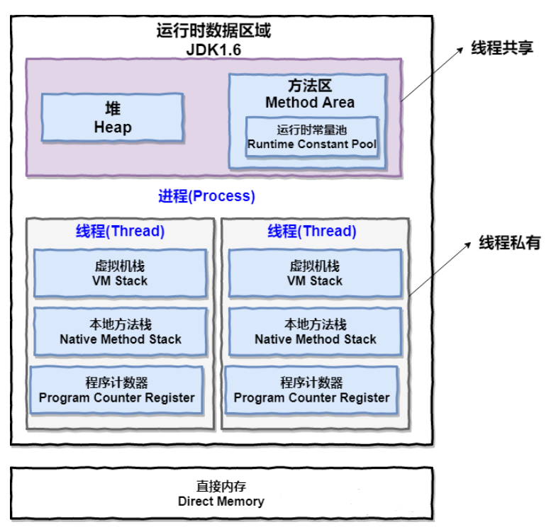
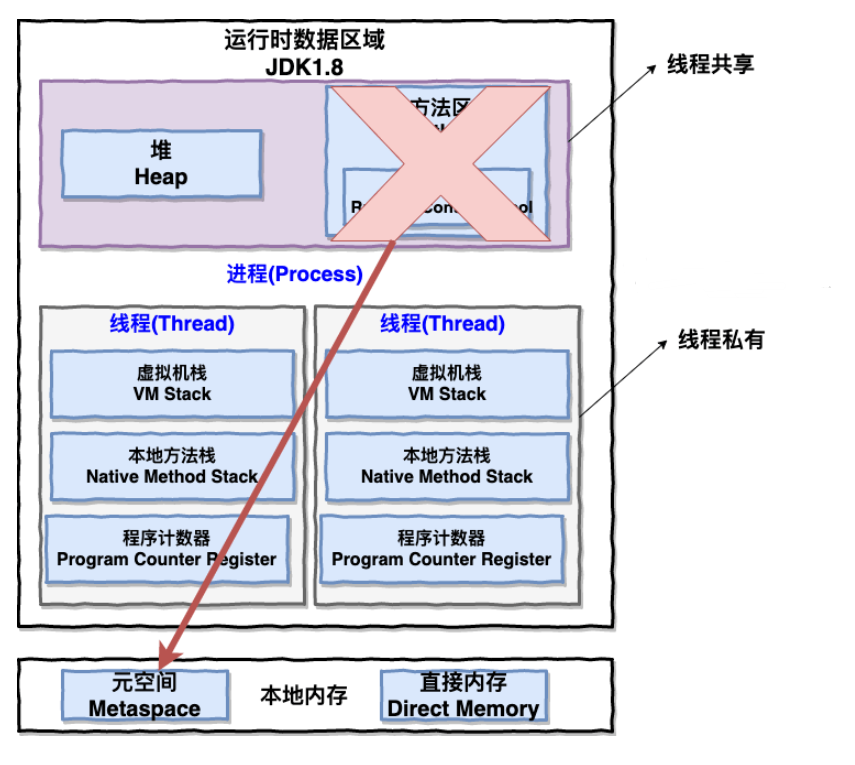
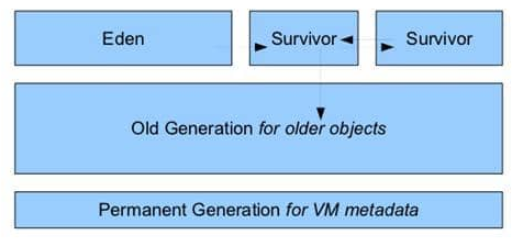
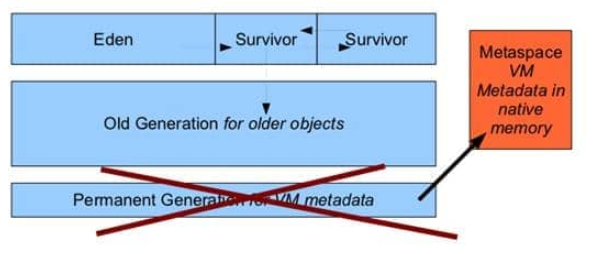

# JVM内存模型

参考[Java 内存区域详解 | JavaGuide](https://javaguide.cn/java/jvm/memory-area/#二-运行时数据区域)

##  运行时数据区域

**JDK1.8之前**



**JDK1.8**



线程私有的：`程序计数器`，`虚拟机栈`，`本地方法栈`

线程共享的：`堆`，`方法区`，`直接内存`

### 1.1 程序计数器

​	字节码解释器工作时通过改变这个计数器的值来选取下一个需要执行的字节码指令，是程序控制流的指示器。

​	每个线程需要依靠一个独立的程序计数器恢复到正确的执行位置，各个程序计数器互不影响，独立存储

作用：

- 字节码解释器通过改变程序计数器来依次读取指令，实现代码的流程控制
- 在多线程中，程序计数器可以用于记录当前线程执行的位置，使得线程被中断或阻塞后可以恢复原来位置

### 1.2 虚拟机栈

​	线程私有的，生命周期与线程相同，描述的是`Java方法执行的内存模型`，每次方法调用的数据都是通过栈来传递的

​	Java虚拟机栈是由一个个栈桢组成，可以称为局部变量表

​	该局部变量表存放了编译可知的各种数据类型，对象引用。

在这里可能会出现两种报错：`StackOverFlowError`和`OutMemoryError`

- `StackOverFlowError`：内存大小不允许动态扩展，当线程请求栈的深度超过当前`Java`虚拟机栈的最大深度时，就会抛出该错误
- `OutMemoryError`：内存大小可以动态扩展，但虚拟机依然无法申请到足够的内存空间

**在虚拟机中，方法/函数是如何调用的？**

​	每一次函数调用都会有一个对应的栈帧被压入Java栈，每一个函数调用结束后，就会有一个栈帧被弹出

### 1.3 本地方法栈

​	和虚拟机栈差不多，不同的是：虚拟机栈为**虚拟机执行Java方法服务**，而**本地方法栈则为虚拟机使用到的Native方法服务**

### 1.4 堆

​	是Java虚拟机中管理内存中最大的一块，是所有线程共享的一块内存区域，虚拟机启动时自动创建。

​	**此内存域的唯一目的是存放对象实例，几乎所有的对象实例以及数组都在这里分配内存**

​	Java堆是垃圾收集器管理的主要区域，因此也被称为**GC堆**。由于收集器采用分代垃圾收集算法，所以Java堆也可以细分为：新生代和老生代

在JDK7版本及之前，堆内存被通常分为下面三个部分：

1. 新生代
2. 老生代
3. 永久代



​	Eden区和两个Survivor区都属于新生代

JDK8版本之后，永久代被移除了，取而代之的是元空间，元空间使用的是直接内存



​	大部分情况，对象都会首先在 Eden 区域分配，在一次新生代垃圾回收后，如果对象还存活，则会进入 s0 或者 s1，并且对象的年龄还会加 1(Eden 区->Survivor 区后对象的初始年龄变为 1)，当它的年龄增加到一定程度（默认为 15 岁），就会被晋升到老年代中。对象晋升到老年代的年龄阈值，可以通过参数 `-XX:MaxTenuringThreshold` 来设置。

### 1.5 方法区

​	方法区是各个线程共享的内存区域，用来存储已被虚拟机加载的`类信息`，`常量`，`静态变量`，`即时编译器编译后的代码`等数据。方法区也被称为永久代。

>  《Java 虚拟机规范》只是规定了有方法区这么个概念和它的作用，并没有规定如何去实现它。那么，在不同的 JVM 上方法区的实现肯定是不同的了。 **方法区和永久代的关系很像 Java 中接口和类的关系，类实现了接口，而永久代就是 HotSpot 虚拟机对虚拟机规范中方法区的一种实现方式。** 也就是说，永久代是 HotSpot 的概念，方法区是 Java 虚拟机规范中的定义，是一种规范，而永久代是一种实现，一个是标准一个是实现，其他的虚拟机实现并没有永久代这一说法。

**常用常数**

JDK 1.8 之前永久代还没被彻底移除的时候通常通过下面这些参数来调节方法区大小

```java
-XX:PermSize=N //方法区 (永久代) 初始大小
-XX:MaxPermSize=N //方法区 (永久代) 最大大小,超过这个值将会抛出 OutOfMemoryError 异常:java.lang.OutOfMemoryError: PermGen
```

JDK 1.8 的时候，方法区（HotSpot 的永久代）被彻底移除了（JDK1.7 就已经开始了），取而代之是元空间，元空间使用的是直接内存。

```java
-XX:MetaspaceSize=N //设置 Metaspace 的初始（和最小大小）
-XX:MaxMetaspaceSize=N //设置 Metaspace 的最大大小
```

与永久代的不同的是，如果不指定大小的话，随着更多类的创建，虚拟机会耗尽所有可用的系统内存。

为什么使用永久代替换为元空间？

1. 整个永久代有一个JVM本身设置的固定大小上限，无法进行调整。而元空间使用的是`直接内存`，受本机可用内存的限制，虽然元空间仍然可能溢出，但是比原来的几率要小
2. 元空间存放的是类的元数据，，这样加载多少类的元数据就不由`MaxPermSize`控制了，而由系统的实际可用空间控制
3. 在 JDK8，合并 HotSpot 和 JRockit 的代码时, JRockit 从来没有一个叫永久代的东西, 合并之后就没有必要额外的设置这么一个永久代的地方了。

### 1.6 运行时常量池

运行时常量池是方法区的一部分。Class文件除了有类的版本，字段，方法，接口等描述信息外，还有常量池表。

> JDK1.7 之前运行时常量池逻辑包含字符串常量池存放在方法区, 此时 hotspot 虚拟机对方法区的实现为永久代
>
> JDK1.7 字符串常量池被从方法区拿到了堆中, 这里没有提到运行时常量池,也就是说字符串常量池被单独拿到堆,运行时常量池剩下的东西还在方法区, 也就是 hotspot 中的永久代 。
>
> JDK1.8 hotspot 移除了永久代用元空间(Metaspace)取而代之, 这时候字符串常量池还在堆, 运行时常量池还在方法区, 只不过方法区的实现从永久代变成了元空间(Metaspace)

### 1.7 直接内存

​	**直接内存并不是虚拟机运行时数据区的一部分，也不是虚拟机规范中定义的内存区域，但是这部分内存也被频繁地使用。而且也可能导致 OutOfMemoryError 错误出现。**

​	JDK1.4 中新加入的 **NIO(New Input/Output) 类**，引入了一种基于**通道（Channel）\**与\**缓存区（Buffer）\**的 I/O 方式，它可以直接使用 Native 函数库直接分配堆外内存，然后通过一个存储在 Java 堆中的 DirectByteBuffer 对象作为这块内存的引用进行操作。这样就能在一些场景中显著提高性能，因为\**避免了在 Java 堆和 Native 堆之间来回复制数据**。


