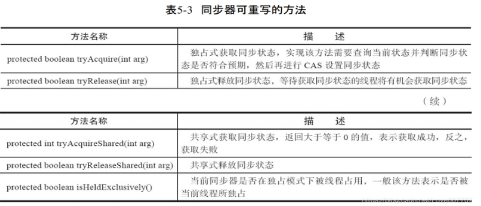
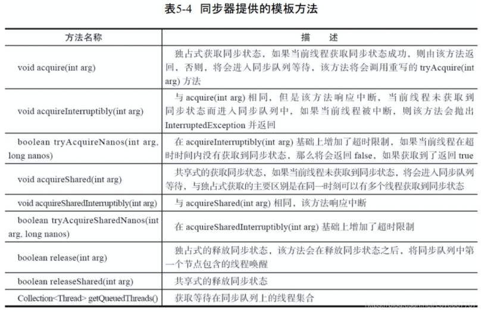
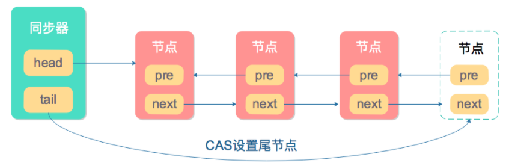
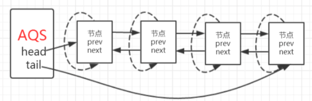

# Java并发：AQS详解

## 1. 什么是AQS

- AQS简称队列同步器，是用来**构建锁**或者其他**同步组件**的基础框架。
- 同步器本身没有实现任何**同步接口**，它定义了若干同步状态**获取**和**释放**的方法来供自定义同步组件使用
- AQS既支持独占式获取同步状态，也可以支持**共享式**地获取同步状态

（可重入锁-ReentrantLock，读写锁-ReentrantReadWriteLock，闭锁CountDownLatch都是基于AQS实现的）

​	以下简称AQS为同步器

​	同步器是实现锁的关键，它们的关系是：

- 锁是面向使用者的，定义了使用者与锁交互的接口，隐藏了实现细节
- 同步器面向锁的实现者，简化了锁的实现方式，屏蔽了同步状态管理，线程排队，等待与唤醒等底层操作

可以说，同步器是锁的灵魂

**同步器如何使用呢？**

​	一般来说，子类通过继承同步器并实现它的抽象方法来管理同步器

## 2. 同步器的接口与示例

​	同步器提供了三个方法来管理同步状态

1. `getState()`：获取当前同步状态
2. `setState(int newState)`：设置当前同步状态
3. `compareAndSetState(int expect, int update)`：使用`CAS`设置当前状态，该方法能保证状态设置的原子性

​	下图是同步器可重写的方法：



​	下图是同步器提供的模板方法，实现自定义同步组件时需要：



​	同步器提供的模板方法分为3类：`独占式获取与释放同步状态`，`共享式获取与释放同步状态`，`查询同步队列中的等待线程情况`

## 3. Node节点与同步队列

​	我们知道，AQS是通过维护一个队列来维护线程之间的同步状态，意思就是说如果加锁失败的线程，会被当作一个Node节点放入该队列当中。

​	这里插一句，那么**AQS是如何实现加锁操作呢**？

​	其实，AQS内部有一个`state`变量，当某个线程加锁成功了，就会设置该变量为`1`，意味着该锁被占用了，其他线程来之后会调用CAS操作，发现值已经被修改了，那么就会进入**同步队列中***了。

​	接下来继续说说Node的结构（Node其实对应的是每个线程）

```java
    static final class Node {
        
        static final Node SHARED = new Node();

        static final Node EXCLUSIVE = null;
        
        static final int CANCELLED =  1;

        static final int SIGNAL    = -1;

        static final int CONDITION = -2;
        
        static final int PROPAGATE = -3;

        volatile int waitStatus; // 当前节点状态

        volatile Node prev; // 前驱节点
 
        volatile Node next; // 后继节点

        volatile Thread thread; // 该节点所包装的线程对象

        Node nextWaiter; // 等待队列的下一个节点

        final boolean isShared() {
            return nextWaiter == SHARED;
        }

        final Node predecessor() throws NullPointerException {
            Node p = prev;
            if (p == null)
                throw new NullPointerException();
            else
                return p;
        }

        Node() {   
        }

        Node(Thread thread, Node mode) {
            this.nextWaiter = mode;
            this.thread = thread;
        }

        Node(Thread thread, int waitStatus) {
            this.waitStatus = waitStatus;
            this.thread = thread;
        }
    }
```

下述代码是节点的状态（保留源码注释）

```java
/** waitStatus value to indicate thread has cancelled */
static final int CANCELLED =  1;  // 取消状态
/** waitStatus value to indicate successor's thread needs unparking */
static final int SIGNAL    = -1; // 后继节点处在等待队列中，如果当前节点释放则会通知后继节点，将后继节点迁移到同步队列
/** waitStatus value to indicate thread is waiting on condition */
// 当前节点在等待队列中，等待在Condition上，只有当其他线程对Condition调用了signal()方法，该节点才会从等待队列迁移到同步队列
static final int CONDITION = -2;
/**
* waitStatus value to indicate the next acquireShared should
* unconditionally propagate
*/
static final int PROPAGATE = -3; // 下一次共享式同步状态会被无条件传播下去
```

附：这里提到了Confition和等待队列的概念，后续会讲到，注意，经常有人把等待队列和同步队列混为一谈，这两个根本不是同个东西！

`0`：中间状态，后继节点已经唤醒，但是还没有完成工作。

同步上述对Node节点的结构分析，我们可以构建出一个同步队列的基本结构



同步队列遵循`FIFO`

## 4.  独占式同步状态获取与释放

### 获取

​	还记得前面提到的同步器可以实现的模板方法吗，同步器可以通过`acquire(int arg)`方法独占式地获取同步状态，该方法对中断不敏感（也就是说，当线程通过该方法获取同步状态失败进入同步队列中，后续对线程进行中断操作，也不会导致它从同步队列中移出）。

​	下面来看看`acquire`的源码(附源码注释)

```java

/**
* Acquires in exclusive mode, ignoring interrupts.  Implemented
* by invoking at least once {@link #tryAcquire},
* returning on success.  Otherwise the thread is queued, possibly
* repeatedly blocking and unblocking, invoking {@link
* #tryAcquire} until success.  This method can be used
* to implement method {@link Lock#lock}.
*
* @param arg the acquire argument.  This value is conveyed to
*        {@link #tryAcquire} but is otherwise uninterpreted and
*        can represent anything you like.
*/
// 发现该方法包含了四个其他方法
// tryAcquire方法负责获取同步状态获取，如果获取失败，则构造同步节点并通过addWaiter方法将该节点
// 加入同步队列的尾部，最后调用acquireQueued方法，自旋地获取同步状态
public final void acquire(int arg) {
    if (!tryAcquire(arg) &&
        acquireQueued(addWaiter(Node.EXCLUSIVE), arg))
        selfInterrupt();
}
```

​	前方高能！套娃开始，下面我们先看看`tryAcquire`方法

```java
// 注意到，这其实是个"空方法"，是要自定义同步器自己来实现的，如果同步状态获取失败，则构造同步节点
// (独占式的，同一时刻只能有一个线程成功获取同步状态)
protected boolean tryAcquire(int arg) {
    throw new UnsupportedOperationException();
}
```

​	`addWaiter`方法和`enq`方法

```java
/**
* Creates and enqueues node for current thread and given mode.
*
* @param mode Node.EXCLUSIVE for exclusive, Node.SHARED for shared
* @return the new node
*/
private Node addWaiter(Node mode) {
    // 将当前线程封装为Node节点
    Node node = new Node(Thread.currentThread(), mode);
    // Try the fast path of enq; backup to full enq on failure
    // 获取尾结点
    Node pred = tail;
    if (pred != null) { // 如果尾结点不为空
        node.prev = pred;	// 尾插法
        if (compareAndSetTail(pred, node)) {	// CAS将当前节点插到同步队列中
            pred.next = node;
            return node;
        }
    }
    // 尾节点为空或CAS插入失败，调用enq
    enq(node);
    return node;
}

/**
* Inserts node into queue, initializing if necessary. See picture above.
* @param node the node to insert
* @return node's predecessor
*/
private Node enq(final Node node) {
    for (;;) {
        Node t = tail; // 初始化同步队列
        // 如果尾结点为空
        if (t == null) { // Must initialize
            if (compareAndSetHead(new Node()))
                tail = head;
        } else {
            // 反之继续尝试，将当前节点插到同步队列中
            node.prev = t;
            if (compareAndSetTail(t, node)) {
                t.next = node;
                return t;
            }
        }
    }
}
```

​	注意到：`acquier`方法中调用了一个`enq`方法，当`acquier`方法调用插入节点失败（尾结点为空或CAS失败）时，就会让`enq`做队列头节点初始化或CAS尾插操作。

`acquireQueued`方法

​	前面说的都是获取锁失败后包装成Node插入队列的过程，那么对于这些Node（线程）他们也会调用`acquireQueued`方法在队列中不断尝试获取锁。

```java
/**
* Acquires in exclusive uninterruptible mode for thread already in
* queue. Used by condition wait methods as well as acquire.
*
* @param node the node
* @param arg the acquire argument
* @return {@code true} if interrupted while waiting
*/
final boolean acquireQueued(final Node node, int arg) {
    boolean failed = true;
    try {
        boolean interrupted = false;
        // 自旋
        for (;;) {
            // 获取前驱节点
            final Node p = node.predecessor();
            // 如果前驱节点为头结点并且获取同步状态成功
            if (p == head && tryAcquire(arg)) {
                // 将当前节点设置为头结点
                setHead(node);
                // 删除原来的头结点
                p.next = null; // help GC
                failed = false;
                return interrupted;
            }
            if (shouldParkAfterFailedAcquire(p, node) &&
                parkAndCheckInterrupt())
                interrupted = true;
        }
    } finally {
        // 获取失败将当前节点取消
        if (failed)
            cancelAcquire(node);
    }
}


/**
* Sets head of queue to be node, thus dequeuing. Called only by
* acquire methods.  Also nulls out unused fields for sake of GC
* and to suppress unnecessary signals and traversals.
*
* @param node the node
*/
private void setHead(Node node) {
    head = node;
    node.thread = null;
    node.prev = null;
}
```

​	

​	同样的，这也是使用了自旋方式获取锁，当前驱节点是头节点并且获取同步状态成功时，则将当前节点设置为头结点，表示当前线程能够获取锁，方法执行结束。下面来说说如果获取失败后，会怎么做

​	`shouldParkAfterFailedAcquire`方法

​	在不断尝试让判断前驱节点是否为头结点并且获取锁的同时，还会调用`shouldParkAfterFailedAcquire`将前驱节点设置为`Signal`，成功后会调用`parkAndCheckInterrupt`方法进行线程的阻塞。

```java
/**
* Checks and updates status for a node that failed to acquire.
* Returns true if thread should block. This is the main signal
* control in all acquire loops.  Requires that pred == node.prev.
*
* @param pred node's predecessor holding status
* @param node the node
* @return {@code true} if thread should block
*/
private static boolean shouldParkAfterFailedAcquire(Node pred, Node node) {
    // 获取前驱节点的节点状态
    int ws = pred.waitStatus;
    if (ws == Node.SIGNAL)
        /*
             * This node has already set status asking a release
             * to signal it, so it can safely park.
             */
        return true;
    if (ws > 0) {  // 如果前驱节点被取消
        /*
             * Predecessor was cancelled. Skip over predecessors and
             * indicate retry.
             */
        do {
            node.prev = pred = pred.prev;
        } while (pred.waitStatus > 0); // 找到下一个不被取消的前驱节点
        pred.next = node;
    } else {
        /*
             * waitStatus must be 0 or PROPAGATE.  Indicate that we
             * need a signal, but don't park yet.  Caller will need to
             * retry to make sure it cannot acquire before parking.
             */
        // 当前驱节点不是取消状态时，将前驱节点状态设置为-1，表示后继节点应该处于等待状态
        compareAndSetWaitStatus(pred, ws, Node.SIGNAL); 
    }
    return false;
}


/**
* Convenience method to park and then check if interrupted
*
* @return {@code true} if interrupted
*/
private final boolean parkAndCheckInterrupt() {
    LockSupport.park(this); // 用于阻塞当前线程的
    return Thread.interrupted();
}
```

做个小总结：`acquireQueued()`方法在自旋过程做了两件事：

1. ​	如果当前节点的前驱节点是头节点，并且能够获取同步状态的话，则表示当前线程能够获取锁，该方法执行退出
2. ​    获取锁失败的话，则会将节点状态设置为`SigNal`，然后调用`LockSupport.park(this);`阻塞当前线程

`selfInterrupt`方法

​	该方法也是用来阻塞当前线程的

```java
/**
* Convenience method to interrupt current thread.
*/
static void selfInterrupt() {
    Thread.currentThread().interrupt();
}
```

### 释放

`release`方法

```java
// 同样的，如果同步状态释放成功（tryRelease返回true），则会判断if（head指向的头结点不为null，状态值不为0）才执行unparkSuccessor
public final boolean release(int arg) {
    if (tryRelease(arg)) {
        Node h = head;
        if (h != null && h.waitStatus != 0)
            unparkSuccessor(h);
        return true;
    }
    return false;
}
```

`tryRelease`方法

```java
protected boolean tryRelease(int arg) {
    throw new UnsupportedOperationException();
}
```

`unparkSuccessor`方法

```java
/**
* Wakes up node's successor, if one exists.
*
* @param node the node
*/
private void unparkSuccessor(Node node) {
    /*
    * If status is negative (i.e., possibly needing signal) try
    * to clear in anticipation of signalling.  It is OK if this
    * fails or if status is changed by waiting thread.
    */
    int ws = node.waitStatus;
    if (ws < 0)
        compareAndSetWaitStatus(node, ws, 0);

    /*
    * Thread to unpark is held in successor, which is normally
    * just the next node.  But if cancelled or apparently null,
    * traverse backwards from tail to find the actual
    * non-cancelled successor.
    */
    // 获取当前节点的后继节点
    Node s = node.next;
    if (s == null || s.waitStatus > 0) {
        s = null;
        for (Node t = tail; t != null && t != node; t = t.prev) // 找到最后一个满足状态<=0的后继节点
            if (t.waitStatus <= 0)
                s = t;
    }
    if (s != null)
        LockSupport.unpark(s.thread); // 唤醒该节点的后继节点所包装的线程
}
```

​	每一次释放后就会唤醒队列中该节点的后继节点所引用的线程。

## 5. 共享式同步状态获取与释放

​	共享式与独占式的主要区别在于：同一时刻能否有多个线程同时获取到同步状态。熟悉数据库原理的知道，读读操作是能够同时执行，如果访问模式都采用独占式，将会影响吞吐量与效率。

### 获取，释放

​	这里本来是打算获取释放分开写的，后来发现在共享模式在获取时会调用释放的函数，那就放在一起说吧= =

​	共享与独占的逻辑差不多，这里就简单分析下源码

```java
public final void acquireShared(int arg) {
    if (tryAcquireShared(arg) < 0)
        doAcquireShared(arg);
}

// 同样，这里是需要自定义同步器实现的，当返回值大于等于0时，表示能够获取同步状态
protected int tryAcquireShared(int arg) {
    throw new UnsupportedOperationException();
}

/**
* Acquires in shared uninterruptible mode.
* @param arg the acquire argument
*/
private void doAcquireShared(int arg) {
    final Node node = addWaiter(Node.SHARED); 
    boolean failed = true;
    try {
        boolean interrupted = false;
        for (;;) {
            final Node p = node.predecessor();  // 获取前驱节点
            if (p == head) {  // 如果是头结点
                int r = tryAcquireShared(arg); // 如果当前线程获取成功
                if (r >= 0) {
                    setHeadAndPropagate(node, r);
                    p.next = null; // help GC
                    if (interrupted)
                        selfInterrupt();
                    failed = false;
                    return;
                }
            }
            if (shouldParkAfterFailedAcquire(p, node) &&  
                // shouldParkAfterFailedAcquire至少执行两遍，第一遍将前驱设置为Signal状态，第二遍检测到signal才返回true
                parkAndCheckInterrupt())
                interrupted = true;
        }
    } finally {
        if (failed)
            cancelAcquire(node);
    }
}
```

`setHeadAndPropagate`

```java
// node指当前执行的线程，propagate代表tryAcquireShared的返回值
// propagate必然>=0，>0是指获取共享锁成功后，还有剩余共享锁可以获取，如果=0，则说明没有剩余共享锁可以获取
private void setHeadAndPropagate(Node node, int propagate) {
    // 保存旧的head
    Node h = head; // Record old head for check below
    setHead(node);
	
    if (propagate > 0 || h == null || h.waitStatus < 0 ||
        (h = head) == null || h.waitStatus < 0) {
        Node s = node.next;
        if (s == null || s.isShared())
            doReleaseShared();
    }
}
```

​	这个函数其实难点在与这个条件判断语句，此函数的大概意思是：node获取锁成功出队，设置新head，并**唤醒后继共享节点**。这就是和独占式不同的地方，由于共享锁是可以多个线程共有的，当一个节点的线程获取共享锁后，必然要通知后继共享节点的线程，也可以获取锁了。如此才能提高吞吐量。

​	对下是对`if`的分析：

1. **propagate>0**

​	如果有剩余资源，那么判断为true，后面的判断就被短路了，这种情况在`ReentrantReadLock`中会发生

​	而`propagate`是可以等于0的，表示没有剩余资源了，在`Semaphore`中会发生

2. **h == null || h.waitStatus < 0**

​	这里 `h == null`是防止空指针异常发生的标准写法，一般是不可能成立的。下面来看看`h.waitStatus < 0`：

- `h.waitStatus=0`，**某个线程释放了锁**或者**前一个节点获取共享锁传播**，唤醒后继节点时将`h.waitStatus=-1`设置为0
- `h.waitStatus=-3`，`doReleaseShared`唤醒`head`后继节点后`h.waitStatus`从-1到0，还没来得及更新`head`，即被唤醒的共享节点还没有`setHeadAndPropagate`，又有线程`doReleaseShared`唤醒head后继节点`h.waitStatus`从0到-3;

```java
// 唤醒处于等待状态的节点
private void doReleaseShared() {
    for (;;) {
        Node h = head;
        if (h != null && h != tail) {
            int ws = h.waitStatus;
            if (ws == Node.SIGNAL) {
                if (!compareAndSetWaitStatus(h, Node.SIGNAL, 0))
                    continue;            // loop to recheck cases
                unparkSuccessor(h);
            }
            else if (ws == 0 &&
                     !compareAndSetWaitStatus(h, 0, Node.PROPAGATE)) // 设置head为传播模式
                continue;                // loop on failed CAS
        }
        // 如果head没有变，则break退出循环。因为有可能被唤醒的节点获取了锁出了队列，导致head变了
        if (h == head)                   // loop if head changed
            break;
    }
}

private void unparkSuccessor(Node node) {
    int ws = node.waitStatus;
    if (ws < 0)
        compareAndSetWaitStatus(node, ws, 0);
	
    // 唤醒后继节点的线程，若为空 or 取消了，从tail往前遍历找到一个正常的节点
    Node s = node.next;
    if (s == null || s.waitStatus > 0) {
        s = null;
        for (Node t = tail; t != null && t != node; t = t.prev)
            if (t.waitStatus <= 0)
                s = t;
    }
    if (s != null)
        LockSupport.unpark(s.thread);
}
```

3. **(h = head) == null || h.waitStatus < 0**

    `(h = head) == null`一般情况都不为空，判断`h.waitStatus<0`，有如下情况

    - `h.waitStatus = 0`，后继节点刚好入队列，还没走到`shouldParkAfterFailedAcquire`中修改前继节点的代码。
    - `h.waitStatus = -3`，上一个共享节点被唤醒后，成为新的head，又有其他线程释放锁调用`doReleaseShared`，`h.waitStatus`从0改为-3。
    - `h.waitStatus = -1`，已经调用了`shouldParkAfterFailedAcquire`，`waitStatus`从0 or -3 改为 -1，可能阻塞，也可能未阻塞


