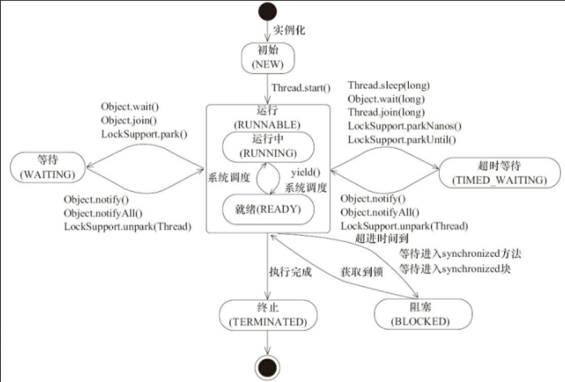

# Java并发编程基础

## 1. 线程简介

### 1. 1线程状态

```java
package Thread;

import utils.SleepUtils;

public class ThreadState {
    public static void main(String[] args) {
        new Thread(new TimeWaiting(), "TimeWaitingThread").start();
        new Thread(new Waiting(), "WaitingThread").start();
        // 使用两个Blocked线程，一个获取锁成功，另一个被阻塞
        new Thread(new Blocked(), "BlockedThread-1").start();
        new Thread(new Blocked(), "BlockedThread-2").start();
    }

    // 该线程不断地进行睡眠
    static class  TimeWaiting implements Runnable {
        @Override
        public void run() {
            while (true) {
                SleepUtils.second(100);
            }
        }
    }

    // 该线程在waiting.class实例上等待
    static class Waiting implements Runnable {
        @Override
        public void run() {
            while (true) {
                synchronized (Waiting.class) {
                    try {
                        Waiting.class.wait();
                    } catch (InterruptedException e) {
                        e.printStackTrace();
                    }
                }
            }
        }
    }

    static class Blocked implements Runnable {
        @Override
        public void run() {
            synchronized (Blocked.class) {
                while (true) {
                    SleepUtils.second(100);
                }
            }
        }
    }
}
```

​	启动程序后，在终端使用`jps`查看进程号

```java
PS D:\java1\javase> jps
23376 Launcher
5168 ThreadState   <-------------该进程
4692 RemoteMavenServer36  
7524
4168 Jps
```

​	使用`jstack 5168`查看线程

```java
"BlockedThread-2" #15 prio=5 os_prio=0 tid=0x000000001e851800 nid=0x1cf4 waiting for monitor entry [0x000000002061f000]
   java.lang.Thread.State: BLOCKED (on object monitor) <--------阻塞
        at Thread.ThreadState$Blocked.run(ThreadState.java:45)
        - waiting to lock <0x000000076bebcea8> (a java.lang.Class for Thread.ThreadState$Blocked)
        at java.lang.Thread.run(Thread.java:748)

"BlockedThread-1" #14 prio=5 os_prio=0 tid=0x000000001e853000 nid=0x4038 waiting on condition [0x000000002051f000]
   java.lang.Thread.State: TIMED_WAITING (sleeping) <---------------获得锁，等待中
        at java.lang.Thread.sleep(Native Method)
        at java.lang.Thread.sleep(Thread.java:340)
        at java.util.concurrent.TimeUnit.sleep(TimeUnit.java:386)
        at utils.SleepUtils.second(SleepUtils.java:8)
        at Thread.ThreadState$Blocked.run(ThreadState.java:45)
        - locked <0x000000076bebcea8> (a java.lang.Class for Thread.ThreadState$Blocked)
        at java.lang.Thread.run(Thread.java:748)

"WaitingThread" #13 prio=5 os_prio=0 tid=0x000000001e850000 nid=0x72c in Object.wait() [0x000000002041e000]
   java.lang.Thread.State: WAITING (on object monitor)  <---------------等待
        at java.lang.Object.wait(Native Method)
        - waiting on <0x000000076bebad20> (a java.lang.Class for Thread.ThreadState$Waiting)
        at java.lang.Object.wait(Object.java:502)
        at Thread.ThreadState$Waiting.run(ThreadState.java:31)
        - locked <0x000000076bebad20> (a java.lang.Class for Thread.ThreadState$Waiting)
        at java.lang.Thread.run(Thread.java:748)

"TimeWaitingThread" #12 prio=5 os_prio=0 tid=0x000000001e82b000 nid=0x5fe4 waiting on condition [0x000000002031f000]
   java.lang.Thread.State: TIMED_WAITING (sleeping) <--------------------超时等待
        at java.lang.Thread.sleep(Native Method)
        at java.lang.Thread.sleep(Thread.java:340)
        at java.util.concurrent.TimeUnit.sleep(TimeUnit.java:386)
        at utils.SleepUtils.second(SleepUtils.java:8)
        at Thread.ThreadState$TimeWaiting.run(ThreadState.java:19)
        at java.lang.Thread.run(Thread.java:748)
```



​	进入等待状态地线程需要依靠其他线程的通知才能够返回到运行状态，而超时等待状态相当于在等待状态的基础上增加了超时限制，也就是超时时间到达时将会回到运行状态。

### 1.2 Daemon线程

​	`Daemon`线程是一种支持型线程，主要被用作程序中后台调度以及支持性工作。当一个java虚拟机中不存在非Daemon线程时，Java虚拟机将会退出。通过`Thread.setDaemon(true)`将线程设置为`Daemon`线程.

```java
package Thread;

import utils.SleepUtils;

public class Daemon {
    public static void main(String[] args) {
        Thread thread = new Thread(new DaemonRunner(), "DaemonRunner");
        thread.setDaemon(true);
        thread.start();
    }

    static class DaemonRunner implements Runnable {
        @Override
        public void run() {
            try {
                SleepUtils.second(10);
            } finally {
                System.out.println("DaemonThread finally run");
            }
        }
    }
}
```

​	无任何输出，守护线程随main方法执行完毕而终止。

## 2. 启动和终止线程

### 2.1 构造线程

```java
// Thread源码中初始化线程的函数
private void init(ThreadGroup g, Runnable target, String name,
                  long stackSize, AccessControlContext acc,
                  boolean inheritThreadLocals) {
    if (name == null) {
        throw new NullPointerException("name cannot be null");
    }

    this.name = name;

    Thread parent = currentThread();
    SecurityManager security = System.getSecurityManager();
    if (g == null) {
        /* Determine if it's an applet or not */

        /* If there is a security manager, ask the security manager
               what to do. */
        if (security != null) {
            g = security.getThreadGroup();
        }

        /* If the security doesn't have a strong opinion of the matter
               use the parent thread group. */
        if (g == null) {
            g = parent.getThreadGroup();
        }
    }

    /* checkAccess regardless of whether or not threadgroup is
           explicitly passed in. */
    g.checkAccess();

    /*
         * Do we have the required permissions?
         */
    if (security != null) {
        if (isCCLOverridden(getClass())) {
            security.checkPermission(SUBCLASS_IMPLEMENTATION_PERMISSION);
        }
    }

    g.addUnstarted();

    this.group = g;
    this.daemon = parent.isDaemon();
    this.priority = parent.getPriority();
    if (security == null || isCCLOverridden(parent.getClass()))
        this.contextClassLoader = parent.getContextClassLoader();
    else
        this.contextClassLoader = parent.contextClassLoader;
    this.inheritedAccessControlContext =
        acc != null ? acc : AccessController.getContext();
    this.target = target;
    setPriority(priority);
    if (inheritThreadLocals && parent.inheritableThreadLocals != null)
        this.inheritableThreadLocals =
        ThreadLocal.createInheritedMap(parent.inheritableThreadLocals);
    /* Stash the specified stack size in case the VM cares */
    this.stackSize = stackSize;

    /* Set thread ID */
    tid = nextThreadID();
}
```

​	一个新构造的线程对象是由其parent线程来进行空间分配的，而child线程继承了parent是否为Daemon，`优先级`和`加载资源`的`contextClassLoader`以及可继承的`ThreadLocal`，同时还会分配一个`唯一的ID`来标识这个child线程。

### 2.2 启动线程

​	调用start方法就可以启动线程，start()的含义是：当前线程同步告知Java虚拟机，只要线程规划器空闲，应立即调用`start()`方法的线程。

### 2.3 中断

​	中断表示一个==运行中的线程是否被其他线程进行了中断操作==，可理解为线程的一个标识位属性。

​	线程通过方法`isInterrupted()`来进行判断是否被中断，也可以调用静态方法`Thread.interrupted()`对当前线程的中断标识位进行复位。只要一个线程处于终结状态，在调用该线程对象`isInterrupted()`只会返回`flase`.

```java
package Thread;

import utils.SleepUtils;

import java.util.concurrent.TimeUnit;

public class Interrupted {
    public static void main(String[] args) throws InterruptedException {
        // sleepThread不停的尝试睡眠
        Thread sleepThread = new Thread(new SleepRunner(), "SleepThread");
        sleepThread.setDaemon(true);
        // busyThread不停的运行
        Thread busyRunner = new Thread(new BusyRunner(), "BusyRunner");
        busyRunner.setDaemon(true);
        sleepThread.start();
        busyRunner.start();
        // 休眠5秒，让sleepThread和busyThread充分运行
        TimeUnit.SECONDS.sleep(5);
        sleepThread.interrupt();
        busyRunner.interrupt();
        System.out.println("SleepThread interrupted is " + sleepThread.isInterrupted());
        System.out.println("BusyThread interrupted is " + busyRunner.isInterrupted());
        // 防止sleepThread和busyThread立刻退出
        SleepUtils.second(2);
    }

    static class SleepRunner implements Runnable {
        @Override
        public void run() {
            while (true) {
                SleepUtils.second(10);  // 许多声明爬出InterruptedException方法，抛出之前，会将该线程的中断标识位清除
            }
        }
    }

    static class BusyRunner implements Runnable {
        @Override
        public void run() {
            while (true) {
            }
        }
    }
}
```

​	抛出`InterruptedException`的线程`SleepThread`,其中断标识位被清除了，而一直忙碌运作的线程`BusyThread`,中断标识位没有被清除。

### 2.4 安全终止线程

- 使用中断
- 利用一个`boolean`变量来控制

```java
package Thread;

import java.util.concurrent.TimeUnit;

public class Shutdown {
    public static void main(String[] args) throws InterruptedException {
        Runner one = new Runner();
        Thread countThread = new Thread(one, "CountThread");
        countThread.start();
        // 睡眠1s，main线程对CountThread进行中断，使CountThread能够感知中断而结束
        TimeUnit.SECONDS.sleep(1);
        countThread.interrupt();
        Runner two = new Runner();
        countThread = new Thread(two, "CountThread");
        countThread.start();
        // 睡眠1s，main线程对Runner two进行取消，使CountThread能够感知on为false而结束
        TimeUnit.SECONDS.sleep(1);
        two.cancel();
    }

    private static class Runner implements Runnable {
        private long i;
        private volatile boolean on = true;

        @Override
        public void run() {
            while (on && !Thread.currentThread().isInterrupted()) {
                i ++;
            }
            System.out.println("Count i = " + i);
        }

        public void cancel() {
            on = false;
        }
    }
}
```

