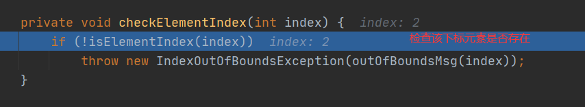

# List


## ArrayList


### 扩容机制源码分析

  idea要将下图勾选去掉才可以跳转到源码  

  idea要将下图勾选去掉才可以看不省略的数据

#### 以下为过程分析（调用无参构造器）

```java
//调试代码
package com.w1nd.collection;
import java.util.*;
public class Collection_ {
    @SuppressWarnings({"all"})
    public static void main(String[] args) {
        List list = new ArrayList<>();
        for (int i = 1; i <= 10; i ++) {
            list.add(i);
        }
        list.add(150);
    }
}
```


## Vector


### 扩容机制过程


## LinkedList


### 源码阅读
#### 增加


#### 删除





## List选择

