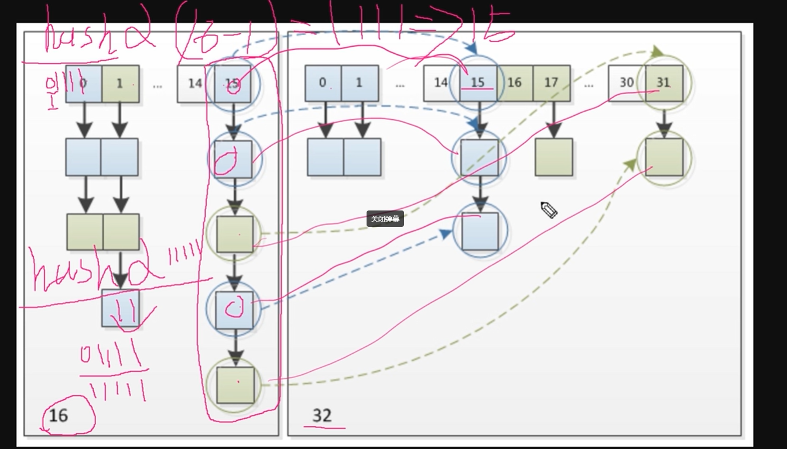

# HashMap源码详解

```java

/**
     * The default initial capacity - MUST be a power of two.
 	*/
static final int DEFAULT_INITIAL_CAPACITY = 1 << 4; // aka 16

/**
     * The maximum capacity, used if a higher value is implicitly specified
     * by either of the constructors with arguments.
     * MUST be a power of two <= 1<<30.
     */
static final int MAXIMUM_CAPACITY = 1 << 30;

/**
     * The load factor used when none specified in constructor.
     * 缺省负载因子大小
     */
static final float DEFAULT_LOAD_FACTOR = 0.75f;

/**
     * The bin count threshold for using a tree rather than list for a
     * bin.  Bins are converted to trees when adding an element to a
     * bin with at least this many nodes. The value must be greater
     * than 2 and should be at least 8 to mesh with assumptions in
     * tree removal about conversion back to plain bins upon
     * shrinkage.
     * 
     * 树化阈值
     */
static final int TREEIFY_THRESHOLD = 8;

/**
     * The bin count threshold for untreeifying a (split) bin during a
     * resize operation. Should be less than TREEIFY_THRESHOLD, and at
     * most 6 to mesh with shrinkage detection under removal.
     * 树降级称为链表的阈值
     */
static final int UNTREEIFY_THRESHOLD = 6;

/**
     * The smallest table capacity for which bins may be treeified.
     * (Otherwise the table is resized if too many nodes in a bin.)
     * Should be at least 4 * TREEIFY_THRESHOLD to avoid conflicts
     * between resizing and treeification thresholds.
     * 
     * 树化的另一个参数，当哈希表中的所有元素个数超过64，才允许树化
     */
static final int MIN_TREEIFY_CAPACITY = 64;
```

```java

/**
     * The table, initialized on first use, and resized as
     * necessary. When allocated, length is always a power of two.
     * (We also tolerate length zero in some operations to allow
     * bootstrapping mechanics that are currently not needed.)
     * 哈希表
     */
transient Node<K,V>[] table;

/**
     * Holds cached entrySet(). Note that AbstractMap fields are used
     * for keySet() and values().
     */
transient Set<Map.Entry<K,V>> entrySet;

/**
     * The number of key-value mappings contained in this map.
     * 当前哈希表中元素个数
     */
transient int size;

/**
     * The number of times this HashMap has been structurally modified
     * Structural modifications are those that change the number of mappings in
     * the HashMap or otherwise modify its internal structure (e.g.,
     * rehash).  This field is used to make iterators on Collection-views of
     * the HashMap fail-fast.  (See ConcurrentModificationException).
     * 
     * 当前哈希表结构修改次数
     */
transient int modCount;

/**
     * The next size value at which to resize (capacity * load factor).
     *
     * 扩容阈值，当哈希表中的元素超过阈值时，触发扩容
     * @serial
     */
// (The javadoc description is true upon serialization.
// Additionally, if the table array has not been allocated, this
// field holds the initial array capacity, or zero signifying
// DEFAULT_INITIAL_CAPACITY.)
int threshold;

/**
     * The load factor for the hash table.
     *
     * 负载因子
     * @serial
     */
final float loadFactor;
```

```java

/**
     * Constructs an empty <tt>HashMap</tt> with the specified initial
     * capacity and load factor.
     *
     * @param  initialCapacity the initial capacity
     * @param  loadFactor      the load factor
     * @throws IllegalArgumentException if the initial capacity is negative
     *         or the load factor is nonpositive
     */
public HashMap(int initialCapacity, float loadFactor) {
    // capaciry必须大于0，最大值也就是MAX_CAP
    if (initialCapacity < 0)
        throw new IllegalArgumentException("Illegal initial capacity: " +
                                           initialCapacity);
    if (initialCapacity > MAXIMUM_CAPACITY)
        initialCapacity = MAXIMUM_CAPACITY;
    // loadFactor必须大于0
    if (loadFactor <= 0 || Float.isNaN(loadFactor))
        throw new IllegalArgumentException("Illegal load factor: " +
                                           loadFactor);
    this.loadFactor = loadFactor;
    this.threshold = tableSizeFor(initialCapacity);  // <-----------------注意该方法
}

/**
     * Constructs an empty <tt>HashMap</tt> with the specified initial
     * capacity and the default load factor (0.75).
     *
     * @param  initialCapacity the initial capacity.
     * @throws IllegalArgumentException if the initial capacity is negative.
     */
public HashMap(int initialCapacity) {
    this(initialCapacity, DEFAULT_LOAD_FACTOR);
}

/**
     * Constructs an empty <tt>HashMap</tt> with the default initial capacity
     * (16) and the default load factor (0.75).
     */
public HashMap() {
    this.loadFactor = DEFAULT_LOAD_FACTOR; // all other fields defaulted
}

/**
     * Constructs a new <tt>HashMap</tt> with the same mappings as the
     * specified <tt>Map</tt>.  The <tt>HashMap</tt> is created with
     * default load factor (0.75) and an initial capacity sufficient to
     * hold the mappings in the specified <tt>Map</tt>.
     *
     * @param   m the map whose mappings are to be placed in this map
     * @throws  NullPointerException if the specified map is null
     */
public HashMap(Map<? extends K, ? extends V> m) {
    this.loadFactor = DEFAULT_LOAD_FACTOR;
    putMapEntries(m, false);
}


/**
     * Returns a power of two size for the given target capacity.
     * 作用：返回一个大于等于当前值cap的一个数字，并且这个数字一定是2的次方数
     *
     * cap = 10;
     * n = 10 - 1 = 9
     * 0b1001 | 0b0100 => 0b1101
     * 0b1101 | 0b0011 => ob1111
     * 0b1111 | 0b1111 => 0b1111
     * ...
     * 得到0b1111 => 15
     * 
     * return 15 + 1
     */
static final int tableSizeFor(int cap) {
    int n = cap - 1;
    n |= n >>> 1;
    n |= n >>> 2;
    n |= n >>> 4;
    n |= n >>> 8;
    n |= n >>> 16;
    return (n < 0) ? 1 : (n >= MAXIMUM_CAPACITY) ? MAXIMUM_CAPACITY : n + 1;
}
```


```java
/*
	h = 0b 0010 0101 1010 1100 0011 1111 0010 1110
	0b 0010 0101 1010 1100 0011 1111 0010 1110 ^
	0b 0000 0000 0000 0000 0010 0101 1010 1100 =
	0b 0010 0101 1010 1100 0001 1010 1000 0010
*/
// 作用：让key的hash值的高16位也参与路由运算
static final int hash(Object key) {
    int h;
    return (key == null) ? 0 : (h = key.hashCode()) ^ (h >>> 16);
}
```

```java
public V put(K key, V value) {
    return putVal(hash(key), key, value, false, true);
}

final V putVal(int hash, K key, V value, boolean onlyIfAbsent,
               boolean evict) {
    // tab ：引用当前hashmap的散列表
    // p ：表示当前散列表的元素
    // n ：表示散列表数组的长度
    // i ：表示路由寻址结果
    Node<K,V>[] tab; Node<K,V> p; int n, i;
    // 延迟初始化逻辑，第一次调用putVal时会初始化hashMap对象中的最耗内存的散列表
    if ((tab = table) == null || (n = tab.length) == 0)
        n = (tab = resize()).length;
    // （n-1） & hash 路由算法
    // 最简单的一种情况：寻址找到的桶位，刚好是null，这个时候，直接添加即可
    // 注意此处已经给p赋值了
    if ((p = tab[i = (n - 1) & hash]) == null)
        tab[i] = newNode(hash, key, value, null);
    else {
        // e：node临时元素
        // k：表示临时的一个key
        Node<K,V> e; K k;
        // 表示桶位中的该元素，与你当前插入的元素的key完全一致，表示后续需要进行替换操作
        if (p.hash == hash &&
            ((k = p.key) == key || (key != null && key.equals(k))))
            e = p; // 不为null的话，表示找到了一个与当前要插入的key-value一致的key的元素
        else if (p instanceof TreeNode)
            e = ((TreeNode<K,V>)p).putTreeVal(this, tab, hash, key, value);
        else {
            // 链表的情况
            for (int binCount = 0; ; ++binCount) {
                // 条件成立的话，说明迭代到最后一个元素了，也没找到一个与你要插入的key一致的node
                // 说明需要加入当前链表的末尾
                if ((e = p.next) == null) {
                    p.next = newNode(hash, key, value, null);
                    // 条件成立的话，说明当前链表的长度，达到树化标准了，需要进行树化
                    if (binCount >= TREEIFY_THRESHOLD - 1) // -1 for 1st
                        // 树化操作
                        treeifyBin(tab, hash);
                    break;
                }
         	    // 条件成立的话，说明找到了相同key的node元素，需要进行替换操作
                if (e.hash == hash &&
                    ((k = e.key) == key || (key != null && key.equals(k))))
                    break;
                p = e;
            }
        }
        // e不等于null，条件成立说明：找到一个与你插入元素key完全一致的数据，需要进行替换
        if (e != null) { // existing mapping for key
            V oldValue = e.value;
            if (!onlyIfAbsent || oldValue == null)
                e.value = value;
            afterNodeAccess(e);
            return oldValue;
        }
    }
    ++modCount; // 表示散列表结构被修改的次数，替换node元素的value不计数
    // 插入新元素，size自增，如果自增后的值大于扩容阈值，则触发扩容
    if (++size > threshold)
        resize();
    afterNodeInsertion(evict);
    return null;
}

```


```java
/**
 * 为什么需要扩容？
 * 为了解决哈希冲突导致的链化影响查询效率的问题，扩容会缓解该问题
*/
final Node<K,V>[] resize() {
    // oldTab：引用扩容前的哈希表
    Node<K,V>[] oldTab = table;
    // oldCap：表示扩容之前table数组的长度
    int oldCap = (oldTab == null) ? 0 : oldTab.length;
    // oldThr：表示扩容之前的扩容阈值，触发本次扩容的阈值
    int oldThr = threshold;
    // newCap：扩容之后table数组的大小
    // newThr：扩容之后，下次再触发扩容的条件
    int newCap, newThr = 0;
    //条件如果成立，说明hashmap中的散列表已经初始化，是一次正常的扩容
    if (oldCap > 0) {
        // 扩容之前的table数组大小已经达到最大阈值，则不扩容，且设置扩容条件为 int 最大值 
        if (oldCap >= MAXIMUM_CAPACITY) {
            threshold = Integer.MAX_VALUE;
            return oldTab;
        }
        // oldCap左移一位实现数值翻倍，并且赋值给newCap，newCap 小于数组最大值限制 且 扩容之前的阈值 >= 16
        // 则下次扩容的阈值，等于当前阈值翻倍
        else if ((newCap = oldCap << 1) < MAXIMUM_CAPACITY &&
                 oldCap >= DEFAULT_INITIAL_CAPACITY)
            newThr = oldThr << 1; // double threshold
    }
    // oldCap == 0，说明hashMap中的散列表是null
    // 1. new HashMap(initCap, loadFactor);
    // 2. new HashMap(initCap);
    // 3. new HashMap(map)
    else if (oldThr > 0) // initial capacity was placed in threshold
        newCap = oldThr;
    // oldCap == 0，oldThr == 0
    // new HashMap()
    else {               // zero initial threshold signifies using defaults
        newCap = DEFAULT_INITIAL_CAPACITY;
        newThr = (int)(DEFAULT_LOAD_FACTOR * DEFAULT_INITIAL_CAPACITY);
    }
    // newThr为零时，通过newCap和loadFactor计算出一个newThr
    if (newThr == 0) {
        float ft = (float)newCap * loadFactor;
        newThr = (newCap < MAXIMUM_CAPACITY && ft < (float)MAXIMUM_CAPACITY ?
                  (int)ft : Integer.MAX_VALUE);
    }
    threshold = newThr;
    // 创建出一个更长的数组
    @SuppressWarnings({"rawtypes","unchecked"})
    Node<K,V>[] newTab = (Node<K,V>[])new Node[newCap];
    table = newTab;
    // oldTab != null 说明hashMap本次扩容之前，table不为null
    if (oldTab != null) {
        for (int j = 0; j < oldCap; ++j) {
            // 当前node节点
            Node<K,V> e;
            // 说明当前桶位中有数据，但是数据具体是单个数据，链表还是红黑树，并不清楚
            if ((e = oldTab[j]) != null) {
                // 方便JVM GC时回收内存
                oldTab[j] = null;
                // 第一种情况：当前桶位只有一个元素，从未发生过碰撞，直接计算出当前元素放在 新数组的位置即可
                if (e.next == null)
                    newTab[e.hash & (newCap - 1)] = e;
                // 第二种情况：判断当前节点已经树化
                else if (e instanceof TreeNode)
                    ((TreeNode<K,V>)e).split(this, newTab, j, oldCap);
                else { // preserve order <=========这里结合下图来看
                    // 第三种情况：桶位已经形成链表
                    // 低位链表：存放在扩容之后的数组的下标位置，与当前数组的下标位置一致
                    Node<K,V> loHead = null, loTail = null;
                    // 高位链表：存放在扩容之后的数组的下标位置为 当前数组下标位置 + 扩容之前数组的长度
                    Node<K,V> hiHead = null, hiTail = null;
                    Node<K,V> next;
                    do {
                        next = e.next;
                        if ((e.hash & oldCap) == 0) {
                            if (loTail == null)
                                loHead = e;
                            else
                                loTail.next = e;
                            loTail = e;
                        }
                        else {
                            if (hiTail == null)
                                hiHead = e;
                            else
                                hiTail.next = e;
                            hiTail = e;
                        }
                    } while ((e = next) != null);
                    if (loTail != null) {
                        loTail.next = null;
                        newTab[j] = loHead;
                    }
                    if (hiTail != null) {
                        hiTail.next = null;
                        newTab[j + oldCap] = hiHead;
                    }
                }
            }
        }
    }
    return newTab;
}
```




```java
public V get(Object key) {
    Node<K,V> e;
    return (e = getNode(hash(key), key)) == null ? null : e.value;
}

final Node<K,V> getNode(int hash, Object key) {
    // tab：引用当前hashMap的散列表
    // first：桶位中的头元素
    // e：临时node元素
    // n：table数组长度
    Node<K,V>[] tab; Node<K,V> first, e; int n; K k;
    if ((tab = table) != null && (n = tab.length) > 0 &&
        (first = tab[(n - 1) & hash]) != null) {
        // 第一种情况：定位出来的桶元素，即为要get的数据
        if (first.hash == hash && // always check first node
            ((k = first.key) == key || (key != null && key.equals(k))))
            return first;
        // 说明当前桶位不止一个元素，可能是链表 也可能是 红黑树
        if ((e = first.next) != null) {
            // 第二种情况：桶位升级成了红黑树
            if (first instanceof TreeNode)
                return ((TreeNode<K,V>)first).getTreeNode(hash, key);
            // 第三种情况：桶位形成链表
            do {
                if (e.hash == hash &&
                    ((k = e.key) == key || (key != null && key.equals(k))))
                    return e;
            } while ((e = e.next) != null);
        }
    }
    return null;
}
```


```java
public V remove(Object key) {
    Node<K,V> e;
    return (e = removeNode(hash(key), key, null, false, true)) == null ?
        null : e.value;
}

final Node<K,V> removeNode(int hash, Object key, Object value,
                           boolean matchValue, boolean movable) {
	// tab：引用当前hashMap中的散列表
    // p：当前node元素
    // n：表示散列表数组长度
    // index：表示寻址结果
    Node<K,V>[] tab; Node<K,V> p; int n, index;
    if ((tab = table) != null && (n = tab.length) > 0 &&
        (p = tab[index = (n - 1) & hash]) != null) {
        // 说明路由的桶位是有数据的，需要进行查找操作，并且删除
        // node：查找的结果
        // e：当前Node的下一个元素
        Node<K,V> node = null, e; K k; V v;
        // 第一种情况：当前桶位中的元素 即为 要删除的元素
        if (p.hash == hash &&
            ((k = p.key) == key || (key != null && key.equals(k))))
            node = p;
        else if ((e = p.next) != null) {
            // 说明，当前桶位 要么是 链表 要么 是红黑树
            if (p instanceof TreeNode) // 判断当前桶位是否升级为红黑树
                // 红黑树的查找操作
                node = ((TreeNode<K,V>)p).getTreeNode(hash, key);
            else {
                // 链表的情况
                do {
                    if (e.hash == hash &&
                        ((k = e.key) == key ||
                         (key != null && key.equals(k)))) {
                        node = e;
                        break;
                    }
                    p = e;
                } while ((e = e.next) != null);
            }
        }
        // 判断node不为空的话，说明按照key查找到需要删除的数据了
        if (node != null && (!matchValue || (v = node.value) == value ||
                             (value != null && value.equals(v)))) {
            // 第一种情况：node是树节点，说明需要进行树节点移除操作
            if (node instanceof TreeNode)
                ((TreeNode<K,V>)node).removeTreeNode(this, tab, movable);
            // 第二种情况：桶位元素即为查找结果，则将该元素的下一个元素防至桶位中
            else if (node == p)
                tab[index] = node.next;
            else
                // 第三种情况：将当前元素p的下一个元素 设置成 要删除元素的 下一个元素
                p.next = node.next; 
            ++modCount;
            --size;
            afterNodeRemoval(node);
            return node;
        }
    }
    return null;
}
```

