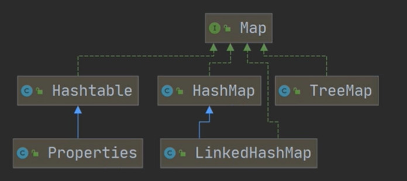
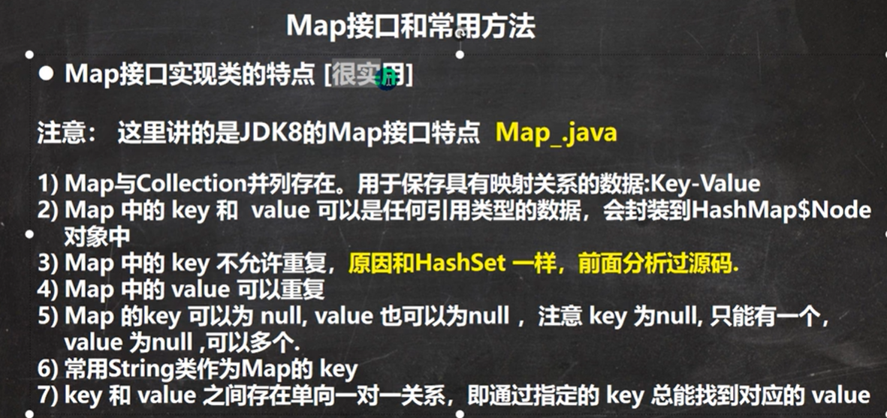
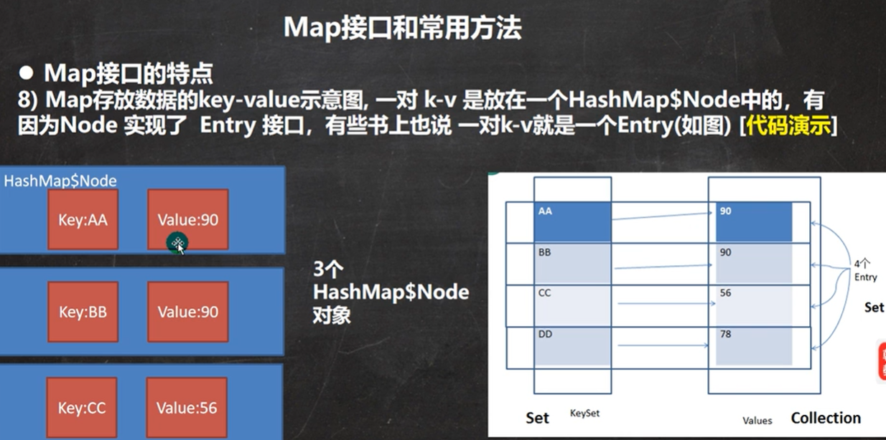

# Map 遍历六大方式
```java
package com.w1nd.map;
 
import java.util.*;
 
 
public class Test {
    public static void main(String[] args) {
        Map map = new HashMap();
        map.put("No.1","路飞");
        map.put("No.2","索隆");
        map.put("No.3","山治");
 
 
        //1 取出所有的key,通过key取出set
        Set set = map.keySet();
        //1.1 增强for循环
        for (Object key :set) {
            System.out.println(key+"-"+map.get(key));
        }
        //1.2 迭代器
        Iterator iterator = set.iterator();
        while (iterator.hasNext()) {
            Object key =  iterator.next();
            System.out.println(key+"-"+map.get(key));
        }
 
 
        //2 取出所有的value的值
        Collection values = map.values();
        //2.1 增强for循环
        for (Object value : values) {
            System.out.println(value);
        }
        //2.2 迭代器
        while (iterator.hasNext()) {
            Object value =  iterator.next();
            System.out.println(value);
        }
 
 
        //3 通过EntrySet获取k-v
        Set e_set = map.entrySet();
        //3.1 增强for循环
        for (Object entry :e_set) {
            //将entry转成Map.Entry
            Map.Entry m=(Map.Entry)entry;
            System.out.println(m.getKey()+"-"+m.getValue());
        }
        //3.2 迭代器
        Iterator iterator1 = e_set.iterator();
        while (iterator1.hasNext()) {
            Object entry =  iterator1.next();
            //获取它的运行类型
            System.out.println(entry.getClass());
            //向下转型 Map.Entry
            Map.Entry m=(Map.Entry)entry;
            System.out.println(m.getKey()+"-"+m.getValue());
        }
    }
}
```