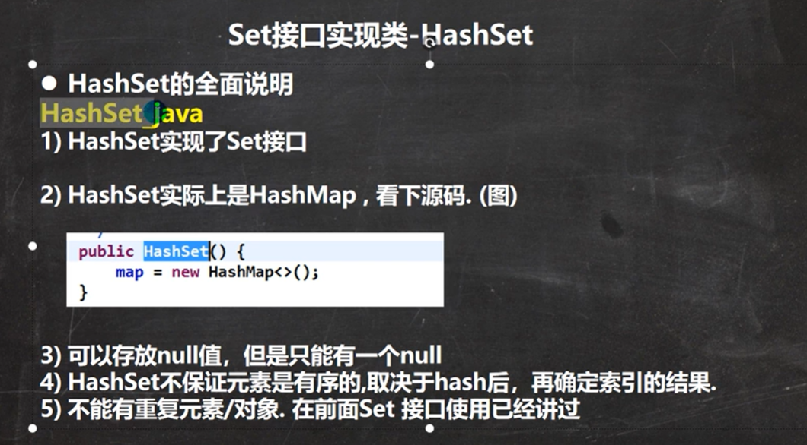
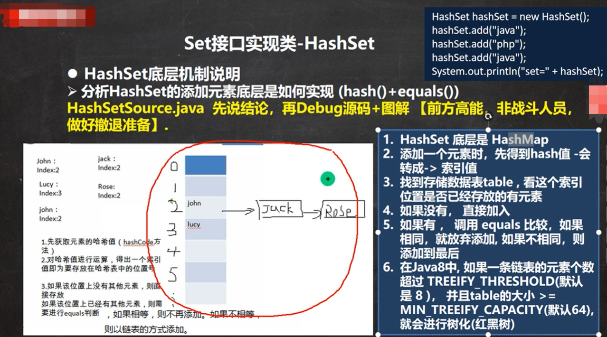
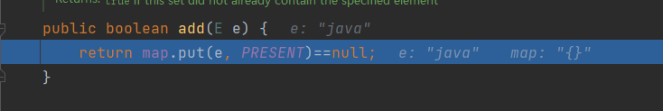
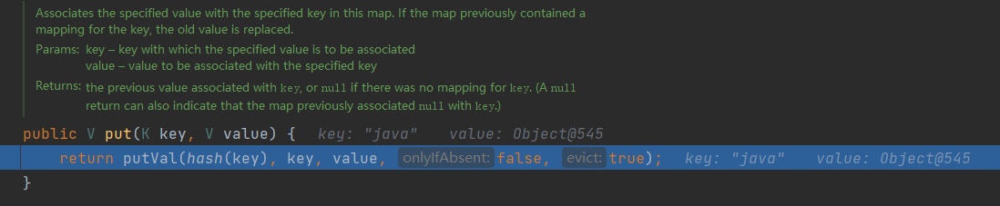
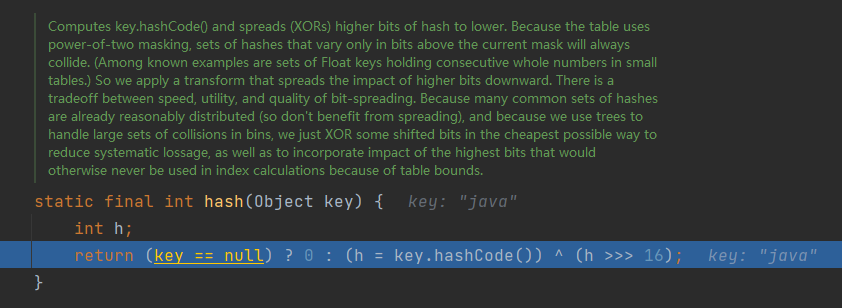
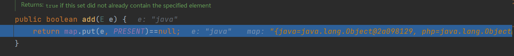
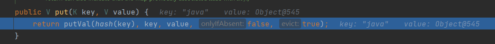
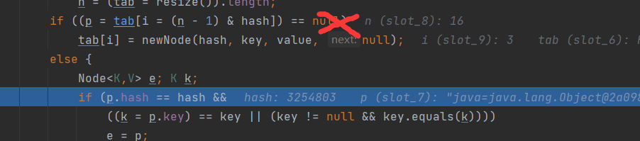

# HashSet



```java
// 面试题
HashSet set = new HashSet();

set.add("lucy"); // ok
set.add("lucy"); // no
set.add(new Dog("tom")); // ok
set.add(new Dog("tom")); // no
set.add(new String("w1nd")); // ok
set.add(new String("w1nd")); // ok

```
**数组链表模拟**
```java
package com.w1nd.collection;

public class HashSetStructure {
    public static void main(String[] args) {
        Node[] table = new Node[16];

        Node john = new Node("john", null);
        table[2] = john;

        Node jack = new Node("jack", null);
        john.next = jack;
        System.out.println("table=" + table);
    }
}

class Node { // 结点，存储数据，可以指向下一个结点，从而形成链表
    Object item; // 存放数据
    Node next;  // 指向下一个结点

    public Node(Object item, Node next) {
        this.item = item;
        this.next = next;
    }

    @Override
    public String toString() {
        return "Node{" +
                "item=" + item +
                ", next=" + next +
                '}';
    }
}
```



### 源码分析
**调试代码**
```java
package com.w1nd.collection;

import java.util.HashSet;

@SuppressWarnings({"all"})
public class HashSetSource {
    public static void main(String[] args) {
        HashSet hashSet = new HashSet();
        hashSet.add("java");
        hashSet.add("php");
        hashSet.add("java");
        System.out.println("set=" + hashSet);
    }
}

```
#### 第一次添加
##### 1. 首先调用add方法，PRESENT是一个占位静态变量，为了和hashmap相匹配

##### 2. 然后执行put方法

##### 3. 计算哈希值，然key的哈希值h与h右移16位进行异或得出，这样是为了降低hash冲突几率

##### 4. 调用putVal方法
```java
final V putVal(int hash, K key, V value, boolean onlyIfAbsent,
boolean evict) {
    Node<K,V>[] tab; Node<K,V> p; int n, i; // 定义了辅助变量
    // table是Node<K,Y>[]，是hashmap中定义
    if ((tab = table) == null || (n = tab.length) == 0) 
        n = (tab = resize()).length; // table没有初始化，扩容函数见5
    if ((p = tab[i = (n - 1) & hash]) == null) 
    // 计算key对应的哈希值应该在索引表的哪个位置
    // 如果p为null，表示还没有存放元素，就创建一个Node（key,value）
        tab[i] = newNode(hash, key, value, null);
    else {
        Node<K,V> e; K k;
        if (p.hash == hash &&
            ((k = p.key) == key || (key != null && key.equals(k))))
            e = p;
        else if (p instanceof TreeNode)
            e = ((TreeNode<K,V>)p).putTreeVal(this, tab, hash, key, value);
        else {
            for (int binCount = 0; ; ++binCount) {
                if ((e = p.next) == null) {
                    p.next = newNode(hash, key, value, null);
                    if (binCount >= TREEIFY_THRESHOLD - 1) // -1 for 1st
                        treeifyBin(tab, hash);
                    break;
                }
                if (e.hash == hash &&
                    ((k = e.key) == key || (key != null && key.equals(k))))
                    break;
                p = e;
            }
        }
        if (e != null) { // existing mapping for key
            V oldValue = e.value;
            if (!onlyIfAbsent || oldValue == null)
                e.value = value;
            afterNodeAccess(e);
            return oldValue;
        }
    }
    ++modCount;  // 修改次数
    if (++size > threshold)
        resize();
    afterNodeInsertion(evict);
    return null; // 返回null才是添加成功
}
```
##### 5. resize扩容方法
```java
final Node<K,V>[] resize() {
    Node<K,V>[] oldTab = table;
    int oldCap = (oldTab == null) ? 0 : oldTab.length;
    int oldThr = threshold;
    int newCap, newThr = 0;
    if (oldCap > 0) {
        if (oldCap >= MAXIMUM_CAPACITY) {
            threshold = Integer.MAX_VALUE;
            return oldTab;
        }
        else if ((newCap = oldCap << 1) < MAXIMUM_CAPACITY &&
                    oldCap >= DEFAULT_INITIAL_CAPACITY)
            newThr = oldThr << 1; // double threshold
    }
    else if (oldThr > 0) // initial capacity was placed in threshold
        newCap = oldThr;
    else {               // zero initial threshold signifies using defaults
        newCap = DEFAULT_INITIAL_CAPACITY; // 得到默认容量16
        newThr = (int)(DEFAULT_LOAD_FACTOR * DEFAULT_INITIAL_CAPACITY); 
        // 临界值（指下次扩容的阈值：到达这个值就要扩容），为原来容量*0.75
    }
    if (newThr == 0) {
        float ft = (float)newCap * loadFactor;
        newThr = (newCap < MAXIMUM_CAPACITY && ft < (float)MAXIMUM_CAPACITY ?
                    (int)ft : Integer.MAX_VALUE);
    }
    threshold = newThr;
    @SuppressWarnings({"rawtypes","unchecked"})
        Node<K,V>[] newTab = (Node<K,V>[])new Node[newCap];
    table = newTab;  // 得到新table
    if (oldTab != null) {
        for (int j = 0; j < oldCap; ++j) {
            Node<K,V> e;
            if ((e = oldTab[j]) != null) {
                oldTab[j] = null;
                if (e.next == null)
                    newTab[e.hash & (newCap - 1)] = e;
                else if (e instanceof TreeNode)
                    ((TreeNode<K,V>)e).split(this, newTab, j, oldCap);
                else { // preserve order
                    Node<K,V> loHead = null, loTail = null;
                    Node<K,V> hiHead = null, hiTail = null;
                    Node<K,V> next;
                    do {
                        next = e.next;
                        if ((e.hash & oldCap) == 0) {
                            if (loTail == null)
                                loHead = e;
                            else
                                loTail.next = e;
                            loTail = e;
                        }
                        else {
                            if (hiTail == null)
                                hiHead = e;
                            else
                                hiTail.next = e;
                            hiTail = e;
                        }
                    } while ((e = next) != null);
                    if (loTail != null) {
                        loTail.next = null;
                        newTab[j] = loHead;
                    }
                    if (hiTail != null) {
                        hiTail.next = null;
                        newTab[j + oldCap] = hiHead;
                    }
                }
            }
        }
    }
    return newTab;
}
```
#### 添加相同元素源码分析
##### 1.第二次添加`java`，同样调用add，put，hash


#### 2.由于第二次添加一样的，所以不会再执行第二个if了，则会执行else中的语句

```java
else {
    Node<K,V> e; K k; // 辅助变量
    if (p.hash == hash &&
        ((k = p.key) == key || (key != null && key.equals(k))))
    // 如果当前索引位置对应的链表的第一个元素和准备添加的key的hash值一样
    // 并且满足 准备加入的key和p指向的Node结点的key是同一个对象
    // 或者p指向Node结点 的 key 的 equals（）和准备加入的key比较后相同
    // 就不能加入
        e = p;
    // 再判断 p 是不是一颗红黑树，就调用putTreeVal进行添加
    else if (p instanceof TreeNode)
        e = ((TreeNode<K,V>)p).putTreeVal(this, tab, hash, key, value);
    else {
        // 如果table对应索引位置，已经是一个链表，就使用for循环比较
        // 1. 依次和该链表的每一个元素比较后，都不相同，则加入到该链表的最后
        // 2. 依次比较过程中，如果有相同的情况，则直接break
        for (int binCount = 0; ; ++binCount) {
            if ((e = p.next) == null) {
                p.next = newNode(hash, key, value, null);
                if (binCount >= TREEIFY_THRESHOLD - 1) // -1 for 1st
                // 注意这里会判断该链表是否达到8个结点，达到则转化为红黑树
                    treeifyBin(tab, hash);
                break;
            }
            if (e.hash == hash &&
                ((k = e.key) == key || (key != null && key.equals(k))))
                break;
            p = e;
        }
    }
```
