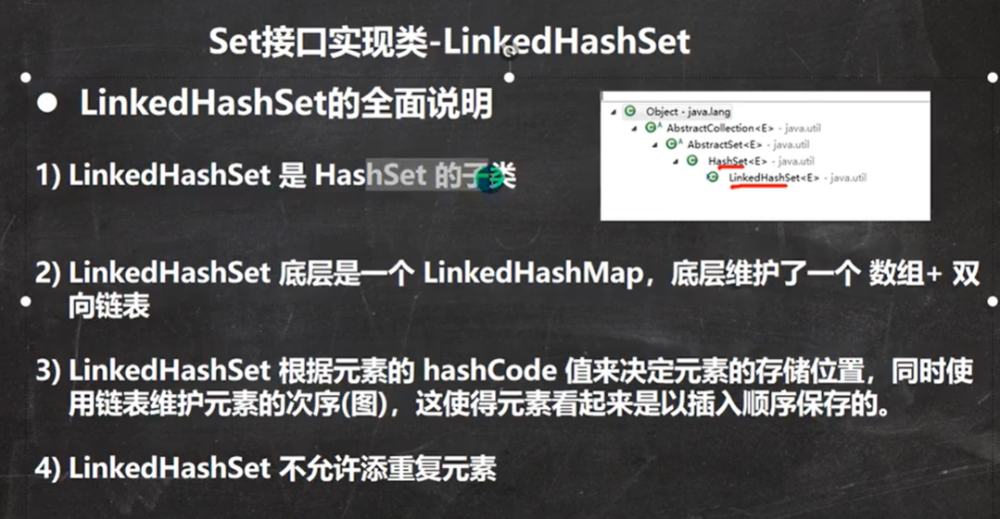
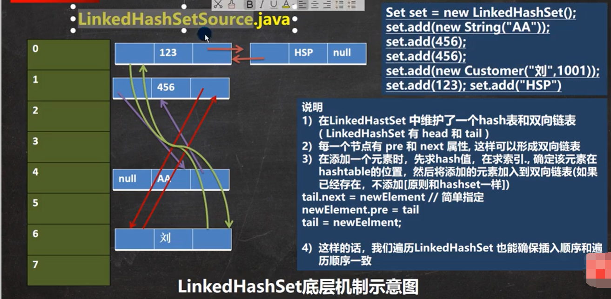

# LinkedHashSet

1. LinkedHashSet 加入顺序和取出元素/数据的顺序一致
2. LinkedHashSet 底层维护的是一个LinkedHashMap（是HashMap的子类）
3. LinkedHashSet 底层结构（数组table + 双向链表）
4. 添加第一次时，直接将 数组table 扩容到16，存放的结点类型是LinkedHashMap$Entry
5. 数组是 HashMap$Node[] 存放的元素/数据是 LinkedHashMap7\$Entry类型