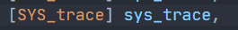

# lab2

## System call tracing

​	在本次作业中，需要添加一个系统调用追踪的功能，这可能会对你稍后的实验有所帮助。你将会创建一个新的`trace`系统调用来控制跟踪。它应该要带有一个参数，一个整数掩码，这位来指定要跟踪哪个系统调用。举个例子，为了跟踪`fork`系统调用，程序要调用`trac(1 << SYS_fork)`，`SYS_fork`是`kernel/syscall.h`里的系统调用编号。你需要修改`xv6`的内核在系统调用返回时打印出一行，如果系统调用编码设置在掩码中。该行应该包含进程id，系统调用的名称和返回值；不需要打印系统调用参数。跟踪系统调用应该是启动对调用它的进程及其随后派生的任何子进程的跟踪，但不应该影响其他进程。

​	我们提供了一个跟踪用户级程序，该程序运行另一个启用跟踪的程序（请参阅user/trace.c）

**tips**：

- 添加`$U/_trace`到Makefile中
- 运行 `make qemu `， 你将看到编译器无法编译 `user/trace.c `，因为系统调用的用户空间存根（`指trace还未实现`）还不存在：将系统调用的原型添加到 `user/user.h `，将存根添加到` user/usys.pl `，以及将系统调用号添加到 `kernel/syscall.h `中。 Makefile 调用 `perl `脚本 `user/usys.pl `，它生成 `user/usys.S `，实际的系统调用存根，它使用 RISC-V ecall 指令转换到内核。修复编译问题后，运行 `trace 32 grep hello README `；它会失败，因为你还没有在内核中实现系统调用。
- 在 `kernel/sysproc.c `中添加一个 `sys_trace() `函数，该函数通过在 `proc `结构中的新变量中记住其参数来实现新系统调用(请参阅 kernel/proc.h )。从用户空间检索系统调用参数的函数位于 `kernel/syscall.c `中，你可以在 `kernel/sysproc.c` 中查看它们的使用示例。

- 修改 `fork()` (参见 `kernel/proc.c` )以将跟踪的掩码从父进程复制到子进程。
- 修改 `kernel/syscall.c` 中的 `syscall()` 函数以打印跟踪输出。你将需要添加要索引的系统调用名称数组。

**实验步骤**

1. 在makefile中添加

    

2. 在`user.h`中添加

    

3. 在`usys.pl`中添加

    

4. 在`syscall.h`添加

    

5. 在`syscall.c`添加

    

    

6. 在`sysproc.c`添加

    

7. 在`syscall.c`添加

    

8. 在`proc.c`的`freeproc`函数添加

    

9. 在`proc.c`的`fork`函数添加

    


## Sysinfo

​	在本实验中，您将添加一个系统调用 sysinfo ，它收集有关正在运行的系统信息。系统调用接受一个参数：一个指向 struct sysinfo 的指针(参见 kernel/sysinfo.h )。内核应该填写这个结构体的字段： freemem 字段应该设置为空闲内存的字节数， nproc 字段应该设置为状态不是 UNUSED 的进程数。我们提供了一个测试程序 sysinfotest ；如果它打印 “sysinfotest：OK” ，则实验结果通过测试。
**tips**

- 将 `$U/_sysinfotest `添加到 Makefile 的 UPROGS 中。

- 运行 `make qemu `， 你将看到编译器无法编译 `user/sysinfotest.c `。添加系统调用 sysinfo ，按照与之前实验相同的步骤。要在 user/user.h 中声明 sysinfo() 的原型，您需要预先声明 struct sysinfo ：

    ```c
    struct sysinfo;
    int sysinfo(struct sysinfo *);
    ```

- `sysinfo` 需要复制一个 `struct sysinfo` 返回用户空间；有关如何使用 `copyout()` 执行此操作的示例，请参阅 `sys_fstat()` ( **kernel/sysfile.c** ) 和 `filestat()` ( **kernel/file.c** )。

- 修复编译问题后，运行 `sysinfotest` 会失败，因为你还没有在内核中实现系统调用。

- 要收集空闲内存量，请在 **kernel/kalloc.c** 中添加一个函数。

- 要收集进程数，请在 **kernel/proc.c** 中添加一个函数。

**实验步骤**

1. 跟上个实验一样添加下述东西

    

    

    

    

    

    

2. 实现收集空闲内存量的函数

    

3. 实现收集进程数的函数

    

4. syscall主逻辑编写

    

    


