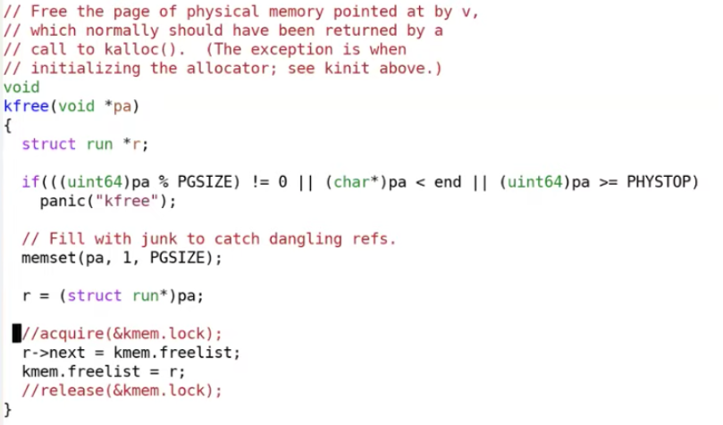
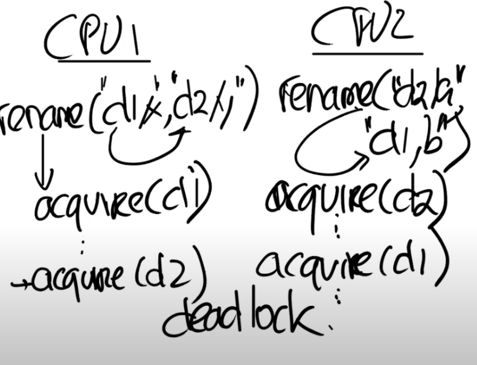

# Multiprocessors and Locking

## 1. 初识锁

**锁的好处：**

​		对于多个CPU，可以带来性能的提升，如果一个应用程序运行在多个CPU核上，并且执行了系统调用，那么内核需要能够处理并行的系统调用。

**为什么要用锁：**

​	当并行的访问数据结构时，例如一个核在读取数据，另一个核在写入数据，我们需要使用锁来协调对于共享数据的更新，以确保数据的**一致性**

​	如果没有锁的话，可能会出现race condition（竞态条件），进而导致程序出错。

​	例如对`freelist`取消锁的代码

​	

​	就有可能出现丢失一些内存page的情况（例子具体到课程中看）

**锁的矛盾性：**

​	要通过并行来获得高性能，我们想要并行的在不同的CPU核上执行系统调用，但是如果这些系统调用使用了共享的数据，我们又需要使用锁，而锁又会使得这些系统调用串行执行，所以最后锁反过来又限制了性能。

## 2. 锁如何避免race condition？

​	锁就是一个对象，就像其他在内核中的对象一样。有一个结构体叫做lock，它包含了一些字段，这些字段中维护了锁的状态。锁有非常直观的API：

- `acquire`，接收指向`lock`的指针作为参数。`acquire`确保了在任何时间，只会有一个进程能够成功的获取锁。
- `release`，也接收指向`lock`的指针作为参数。在同一时间尝试获取锁的其他进程需要等待，直到持有锁的进程对锁调用`release`。

​	锁的acquire和release之间的代码，通常被称为critical section（临界区）。

​	之所以被称为critical section，是因为通常会在这里以原子的方式执行共享数据的更新

​	所以基本上来说，如果在acquire和release之间有多条指令，它们要么会一起执行，要么一条也不会执行

## 3. 什么时候使用锁？

​	**如果两个进程访问了一个共享的数据结构，并且其中一个进程会更新共享的数据结构，那么就需要对于这个共享的数据结构加锁。**

​	这个规则比较保守，存在无锁编程的情况

​	但这个规则有比较宽松，除了共享的数据，在一些其他场合也需要锁，例如对于printf，如果我们将一个字符串传递给它，XV6会尝试原子性的将整个字符串输出，而不是与其他进程的printf交织输出。

## 4. 锁的特征和死锁

​	锁有三种作用

- 避免丢失更新
- 可以打包多个操作，使它们具有原子性
- 锁可以维护共享数据结构的不变性

**死锁**

​	**一个锁的场景：**首先acquire一个锁，然后进入到critical section；在critical section中，再acquire同一个锁；第二个acquire必须要等到第一个acquire状态被release了才能继续执行，但是不继续执行的话又走不到第一个release，所以程序就一直卡在这了。这就是一个死锁。

​	**多个锁的场景：**

​	

​	有多个锁，需要对锁进行排序，所有的操作都必须以相同的顺序获取锁。

	## 5. 锁的性能

​	想获得更高的性能，需要拆分数据结构和锁

​	开发流程通常是：

- 先以coarse-grained lock（注，也就是大锁）开始。
- 再对程序进行测试，来看一下程序是否能使用多核。
- 如果可以的话，那么工作就结束了，你对于锁的设计足够好了；如果不可以的话，那意味着锁存在竞争，多个进程会尝试获取同一个锁，因此它们将会序列化的执行，性能也上不去，之后你就需要重构程序。

