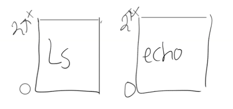
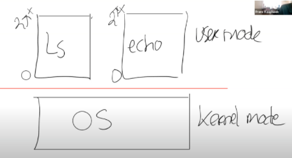
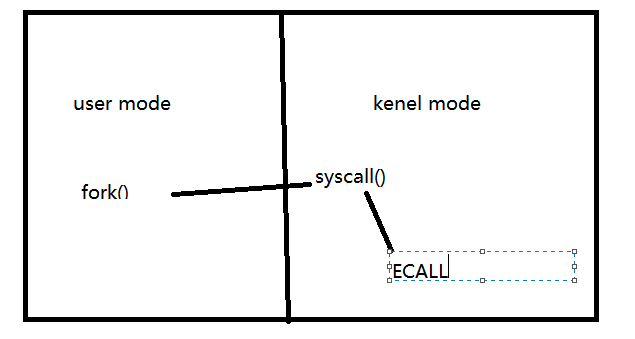
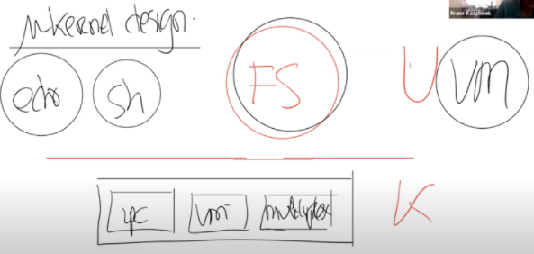

# 操作系统组织和系统调用

## 1. 操作系统的隔离性

## 2. 操作系统的防御性

## 3. 硬件对于强隔离的支持

​	硬件对强隔离的支持包括了：`user/kernel`和`虚拟内存`

​	也就是处理器会有两种操作模式：`用户态`和`内核态`

​	当运行在内核态时，CPU可以运行特定权限的指令，当运行在用户态时，CPU只能运行普通权限的指令

​	那么什么是普通指令，什么是特殊指令呢？

​	**普通权限指令就是所有应用程序都允许执行这些指令**。例如将两个寄存器相加的指令ADD，将两个寄存器相减的指令SUB，跳转指令JRC，BRANCH指令等。

​	**特殊指令主要是一些直接操纵硬件的指令和设置保护的指令**。例如设置page table寄存器，关闭时钟中断。在处理器上有多种的状态，操作系统会使用这些状态，但是只能通过特殊权限指令来变更这些状态。

> ​	提问1：如果kernel mode允许一些指令的执行，而user mode不允许一些指令的执行，是谁在检查当前的mode并实际运行这些指令，并且怎么知道当前是不是kernel mode？
>
> ​	处理中有一个flag。当它为1时是user mode，为0时 是kernel mode。当处理器在解析指令时，如果指令是特权指令，并且flag为1，则处理器拒绝执行这条指令。
>
> ​	提问2：设置flag的指令是什么类型的指令？
>
> ​	特权指令，如果用户指令可以设置那就相当于应用程序可以运行各种特殊权限指令了。所以flag是被保护的。
>
> ​	提问3：存在某种用户可以随意地操纵内核吗？
>
> ​	不会。
>
> ​	提问4：BIOS会在操作系统之前还是之后运行？
>
> ​	BIOS会先启动，之后它在启动操作系统，所以BIOS需要是一段可被信任的代码。
>
> ​	提问5：设置处理器中kernel mode的flag是一条特殊权限指令，那么一个用户态的程序要如何让内核执行任何内核指令？因为切换到kernel mode 指令是一条特权指令，对于用户态也就没法修改flag
>
> ​	如果在用户态执行一条特权指令，用户程序会通过系统调用（system call）切换到kernel model。当用户程序执行系统调用，会通过ECALL触发一个软中断（software interrupt），软中断会查询操作系统预先设置的中断向量表，并执行中断向量表中包含的中断处理程序。中断处理程序在内核中，这样就完成了user mode 到 kernel mode的切换，并执行用户程序想要执行的特权指令。

---

​	上述都是通过处理器的用户态和系统态在阐述操作系统是如何支持隔离性的。

​	接下来说说虚拟内存，基本上所有的CPU都支持虚拟内存。基本来说，处理器包含了`page table`，而`page table`将虚拟内存地址与物理内存地址做了对应。

​	每一个进程都会有自己独立的`page table`，这样的话，每一个进程只能访问出现在自己`page table`中的物理内存。

​	操作系统会设置`page table`，使得每一个进程都有不重合的物理内存，这样一个进程就不能访问其他进程的物理内存，因为其他进程的物理内存都不在它的`page table`中.

​	一个进程甚至不能随意编造一个内存地址，然后通过这个内存地址来访问其他进程的物理内存。

​	总结来说，**page table定义了对于内存的视图，而每一个用户进程都有自己对于内存的独立视图**。

​	例如，对于ls程序与echo程序

​	每个矩形都对应一个虚拟内存地址，从0开始到2的n次方。这样，每个程序就有了一个内存地址，它们被映射到不同的物理内存地址。

## 4. User/Kernel mode切换

​	我们知道，用户空间运行的程序运行在用户态，内核空间的程序运行在内核态。操作系统位于内核空间

​	在3时，简要说了user/kernel mode切换的过程。

​	在RISC-V中，有一个专门的指令来实现这个功能，叫做`ECALL`。`ECALL`接受一个数字参数，让一个用户程序将程序执行的控制权转移到内核，它只需要执行ECALL指令，并传入一个数字。**这里的数字参数代表了应用程序想要调用的System Call**.

​	ECALL会跳转到内核中一个特定，由内核控制的位置。

​	XV6中存在一个唯一的系统调用接入点，每一次应用程序执行ECALL指令，应用程序都会通过这个接入点进入到内核中。

​	举个例子，当用户在空间执行fork时，并不是直接调用操作系统中对应的函数，而是(间接)调用ECALL指令，并将fork对应的数字作为参数传给ECALL，之后再通过ECALL跳转到内核。

​	下图中通过一根竖线来区分用户态和内核态。在内核侧，有一个位于`syscall.c`的函数`syscall`，每一个从应用程序发起的系统调用都会调用到这个`syscall`函数，`syscall`函数会检查ECALL的参数，通过这个参数内核可以知道需要调用的是fork

​	用户空间和内核空间的界限是一个硬性的界限，用户不能直接调用fork，用户应用程序执行系统调用的唯一方法就是调用这里的ECALL指令。

​	再举个例子，假设执行另一个系统调用write，流程是类似的，先调用封装好的系统调用函数执行ECALL指令。指令的参数是代表了write系统调用的数字，之后控制权到了syscall函数，syscall会实际调用write系统调用。

> 提问1：操作系统在什么时候检查是否允许执行fork或write？
>
> ​	在内核实现fork的位置可以实现任何的检查，例如检查系统调用的参数，并决定应用程序是否被允许执行fork系统调用。在Unix中，任何应用程序都能调用fork，而write的实现需要检查传递给write的地址属于用户应用程序。
>
> 提问2：当应用程序表现了恶意或是在一个死循环中，内核是如何夺回控制权限的？
>
> ​	内核会通过硬件设置一个定时器，定时器到期后，会将控制权从用户空间转移到内核空间，之后内核就有了控制能力并可以重新调度CPU到另一个进程中。

## 5. 宏内核 vs 微内核

​	通过上述所言，我们知道有了一种方法，通过系统调用或者说ECALL指令，将控制权从应用程序转到操作系统。之后内核负责实现具体的功能并检查参数以确保不会被一些坏的参数所欺骗。所以内核有时候也被称为`可被信任的计算空间`（Trusted Computing Base）。简称TCB

​	要成为TCB，有两个条件

- 内核是正确且没有bug
- 将用户应用程序或者进程当作是恶意的

**宏内核**

​	内核也是有一定区分的，当整个操作系统代码都运行在`kernel mode`，也就是所有的操作系统服务都在`kernel mode`中，则被称为`Monolithic Kernel Design`（宏内核）

​	这种方式的优缺点：

优：出现Bug的几率增大了

劣：集成度好，操作系统中包含许多组成部分，比如文件系统，虚拟内存，进程管理，都是实现了特定功能的子模块，如果都位于同个程序，可以提供很好的性能。

**微内核**

​	微内核（`Micro Kernel Design`）则是希望在`kernel mode`中运行尽可能少的代码。这种设计模式下，`kernel mode`中只有非常少的几个模块。例如，内核通常会有一些`IPC`的实现或者`Message passing`；非常少的虚拟内存的支持，可能只支持了`page table`；以及分时复用`CPU`的一些支持。

​	微内核的目的在于大部分操作系统运行在内核之外。

​	例如，文件系统可以像一个普通的用户程序，运行在用户空间，可能还会有一些其他的用户应用系统，例如虚拟内存系统的一部分也会以一个普通的应用程序的形式运行在`user mode`。

​	这种方式的优缺点：

优：更少的Bug

缺：

​	需要让shell能与文件系统交互，比如shell调用了`exec`，必须有种方式可以接入到文件系统中。

​	通常的工作方式是，Shell会通过内核中的`IPC`系统发送一条消息，内核会查看这条消息并发现这是给文件系统的消息，之后内核会把消息发给文件系统。

​	文件系统会完成它的工作之后向IPC系统发送回一条消息，这是你的`exec`系统调用的结果，之后IPC系统再将这条消息发送给shell

---

​	通过上述可以知道，对于微内核而言，对于任何文件系统的交互，都需要完成2次用户空间<->内核空间的转换。而宏内核只要1次。所以通常微内核的性能会更差

- 在`user/kernel mode`反复横跳带来的性能损耗
- 宏内核紧耦合，各个组成部分，例如文件系统和虚拟内存，可以很容易共享`page cache`。而在微内核中，各个部分之间都很好的隔离开了，这种共享更难实现。进而导致更难在微内核中得到更高的性能。

## 6. 编译运行kernel

​	

