# Page tables

这节课主要包含3部分

- 地址空间
- 虚拟内存的硬件
- XV6中虚拟内存代码

## 1. 地址空间（Address Spaces）

​	创建虚拟内存的一大原因是可以通过它实现隔离性。

​	在RISC-V主板上，内存是由一些DRAM芯片组成，在这些芯片中保存了程序的数据和代码。例如内存中的某一个部分是内核，包括了文本，数据，栈等；如果运行了Shell，则那部分就是shell。。这里说的都是物理内存，它的地址从0开始到某个大的地址结束。结束地址取决于我们的机器现在究竟有多少物理内存。

​	所有的程序都必须存在于物理内存中，否则处理器甚至不能处理程序的指令。

​	但在这种物理内存中，如果多个程序同时运行，很容易破坏隔离性。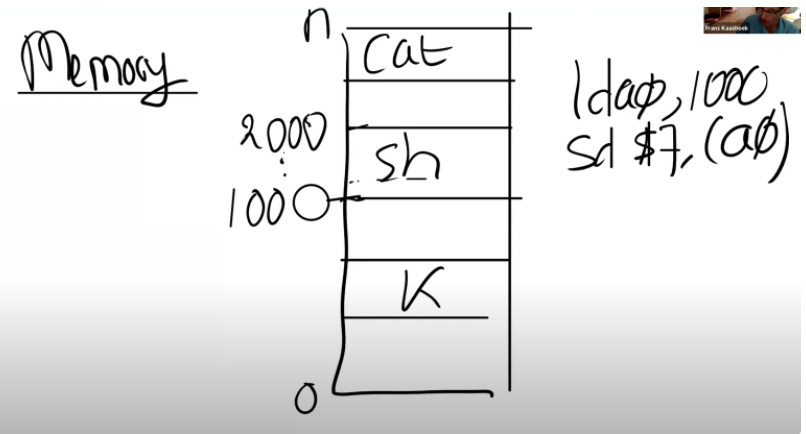

​	应该有一种方法，让每个程序包括内核在内的都有自己专属的地址空间。该地址空间从0到某个地址结束。

​	所以现在问题是如何在一个物理内存上，创建不同的地址空间。

> ​	问题1：物理内存的数量是有限的，而虚拟地址空间存在最大虚拟内存地址，但是如果有很多个虚拟地址空间，我们在设计的时候需要将最大虚拟内存地址设置的足够小吗？
>
> ​	不需要。虚拟内存可以比物理内存更大，物理内存也可以比虚拟内存更大。我们马上就会看到这里是如何实现的，其实就是通过page table来实现，这里非常灵活。
>
> ​	问题2：如果有太多的进程使用了虚拟内存，有没有可能物理内存耗尽了？
>
> ​	有可能的。如果你有一些大的应用程序，每个程序都有大的page table，并且分配了大量的内存，在某个时间你的内存就耗尽了。

## 2. 页表（Page Table）

​	为了实现在一个物理内存上，创建不同地址空间，我们可以使用页表。

​	页表是硬件中通过处理器和内存管理单元（Memory Management Unit）实现。

​	对于任何一条带有地址的指令，其中地址应该认为是虚拟内存地址，而不是物理地址。例如寄存器a0中是地址`10x1000`，那么这是一个虚拟内存地址。

​	虚拟内存地址会转到内存管理单元，内存管理单元会将虚拟地址转换为物理地址，之后在用这个物理地址来索引物理内存，并从物理内存加载或向物理内存存储数据。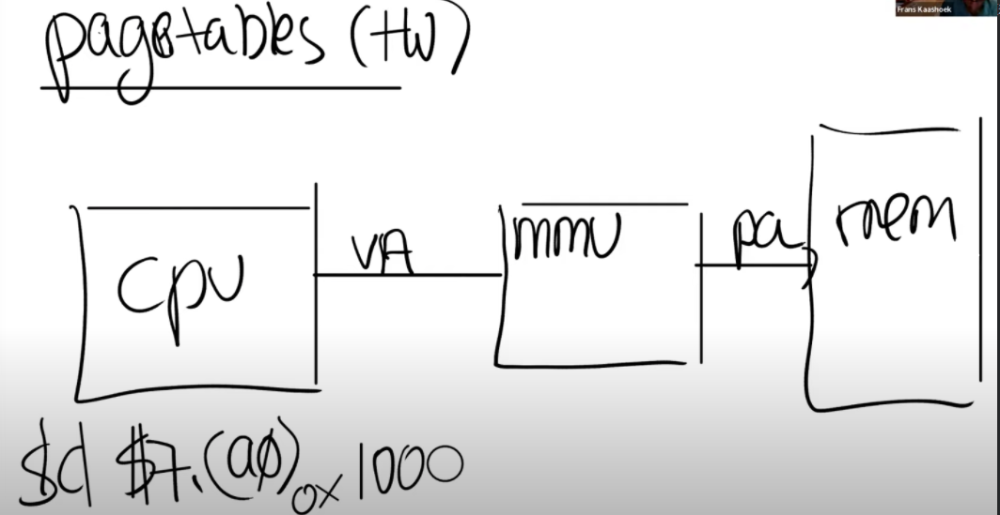

​	从CPU的角度来说，一旦MMU打开了，它执行的每条指令中的地址都是虚拟内存地址。

​	为了能够完成虚拟内存地址到物理内存地址的翻译，MMU会有一个表单，表单中，一边是虚拟内存地址，另一边是物理内存地址。

​	通常来说，这个表单保存在内存中。所以CPU需要一些寄存器来存放表单在物理内存中的地址。例如某个位置有一个地址关系表单，假设该位置的物理内存地址是`0x10`，那么在`RISC-V`上一个叫做`SATP`的寄存器会保存地址`0x10`.

​	这样，CPU就可以告诉MMU，从哪找到将虚拟内存地址转换成物理内存地址的表单。

> ​	提问1：MMU并不会保存page table，只会从内存中读取page table，然后完成翻译，对吗？
>
> ​	是的

​		基本想法就是**每个应用程序都有自己独立的表单**，并且这个表单定义了应用程序的地址空间。	

​	当操作系统将CPU从一个应用程序切换到另一个应用程序时，同时也需要切换`SATP`寄存器中的内容，从而指向新的进程保存在物理内存中的地址对应表单。

> ​	提问2：每个进程对应的SATP值是由内核保存的？
>
> ​	是的。内核会写SATP寄存器，这是一条特权指令。所以用户应程序不能通过更新这个寄存器来更换一个地址对应表单，否则就会破坏隔离性。所以，只有运行在kernel mode的代码才可以更新这个寄存器

---

​	通过前面讲述，对页表应该有个大概认识了。

​	那么页表是如何工作的？如果对于每个虚拟地址，在表单中都有一个条目，对于RISC-V，会有$2^{64}$个地址，如果以地址为粒度来管理，表单会非常巨大。

​	所以，实际情况不可能是虚拟内存地址对应`page table`中的一个条目。

​	接下来，会分两部介绍`RISC-V`是如何工作的

​	第一步：**不要为每个地址创建一条表单条目，而是为每个page创建一条表单条目**。（这里第一次读挺蒙的，仔细一想，其实就是将页表拆分为许多page，以前一直以为page=页表QAQ）

​	在RISC-V中，一个page是`4KB`，也就是`4096Bytes`。这个大小非常常见，几乎所有的处理器都是这样。

​	现在，内存地址翻译方式就变了。对于虚拟内存地址，会将它划分为两个部分，`index`和`offset`，`index`用来查找`page`，`offset`对应是一个`page`中的哪个字节

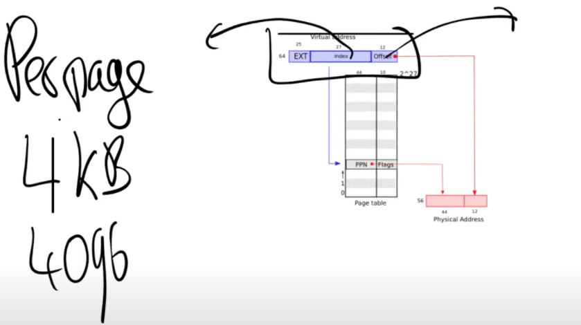

​	在MMU做地址翻译时，通过读取虚拟内存地址的`index`可以知道物理内存中的`page`号，`offset`则指定了偏移量。

​	在RISC-V中，虚拟内存地址都是`64bit`，但并不是全被使用了，高`25bit`并没有使用。所以虚拟内存地址数量只有$2^{39}$个，大概512GB.

​	在剩下的`39bit`中，有`27bit`被用来当作`index`，`12bit`被用来当作`offset`。`offset`必须是`12bit`，对应了一个`page`的`4096`个字节。

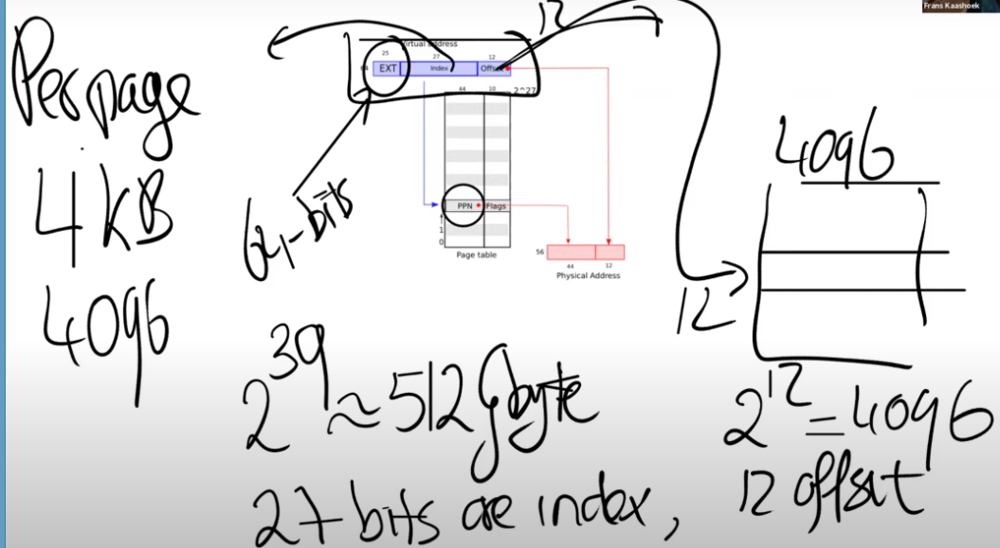	

​	在RISC-V中，物理内存地址是`56bit`。所以物理内存可以大于单个虚拟内存地址空间，但是也最多到$2^{56}$。大多数主板还不支持$2^{56}$这么大的物理内存，但是原则上，如果你能造出这样的主板，那么最多可以支持2^56字节的物理内存。

> ​	提问3：4KB作为一个page，这在物理内存中是连续的嘛？
>
> ​	是的，在物理内存中，这是连续的4096个字节。
>
> ​	提问4：56bit是根据什么确定的？
>
> ​	硬件设计人员决定的。而且主板只需要56根线
>
> ​	提问5：如果虚拟内存最多是$2^{39}$，而物理内存最多是$2^{56}$，这样我们可以有多个进程都用光了他们的虚拟内存，但是物理内存还有剩余，对吗？
>
> ​	是的
>
> ​	提问6：从CPU到MMU之后到了内存，但是不同的进程之间的怎么区别？比如说Shell进程在地址0x1000存了一些数据，ls进程也在地址0x1000也存了一些数据，我们需要怎么将它们翻译成不同的物理内存地址。
>
> ​	SATP寄存器包含了需要使用的地址转换表的内存地址。所以ls有自己的地址转换表，cat也有自己的地址转换表。每个进程都有完全属于自己的地址转换表。

​	通过上面这第一步，**地址转换是以page为粒度了，而不是以单个内存地址为粒度**。

---

​	下一个问题：如果每个进程都有自己的`page table`，那么每个`page table`表会有多大呢？

​	我们知道，page table最多会有$2^{27}$个条目（虚拟内存地址中的index长度为27）。如果每个进程都使用这么大的`page table`的话，很快物理内存就会耗尽。

​	实际上，`page table`是一个多级的结构，也就是常说的**多级页表**。

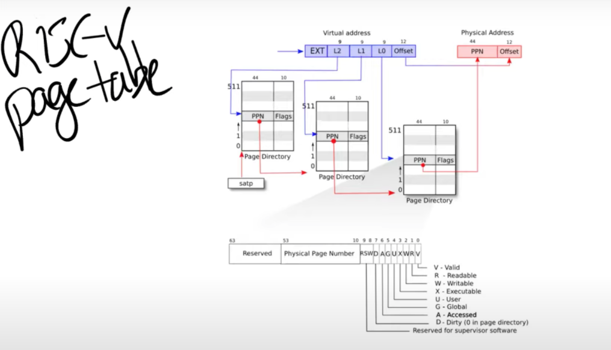

​	之前说的`27bit`的index，实际上是由3个`9bit`的数字组成（L2，L1，L0）。前9个bit被用来索引最高级的`page directory`。（注：通常page directory是用来索引page table或者其他page directory物理地址的表单，但是在课程中，page table，page directory， page directory table区分并不明显，可以都认为是有相同结构的地址对应表单）。

​	一个directory是`4096Bytes`，就跟page的大小是一样的。Directory中的一个条目被称为PTE（Page Table Entry）是`64bits`，就像寄存器的大小一样，也就是`8Bytes`。所以一个Directory page有`512`个条目。

​	所以实际上，SATP寄存器会指向最高一级的page directory的物理内存地址，之后我们用虚拟内存中index的高`9bit`用来索引最高一级的page directory，这样我们就能得到一个`PPN`，也就是`物理page号`。

​	当我们在使用中间级的page directory时，我们通过虚拟内存地址中的L1部分完成索引。接下来会走到最低级的page directory，我们通过虚拟内存地址中的L0部分完成索引。在最低级的page directory中，我们可以得到对应于虚拟内存地址的物理内存地址。

​	这种方案的主要优点是**如果地址空间中大部分地址都没有使用，不必为每一个index准备一个条目**。

​	举个例子，如果你的地址空间只使用了一个page，4096Bytes。除此之外，你没有使用任何其他的地址。现在，你需要多少个page table entry，或者page table directory来映射这一个page？

​	在最高级，你需要一个page directory。在这个page directory中，你需要一个数字是0的PTE，指向中间级page directory。所以在中间级，你也需要一个page directory，里面也是一个数字0的PTE，指向最低级page directory。所以这里总共需要3个page directory（也就是3 * 512个条目）。

​	而在前一个方案中，虽然我们只使用了一个page，还是需要$2^{27}$个PTE。

> ​	提问7：既然每个物理page的PPN是44bit，而物理地址是56bit，我们从哪得到缺失的12bit？
>
> ​	所有的page directory传递的都是PPN，对应的物理地址是44bit的PPN加上12bit的0（注，也就是page的起始地址，因为每个page directory都使用一个完整的page，所以直接从page起始地址开始使用就行）。如果我们查看这里的PTE条目，它们都有相同的格式，其中44bit是PPN，但是寄存器是64bit的，所有有一些bit是留空的。实际上，支持page的硬件在低10bit存了一些标志位用来控制地址权限。
>
> ​	如果你把44bit的PPN和10bit的Flags相加是54bit，也就是说还有10bit未被使用，这10bit被用来作为未来扩展。比如说某一天你有了一个新的RISC-V处理器，它的page table可能略有不同，或许有超过44bit的PPN。如果你看下面这张图，你可以看到，这里有10bit是作为保留字段存在的。

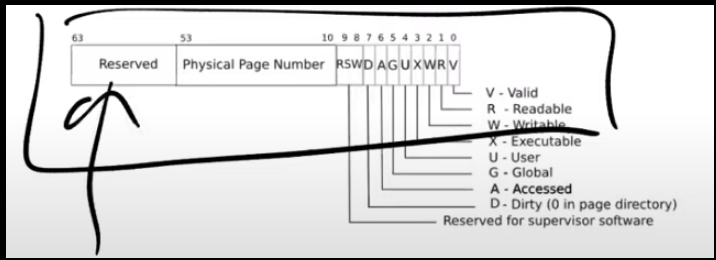

接下来，看看PTE中的Falg

- Valid：如果Valid bit位为1，那么表明这是一条合法的PTE，你可以用它来做地址翻译。
- R和W：表明是否可以读/写这个page。
- Executable表明你可以从这个page执行指令。
- User表明这个page可以被运行在用户空间的进程访问。
- 其他标志位并不是那么重要，他们偶尔会出现，前面5个是重要的标志位。

> ​	提问8：PPN是如何合并成最终的物理内存地址？
>
> ​	在最高级的page directory中的PPN，包含了下一级page directory的物理内存地址，依次类推。在最低级page directory，我们还是可以得到44bit的PPN，这里包含了我们实际上想要翻译的物理page地址，然后再加上虚拟内存地址的12bit offset，就得到了56bit物理内存地址。
>
> ---
>
> ​	提问9：为什么是page directory存放PPN？为什么不是存一个虚拟内存地址？
>
> ​	需要在物理内存中查找下一个page directory的地址。不能让我们的地址翻译依赖于另一个翻译，否则我们可能会陷入递归的无限循环中。
>
> ---
>
> ​	提问10：SATP呢？它存的是物理地址还是虚拟地址？
>
> ​	还是物理地址，因为最高级的page directory还是存在物理内存中
>
> ---
>
> ​	提问11：层次化的3个page table，每个page table都由虚拟地址的9个bit来索引，所以是由虚拟地址中的3个9bit来分别索引3个page table，对吗？
>
> ​	是的，最高的9个bit用来索引最高一级的page directory，第二个9bit用来索引中间级的page directory，第三个9bit用来索引最低级的page directory。
>
> ---
>
> ​	提问12：当一个进程请求一个虚拟内存地址时，CPU会查看SATP寄存器得到对应的最高一级page table，这级page table会使用虚拟内存地址中27bit index的最高9bit来完成索引，如果索引的结果为空，MMU会自动创建一个page table吗？
>
> ​	不会的，MMU会告诉操作系统或者处理器，抱歉我不能翻译这个地址，最终这会变成一个page fault。如果一个地址不能被翻译，那就不翻译。就像你在运算时除以0一样，处理器会拒绝那样做。
>
> ---
>
> ​	提问13：怎么计算page table的物理地址，是不是这样，我们从最高级的page table得到44bit的PPN，然后再加上虚拟地址中的12bit offset，就得到了完整的56bit page table物理地址？
>
> ​	不会加上虚拟地址中的offset，这里只是使用了12bit的0。所以我们用44bit的PPN，再加上12bit的0，这样就得到了下一级page directory的56bit物理地址。这里要求每个page directory都与物理page对齐（也就是page directory的起始地址就是某个page的起始地址，所以低12bit都为0）。

## 3. 页表缓存（Translation Lookaside Buffer）

​	通过上述对页表的分析，可以知道，基本上都要做3次内存查找才可以完成一次地址转换。但这代价有点高，这时候我们可以很自然的想道用一个缓存来缓解这个问题：称为`Translation Lookside Buffer`（通常翻译成页表缓存）。简称TLB。也就是PTE的缓存

​	当处理器第一次查找一个虚拟地址时，硬件通过3级page table得到最终的PPN，TLB会保存虚拟地址到物理地址的映射关系。这样下一次当你访问同一个虚拟地址时，处理器可以查看TLB，TLB会直接返回物理地址，而不需要通过page table得到结果。

> ​	提问1：学生提问：前面说TLB会保存虚拟地址到物理地址的对应关系，如果在page级别做cache是不是更加高效？
>
> ​	有很多种方法都可以实现TLB，对于你们来说最重要的是知道TLB是存在的。TLB实现的具体细节不是我们要深入讨论的内容。这是处理器中的一些逻辑，对于操作系统来说是不可见的，操作系统也不需要知道TLB是如何工作的。你们需要知道TLB存在的唯一原因是，如果你切换了page table，操作系统需要告诉处理器当前正在切换page table，处理器会清空TLB。因为本质上来说，如果你切换了page table，TLB中的缓存将不再有用，它们需要被清空，否则地址翻译可能会出错。所以操作系统知道TLB是存在的，但只会时不时的告诉操作系统，现在的TLB不能用了，因为要切换page table了。在RISC-V中，清空TLB的指令是sfence_vma。
>
> ---
>
> ​	提问2：3级的page table是由操作系统实现的还是由硬件自己实现的？
>
> ​	由硬件实现的，所以3级 page table的查找都发生在硬件中。MMU是硬件的一部分而不是操作系统的一部分。在XV6中，有一个函数也实现了page table的查找，因为时不时的XV6也需要完成硬件的工作，所以XV6有这个叫做walk的函数，它在软件中实现了MMU硬件相同的功能。
>
> ---
>
> ​	提问3：在这个机制中，TLB发生在哪一步，是在地址翻译之前还是之后？
>
> ​	整个CPU和MMU都在处理器芯片中，所以在一个RISC-V芯片中，有多个CPU核，MMU和TLB存在于每一个CPU核里面。RISC-V处理器有L1 cache，L2 Cache，有些cache是根据物理地址索引的，有些cache是根据虚拟地址索引的，由虚拟地址索引的cache位于MMU之前，由物理地址索引的cache位于MMU之后。
>
> ---
>
> ​	提问4：硬件会完成3级 page table的查找，那为什么我们要在XV6中有一个walk函数来完成同样的工作？
>
> ​	XV6中的walk函数设置了最初的page table，它需要对3级page table进行编程所以它首先需要能模拟3级page table。另一个原因或许你们已经在syscall实验中遇到了，在XV6中，内核有它自己的page table，用户进程也有自己的page table，用户进程指向sys_info结构体的指针存在于用户空间的page table，但是内核需要将这个指针翻译成一个自己可以读写的物理地址。如果你查看copy_in，copy_out，你可以发现内核会通过用户进程的page table，将用户的虚拟地址翻译得到物理地址，这样内核可以读写相应的物理内存地址。这就是为什么在XV6中需要有walk函数的一些原因。
>
> ---
>
> ​	提问5：为什么硬件不开发类似于walk函数的接口？这样我们就不用在XV6中用软件实现自己的接口，自己实现还容易有bug。为什么没有一个特殊权限指令，接收虚拟内存地址，并返回物理内存地址？
>
> ​	其实这就跟你向一个虚拟内存地址写数据，硬件会自动帮你完成工作一样（工作是指翻译成物理地址，并完成数据写入）。你们在page table实验中会完成相同的工作。我们接下来在看XV6的实现的时候会看到更多的内容。

​		`page table`提供了一层抽象，抽象就是指从虚拟地址到物理地址的映射。这里的映射关系完全由操作系统控制。

## 4. Kernel Page Table

​	接下来，看下在XV6，`page table`是如何工作的？

​	下图就是内核中地址的对应关系，左边是内核的虚拟地址空间，右边上半部分是物理内存或者说是DRAM，右边下半部分是I/O设备。

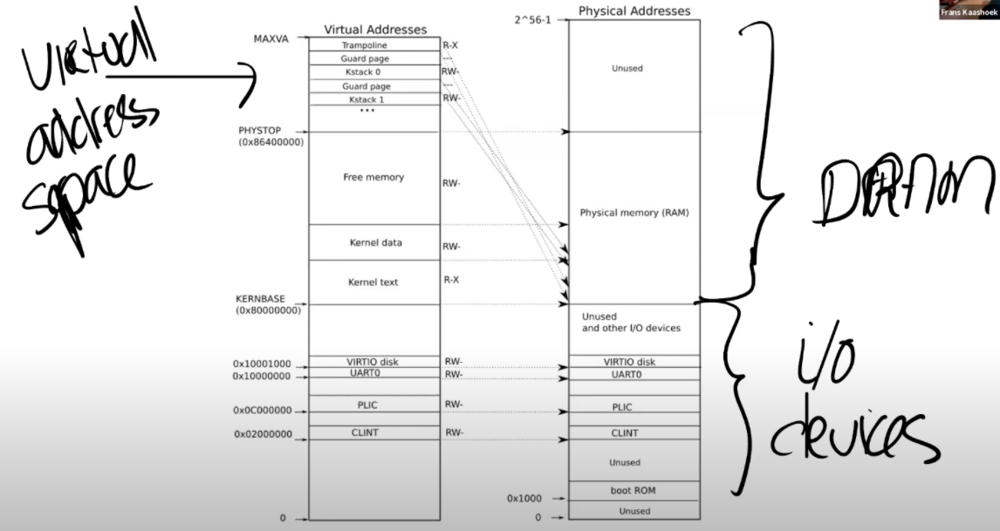

​	先看看右半部分，图中的右半部分的结构完全由硬件设计者决定，操作系统启动时，会从地址0x80000000开始运行，这个地址其实也是由硬件设计者决定的。

​	下图是一个主板	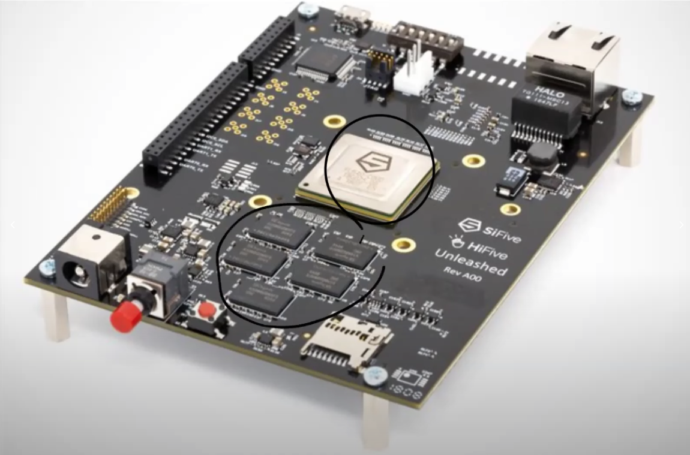

​	中间是RISC-V处理器，我们现在知道了处理器中有4个核，每个核都有自己的MMU和TLB。处理器旁边就是DRAM芯片。

​	主板的设计人员决定了，在完成了虚拟到物理地址的翻译之后，如果得到的物理地址大于`0x80000000`会走向DRAM芯片，如果得到的物理地址低于`0x80000000`会走向不同的I/O设备。这是由这个主板的设计人员决定的物理结构。

> ​	提问1：这里是由硬件决定的，硬件是特指CPU还是说CPU所在的主板？
>
> ​	CPU所在的主板。CPU只是主板的一小部分，DRAM芯片位于处理器之外。是主板设计者将处理器，DRAM和许多I/O设备汇总在一起。对于一个操作系统来说，CPU只是一个部分，I/O设备同样也很重要。所以当你在写一个操作系统时，你需要同时处理CPU和I/O设备，比如你需要向互联网发送一个报文，操作系统需要调用网卡驱动和网卡来实际完成这个工作。

​	回到最初那张图的右侧：物理地址的分布。可以看到最下面是未被使用的地址，这与主板文档内容是一致的（地址为0）。地址0x1000是boot ROM的物理地址，当你对主板上电，主板做的第一件事情就是运行存储在boot ROM中的代码，当boot完成之后，会跳转到地址0x80000000，操作系统需要确保那个地址有一些数据能够接着启动操作系统。

​	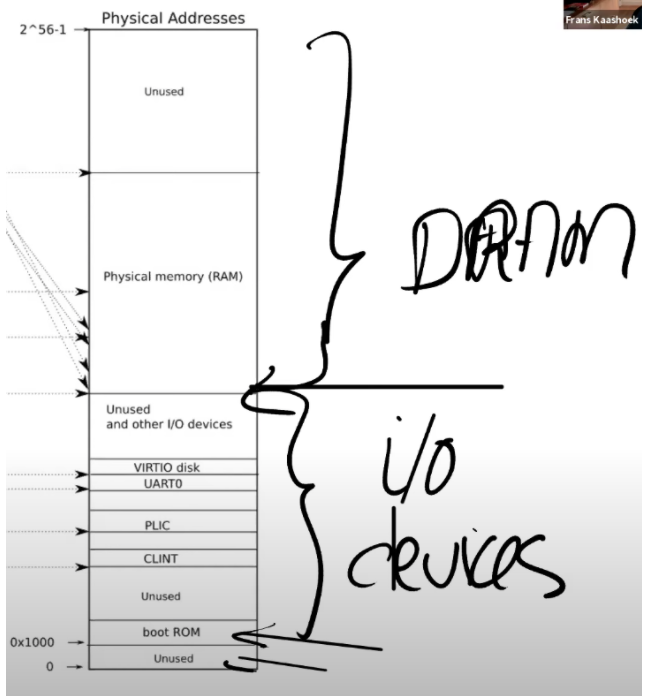

​	这里还有一些其他的I/O设备：

- PLIC是中断控制器（Platform-Level Interrupt Controller）我们下周的课会讲。

- CLINT（Core Local Interruptor）也是中断的一部分。所以多个设备都能产生中断，需要中断控制器来将这些中断路由到合适的处理函数。

- UART0（Universal Asynchronous Receiver/Transmitter）负责与Console和显示器交互。

- VIRTIO disk，与磁盘进行交互。

> ​	提问1：低于0x80000000的物理地址，不存在于DRAM中，当我们在使用这些地址的时候，指令会直接走向其他的硬件，对吗？
>
> ​	是的。高于0x80000000的物理地址对应DRAM芯片，但是对于例如以太网接口，也有一个特定的低于0x80000000的物理地址，我们可以对这个叫做内存映射I/O（Memory-mapped I/O）的地址执行读写指令，来完成设备的操作。
>
> ---
>
> ​	提问2：为什么物理地址最上面一大块标为未被使用？
>
> ​	物理地址总共有2^56那么多，但是你不用在主板上接入那么多的内存。所以不论主板上有多少DRAM芯片，总是会有一部分物理地址没有被用到。实际上在XV6中，我们限制了内存的大小是128MB。
>
> ---
>
> ​	提问3：当读指令从CPU发出后，它是怎么路由到正确的I/O设备的？比如说，当CPU要发出指令时，它可以发现现在地址是低于0x80000000，但是它怎么将指令送到正确的I/O设备？
>
> ​	可以认为在RISC-V中有一个多路输出选择（demultiplexer）。

---

​	接下来看看左边，这就是XV6的虚拟内存地址空间。

​	当机器刚刚启动时，还没有可用的page，XV6操作系统会设置好内核使用的虚拟地址空间，也就是这张图左边的地址分布。

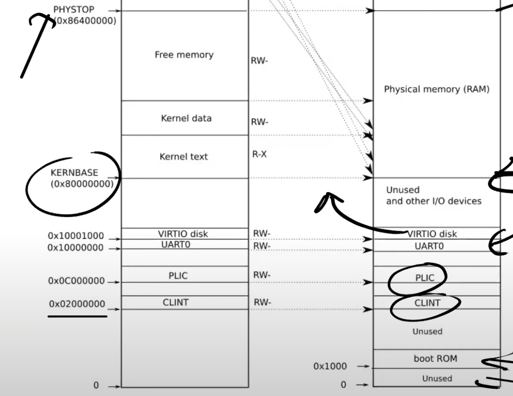

- **有一些page在虚拟内存中的地址很靠后，比如kernel stack在虚拟内存中的地址就很靠后。**

    ​	因为在它之下有一个未被映射的`Guard page`，这个`Guard page`对应的`PTE`的`Valid` 标志位没有设置，这样，如果`kernel stack`耗尽了，它会溢出到`Guard page`，但是因为`Guard page`的`PTE`中`Valid`标志位未设置，会导致立即触发`page fault`，这样的结果好过内存越界之后造成的数据混乱。立即触发一个`panic`（也就是`page fault`），你就知道kernel stack出错了。同时我们也又不想浪费物理内存给`Guard page`，所以Guard page不会映射到任何物理内存，它只是占据了虚拟地址空间的一段靠后的地址。

    ​	同时，kernel stack被映射了两次，在靠后的虚拟地址映射了一次，在PHYSTOP下的Kernel data中又映射了一次，但是实际使用的时候用的是上面的部分，因为有Guard page会更加安全。

    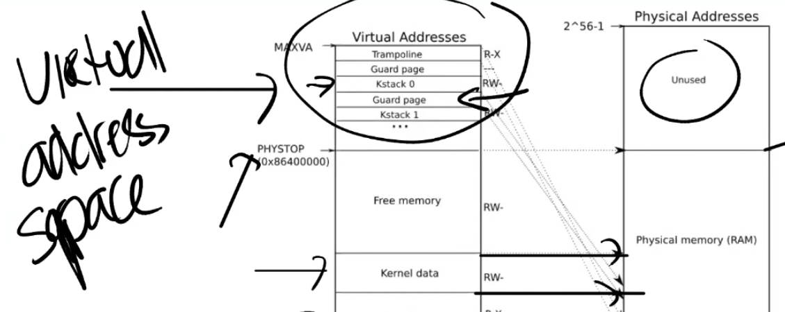

- 权限

    ​	例如Kernel text page被标位R-X，意味着你可以读它，也可以在这个地址段执行指令，但是你不能向Kernel text写数据。通过设置权限我们可以尽早的发现Bug从而避免Bug。对于Kernel data需要能被写入，所以它的标志位是RW-，但是你不能在这个地址段运行指令，所以它的X标志位未被设置。（注，所以，kernel text用来存代码，代码可以读，可以运行，但是不能篡改，kernel data用来存数据，数据可以读写，但是不能通过数据伪装代码在kernel中运行）

> ​	提问4：对于不同的进程会有不同的kernel stack吗？
>
> ​	是的。每一个用户进程都有一个对应的kernel stack
>
> ---
>
> ​	提问5：用户程序的虚拟内存会映射到未使用的物理地址空间吗？
>
> ​	在kernel page table中，有一段Free Memory，它对应了物理内存中的一段地址。XV6使用这段free memory来存放用户进程的page table，text和data。如果我们运行了非常多的用户进程，某个时间点我们会耗尽这段内存，这个时候fork或者exec会返回错误。
>
> ---
>
> ​	提问6：用户进程的虚拟地址空间会比内核的虚拟地址空间小的多，是吗？
>
> ​	本质上来说，两边的虚拟地址空间大小是一样的。但是用户进程的虚拟地址空间使用率会更低。
>
> ---
>
> ​	提问7：如果多个进程都将内存映射到了同一个物理位置，这里会优化合并到同一个地址吗？
>
> ​	XV6不会做这样的事情，但是page table实验中有一部分就是做这个事情。真正的操作系统会做这样的工作。

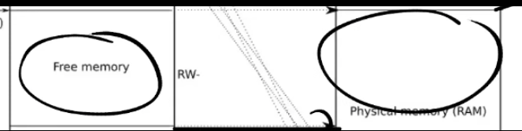

> ​	提问8：每个进程都会有自己的3级树状page table，通过这个page table将虚拟地址翻译成物理地址。所以看起来当我们将内核虚拟地址翻译成物理地址时，我们并不需要kernel的page table，因为进程会使用自己的树状page table并完成地址翻译。（个人理解：是想问为什么还要加上kernel的page table）
>
> ​	当kernel创建了一个进程，针对这个进程的page table也会从Free memory中分配出来。内核会为用户进程的page table分配几个page，并填入PTE。在某个时间点，当内核运行了这个进程，内核会将进程的根page table的地址加载到SATP中。从那个时间点开始，处理器会使用内核为那个进程构建的虚拟地址空间。
>
> ---
>
> ​	提问9：所以内核为进程放弃了一些自己的内存，但是进程的虚拟地址空间理论上与内核的虚拟地址空间一样大，虽然实际中肯定不会这么大?
>
> ​	是的，下图是用户进程的虚拟地址空间分布，与内核地址空间一样，它也是从0到MAXVA。它有由内核设置好的，专属于进程的page table来完成地址翻译。
>
> ---
>
> ​	提问10：不能将所有的MAXVA地址都使用吧？
>
> ​	是的我们不能，这样我们会耗尽内存。大多数的进程使用的内存都远远小于虚拟地址空间。

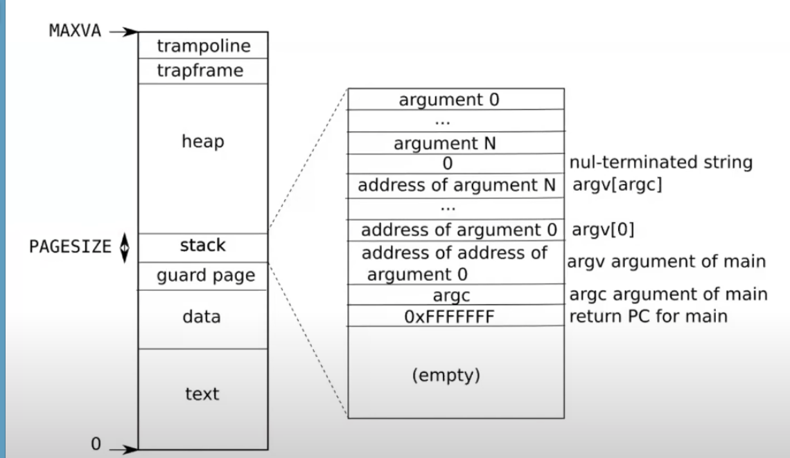

​	kernal page table是给内核态用的

​	系统调用 异常 中断这三种情况系统都会自动跳转到内核态 这个时候需要用到kernal page table