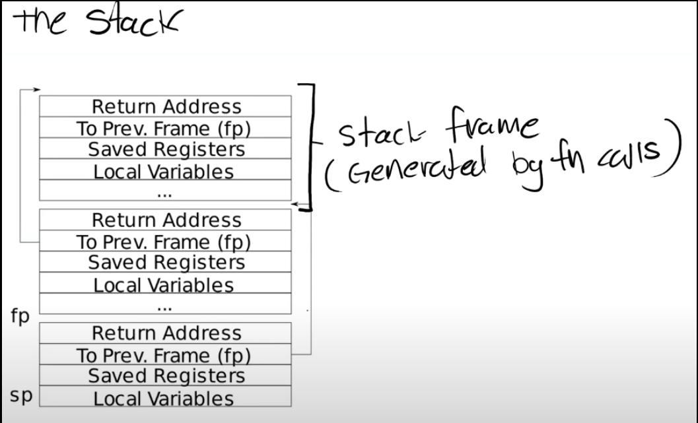

# Calling conventions and stack frames RISC-V

## 1. C程序到汇编程序的转换

​	当我们说到一个RISC-V处理器时，意味着这个处理器能够理解RISC-V的指令集。

​	任何一个处理器都有一个关联的`ISA`（Instruction Sets Architecture），`ISA`就是处理器能够理解的指令集。每一条指令都有一个对应的二进制编码或者一个Opcode。当处理器在运行时，如果看见了这些编码，那么处理器就知道该做什么样的操作。

​	汇编语言不具备C语言的组织结构，在汇编语言中你只能看到一行行的指令，比如add，mult等等。汇编语言中没有很好的控制流程，没有循环（注，但是有基于lable的跳转），虽然有函数但是与你们知道的C语言函数不太一样，汇编语言中的函数是以label的形式存在而不是真正的函数定义。汇编语言是一门非常底层的语言，许多其他语言，比如C++，都会编译成汇编语言。运行任何编译型语言之前都需要先生成汇编语言。

## 2. RISC-V vs x86

​	大多数现代计算机都运行在x86和x86-64处理器上。x86拥有一套不同的指令集，看起来与RISC-V非常相似。通常你们的个人电脑上运行的处理器是x86，Intel和AMD的CPU都实现了x86。

​	RISC-V中的`RISC`是精简指令集（Reduced Instruction Set Computer）的意思，而x86通常被称为`CISC`，复杂指令集（Complex Instruction Set Computer）。这两者之间有一些关键的区别：

- 指令的数量。
- RISC-V指令也更加简单。
- RISC是开源的

​	ARM也是一个精简指令集，高通的Snapdragon处理器就是基于ARM。如果你使用一个Android手机，那么大概率你的手机运行在精简指令集上。如果你使用IOS，苹果公司也实现某种版本的ARM处理器，这些处理器运行在iPad，iPhone和大多数苹果移动设备上，甚至对于Mac，苹果公司也在尝试向ARM做迁移（注，刚刚发布的Macbook）。所以精简指令集出现在各种各样的地方。如果你想在现实世界中找到RISC-V处理器，你可以在一些嵌入式设备中找到。所以RISC-V也是有应用的，当然它可能没有x86那么流行。

> ​	提问1： 为什么x86会有15000条指令？
>
> ​	许多指令来实现向后兼容，向后兼容是否重要因人而异。另一方面，这里许多指令都是cmd指令，用来完成一些特殊的操作。我从来没有见过一个Intel的汇编代码使用了所有的15000个指令。大多数这些指令都是为了向后兼容和cmd的需求创建。

​	RISC-V的特殊之处在于：它区分了`Base Integer Instruction Set`和`Standard Extension Instruction Set`

​	`Base Integer Instruction Set`包含了所有的常用指令，比如add，mult。除此之外，处理器还可以选择性的支持`Standard Extension Instruction Set`。例如，一个处理器可以选择支持`Standard Extension for Single-Precision Float-Point`。这种模式使得RISC-V更容易支持向后兼容。 每一个`RISC-V`处理器可以声明支持了哪些扩展指令集，然后编译器可以根据支持的指令集来编译代码。

> ​	提问2：使用x86而不是RISC-V的唯一优势就是能得到性能的提升，但是这里的性能是以复杂度和潜在的安全为代价的，我的问题是为什么我们还在使用x86，而不是使用RISC-V处理器？
>
> ​	现在整个世界都运行在x86上，如果你突然将处理器转变成RISC-V，那么你就会失去很多重要的软件支持。同时，Intel在它的处理器里面做了一些有意思的事情，例如安全相关的enclave，这是Intel最近加到处理器中来提升安全性的功能。此外，Intel还实现了一些非常具体的指令，这些指令可以非常高效的进行一些特定的运算。所以Intel有非常多的指令，通常来说对于一个场景都会有一个完美的指令，它的执行效率要高于RISC-V中的同等指令。但是这个问题更实际的答案是，RISC-V相对来说更新一些，目前还没有人基于RISC-V来制造个人计算机，SiFive也就是最近才成为第一批将RISC-V应用到个人计算机的公司。所以，从实际的角度来说，因为不能在RISC-V上运行所有为Intel设计的软件。

	## 3. gdb和汇编代码执行

​	见gdb debug环境搭建.md

## 4. RISC-V寄存器

​	

​	寄存器是CPU或者处理器上，预先定义的可以用来存储数据的位置。

​	寄存器之所以重要是因为汇编代码并不是在内存上执行，而是在寄存器上执行，也就是说，当我们在做add，sub时，我们是对寄存器进行操作。所以你们通常看到的汇编代码中的模式是，我们通过load将数据存放在寄存器中，这里的数据源可以是来自内存，也可以来自另一个寄存器。

​	当我们调用函数时，你可以看到这里有a0 - a7寄存器。通常我们在谈到寄存器的时候，我们会用它们的**ABI名字**。不仅是因为这样描述更清晰和标准，同时也因为在写汇编代码的时候使用的也是ABI名字。第一列中的寄存器名字并不是超级重要，它唯一重要的场景是在RISC-V的Compressed Instruction中。

​	基本上来说，RISC-V中通常的指令是64bit，但是在Compressed Instruction中指令是16bit。在Compressed Instruction中我们使用更少的寄存器，也就是x8 - x15寄存器。我猜你们可能会有疑问，为什么s1寄存器和其他的s寄存器是分开的，因为s1在Compressed Instruction是有效的，而s2-11却不是。除了Compressed Instruction，寄存器都是通过它们的ABI名字来引用。

​	a0到a7寄存器是用来作为函数的参数。如果一个函数有超过8个参数，我们就需要用内存了。从这里也可以看出，当可以使用寄存器的时候，我们不会使用内存，我们只在不得不使用内存的场景才使用它。

​	表单中的第4列，Saver列，当我们在讨论寄存器的时候也非常重要。它有两个可能的值`Caller`，`Callee`。我经常混淆这两个值，因为它们只差一个字母。我发现最简单的记住它们的方法是：

- `Caller Saved`寄存器在函数调用的时候不会保存
- `Callee Saved`寄存器在函数调用的时候会保存

​	一个`Caller Saved`寄存器可能被其他函数重写。假设我们在函数a中调用函数b，任何被函数a使用的并且是Caller Saved寄存器，调用函数b可能重写这些寄存器。

​	一个比较好的例子就是Return address寄存器（注，保存的是函数返回的地址），你可以看到ra寄存器是Caller Saved，这一点很重要，它导致了当函数a调用函数b的时侯，b会重写Return address。所以基本上来说，任何一个Caller Saved寄存器，作为调用方的函数要小心可能的数据可能的变化

​	一个Callee Saved寄存器，作为被调用方的函数要小心寄存器的值不会相应的变化。

## 5. Stack

​	下面是一个非常简单的栈的结构图，其中每一个区域都是一个Stack Frame，每执行一次函数调用就会产生一个Stack Frame。

​	每一次我们调用一个函数，函数都会为自己创建一个`Stack Frame`，并且只给自己用。函数通过移动`Stack Pointer`来完成`Stack Frame`的空间分配。

---

​	对于`Stack`来说，是从高地址开始向低地址使用。所以栈总是向下增长。当我们想要创建一个新的`Stack Frame`的时候，总是对当前的`Stack Pointer`做减法。

​	一个函数的Stack Frame包含了保存的寄存器，本地变量，并且，如果函数的参数多于8个，额外的参数会出现在`Stack`中。

​	Stack Frame大小并不总是一样，即使在这个图里面看起来是一样大的。不同的函数有不同数量的本地变量，不同的寄存器，所以Stack Frame的大小是不一样的。

​	但有两件事是确定的：

- `Return address`总是会出现在`Stack Frame`的第一位
- 指向前一个`Stack Frame`的指针也会出现在栈中的固定位置

​	有关Stack Frame中有两个重要的寄存器：

​	第一个是`SP（Stack Pointer）`，它指向Stack的底部并代表了当前Stack Frame的位置。

​	第二个是`FP（Frame Pointer）`，它指向当前Stack Frame的顶部。因为Return address和指向前一个Stack Frame的的指针都在当前Stack Frame的固定位置，所以可以通过当前的FP寄存器寻址到这两个数据。

​	保存前一个`Stack Frame`的指针的原因是为了让我们能跳转回去。所以当前函数返回时，我们可以将前一个`Frame Pointer`存储到FP寄存器中。所以我们使用`Frame Pointer`来操纵我们的`Stack Frames`，并确保我们总是指向正确的函数。

## 6. Struct

​	你可以认为struct像是一个数组，但是里面的不同字段的类型可以不一样。

