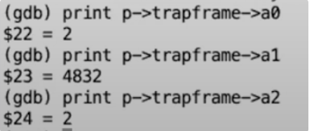

#  **Isolation & system call entry/exit** 

## 1. Trap机制

程序运行是完成用户空间和内核空间的切换。每当

- 程序执行系统调用
- 程序出现了类似`page fault`，运算时除0的错误
- 一个设备触发了中断使得当前程序需要响应内核设备驱动

都会发生这样的切换

**用户空间和内核空间的切换通常被称为trap**。

​	例如Shell，它运行在用户空间，同时我们还有内核空间。Shell会执行系统调用，将程序切换到内核。比如XV6启动之后Shell输出的一些提示信息，就是通过执行write系统调用来输出的。这是Shell尝试执行wrtie系统调用的一个例子。

​	需要清除地如何让程序的运行，从只拥有user权限并且位于用户空间的Shell，切换到拥有supervisor权限的内核。

​	在这个过程中，硬件的状态将会非常重要，因为我们很多的工作都是将硬件从适合运行用户应用程序的状态，改变到适合运行内核代码的状态。

​	我们知道，有32个用户寄存器，32个寄存器重要的有

- 堆栈寄存器
- 程序计数器
- 表明当前mode的标志位，这个标志位表明了当前是supervisor mode还是user mode。当我们在运行Shell的时候，自然是在user mode。
- 还有一堆控制CPU工作方式的寄存器，比如SATP（Supervisor Address Translation and Protection）寄存器，它包含了指向page table的物理内存地址
- 还有一堆控制CPU工作方式的寄存器，比如SATP（Supervisor Address Translation and Protection）寄存器，它包含了指向page table的物理内存地址
- SEPC（Supervisor Exception Program Counter）寄存器，在trap的过程中保存程序计数器的值。
- SSRATCH（Supervisor Scratch Register）寄存器，这也是个非常重要的寄存器

​	肯定的是，在trap的最开始，CPU的所有状态都设置成运行用户代码而不是内核代码。在trap处理的过程中，我们实际上需要更改一些这里的状态，或者对状态做一些操作。这样我们才可以运行系统内核中普通的C程序

- 首先，需要保存32个用户寄存器。

    ​	因为需要恢复用户应用程序的执行，尤其是当用户程序随机的被设备中断所打断时，希望内核能够响应中断，之后用户程序完全无感知的情况下再恢复用户代码的执行。所以这意味着32个用户寄存器不能被内核弄乱。但是这些寄存器又要被内核代码所使用，所以在`trap`之前，必须在某处保存32个用户寄存器。

- 程序计数器也需要在某个地方保存，它几乎跟一个用户寄存器的地位是一样的，我们需要能够在用户程序运行中断的位置继续执行用户程序。
- 将`mode`改成`supervisor mode`，因为我们想要使用内核中的各种各样的特权指令。
- `SATP`寄存器现在正指向`user page table`，而`user page table`只包含了用户程序所需要的内存映射和一两个其他的映射，它并没有包含整个内核数据的内存映射。所以在运行内核代码之前，我们需要将SATP指向`kernel page table`。
- 将堆栈寄存器指向位于内核的一个地址，因为我们需要一个堆栈来调用内核的C函数。

​	操作系统要实现安全和隔离，所以不能让用户代码介入到这里的`user/kernel`切换，否则有可能会破坏安全性。这意味着，`trap`中涉及到的硬件和内核机制不能依赖任何来自用户空间东西。比如说我们不能依赖32个用户寄存器，它们可能保存的是恶意的数据，所以，XV6的`trap`机制不会查看这些寄存器，而只是将它们保存起来。

​	同时，`trap`要对用户代码是透明的，也就是说我们想要执行trap，然后在内核中执行代码，同时用户代码并不用察觉到任何有意思的事情。

---

​	接下来看看在`supervisor mode`可以控制什么

- 读写控制寄存器

    ​	比如说，当你在supervisor mode时，你可以：读写SATP寄存器，也就是page table的指针；STVEC，也就是处理trap的内核指令地址；SEPC，保存当发生trap时的程序计数器；SSCRATCH等等。在supervisor mode你可以读写这些寄存器，而用户代码不能做这样的操作。

- 使用`PTE_U`标志位为0的`PTE`。当`PTE_U`标志位为1的时候，表明用户代码可以使用这个页表；如果这个标志位为0，则只有`supervisor mode`可以使用这个页表。

​	除此之外，不能在做其他的事了

​	需要知道的是，`supervisor mode`中的代码并不能读写任意物理地址。

​	并且，在`supervisor mode`中，也需要通过`page table`来访问内存，如果一个虚拟地址并不在当前由SATP指向的`page table`中，又或者SATP指向的`page table`中PTE_U=1，那么`supervisor mode`不能使用那个地址。

## 2. Trap代码执行流程

​	通过跟踪shell中调用`write`系统调用来理解这一过程

​	实际上，`write`通过执行ECALL指令来执行系统调用。ECALL指令会切换到具有`supervisor mode`的

## 3.  Ecall指令之前的状态

## 4.  Ecall指令之后的状态

​	ecall之后，代码将会到`trampoline page`的最开始，这是用户内存中一个非常大的地址。

​	即将运行的指令在内存的`trampoline page`中

​	

​	这些指令是内核在supervisor mode中将要执行的最开始的几条指令，也是在trap机制中最开始要执行的几条指令。

​	此时查看寄存器，会发现寄存器的值没有改变，还是用户程序拥有的一些寄存器内容。

​	**所以，此时寄存器里还是用户程序的数据，在这些数据保存到某处时，不能使用任何寄存器，否则后面将会无法恢复寄存器数据**。假设此时内核在某个时间点使用了任何一个寄存器，内核会覆盖寄存器内的用户数据，之后尝试要恢复用户程序，我们就不能恢复寄存器中的正确数据，用户程序的执行也会相应的出错。

>  	提问1：csrrw指令是干什么的？
>
> ​	这条指令交换了寄存器a0和sscratch的内容。这个操作超级重要，它回答了这个问题，**内核的trap代码如何能够在不使用任何寄存器的前提下做任何操作**。这条指令将a0的数据保存在了sscratch中，同时又将sscratch内的数据保存在a0中。之后内核就可以任意的使用a0寄存器了。

​	现在在地址`0x3ffffff00`，也就是上面`page table`输出的最后一个page，这是`trampoline page`。

​	也就是说，现在正在`trampoline page`中执行程序，这个`page`包含了内核的trap处理代码。

​	ecall并不会切换page table，这是ecall指令的一个非常重要的特点。所以这意味着，

- trap处理代码必须存在于每一个user page table中。
- 我们需要在user page table中的某个地方来执行最初的内核代码。

​	而这个trampoline page，是由内核小心的映射到每一个user page table中，以使得当我们仍然在使用user page table时，内核在一个地方能够执行trap机制的最开始的一些指令。

​	这里的控制是通过**STVEC寄存器**（处理trap的内核指令地址）完成的，这是一个只能在supervisor mode下读写的特权寄存器。在从内核空间进入到用户空间之前，内核会设置好STVEC寄存器指向内核希望trap代码运行的位置。

​	

​	如图所见，内核已经事先设置好了STVEC寄存器的内容为0x3ffffff000，这就是trampoline page的起始位置。STVEC寄存器的内容，就是在ecall指令执行之后。

​	**即使trampoline page是在用户地址空间的user page table完成的映射，用户代码不能写它，因为这些page对应的PTE并没有设置PTE_u标志位。这也是为什么trap机制是安全的。**

​	现在已经在supervisor mode了，但是实际上并没有任何能直接确认当前在哪种mode下的方法。不过的确发现程序计数器现在正在trampoline page执行代码，而这些page对应的PTE并没有设置PTE_u标志位。所以现在只有当代码在supervisor mode时，才可能在程序运行的同时而不崩溃。所以，从代码没有崩溃和程序计数器的值推导出我们必然在supervisor mode。

---

​	通过ecall走到`trampoline page`的，而`ecall`实际只会改变三件事：

- ecall将代码从user mode改到supervisor mode。
- ecall将程序计数器的值保存在了**SEPC寄存器**（保存当发生trap时的程序计数器）。
- ecall会跳转到**STVEC寄存器**（处理trap的内核指令地址）指向的指令

到这一步，ecall只是做了一点点工作，但实际上和我们执行内核中的C代码还差的很远，接下来：

- 需要保存32个用户寄存器的内容，这样当我们想要恢复用户代码执行时，我们才能恢复这些寄存器的内容。
- 此时还在user page table，切换到kernel page table。（某些操作系统会将这两个映射到一个page table中，但xv6不这么做）
- 创建或者找到一个kernel stack，并将Stack Pointer寄存器的内容指向那个kernel stack。这样才能给C代码提供栈。
- 跳转到内核中C代码的某些合理的位置。

ecall可以理解为硬件层面的操作，而trap是在内核（软件层面）中的操作

> ​	提问2：为什么在gdb中看不到ecall的具体内容？
>
> ​	ecall只会更新CPU中的mode标志位为supervisor，并且设置程序计数器成STVEC寄存器内的值。在进入到用户空间之前，内核会将trampoline page的地址存在STVEC寄存器中。所以ecall的下一条指令的位置是STVEC指向的地址，也就是trampoline page的起始地址。（注，**实际上ecall是CPU的指令，自然在gdb中看不到具体内容**）

## 5.  uservec函数

​	其实上述内容我感觉只是在讲ecall为我们做了什么，接下来随着程序继续看下去

​	现在程序位于`trampoline page`的起始，也是`uservec`函数的起始。

​	我们现在要做的第一件事就是**保存寄存器的内容**。

​	在其他的机器中，或许直接将32个寄存器中的内容写到物理内存中某些合适的位置。但在RISC-V中不能这样做，原因是：**32个寄存器中的内容写到物理内存中某些合适的位置**。所以我们只能使用`page table`中的内容。

​	还有一种操作是：直接将SATP寄存器指向`kernel page table`，之后就可以直接使用所有的`kernel mapping`来帮助我们存储用户寄存器。这是合法的。因为**`supervisor mode`可以更改SATP寄存器**。但有两个问题是：

1. 在`trap`代码当前的位置，也就是`trap`机制的最开始，我们并不知道`kernel page table`的地址。
2. 更改SATP寄存器的指令，要求写入SATP寄存器的内容来自于另一个寄存器

​	所以，为了能执行更新page table的指令（指向`kernel page table`），我们需要一些空闲的寄存器，这样我们才能先将page table的地址存在这些寄存器中，然后再执行修改SATP寄存器的指令。

---

​	下面先聊聊如何解决上述问题。

​	对于**保存用户寄存器**，XV6在RISC-V上的实现包括了两个部分。

​	第一个部分是：**XV6在每个user page table映射了trapframe page，这样每个进程都有自己的trapframe page。**

​	这个page（trapframe page）有许多有趣的东西。但现在**最重要的数据是用来保存用户寄存器的32个空槽位**

​	所以，现在好消息是：**我们在user page table有一个之前由kernel设置好的映射关系，这个映射关系指向了一个可以用来存放这个进程的用户寄存器的内存位置。这个位置的虚拟地址总是0x3ffffffe000。**

​	如果你想查看XV6在trapframe page中存放了什么，这部分代码在proc.h中的trapframe结构体中。

​	可以看到很多槽位的名字都对应了特定的寄存器。在最开始还有5个数据，这些是内核事先存放在trapframe中的数据。比如**第一个数据保存了kernel page table地址**，这将会是trap处理代码将要加载到SATP寄存器的数值。

​	所以对于保存用户寄存器，一半的答案是：**内核非常方便的将`trapframe page`映射到了每个`user page table`。**

​	通过这个答案，我们可以解决第一个问题。

---

​	接下来看看另一半答案

​	这个答案在：**SSCRATCH寄存器**

​	在进入到`user space`之前，内核会将`trapframe page`的地址保存在这个寄存器中，也就是0x3fffffe000这个地址。

​	更重要的是，RISC-V有一个指令允许交换任意两个寄存器的值。而**SSCRATCH寄存器**的作用就是保存另一个寄存器的值，并将自己的值加载给另一个寄存器。

​	查看trampoline.S代码

​	

​	第一件事情就是执行csrrw指令，这个指令交换了a0和sscratch两个寄存器的内容。

​	

​	上图是交换之前的，`trapframe page`的虚拟地址。它之前保存在SSCRATCH寄存器中。2，这是a0寄存器之前的值。

​	a0寄存器保存的是`write`函数的第一个参数，在这个场景下，是Shell传入的文件描述符2。

​	交换之后，在sscratch就保存到了a0，我们有了指向trapframe page的指针。

​	接下来的30多个sd，就是将每个寄存器保存在trapframe的不同偏移位置。因为a0在交换完之后包含的是trapframe page地址，也就是0x3fffffe000。所以，每个寄存器被保存在了偏移量+a0的位置。

> ​	提问3：当与a0寄存器进行交换时，trapframe的地址是怎么出现在SSCRATCH寄存器中的？
>
> ​	在内核前一次切换回用户空间时，内核会执行set sscratch指令，将这个寄存器的内容设置为0x3fffffe000，也就是trapframe page的虚拟地址。所以，当我们在运行用户代码，比如运行Shell时，SSCRATCH保存的就是指向trapframe的地址。之后，Shell执行了ecall指令，跳转到了trampoline page，这个page中的第一条指令会交换a0和SSCRATCH寄存器的内容。所以，SSCRATCH中的值，也就是指向trapframe的指针现在存储与a0寄存器中。（第一次启动机器，是由内核->用户）
>
> ​	提问4：这是发生在进程创建的过程中吗？这个SSCRATCH寄存器存在于哪？
>
> ​	这个寄存器存在于CPU上，这是CPU上的一个特殊寄存器。
>
> ---
>
> ​	内核在什么时候设置的它呢？
>
> ​	
>
> ​		选中的代码是内核在返回到用户空间之前执行的最后两条指令。在内核返回到用户空间时，会恢复所有的用户寄存器。之后会再次执行交换指令，csrrw。因为之前内核已经设置了a0保存的是trap frame地址，经过交换之后SSCRATCH仍然指向了trapframe page地址，而a0也恢复成了之前的数值。最后sret返回到了用户空间。
>
> ​	那么，a0是如何有trapframe page的地址。我们可以查看trap.c代码。
>
> 
>
> ​	这是内核返回到用户空间的最后的C函数。C函数做的最后一件事情是调用fn函数，传递的参数是TRAMFRAME和user page table。在C代码中，当你调用函数，第一个参数会存在a0，这就是为什么a0里面的数值是指向trapframe的指针。fn函数是就是刚刚我向你展示的位于trampoline.S中的代码。
>
> ---
>
> ​	提问5：当你启动一个进程，之后进程在运行，之后在某个时间点进程执行了ecall指令，那么你是在什么时候执行上一个问题中的fn函数呢？因为这是进程的第一个ecall指令，所以这个进程之前应该没有调用过fn函数吧。
>
> ​	一台机器总是从内核开始运行的，当机器启动的时候，它就是在内核中。 任何时候，不管是进程第一次启动还是从一个系统调用返回，进入到用户空间的唯一方法是就是执行sret指令。sret指令是由RISC-V定义的用来从supervisor mode转换到user mode。所以，**在任何用户代码执行之前，内核会执行fn函数，并设置好所有的东西，例如SSCRATCH，STVEC寄存器。**
>
> ---
>
> ​	提问6：当我们在汇编代码中执行ecall指令，是什么触发了trampoline代码的执行，是CPU中的从user到supervisor的标志位切换吗？
>
> ​	在我们的例子中，Shell在用户空间执行了ecall指令。ecall会完成几件事情，ecall指令会设置当前为supervisor mode，保存程序计数器到SEPC寄存器，并且将程序计数器设置成控制寄存器STVEC的内容。
>
> ​	STVEC是内核在进入到用户空间之前设置好的众多数据之一，内核会将其设置成trampoline page的起始位置。所以，当ecall指令执行时，ecall会将STVEC拷贝到程序计数器。之后程序继续执行，但是却会在当前程序计数器所指的地址，也就是trampoline page的起始地址执行。
>
> ---
>
> ​	提问7：寄存器保存在了trapframe page，但是这些寄存器用户程序也能访问，为什么我们要使用内存中一个新的区域（指的是trapframe page），而不是使用程序的栈？
>
> ​	这里或许有两个问题。第一个是，为什么我们要保存寄存器？为什么内核要保存寄存器的原因，是因为**内核即将要运行会覆盖这些寄存器的C代码**。如果我们想正确的恢复用户程序，我们需要将这些寄存器恢复成它们在ecall调用之前的数值，所以我们需要将所有的寄存器都保存在trapframe中，这样才能在之后恢复寄存器的值。
>
> ​	另一个问题是，为什么这些寄存器保存在trapframe，而不是用户代码的栈中？这个问题的答案是，我们不确定用户程序是否有栈，必然有一些编程语言没有栈，对于这些编程语言的程序，Stack Pointer不指向任何地址。当然，也有一些编程语言有栈，但是或许它的格式很奇怪，内核并不能理解。比如，编程语言以堆中以小块来分配栈，编程语言的运行时知道如何使用这些小块的内存来作为栈，但是内核并不知道。所以，如果我们想要运行任意编程语言实现的用户程序，内核就不能假设用户内存的哪部分可以访问，哪部分有效，哪部分存在。所以内核需要自己管理这些寄存器的保存，这就是为什么内核将这些内容保存在属于内核内存的trapframe中，而不是用户内存。

---

​	现在，保存用户寄存器的方法明白，回到程序。

​	程序现在仍然在trampoline的最开始，也就是uservec函数的最开始

​	在寄存器拷贝的结束位置设置了一个断点，我们在gdb中让代码继续执行，现在我们停在了下面这条ld（load）指令。

​	这条指令正在将a0指向的内存地址往后数的第8个字节开始的数据加载到Stack Pointer寄存器。a0的内容现在是trapframe page的地址。

​	从本节第一张图中，`trapframe`的格式可以看出，第8个字节开始的数据是内核的`Stack Pointer`（kernel_sp）。

​	`trapframe`中的`kernel_sp`是由kernel在进入用户空间之前就设置好的，它的值是这个进程的`kernel stack`。

​	所以这条指令的作用是初始化Stack Pointer指向这个进程的kernel stack的最顶端。指向完这条指令之后，我们打印一下当前的Stack Pointer寄存器，

​	这是这个进程的kernel stack。因为XV6在每个kernel stack下面放置一个guard page，所以kernel stack的地址都比较大。

​	下一条指令是向**tp寄存器写入数据**。因为在RISC-V中，没有一个直接的方法来确认当前运行在多核处理器的哪个核上，XV6会将**CPU核的编号**也就是hartid保存在**tp寄存器**。内核可以通过这个值确定某个CPU核上运行了哪些进程。执行这条指令，并且打印tp寄存器。

​	

​	现在运行在CPU核0，这说的通，因为之前配置了QEMU只给XV6分配一个核，所以我们只能运行在核0上。

​	下一条指令是向**t0寄存器写入数据**。这里写入的是我们将要执行的第一个C函数的指针，也就是函数usertrap的指针。我们在后面会使用这个指针。

​	

​	下一条指令是**向t1寄存器写入数据**。这里写入的是kernel page table的地址，我们可以打印t1寄存器的内容。

​	严格来说，t1的内容并不是kernel page table的地址，这是你需要向SATP寄存器写入的数据。它包含了kernel page table的地址，但是移位了（注，详见4.3），并且包含了各种标志位。

​	下一条指令是交换SATP和t1寄存器。这条指令执行完成之后，当前程序会从user page table切换到kernel page table。

​	现在我们在QEMU中打印page table，可以看出与之前的page table完全不一样。

​	

​	现在这里输出的是由内核设置好的巨大的`kernel page table`。所以现在我们成功的切换了`page table`，我们在这个位置进展的很好，`Stack Pointer`指向了`kernel stack`；我们有了`kernel page table`，可以读取`kernel data`。我们已经准备好了执行内核中的C代码了。

---

​	这里还有个问题，为什么代码没有崩溃？毕竟我们在内存中的某个位置执行代码，程序计数器保存的是虚拟地址，如果我们切换了page table，为什么同一个虚拟地址不会通过新的page table寻址走到一些无关的page中？看起来我们现在没有崩溃并且还在执行这些指令。有人来猜一下原因吗？

> 回答：因为我们还在trampoline代码中，而trampoline代码在用户空间和内核空间都映射到了同一个地址。

==下面这句话值得细读==	

​	`trampoline page`在`user page table`中的映射与`kernel page table`中的映射是完全一样的。这两个`page table`中其他所有的映射都是不同的，只有`trampoline page`的映射是一样的，因此我们在切换`page table`时，寻址的结果不会改变，我们实际上就可以继续在同一个代码序列中执行程序而不崩溃。这是`trampoline page`的特殊之处，它同时在`user page table`和`kernel page table`都有相同的映射关系。

​	之所以叫trampoline page，是因为你某种程度在它上面“弹跳”了一下，然后从用户空间走到了内核空间。

​	最后一条指令是*jr t0*。执行了这条指令，我们就要从trampoline跳到内核的C代码中。这条指令的作用是跳转到t0指向的函数中。我们打印t0对应的一些指令。

​	

​	可以看到t0的位置对应于一个叫做usertrap函数的开始。接下来我们就要以kernel stack，kernel page table跳转到usertrap函数。

## 6. usertrap函数

usertrap函数是位于trap.c文件的一个函数

使用`tui enable`打开对c代码的展示

有很多原因会使程序进入到`usertrap`函数中：

- 系统调用
- 运算时除0
- 使用一个未被映射的虚拟地址
- 设备中断

`usertrap`某种程度上存储并恢复硬件状态，但它也需要检查触发`trap`的原因，以确定相应的处理方式。

---

接下来，一步步执行`usertrap`函数

​	这第一件事就是**更改STVEC寄存器**（处理trap的内核指令地址）。取决于`trap`是来自用户空间还是内核空间，实际上XV6处理trap的方法是不一样的。

​	目前为止，我们只讨论过当trap是由用户空间发起时会发生什么。如果trap从内核空间发起，将会是一个非常不同的处理流程，因为从内核发起的话，程序已经在使用kernel page table。所以当trap发生时，程序执行仍然在内核的话，很多处理都不必存在。

---

​	在内核中执行任何操作之前，`usertrap`中先将STVEC指向了`kernelvec`变量，**这是内核空间trap处理代码的位置**，而不是用户空间trap处理代码的位置。

​	

​	出于各种原因，我们需要知道当前运行的是什么进程，我们通过调用`myproc`函数来做到这一点。**myproc函数实际上会查找一个根据当前CPU核的编号索引的数组**，CPU核的编号是hartid，如果你还记得，我们之前在uservec函数中将它存在了tp寄存器。这是myproc函数找出当前运行进程的方法。

​	

​	接下来我们要保存用户程序计数器，它仍然保存在SEPC寄存器中。

​	但是可能发生这种情况：当程序还在内核中执行时，我们可能切换到另一个进程，并进入到那个程序的用户空间，然后那个进程可能再调用一个系统调用进而导致SEPC寄存器的内容被覆盖。

​	所以，我们需要保存当前进程的SEPC寄存器到一个与该进程关联的内存中，这样这个数据才不会被覆盖。这里我们使用trapframe来保存这个程序计数器。

​	接下来我们需要找出我们现在会在usertrap函数的原因。根据触发trap的原因，RISC-V的SCAUSE寄存器会有不同的数字。数字8表明，我们现在在trap代码中是因为系统调用。可以打印SCAUSE寄存器，它的确包含了数字8，我们的确是因为系统调用才走到这里的。

​	所以，我们可以进到这个if语句中。接下来第一件事情是检查是不是有其他的进程杀掉了当前进程，但是我们的Shell没有被杀掉，所以检查通过。

​	

​	在RISC-V中，存储在SEPC寄存器中的程序计数器，是用户程序中触发trap的指令的地址。但是当我们恢复用户程序时，我们希望在下一条指令恢复，也就是ecall之后的一条指令。所以对于系统调用，我们对于保存的用户程序计数器加4，这样我们会在ecall的下一条指令恢复，而不是重新执行ecall指令。

​	

​	XV6会在处理系统调用的时候使能中断，这样中断可以更快的服务，有些系统调用需要许多时间处理。中断总是会被RISC-V的trap硬件关闭，所以在这个时间点，我们需要显式的打开中断。

---

下一行代码中，我们会调用syscall函数。这个函数定义在syscall.c。

​	

​	它的作用是从syscall表单中，根据系统调用的编号查找相应的系统调用函数。

​	如果你还记得之前的内容，Shell调用的write函数将a7设置成了系统调用编号，对于write来说就是16。所以syscall函数的工作就是获取由trampoline代码保存在trapframe中a7的数字，然后用这个数字索引实现了每个系统调用的表单。

​	我们可以打印num，的确是16。这与Shell调用的write函数写入的数字是一致的。

​	之后查看通过num索引得到的函数，正是sys_write函数。sys_write函数是内核对于write系统调用的具体实现。会很难，这里不介绍

​	这里有件有趣的事情，系统调用需要找到它们的参数。你们还记得write函数的参数吗？分别是文件描述符2，写入数据缓存的指针，写入数据的长度2。syscall函数直接通过trapframe来获取这些参数，就像这里刚刚可以查看trapframe中的a7寄存器一样，我们可以查看a0寄存器，这是第一个参数，a1是第二个参数，a2是第三个参数。

​	

​	(不知道为什么，我打印出来的值不对，埋个坑，后续了解了在回来补充)

​	现在`syscall`执行了真正的系统调用，之后`sys_write`返回了。

​	这里向trapframe中的a0赋值的原因是：**所有的系统调用都有一个返回值，比如write会返回实际写入的字节数，而RISC-V上的C代码的习惯是函数的返回值存储于寄存器a0，所以为了模拟函数的返回，我们将返回值存储在trapframe的a0中**。

​	之后，当我们返回到用户空间，trapframe中的a0槽位的数值会写到实际的a0寄存器，Shell会认为a0寄存器中的数值是write系统调用的返回值。

​	执行完这一行代码之后，我们打印这里trapframe中a0的值，可以看到输出2。

​	意味这sys_write的返回值是2，符合传入的参数，这里只写入了2个字节。

---

​	从syscall函数返回之后，我们回到了trap.c中的`usertrap`函数。

​	

​	再次检查当前用户进程是否被杀掉了，因为我们不想恢复一个被杀掉的进程。当然，在我们的场景中，Shell没有被杀掉。

​	最后，`usertrap`调用了一个函数`usertrapret`。

## 7. usertrapret函数

​	继前面所说，接下来调用`usertrapret`函数，来设置在返回到用户空间之前内核要做的工作。

​	什么工作？（暂时不知道。。）

​	

​	首先关闭了中断。我们之前在系统调用的过程中是打开了中断的，这里关闭中断是因为**我们将要更新STVEC寄存器来指向用户空间的trap处理代码，而之前在内核中的时候，我们指向的是内核空间的trap处理代码**。

​	如果这时发生了一个中断，那么程序执行会走向用户空间的trap处理代码，即便我们现在仍然在内核中，出于各种各样具体细节的原因，这会导致内核出错。所以我们这里关闭中断。

​	

​	下一行我们设置了STVEC寄存器指向trampoline代码，在那里最终会执行sret指令返回到用户空间。位于trampoline代码最后的sret指令会重新打开中断。这样，即使我们刚刚关闭了中断，当我们在执行用户代码时中断是打开的。

​	

​	接下来的几行填入了trapframe的内容，这些内容对于执行trampoline代码非常有用。这里的代码就是：

- 存储了kernel page table的指针
- 存储了当前用户进程的kernel stack
- 存储了usertrap函数的指针，这样trampoline代码才能跳转到这个函数
- 从tp寄存器中读取当前的CPU核编号，并存储在trapframe中，这样trampoline代码才能恢复这个数字，因为用户代码可能会修改这个数字

现在我们在usertrapret函数中，我们正在设置trapframe中的数据，这样下一次从用户空间转换到内核空间时可以用到这些数据。

> ​	提问1：为什么trampoline代码中不保存SEPC寄存器？
>
> ​	可以存储。trampoline代码没有像其他寄存器一样保存这个寄存器。如果记得的话，这个寄存器实际上是在C代码usertrap中保存的，而不是在汇编代码trampoline中保存的。我想不出理由这里哪种方式更好。用户寄存器（User Registers）必须在汇编代码中保存，因为任何需要经过编译器的语言，例如C语言，都不能修改任何用户寄存器。所以对于用户寄存器，必须要在进入C代码之前在汇编代码中保存好。但是对于SEPC寄存器（注，控制寄存器），我们可以早点保存或者晚点保存。

​	设置SSTATUS寄存器，这是一个控制寄存器。这个寄存器的SPP bit位控制了`sret`指令的行为，该bit为0表示下次执行`sret`的时候，我们想要返回`user mode`而不是`supervisor mode`。这个寄存器的SPIE bit位控制了，在执行完sret之后，是否打开中断。因为我们在返回到用户空间之后，我们的确希望打开中断，所以这里将SPIE bit位设置为1。修改完这些bit位之后，我们会把新的值写回到SSTATUS寄存器。

​	

​	在trampoline代码的最后执行了sret指令。这条指令会将程序计数器设置成SEPC寄存器的值，所以现在我们将SEPC寄存器的值设置成之前保存的用户程序计数器的值。在不久之前，我们在usertrap函数中将用户程序计数器保存在trapframe中的epc字段。

​	接下来，我们根据`user page table`地址生成相应的SATP值，这样我们在返回到用户空间的时候才能完成`page table`的切换。

​	实际上，我们会在汇编代码`trampoline`中完成`page table`的切换，并且也只能在`trampoline`中完成切换，因为只有`trampoline`中代码是同时在用户和内核空间中映射。

​	但是我们现在还没有在trampoline代码中，我们现在还在一个普通的C函数中，所以这里我们将page table指针准备好，并将这个指针作为第二个参数传递给汇编代码，这个参数会出现在a1寄存器。

​	倒数第二行的作用是计算出我们将要跳转到汇编代码的地址。我们期望跳转的地址是tampoline中的userret函数，这个函数包含了所有能将我们带回到用户空间的指令。所以这里我们计算出了userret函数的地址。

​	倒数第一行，将fn指针作为一个函数指针，执行相应的函数（也就是userret函数）并传入两个参数，两个参数存储在a0，a1寄存器中。	

## 8. userret函数

​	接下来，程序到了`trampoline.S`代码

​	第一步是切换`page table`。

​	在执行`csrw satp,a1`之前，`page table`还是巨大的`kernel page table`。这条指令会将`user page table`（在`usertrapret`中作为第二个参数传给了这里的`userret`函数，所以会在a1寄存器中）存储在SATP寄存器中。

​	执行完这条指令之后，page table就变成了小得多的user page table。但是幸运的是，user page table也映射了trampoline page，所以程序还能继续执行而不是崩溃。（注：sfence.vma是清空页表缓存）

​		

​	这里，我们将SSCRATCH寄存器恢复成保存好的用户的a0寄存器。在这里a0是`trapframe`的地址，因为C代码usertrapret函数中将trapframe地址作为第一个参数传递过来了。112是a0寄存器在trapframe中的位置。（注，这里有点绕，**本质就是通过当前的a0寄存器找出存在trapframe中的a0寄存器**）

​	我们先将这个地址里的数值保存在t0寄存器中，之后再将t0寄存器的数值保存在SSCRATCH寄存器中。

​	为止目前，所有的寄存器内容还是属于内核。

​	

​	接下来的这些指令将a0寄存器指向的trapframe中，之前保存的寄存器的值加载到对应的各个寄存器中。之后，我们离能真正运行用户代码就很近了。

> ​	提问1：现在trapframe中的a0寄存器是我们执行系统调用的返回值吗？
>
> ​	是的，系统调用的返回值覆盖了我们保存在trapframe中的a0寄存器的值。我们希望用户程序Shell在a0寄存器中看到系统调用的返回值。所以，trapframe中的a0寄存器现在是系统调用的返回值2。相应的SSCRATCH寄存器中的数值也应该是2，可以通过打印寄存器的值来验证。

​	打印所有的寄存器，

​	这些寄存器的值就是我们在最最开始看到的用户寄存器的值。例如SP寄存器保存的是user stack地址，这是一个在较小的内存地址；a1寄存器是我们传递给write的buffer指针，a2是我们传递给write函数的写入字节数。

​	a0寄存器现在还是个例外，它现在仍然是指向trapframe的指针，而不是保存了的用户数据。

​	

​	接下来，在我们即将返回到用户空间之前，我们交换SSCRATCH寄存器和a0寄存器的值。前面我们看过了SSCRATCH现在的值是系统调用的返回值2，a0寄存器是trapframe的地址。交换完成之后，a0持有的是系统调用的返回值，SSCRATCH持有的是trapframe的地址。之后trapframe的地址会一直保存在SSCRATCH中，直到用户程序执行了另一次trap。现在我们还在kernel中。

​	sret是我们在kernel中的最后一条指令，当我执行完这条指令：

- 程序会切换回user mode
- SEPC寄存器的数值会被拷贝到PC寄存器（程序计数器）
- 重新打开中断

打印PC寄存器

​	所以，现在我们回到了用户空间，执行完ret指令之后我们就可以从write系统调用返回到Shell中了。或者更严格的说，是从触发了系统调用的write库函数中返回到Shell中。

> ​	提问2：再重复一下在sret过程中，中断会发生什么吗？
>
> ​	sret打开了中断。所以在supervisor mode中的最后一个指令，我们会重新打开中断。用户程序可能会运行很长时间，最好是能在这段时间响应例如磁盘中断。

## self debug

跟踪trap

​	修改原文件为`write`

​	查看寄存器信息，`a0`,`a1`和`a2`是shell传递给`write`的三个参数

​	`a0`指文件描述符，`a1`中指向shell要写入的字符缓冲区的指针，`a2`要写入的字符数

使用x命令查看要写入的值，以及`satp`指向的页表地址

在qemu中键入`ctrl + b c`输入`info mem`查看 页表

查看当前指向位置情况，并且指向`ecall`

