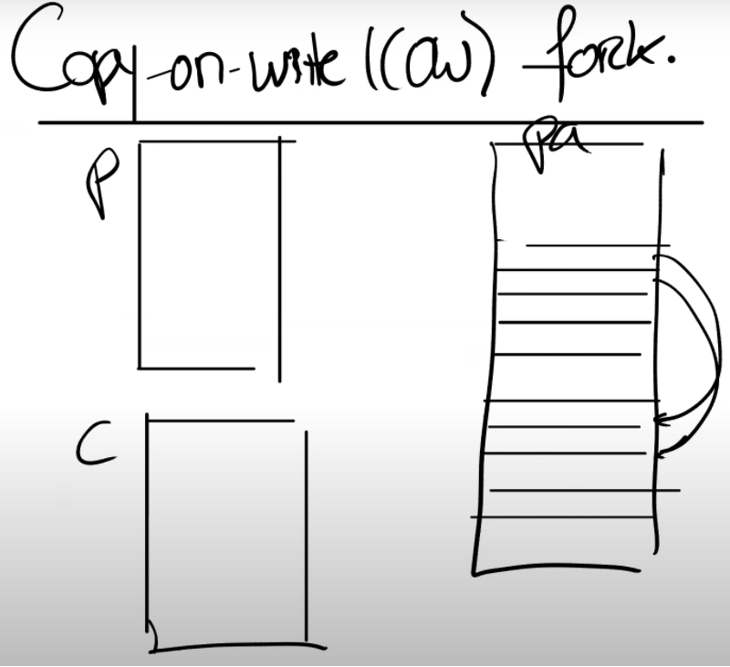
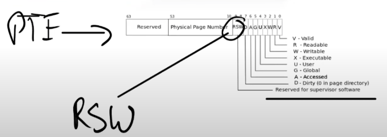
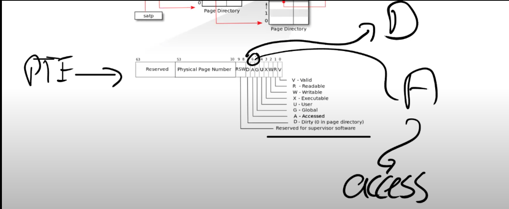
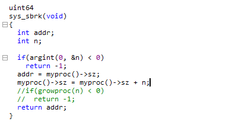
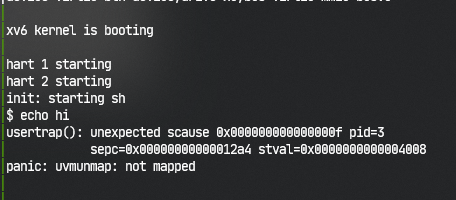
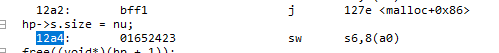

# Page Faults

## 1. Page Fault Basic

## 2. Lazy page allocation

## 3. Zero Fill On Demand

## 4. Copy On Write Fork

​	简称`COW fork`

​	当Shell处理指令时，它会通过`fork`创建一个子进程。`fork`会创建一个Shell进程的拷贝，所以这时我们有一个父进程（原来的Shell）和一个子进程。Shell的子进程执行的第一件事情就是调用`exec`运行一些其他程序，比如运行`echo`。

​	现在的情况是，`fork`创建了Shell地址空间的一个完整的拷贝，而`exec`做的第一件事情就是丢弃这个地址空间，取而代之的是一个包含了`echo`的地址空间。

​	所以，我们最开始有了一个父进程的虚拟地址空间，然后我们有了子进程的虚拟地址空间。

​	在物理内存中，XV6中的Shell通常会有4个page，当调用fork时，基本上就是创建了4个新的page，并将父进程page的内容拷贝到4个新的子进程的page中。



​	但是之后，一旦调用了`exec`，我们又会释放这些`page`，并分配新的`page`来包含`echo`相关的内容。

​	所以对于这个特定场景有一个非常有效的优化：**当我们创建子进程时，与其创建，分配并拷贝内容到新的物理内存，其实我们可以直接共享父进程的物理内存page**。所以这里，我们可以设置子进程的PTE指向父进程对应的物理内存page。

​	但这里要非常小心，因为一旦子进程想要修改这些内存的内容，相应的更新应该对父进程不可见，因为我们希望在父进程和子进程之间有强隔离性。为了确保进程间的隔离性，我们可以将这里的父进程和子进程的PTE的标志位都设置成只读的。

​	在得到page fault之后，我们需要拷贝相应的物理page。

==（下面这是一个具体的例子，体现了COW fork的作用）==

​	假设现在是子进程在执行store指令，那么我们会分配一个新的物理内存page，然后将page fault相关的物理内存page拷贝到新分配的物理内存page中，并将新分配的物理内存page映射到子进程。这时，新分配的物理内存page只对子进程的地址空间可见，所以我们可以将相应的PTE设置成可读写，并且我们可以重新执行store指令。

​	实际上，对于触发刚刚page fault的物理page，因为现在只对父进程可见，相应的PTE对于父进程也变成可读写的了。

​	所以现在，我们拷贝了一个page，将新的page映射到相应的用户地址空间，并重新执行用户指令。重新执行用户指令是指调用userret函数

---

> ​	提问1：如何发现父进程写了这部分内存地址？是与子进程相同的方法吗？
>
> ​	是的，因为子进程的地址空间来自于父进程的地址空间的拷贝。如果我们使用了特定的虚拟地址，因为地址空间是相同的，不论是父进程还是子进程，都会有相同的处理方式。
>
> ​	提问2：对于一些没有父进程的进程，比如系统启动的第一个进程，它会对于自己的PTE设置成只读的吗？还是设置成可读写的，然后在fork的时候再修改成只读的？
>
> ​	这取决于系统设计者。最简单的方式就是将PTE设置成只读的，当要写这些page时，会得到一个page fault，之后你可以再按照上面的流程进行处理。
>
> ​	提问3：经常会拷贝用户进程对应的page，内存硬件有没有实现特定的指令来完成拷贝，因为通常来说内存会有一些读写指令，但是因为我们现在有了从page a拷贝到page b的需求，会有相应的拷贝指令吗？
>
> ​	x86有硬件指令可以用来拷贝一段内存。但是RISC-V并没有这样的指令。当然在一个高性能的实现中，所有这些读写操作都会流水线化，并且按照内存的带宽速度来运行。
>
> ​	提问4：当发生page fault时，我们其实是在向一个只读的地址执行写操作。内核如何能分辨现在是一个copy-on-write fork的场景，而不是应用程序在向一个正常的只读地址写数据。是不是说默认情况下，用户程序的PTE都是可读写的，除非在copy-on-write fork的场景下才可能出现只读的PTE？
>
> ​	内核必须要能够识别这是一个copy-on-write场景。几乎所有的page table硬件都支持了这一点。下图是一个常见的多级page table。对于PTE的标志位，我之前介绍过第0bit到第7bit，但是没有介绍最后两位RSW。这两位保留给supervisor software使用，supervisor softeware指的就是内核。内核可以随意使用这两个bit位。所以可以做的一件事情就是，将bit8标识为当前是一个copy-on-write page。
>
> ​	`

​	目前在XV6中，除了trampoline page外，一个物理内存page只属于一个用户进程。trampoline page永远也不会释放，所以也不是什么大问题。

​	但是如果现在有多个用户进程或者说多个地址空间都指向了相同的物理内存page，当父进程退出，如果有子进程还在使用这些物理page，而内核又释放了这些物理page，将会出问题。那么现在释放内存page的依据是什么呢？

​	需要对于每一个物理内存page的引用进行计数，当我们释放虚拟page时，我们将物理内存page的引用数减1，如果引用数等于0，那么我们就能释放物理内存page。所以在copy-on-write lab中，需要引入一些额外的数据结构或者元数据信息来完成引用计数。

> ​	提问5：应该在哪存储这些引用计数呢？因为如果我们需要对每个物理内存page的引用计数的话，这些计数可能会有很多。
>
> ​	对于每个物理内存page，我们都需要做引用计数，也就是说对于每4096个字节，需要维护一个引用计数
>
> ​	提问6：可以将引用计数存在RSW对应的2个bit中吗？并且限制不超过4个引用。
>
> ​	如果引用超过了4次，那么将会是一个问题。因为一个内存引用超过了4次，你将不能再使用这里的优化了
>
> ​	提问7：真的有必要额外增加一位来表示当前的page是copy-on-write吗？因为内核可以维护有关进程的一些信息...
>
> ​	是的，你可以在管理用户地址空间时维护一些其他的元数据信息，这样你就知道这部分虚拟内存地址如果发生了page fault，那么必然是copy-on-write场景。

## 5. Demand Paging（需求分页）

​	回到exec，在**未修改**的XV6中，操作系统会加载程序内存的text，data区域，并且以eager的方式将这些区域加载进page table。

​	所以这会有以下问题

​	为什么我们要以eager的方式将程序加载到内存中？为什么不再等等，直到应用程序实际需要这些指令的时候再加载内存？程序的二进制文件可能非常的巨大，将它全部从磁盘加载到内存中将会是一个代价很高的操作。又或者data区域的大小远大于常见的场景所需要的大小，我们并不一定需要将整个二进制都加载到内存中。

​	所以对于exec，在虚拟地址空间中，我们为text和data分配好地址段，但是相应的PTE并不对应任何物理内存`page`。对于这些PTE，我们只需要将`valid bit`位设置为0即可。

​	如果我们修改XV6使其按照上面的方式工作，我们什么时候会得到第一个page fault呢？或者说，用户应用程序运行的第一条指令是什么？用户应用程序在哪里启动的？

​	应用程序是从地址0开始运行。text区域从地址0开始向上增长。位于地址0的指令是会触发第一个page fault的指令，因为我们还没有真正的加载内存。

---

​	那么该如何处理这里的page fault呢？

​	首先我们可以发现，这些page是`on-demand page`。我们需要在某个地方记录了这些page对应的程序文件，我们在`page fault handler`中需要从程序文件中读取page数据，加载到内存中；之后将内存page映射到`page table`；最后再重新执行指令。

​	之后程序就可以运行了。在最坏的情况下，用户程序使用了text和data中的所有内容，那么我们将会在应用程序的每个page都收到一个page fault。但是如果我们幸运的话，用户程序并没有使用所有的text区域或者data区域，那么我们一方面可以节省一些物理内存，另一方面我们可以让exec运行的更快（注，因为不需要为整个程序分配内存）。

---

​	但还有下列问题

- 如果text和data区域可能大于物理内存的容量。
- 又或者多个应用程序按照demand paging的方式启动，它们二进制文件的和大于实际物理内存的容量。
- 对于demand paging来说，假设内存已经耗尽了或者说OOM了，这个时候如果得到了一个page fault，需要从文件系统拷贝中拷贝一些内容到内存中，但这时你又没有任何可用的物理内存page

​	这其实回到了之前的一个问题：在lazy allocation中，如果内存耗尽了该如何办？

​	如果内存耗尽了，一个选择是撤回page（evict page）。比如说将部分内存page中的内容写回到文件系统再撤回page。一旦你撤回并释放了page，那么你就有了一个新的空闲的page，你可以使用这个刚刚空闲出来的page，分配给刚刚的page fault handler，再重新执行指令。

---

​	那么什么样的page可以被撤回？并且该使用什么样的策略来撤回page？

​	LRU（最近最少使用）

​	另外，除了这个策略之外，还有一些其他的小优化。如果你要撤回一个page，你需要在dirty page和non-dirty page中做选择。**dirty page是曾经被写过的page，而non-dirty page是只被读过，但是没有被写过的page。**

​	那么要选择哪个来撤回？

​	**non-dirty page**，因为如果non-dirty page出现在page table1中，你可以将内存page中的内容写到文件中，之后将相应的PTE标记为non-valid，这就完成了所有的工作。之后你可以在另一个page table重复使用这个page。所以通常来说这里优先会选择non-dirty page来撤回。

> ​	提问1：对于一个cache，我们可以认为它被修改了但是还没有回写到后端存储时是dirty的。那么对于内存page来说，怎么判断dirty？它只存在于内存中，而不存在于其他地方。那么它什么时候会变成dirty呢？
>
> ​	对于memory mapped files，你将一个文件映射到内存中，然后恢复它，你就会设置内存page为dirty。
>
> ​	提问2：所以这只对一个不仅映射了内存，还映射了文件的page有效？
>
> ​	一个page只要最近被写过，那么就会是dirty的

​	如果你们再看PTE，我们有RSW位，你们可以发现在bit7，对应的就是Dirty bit。当硬件向一个page写入数据，会设置dirty bit，之后操作系统就可以发现这个page曾经被写入了。类似的，还有一个Access bit，任何时候一个page被读或者被写了，这个Access bit会被设置。

​	

​	Access bit通常被用来实现这里的LRU策略。

> ​	提问3：是不是要定时的将Access bit恢复成0？
>
> ​	是的，这是一个典型操作系统的行为。操作系统会扫描整个内存，这里有一些著名的算法例如clock algorithm，就是一种实现方式。
>
> ​	提问4：为什么需要恢复这个bit？
>
> ​	如果你想知道page最近是否被使用过，你需要定时比如每100毫秒或者每秒清除Access  bit，如果在下一个100毫秒这个page被访问过，那你就知道这个page在上一个100毫秒中被使用了。而Access bit为0的page在上100毫秒未被使用。这样你就可以统计每个内存page使用的频度，这是一个成熟的LRU实现的基础。（注，可以通过Access bit来决定内存page 在LRU中的排名）

## 6. Memory Mapped Files（内存映射文件）

​	这里的核心思想是，**将完整或者部分文件加载到内存中，这样就可以通过内存地址相关的load或者store指令来操纵文件。**

​	为了支持这个功能，一个现代的操作系统会提供一个叫做mmap的系统调用。这个系统调用会接收一个虚拟内存地址（VA），长度（len），protection，一些标志位，一个打开文件的文件描述符，和偏移量（offset）。

```c
mmap(va, len, protection, flag, offset)
```

​	语义就是，从文件描述符对应的文件的偏移量的位置开始，映射长度为len的内容到虚拟内存地址VA，同时我们需要加上一些保护，比如只读或者读写。

---

​	假设文件内容是读写并且内核实现mmap的方式是eager方式（不过大部分系统都不会这么做），内核会从文件的offset位置开始，将数据拷贝到内存，设置好PTE指向物理内存的位置。

​	之后应用程序就可以使用load或者store指令来修改内存中对应的文件内容。当完成操作之后，会有一个对应的unmap系统调用，参数是虚拟地址（VA），长度（len）。来表明应用程序已经完成了对文件的操作，在unmap时间点，我们需要将dirty block写回到文件中。我们可以很容易的找到哪些block是dirty的，因为它们在PTE中的dirty bit为1。

​	当然，在任何聪明的内存管理机制中，所有的这些都是以lazy的方式实现。你不会立即将文件内容拷贝到内存中，而是先记录一下这个PTE属于这个文件描述符。相应的信息通常在VMA结构体中保存，VMA全称是Virtual Memory Area。

​	例如对于这里的文件f，会有一个VMA，在VMA中我们会记录文件描述符，偏移量等等，这些信息用来表示对应的内存虚拟地址的实际内容在哪，这样当我们得到一个位于VMA地址范围的page fault时，内核可以从磁盘中读数据，并加载到内存中。

> ​	提问1：有没有可能多个进程将同一个文件映射到内存，然后会有同步的问题？
>
> ​	这个问题其实等价于，多个进程同时通过read/write系统调用读写一个文件会怎么样？
>
> ​	这里的行为是不可预知的。write系统调用会以某种顺序出现，如果两个进程向一个文件的block写数据，要么第一个进程的write能生效，要么第二个进程的write能生效，只能是两者之一生效。在这里其实也是一样的，所以我们并不需要考虑冲突的问题。
>
> ​	一个更加成熟的Unix操作系统支持锁定文件，你可以先锁定文件，这样就能保证数据同步。但是默认情况下，并没有同步保证。
>
> ​	提问2：mmap的参数中，len和flag是什么意思？
>
> ​	len是文件中你想映射到内存中的字节数。prot是read/write。flags会在mmap lab中出现，我认为它表示了这个区域是私有的还是共享的。如果是共享的，那么这个区域可以在多个进程之间共享。
>
> ​	提问3：如果其他进程直接修改了文件的内容，那么是不是意味着修改的内容不会体现在这里的内存中？
>
> ​	是的。但是如果文件是共享的，那么你应该同步这些变更。我记不太清楚在mmap中，文件共享时会发生什么。


## self debug





