# Interrupts

## 1. Interrupt硬件部分

​	**中断其实就是硬件想要得到操作系统的关注**。例如网卡收到一个packet，网卡会生成一个中断；用户通过键盘按下了一个按键，键盘会产生一个中断。

​	操作系统需要做的是，保存当前的工作，处理中断，处理完成之后再恢复之前的工作。这里的保存和恢复工作，与我们之前看到的系统调用过程（注，详见lec06）非常相似。所以系统调用，page fault，中断，都使用相同的机制。

---

​	但中断和系统调用又有三个差别：

1. `asynchronous`。当硬件生成中断时，Interrupt handler与当前运行的进程在CPU上没有任何关联。但如果是系统调用的话，系统调用发生在运行进程的context下。
2. `concurrency`。对于中断来说，CPU和生成中断的设备是并行的在运行。网卡自己独立的处理来自网络的packet，然后在某个时间点产生中断，但是同时，CPU也在运行。所以我们在CPU和设备之间是真正的并行的，我们必须管理这里的并行。
3. `program device`。这节课主要关注外部设备，例如网卡，UART，而这些设备需要被编程。每个设备都有一个编程手册，就像RISC-V有一个包含了指令和寄存器的手册一样。设备的编程手册包含了它有什么样的寄存器，它能执行什么样的操作，在读写控制寄存器的时候，设备会如何响应。不过通常来说，设备的手册不如RISC-V的手册清晰，这会使得对于设备的编程会更加复杂。

---

​	这节课主要讨论两个事

- console中的提示符“$ ”是如何显示出来的
- 如果你在键盘输入“ls”，这些字符是怎么最终在console中显示出来的。

---

​	中断是从哪产生的？

- 外部设备，主要来自主板上的设备
- 定时器
- 软件

​	这节课主要讨论外部设备的中断

​	主板可以连接以太网卡，MicroUSB，MicroSD等，主板上的各种线路将外设和CPU连接在一起。

​	下图是来自于SiFive有关处理器的文档，图中的右侧是各种各样的设备，例如UART0。我们在之前的课程已经知道UART0会映射到内核内存地址的某处，而所有的物理内存都映射在地址空间的0x80000000之上。（注，详见4.5）。类似于读写内存，通过向相应的设备地址执行load/store指令，我们就可以对例如UART的设备进行编程。

​	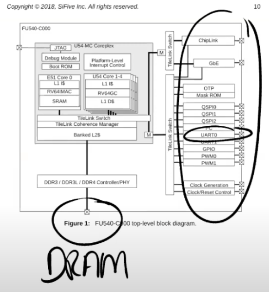

​	所有的设备都连接到处理器上，处理器上是通过Platform Level Interrupt Control，简称**PLIC**来处理设备中断。PLIC会管理来自于外设的中断。如果我们再进一步深入的查看PLIC的结构图，

​	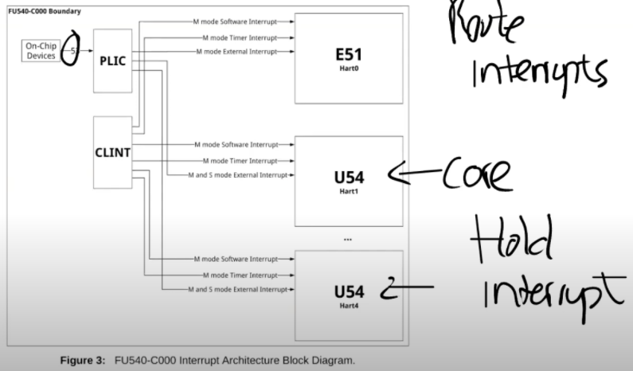

​	如图，有53个不同的来自于设备的中断。这些中断到达PLIC之后，PLIC会路由这些中断。图的右下角是CPU的核，PLIC会将中断路由到某一个CPU的核。如果所有的CPU核都正在处理中断，PLIC会保留中断直到有一个CPU核可以用来处理中断。所以PLIC需要保存一些内部数据来跟踪中断的状态。

​	具体流程是：

- PLIC会通知当前有一个待处理的中断

- 其中一个CPU核会Claim接收中断，这样PLIC就不会把中断发给其他的CPU处理

- CPU核处理完中断之后，CPU会通知PLIC

- PLIC将不再保存中断的信息

> ​	提问1：PLIC有没有什么机制能确保中断一定被处理？
>
> ​	取决于内核以什么样的方式来对PLIC进行编程。PLIC只是分发中断，而内核需要对PLIC进行编程来告诉它中断应该分发到哪。实际上，内核可以对中断优先级进行编程，这里非常的灵活。
>
> ​	提问2：当UART触发中断的时候，所有的CPU核都能收到中断吗？
>
> ​	取决于你如何对PLIC进行编程。对于XV6来说，所有的CPU都能收到中断，但是只有一个CPU会Claim相应的中断。

## 2. 设备驱动概述

​	**管理设备的代码称为驱动，所有的驱动都在内核中。**

​	今天要看的是UART设备的驱动，代码在`uart.c`文件中。如果我们查看代码的结构，我们可以发现大部分驱动都分为两个部分，`bottom/top`。

​	`bottom`部分通常是`Interrupt handler`。当一个中断送到了CPU，并且CPU设置接收这个中断，CPU会调用相应的`Interrupt handler`。`Interrupt handler`并不运行在任何特定进程的context中，它只是处理中断。

​	`top`部分，是用户进程，或者内核的其他部分调用的接口。对于UART来说，这里有`read/write`接口，这些接口可以被更高层级的代码调用。

​	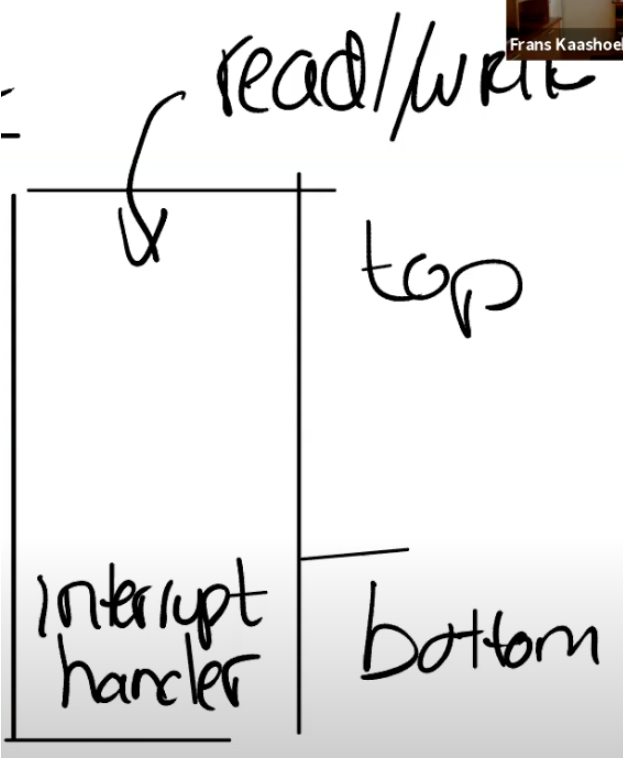

​	通常情况下，驱动中会有一些队列（或者说buffer），`top`部分的代码会从队列中读写数据，而`Interrupt handler`（`bottom`部分）同时也会向队列中读写数据。这里的队列可以将并行运行的设备和CPU解耦开来。

​	通常对于`Interrupt handler`来说存在一些限制，因为它并没有运行在任何进程的`context`中，所以进程的`page table`并不知道该从哪个地址读写数据，也就无法直接从`Interrupt handler`读写数据。

​	驱动的`top`部分通常与用户的进程交互，并进行数据的读写。我们后面会看更多的细节，这里是一个驱动的典型架构。

---

​	在很多操作系统中，驱动代码加起来可能会比内核还要大，主要是因为，对于每个设备，你都需要一个驱动，而设备又很多。

​	通常来说，编程是通过`memory mapped I/O`完成的。

​	在SiFive的手册中，设备地址出现在物理地址的特定区间内，这个区间由主板制造商决定。操作系统需要知道这些设备位于物理地址空间的具体位置，然后再通过普通的`load/store`指令对这些地址进行编程。

​	`load/store`指令实际上的工作就是读写设备的控制寄存器。例如，对网卡执行`store`指令时，CPU会修改网卡的某个控制寄存器，进而导致网卡发送一个`packet`。	所以这里的`load/store`指令不会读写内存，而是会操作设备。

---

​	下图中是SiFive主板中的对应设备的物理地址

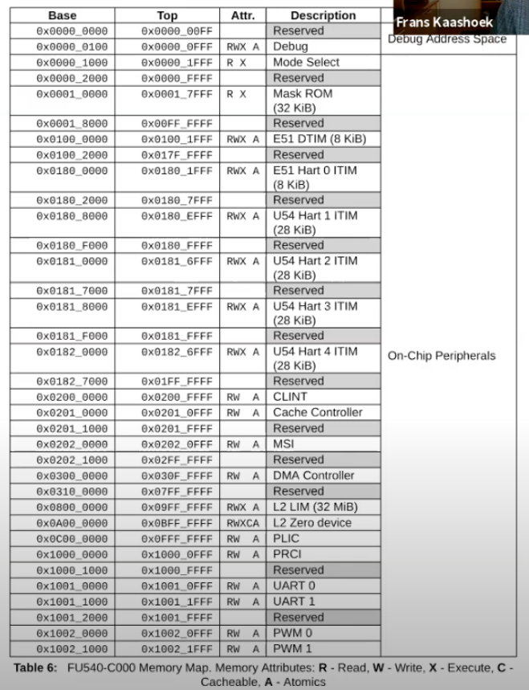

​	以上就是Memory-mapped IO。

​	下图是UART的文档。

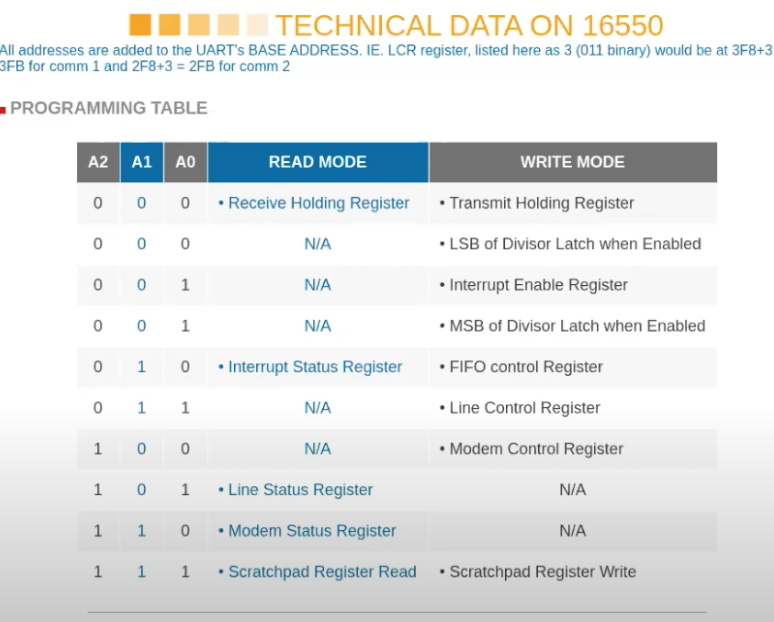

​	这是一个很简单的芯片，图中表明了芯片拥有的寄存器。例如对于控制寄存器000，如果写它会将数据写入到寄存器中并被传输到其他地方，如果读它可以读出存储在寄存器中的内容。UART可以让你能够通过串口发送数据bit，在线路的另一侧会有另一个UART芯片，能够将数据bit组合成一个个Byte。

​	这里还有一些其他可以控制的地方，例如控制寄存器001，可以通过它来控制UART是否产生中断。实际上对于一个寄存器，其中的每个bit都有不同的作用。例如对于寄存器001，也就是IER寄存器，bit0-bit3分别控制了不同的中断。

> ​	提问1：如果你写入数据到Transmit Holding Register，然后再次写入，那么前一个数据不会被覆盖掉吗？
>
> ​	我们通过load将数据写入到这个寄存器中，之后UART芯片会通过串口线将这个Byte送出。当完成了发送，UART会生成一个中断给内核，这个时候才能再次写入下一个数据。所以内核和设备之间需要遵守一些协议才能确保一切工作正常。上图中的UART芯片会有一个容量是16的FIFO，但是你还是要小心，因为如果阻塞了16个Byte之后再次写入还是会造成数据覆盖。

## 3. 在XV6中设置中断

​	当XV6启动时，Shell会输出提示符“\$ ”，如果我们在键盘上输入ls，最终可以看到“\$ ls”。我们接下来通过研究Console是如何显示出“$ ls”，来看一下设备中断是如何工作的。

​	“$ ”是Shell程序的输出，而“ls”是用户通过键盘输入之后再显示出来的。

---

​	**对于“\$ ”来说**，实际上就是设备会将字符传输给UART的寄存器，UART之后会在发送完字符之后产生一个中断。在QEMU中，模拟的线路的另一端会有另一个UART芯片（模拟的），这个UART芯片连接到了虚拟的Console，它会进一步将“\$ ”显示在console上。

​	**对于“ls”**，这是用户输入的字符。键盘连接到了UART的输入线路，当你在键盘上按下一个按键，UART芯片会将按键字符通过串口线发送到另一端的UART芯片。另一端的UART芯片先将数据bit合并成一个Byte，之后再产生一个中断，并告诉处理器说这里有一个来自于键盘的字符。之后Interrupt handler会处理来自于UART的字符。

---

​	RISC-V有许多与中断相关的寄存器：

- **SIE（Supervisor Interrupt Enable）寄存器**

    ​	这个寄存器中有一个bit（E）专门针对例如UART的外部设备的中断；有一个bit（S）专门针对软件中断，软件中断可能由一个CPU核触发给另一个CPU核；还有一个bit（T）专门针对定时器中断。

- **SSTATUS（Supervisor Status）寄存器**

    ​	这个寄存器中有一个`bit`来打开或者关闭中断。每一个CPU核都有独立的SIE和SSTATUS寄存器，除了通过SIE寄存器来单独控制特定的中断，还可以通过SSTATUS寄存器中的一个`bit`来控制所有的中断。

- **SIP（Supervisor Interrupt Pending）寄存器**

    ​	当发生中断时，处理器可以通过查看这个寄存器知道当前是什么类型的中断。

- **SCAUSE寄存器**

    ​	它会表明当前状态的原因是中断。

- **STVEC寄存器**

​			会保存当trap，page fault或者中断发生时，CPU运行的用户程序的程序计数器，这样才能在稍后恢复程序的运行。

---

​	接下来我们看看XV6是如何对其他寄存器进行编程，使得CPU处于一个能接受中断的状态。

​	**1.** 接下来看看代码，首先是位于start.c的start函数。

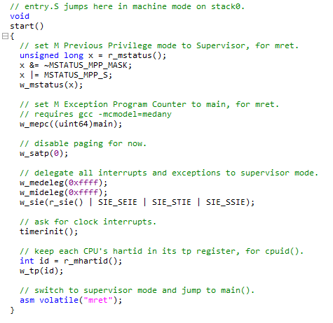

​	这里将所有的中断都设置在`Supervisor mode`，然后设置SIE寄存器来接收`External`，软件和定时器中断，之后初始化定时器。

​	**2.** 接下来我们看一下main函数中是如何处理External中断。

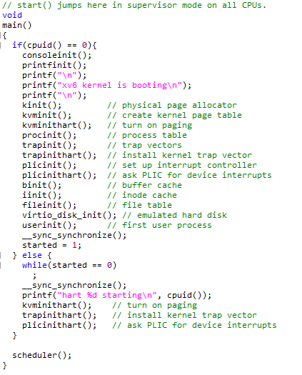

​	第一个外设是console，这是我们print的输出位置。

​	**3.** 查看位于console.c的`consoleinit`函数。

​	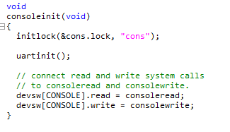

​	首先初始化了锁

​	**4.** 调用了uartinit，uartinit函数位于uart.c文件。这个函数实际上就是配置好UART芯片使其可以被使用。

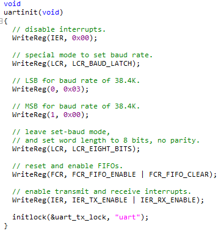

​	先关闭中断，之后设置波特率，设置字符长度为8bit，重置FIFO，最后再重新打开中断。

> ​	提问1：什么是波特率？
>
> ​	串口线的传输速率。

​	运行完这个函数之后，原则上UART就可以生成中断了。但是因为我们还没有对PLIC编程，所以中断不能被CPU感知。

​	**5.** 最终，在main函数中，需要调用plicinit函数。下图是plicinit函数。

​	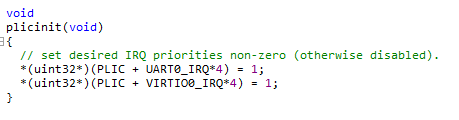

​	PLIC与外设一样，也占用了一个I/O地址（`0xC000_0000`）。

​	代码的第一行使能了UART的中断，这里实际上就是设置PLIC会接收哪些中断，进而将中断路由到CPU。

​	代码的第二行设置PLIC接收来自IO磁盘的中断。

​	**6.** `main`函数中，`plicinit`之后就是`plicinithart`函数。`plicinit`是由0号CPU运行，之后，每个CPU的核都需要调用`plicinithart`函数表明对于哪些外设中断感兴趣。

​	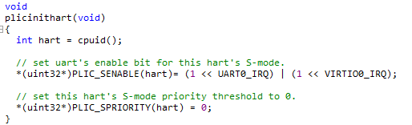

​	所以在`plicinithart`函数中，每个CPU的核都表明自己对来自于UART和VIRTIO的中断感兴趣。因为我们忽略中断的优先级，所以我们将优先级设置为0。

​	**7.** 到目前为止，我们有了生成中断的外部设备，我们有了PLIC可以传递中断到单个的CPU。但是CPU自己还没有设置好接收中断，因为我们还没有设置好SSTATUS寄存器。在`main`函数的最后，程序调用了`scheduler`函数。

​		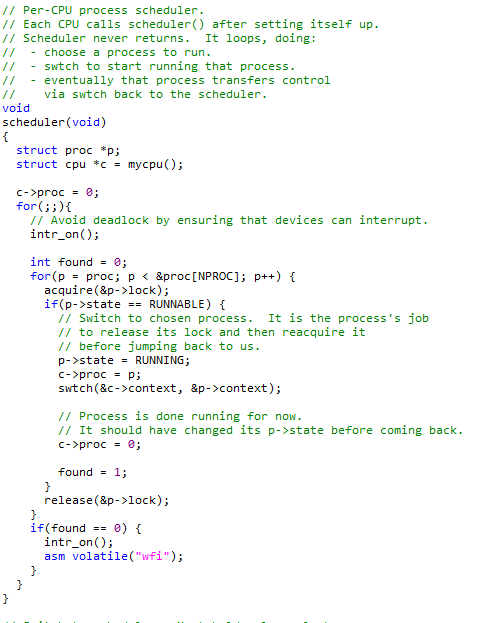

​	scheduler函数主要是运行进程。但是在实际运行进程之前，会执行intr_on函数来使得CPU能接收中断。

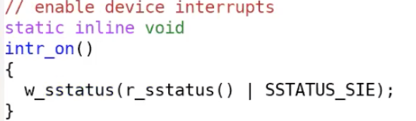

​	intr_on函数只完成一件事情，就是设置SSTATUS寄存器，打开中断标志位。

​	在这个时间点，中断被完全打开了。如果PLIC正好有pending的中断，那么这个CPU核会收到中断。

> ​	提问2：哪些核在intr_on之后打开了中断？
>
> ​	任何一个调用了intr_on的CPU核，都会接收中断。实际上所有的CPU核都会运行intr_on函数。

## 4. UART驱动的top部分

​	接下来看一下如何从Shell程序输出提示符“$ ”到Console。

​	**1.** 首先我们看init.c中的main函数，这是系统启动后运行的第一个进程。

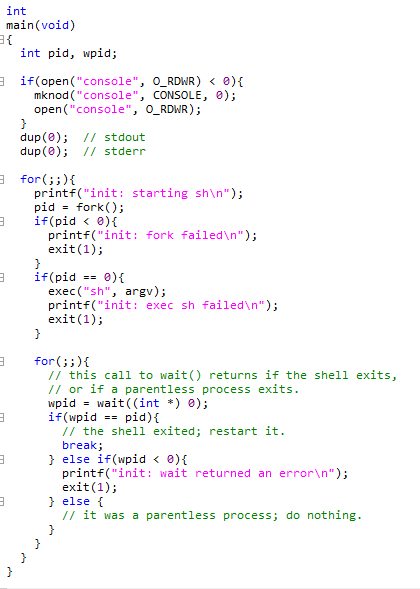

​	首先这个进程的`main`函数创建了一个代表Console的设备。这里通过`mknod`操作创建了`console`设备。因为这是第一个打开的文件，所以这里的文件描述符0。之后通过`dup`创建`stdout`和`stderr`。这里实际上通过复制文件描述符0，得到了另外两个文件描述符1，2。最终文件描述符0，1，2都用来代表`Console`。

​	**2.** Shell程序首先打开文件描述符0，1，2。之后Shell向文件描述符2打印提示符“$ ”。

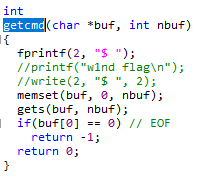

​	尽管Console背后是UART设备，但是从应用程序来看，它就像是一个普通的文件。Shell程序只是向文件描述符2写了数据，它并不知道文件描述符2对应的是什么。在Unix系统中，**设备是由文件表示**。我们来看一下这里的fprintf是如何工作的。

​	**3.** 在printf.c文件中，代码只是调用了write系统调用，在我们的例子中，fd对应的就是文件描述符2，c是字符“$”。

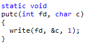

​	Shell输出的每一个字符都会触发一个write系统调用。

​	**4.** `write`系统调用最终会走到`sysfile.c`文件的sys_write函数。

​		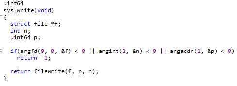

​	这个函数中首先对参数做了检查

​	**5.** 然后又调用了`filewrite`函数。filewrite函数位于`file.c`文件中。

​	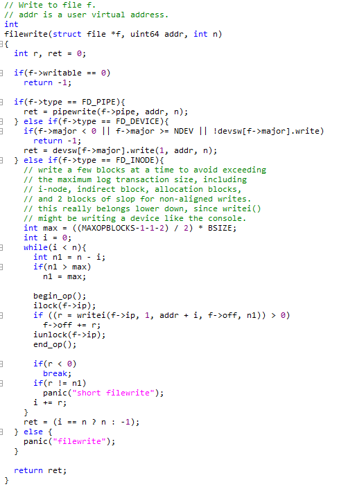

​	在`filewrite`函数中首先会判断文件描述符的类型。`mknod`生成的文件描述符属于设备（FD_DEVICE），而对于设备类型的文件描述符，我们会为这个特定的设备执行设备相应的`write`函数。

​	**6.** 现在的设备是Console，所以我们知道这里会调用console.c中的consolewrite函数。

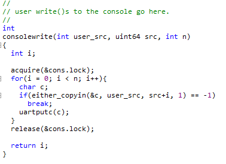

​		这里先通过`either_copyin`将字符拷入，之后调用`uartputc`函数。`uartputc`函数将字符写入给UART设备，

​		所以你可以认为`consolewrite`是一个UART驱动的top部分。

​	**7.** uart.c文件中的uartputc函数会实际的打印字符。

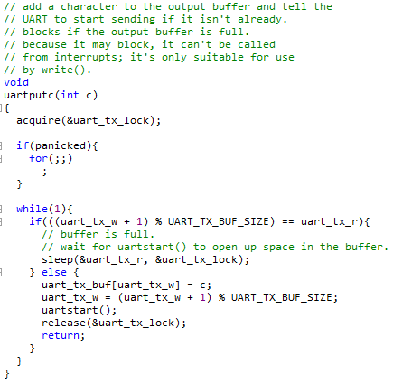

​	在UART的内部会有一个buffer用来发送数据，buffer的大小是32个字符。同时还有一个为consumer提供的读指针和为producer提供的写指针，来构建一个环形的buffer（注，或者可以认为是环形队列）。

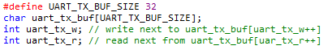

​	在我们的例子中，Shell是`producer`，所以需要调用`uartputc`函数。

​	在函数中第一件事情是判断环形`buffer`是否已经满了。如果读写指针相同，那么`buffer`是空的，如果写指针加1等于读指针，那么`buffer`满了。当`buffer`是满的时候，向其写入数据是没有意义的，所以这里会sleep一段时间，将CPU出让给其他进程。当然，对于我们来说，`buffer`必然不是满的，因为提示符“$”是我们送出的第一个字符。

​	所以代码会走到else，字符会被送到`buffer`中，更新写指针，之后再调用`uartstart`函数。

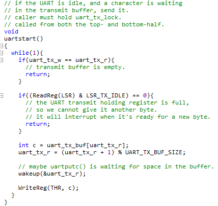

​	`uartstart`就是通知设备执行操作。

​	首先是检查当前设备是否空闲，如果空闲的话，我们会从buffer中读出数据，然后将数据写入到THR（`Transmission Holding Register`）发送寄存器。这里相当于告诉设备，我这里有一个字节需要你来发送。一旦数据送到了设备，系统调用会返回，用户应用程序Shell就可以继续执行。这里从内核返回到用户空间的机制与lec06的trap机制是一样的。

## 5. UART驱动的bottom部分

​	在我们向Console输出字符时，如果发生了中断，RISC-V会做什么操作？

​	我们之前已经在SSTATUS寄存器中打开了中断，所以处理器会被中断。

​	假设键盘生成了一个中断并且发向了PLIC，PLIC会将中断路由给一个特定的CPU核，并且如果这个CPU核设置了SIE寄存器的E bit（注，针对外部中断的bit位），那么会发生以下事情：

- 首先，会清除SIE寄存器相应的`bit`，这样可以阻止CPU核被其他中断打扰，该CPU核可以专心处理当前中断。处理完成之后，可以再次恢复SIE寄存器相应的`bit`。
- 之后，会设置SEPC寄存器为当前的程序计数器。我们假设Shell正在用户空间运行，突然来了一个中断，那么当前Shell的程序计数器会被保存。
- 之后，要保存当前的`mode`。在我们的例子里面，因为当前运行的是Shell程序，所以会记录`user mode`。
- 再将`mode`设置为`Supervisor mode`。
- 最后将程序计数器的值设置成STVEC的值。（注，STVEC用来保存trap处理程序的地址，详见lec06）在XV6中，STVEC保存的要么是`uservec`或者`kernelvec`函数的地址，具体取决于发生中断时程序运行是在用户空间还是内核空间。在我们的例子中，Shell运行在用户空间，所以STVEC保存的是uservec函数的地址。而从之前的课程我们可以知道`uservec`函数会调用`usertrap`函数。所以最终，我们在`usertrap`函数中。

---

​	**1.** 接下来看一下trap.c文件中的`usertrap`函数，我们在lec06和lec08分别在这个函数中处理了系统调用和page fault。今天我们将要看一下如何处理中断。

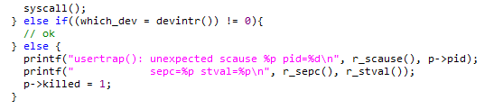

​	在`trap.c`的`devintr`函数中，首先会通过SCAUSE寄存器判断当前中断是否是来自于外设的中断。

​	**2.** 如果是的话，再调用`plic_claim`函数来获取中断。

​	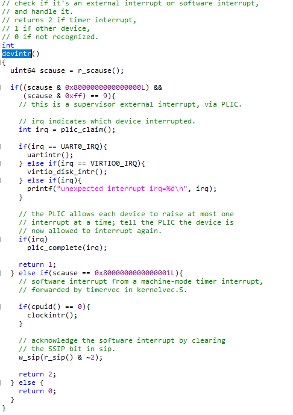

​	**3.** `plic_claim`函数位于`plic.c`文件中。在这个函数中，当前CPU核会告知PLIC，自己要处理中断，PLIC_SCLAIM会将中断号返回，对于UART来说，返回的中断号是10。

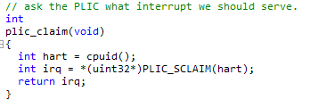

​	**4.** 从`devintr`函数可以看出，如果是UART中断，那么会调用`uartintr`函数。

​		由于现在还没有通过键盘输入任何数据，所以UART的接受寄存器现在为空。

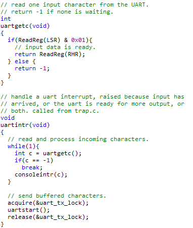

​		所以代码会直接运行到`uartstart`函数，这个函数会将Shell存储在`buffer`中的任意字符送出。实际上在提示符“\$”之后，Shell还会输出一个空格字符，`write`系统调用可以在UART发送提示符“\$”的同时，并发的将空格字符写入到`buffer`中。所以UART的发送中断触发时，可以发现在`buffer`中还有一个空格字符，之后会将这个空格字符送出。

​		这样，驱动的top部分和bottom部分就解耦开了。

> ​	提问1：UART对于键盘来说很重要，来自于键盘的字符通过UART走到CPU再到我们写的代码。但是我不太理解UART对于Shell输出字符究竟有什么作用？因为在这个场景中，并没有键盘的参与。
>
> ​	显示设备与UART也是相连的。所以UART连接了两个设备，一个是键盘，另一个是显示设备，也就是Console。QEMU也是通过模拟的UART与Console进行交互，而Console的作用就是将字符在显示器上画出来。
>
> ​	提问2：uartinit只被调用了一次，所以才导致了所有的CPU核都共用一个buffer吗？
>
> ​	因为只有一个UART设备，一个buffer只针对一个UART设备，而这个buffer会被所有的CPU核共享，这样运行在多个CPU核上的多个程序可以同时向Console打印输出，而驱动中是通过锁来确保多个CPU核上的程序串行的向Console打印输出。
>
> ​	提问3：之所以需要锁是因为有多个CPU核，但是却只有一个Console，对吧？
>
> ​	是的，如我们之前说的驱动的top和bottom部分可以并行的运行。所以一个CPU核可以执行uartputc函数，而另个一CPU核可以执行uartintr函数，我们需要确保它们是串行执行的，而锁确保了这一点。
>
> ​	提问4：那是不是意味着，某个时间，其他所有的CPU核都需要等待某一个CPU核的处理？
>
> ​	这里并不是死锁。其他的CPU核还是可以在等待的时候运行别的进程。

## 6. Interrupt相关的并发

​	这里的并发包括以下几个方面：

- **设备与CPU是并行运行的**。例如当UART向Console发送字符的时候，CPU会返回执行Shell，而Shell可能会再执行一次系统调用，向buffer中写入另一个字符，这些都是在并行的执行。这里的并行称为producer-consumer并行。
- **中断会停止当前运行的程序**。例如，Shell正在运行第212个指令，突然来了个中断，Shell的执行会立即停止。对于用户空间代码，这并不是一个大的问题，因为当我们从中断中返回时，我们会恢复用户空间代码，并继续执行执行停止的指令。我们已经在trap和page fault中看过了这部分内容。但是当内核被中断打断时，事情就不一样了。所以，代码运行在kernel mode也会被中断，这意味着即使是内核代码，也不是直接串行运行的。在两个内核指令之间，取决于中断是否打开，可能会被中断打断执行。对于一些代码来说，如果不能在执行期间被中断，这时内核需要临时关闭中断，来确保这段代码的原子性。
- **驱动的top和bottom部分是并行运行的**。例如，Shell会在传输完提示符“$”之后再调用write系统调用传输空格字符，代码会走到UART驱动的top部分（注，uartputc函数），将空格写入到buffer中。但是同时在另一个CPU核，可能会收到来自于UART的中断，进而执行UART驱动的bottom部分，查看相同的buffer。所以一个驱动的top和bottom部分可以并行的在不同的CPU上运行。这里我们通过lock来管理并行。因为这里有共享的数据，我们想要buffer在一个时间只被一个CPU核所操作。

---

​	下面关注第一点，也就是`producer/consumser`并发。

​	在驱动中会有一个`buffer`，在我们之前的例子中，`buffer`是32字节大小。并且有两个指针，分别是读指针和写指针。

​	如果两个指针相等，那么`buffer`是空的。当Shell调用`uartputc`函数时，会将字符，例如提示符“$”，写入到写指针的位置，并将写指针加1。这就是`producer`对于`buffer`的操作。

​	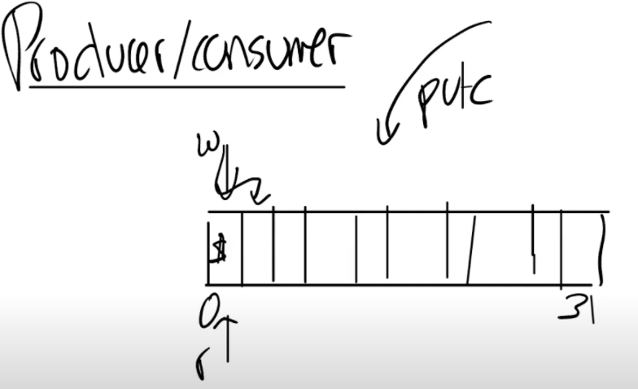

​	`producer`可以一直写入数据，直到写指针 + 1等于读指针，因为这时，buffer已经满了。当buffer满了的时候，`producer`必须停止运行。我们之前在uartputc函数中看过，如果`buffer`满了，代码会`sleep`，暂时搁置Shell并运行其他的进程。

​	`Interrupt handler`，也就是`uartintr`函数，在这个场景下是`consumer`，每当有一个中断，并且读指针落后于写指针，`uartintr`函数就会从读指针中读取一个字符再通过UART设备发送，并且将读指针加1。当读指针追上写指针，也就是两个指针相等的时候，`buffer`为空，这时就不用做任何操作。

> ​	提问1：这里的buffer对于所有的CPU核都是共享的吗？
>
> ​	这里的buffer存在于内存中，并且只有一份，所以，所有的CPU核都并行的与这一份数据交互。所以我们才需要lock。
>
> ​	提问2：对于uartputc中的sleep，它怎么知道应该让Shell去sleep？
>
> ​	sleep会将当前在运行的进程存放于sleep数据中。它传入的参数是需要等待的信号，在这个例子中传入的是uart_tx_r的地址。在uartstart函数中，一旦buffer中有了空间，会调用与sleep对应的函数wakeup，传入的也是uart_tx_r的地址。任何等待在这个地址的进程都会被唤醒。有时候这种机制被称为conditional synchronization。

---

​	以上就是Shell输出提示符“$ ”的全部内容。如你们所见，过程还挺复杂的，许多代码一起工作才将这两个字符传输到了Console。

## 7. UART读取键盘输入

​	在UART的另一侧，会有类似的事情发生，有时Shell会调用`read`从键盘中读取字符。 在read系统调用的底层，会调用fileread函数。在这个函数中，如果读取的文件类型是设备，会调用相应设备的`read`函数。

​	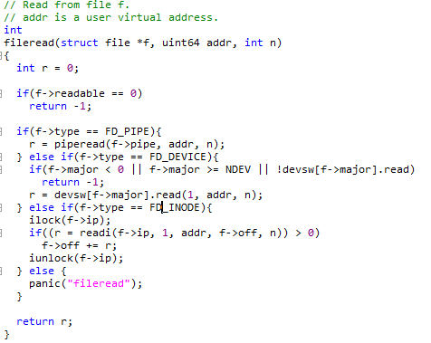

​	read函数就是console.c文件中的consoleread函数。

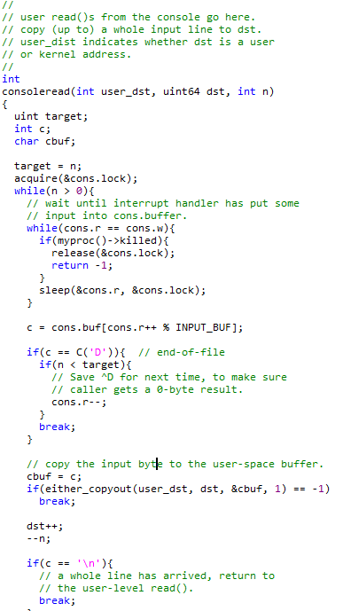

​	这里与UART类似，也有一个`buffer`，包含了128个字符。其他的基本一样，也有`producer`和`consumser`。但是在这个场景下Shell变成了`consumser`，因为Shell是从`buffer`中读取数据。而键盘是`producer`，它将数据写入到`buffer`中

​	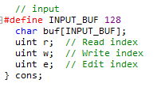

​	从`consoleread`函数中可以看出，当读指针和写指针一样时，说明`buffer`为空，进程会sleep。所以Shell在打印完“$ ”之后，如果键盘没有输入，Shell进程会`sleep`，直到键盘有一个字符输入。

​	所以在某个时间点，假设用户通过键盘输入了“l”，这会导致“l”被发送到主板上的UART芯片，产生中断之后再被PLIC路由到某个CPU核，之后会触发devintr函数，`devintr`可以发现这是一个UART中断，然后通过`uartgetc`函数获取到相应的字符，之后再将字符传递给`consoleintr`函数。

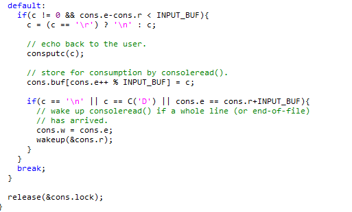

​	默认情况下，字符会通过`consputc`，输出到`console`上给用户查看。之后，字符被存放在`buffer`中。在遇到换行符的时候，唤醒之前sleep的进程，也就是Shell，再从`buffer`中将数据读出。

​	所以这里也是通过buffer将consumer和producer之间解耦，这样它们才能按照自己的速度，独立的并行运行。如果某一个运行的过快了，那么buffer要么是满的要么是空的，consumer和producer其中一个会sleep并等待另一个追上来。

