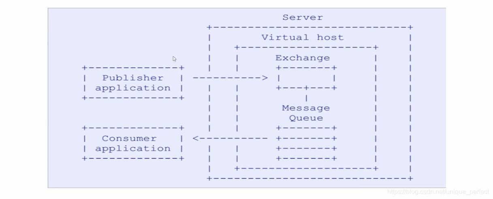
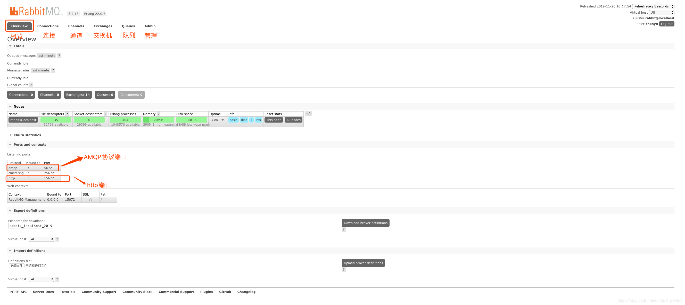
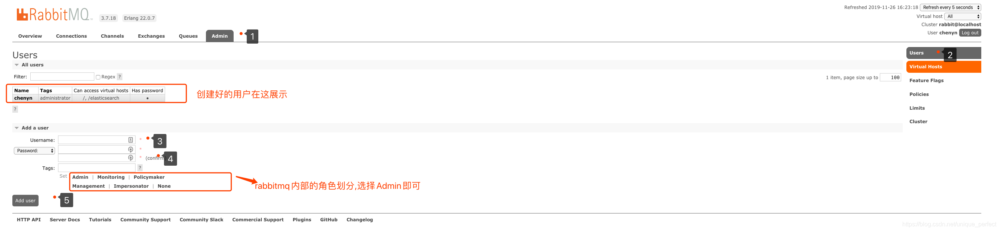
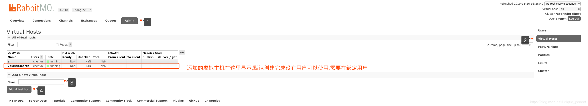
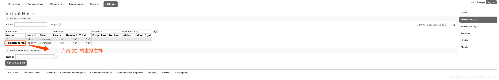
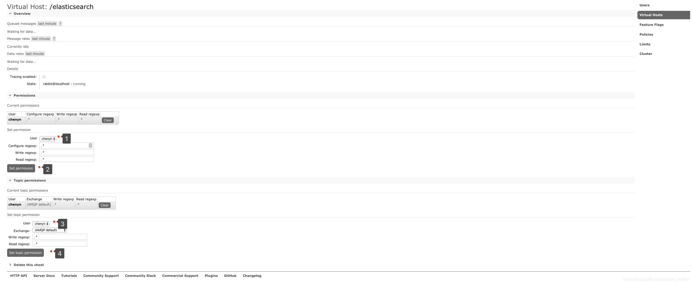
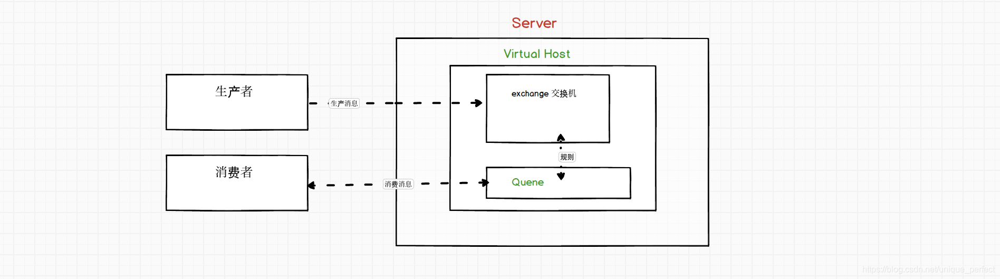
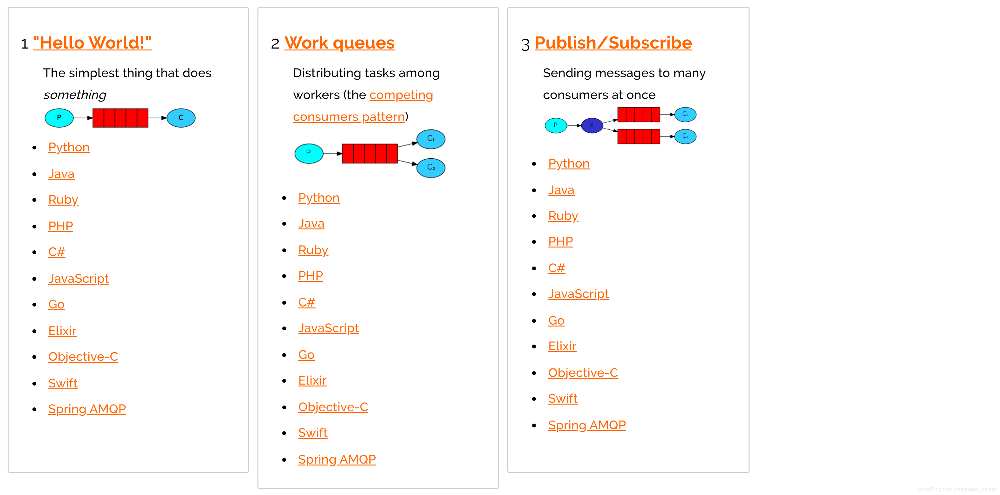

# RabbitMQ  
[转自b站编程不良人](https://www.bilibili.com/video/BV1dE411K7MG)  
## 一.消息队列MQ  
### 1. 什么是MQ  
 &nbsp;&nbsp;&nbsp;MQ(Message Queue) : 翻译为消息队列,通过典型的`生产者`和`消费者`模型,生产者不断向消息队列中生产消息，消费者不断的从队列中获取消息。因为消息的生产和消费都是`异步`的，而且`只关心消息的发送和接收，没有业务逻辑的侵入`,轻松的实现系统间解耦。别名为 消息中间件通过利用高效可靠的消息传递机制进行平台无关的数据交流，并基于数据通信来进行分布式系统的集成。  
### 2. MQ有哪些  
 &nbsp;&nbsp;&nbsp;ActiveMQ、RabbitMQ，Kafka，RocketMQ等。  
### 3. 不同MQ的特点  
- ActiveMQ  
 > 单机吞吐量：万级  
　　topic数量都吞吐量的影响：  
　　时效性：ms级  
　　可用性：高，基于主从架构实现高可用性  
　　消息可靠性：有较低的概率丢失数据  
　　功能支持：MQ领域的功能极其完备  
　　总结：  
　　　　非常成熟，功能强大，在早些年业内大量的公司以及项目中都有应用  
　　　　偶尔会有较低概率丢失消息  
　　　　现在社区以及国内应用都越来越少，官方社区现在对ActiveMQ 5.x维护越来越少，几个月才发布一个版本  
　　　　主要是基于解耦和异步来用的，较少在大规模吞吐的场景中使用  
- RabbitMQ  
> 单机吞吐量：万级  
　　topic数量都吞吐量的影响：  
　　时效性：微秒级，延时低是一大特点。  
　　可用性：高，基于主从架构实现高可用性  
　　消息可靠性：  
　　功能支持：基于erlang开发，所以并发能力很强，性能极其好，延时很低  
　　总结：　　
　　　　erlang语言开发，性能极其好，延时很低；  
　　　　吞吐量到万级，MQ功能比较完备  
　　　　开源提供的管理界面非常棒，用起来很好用  
　　　　社区相对比较活跃，几乎每个月都发布几个版本分  
　　　　在国内一些互联网公司近几年用rabbitmq也比较多一些 但是问题也是显而易见的，RabbitMQ确实吞吐量会低一些，这是因为他做的实现机制比较重。  
　　　　erlang开发，很难去看懂源码，基本职能依赖于开源社区的快速维护和修复bug。  
- RocketMQ  
> 单机吞吐量：十万级  
　　topic数量都吞吐量的影响：topic可以达到几百，几千个的级别，吞吐量会有较小幅度的下降。可支持大量topic是一大优势。  
　　时效性：ms级  
　　可用性：非常高，分布式架构  
　　消息可靠性：经过参数优化配置，消息可以做到0丢失  
　　功能支持：MQ功能较为完善，还是分布式的，扩展性好  
　　总结：  
　　　　接口简单易用，可以做到大规模吞吐，性能也非常好，分布式扩展也很方便，社区维护还可以，可靠性和可用性都是ok的，还可以支撑大规模的topic数量，支持复杂MQ业务场景  
　　　　而且一个很大的优势在于，源码是java，我们可以自己阅读源码，定制自己公司的MQ，可以掌控  
　　　　社区活跃度相对较为一般，不过也还可以，文档相对来说简单一些，然后接口这块不是按照标准JMS规范走的有些系统要迁移需要修改大量代码  
- Kafka  
> 单机吞吐量：十万级，最大的优点，就是吞吐量高。  
　　topic数量都吞吐量的影响：topic从几十个到几百个的时候，吞吐量会大幅度下降。所以在同等机器下，kafka尽量保证topic数量不要过多。如果要支撑大规模topic，需要增加更多的机器资源  
　　时效性：ms级  
　　可用性：非常高，kafka是分布式的，一个数据多个副本，少数机器宕机，不会丢失数据，不会导致不可用  
　　消息可靠性：经过参数优化配置，消息可以做到0丢失  
　　功能支持：功能较为简单，主要支持简单的MQ功能，在大数据领域的实时计算以及日志采集被大规模使用  
　　总结：  
　　　　kafka的特点其实很明显，就是仅仅提供较少的核心功能，但是提供超高的吞吐量，ms级的延迟，极高的可用性以及可靠性，而且分布式可以任意扩展  
　　　　同时kafka最好是支撑较少的topic数量即可，保证其超高吞吐量  
　　　　kafka唯一的一点劣势是有可能消息重复消费，那么对数据准确性会造成极其轻微的影响，在大数据领域中以及日志采集中，这点轻微影响可以忽略  
## 二. 初识RabbitMQ  
 &nbsp;&nbsp;&nbsp;基于AMQP协议，erlang语言开发，是部署最广泛的开源消息中间件,是最受欢迎的开源消息中间件之一  
### 1. AMQP协议  
 &nbsp;&nbsp;&nbsp;AMQP是一种协议，更准确的说是一种binary wire-level protocol（链接协议）。这是其和JMS的本质差别，AMQP不从API层进行限定，而是直接定义网络交换的数据格式。这使得实现了AMQP的provider天然性就是跨平台的。以下是AMQP协议模型:  
  
 &nbsp;&nbsp;&nbsp;如图所示，生产者（Publisher）将消息发送给虚拟主机（Virtual host）中的交换机（Exchange），交换机和消息队列（Message Queue）之间有绑定关系，消费者（Consumer）通过消息队列来消费消息。  
 ## 三. RabbitMQ配置  
 ### 1. RabbitMQ管理命令行  
 #### ①. 服务启动相关  
- `systemctl start rabbitmq-server`：启动RabbitMQ  
- `systemctl restart rabbitmq-server`：重启RabbitMQ  
- `systemctl stop rabbitmq-server`：停止RabbitMQ  
- `systemctl status rabbitmq-server`：查看RabbitMQ的状态  
 #### ②. 管理命令行  
- `rabbitmqctl help` ：查看更多命令，用来在不使用web管理界面情况下命令操作RabbitMQ  
 #### ③. 插件管理命令行  
- `rabbitmq-plugins list`：列出所有插件  
- `rabbitmq-plugins enable`：启动插件  
- `rabbitmq-plugins disable`：关闭插件  
### 2.Web管理界面  
#### (1)Overview概览  
  
- `connections`：无论生产者还是消费者，都需要与RabbitMQ建立连接后才可以完成消息的生产和消费，在这里可以查看连接情况  
- `channels`：通道，建立连接后，会形成通道，消息的投递获取依赖通道  
- `Exchanges`：交换机，用来实现消息的路由  
- `Queues`：队列，即消息队列，消息存放在队列中，等待消费，消费后被移除队列  
#### (2) Admin用户和虚拟主机管理  
##### Ⅰ添加用户  
  
上面的Tags选项，其实是指定用户的角色，可选的有以下几个：  
 &nbsp;&nbsp;&nbsp;超级管理员(administrator)：可登陆管理控制台，可查看所有的信息，并且可以对用户，策略(policy)进行操作  
 &nbsp;&nbsp;&nbsp;监控者(monitoring)：可登陆管理控制台，同时可以`查看`rabbitmq节点的相关信息(进程数，内存使用情况，磁盘使用情况等)  
 &nbsp;&nbsp;&nbsp;策略制定者(policymaker)：可登陆管理控制台, 同时可以对policy进行管理。但`无法查看节点的相关信息`(上图红框标识的部分)  
 &nbsp;&nbsp;&nbsp;普通管理者(management)：`仅可登陆管理控制台`，无法看到节点信息，也无法对策略进行管理  
 &nbsp;&nbsp;&nbsp;其他：`无法登陆管理控制台`，通常就是普通的生产者和消费者  
##### Ⅱ 创建虚拟主机  
  
##### Ⅲ 绑定虚拟主机和用户  
创建好虚拟主机，我们还要给用户添加访问权限：  
点击添加好的虚拟主机：  
  
进入虚拟机设置界面  
  
## RabbitMQ的第一个程序  
### 1. AMQP协议回顾  
  
 &nbsp;&nbsp;&nbsp;产者通过通道发送消息，每个生产者对应一个虚拟主机，需要将虚拟主机和用户绑定之后才有访问权限。消息要不要放到交换机中取决于所使用的消息模型，消息不放到交换机时会直接放到消息队列中。消费者和生产者是解耦的，它只关心消息队列中有没有相应的消息，消费者消费消息时也需要连接虚拟主机。  
### 2. AMQP支持的消息模型  
  
### 3. 使用rabbitmq需要引入的依赖  
```java  
<dependency>  
    <groupId>com.rabbitmq</groupId>  
    <artifactId>amqp-client</artifactId>  
    <version>5.7.2</version>  
</dependency>  

```  
### 4. 第一种模型（直连）  
  
 &nbsp;&nbsp;&nbsp;在上图的模型中，有以下概念：  
- P：生产者，也就是要发送消息的程序  
- C：消费者：消息的接受者，会一直等待消息到来  
- queue：消息队列，图中红色部分。类似一个邮箱，可以缓存消息；生产者向其中投递消息，消费者从其中取出消息  
 &nbsp;&nbsp;&nbsp;该模型中只有一个生产者和一个消费者，生产者将消息发送到消息队列，生产者对消息队列进行监听，从消息队列取出消息进行消费。  
### 5. 第二种模型（work queue）  
 &nbsp;&nbsp;&nbsp;Work queues，也被称为（Task queues），`任务模型`。当消息处理比较耗时的时候，可能生产消息的速度会远远大于消息的消费速度。长此以往，消息就会堆积越来越多，无法及时处理。此时就可以使用work 模型：让`多个消费者绑定到一个队列，共同消费队列中的消息`。队列中的消息一旦消费，就会消失，因此任务是不会被重复执行的。  

角色：
- P：生产者：任务的发布者
- C1：消费者-1，领取任务并且完成任务，假设完成速度较慢
- C2：消费者-2：领取任务并完成任务，假设完成速度快
**:star:** 当多个消费者处理消息的速度不同时，可以关闭自动确认并设置每次能消费的消息个数来实现能者多劳。
```java
package workqueue;

import com.rabbitmq.client.*;
import utils.MQConnection;

import java.io.IOException;

public class Consumer2 {
    public static void main(String[] args) throws IOException {
        // 获取连接对象
        Connection connection = MQConnection.getConnection();
        // 获取通道对象
        Channel channel = connection.createChannel();
        // 每次只能消费1个消息
        channel.basicQos(1);
        // 通过通道声明队列
        channel.queueDeclare("work", true, false, false, null);
        // 关闭自动确认，需要手动确认
        channel.basicConsume("work", false, new DefaultConsumer(channel) {
            @Override
            public void handleDelivery(String consumerTag, Envelope envelope, AMQP.BasicProperties properties, byte[] body) throws IOException {
                try {
                    Thread.sleep(1000);
                } catch (InterruptedException e) {
                    e.printStackTrace();
                }
                System.out.println("消费者2：" + new String(body));
                // 手动确认
                // 参数：确认队列中哪个具体消息、是否开启多个消息同时确认
                channel.basicAck(envelope.getDeliveryTag(), false);
            }
        });
    }
}

```
### 6. 第三种模型（fanout）


