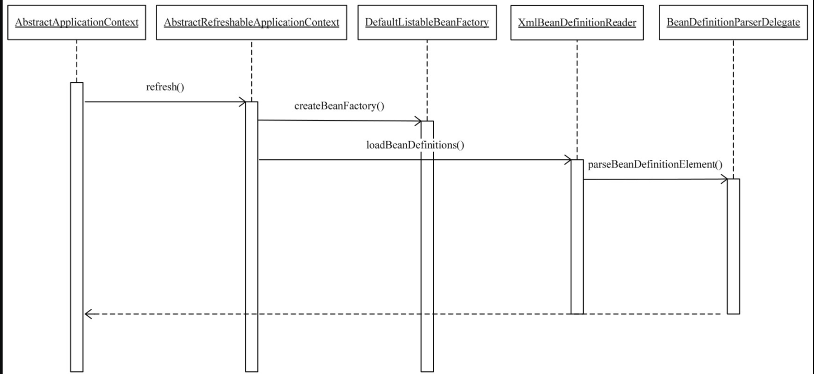

# Spring IoC容器

## 1. 概述

​	在面向对象系统中，对象封装了数据和对数据的处理，对象的依赖关系可以通过把对象的依赖注入交给框架或IoC容器来完成，这种将具体对象手中交出控制的做法称为控制反转。

​	如此，对象之间的相互依赖关系由IoC容器进行管理，并由IoC容器完成对象的注入。如A依赖B，B依赖C，通过IoC容器，可以直接创建A，B,C将会自动创建。

​	依赖控制反转有很多实现方式，在Spring中，IoC是实现这个模式的载体

- 可以在对象生成或初始化时直接将数据注入到对象中
- 通过对象引用注入到对象数据域中的方式来注入对方法调用的依赖

​	当应用控制反转后，对象被创建时，**由一个调控系统内的所有对象的外界实体将其所依赖的对象的引用传递给它**，即依赖注入。	可以认为这个调控系统是IoC容器。

​	在面向对象系统中，大部分对象只是用来处理数据，这些对象并不常发生变化，以单件的形式起作用就可以满足应用的需求。

​	另外，对象之间的相互依赖关系也是比较稳定，一般不会随着应用的运行状态的改变而改变。

**IoC的应用场景**

1. 解耦组件之间复杂关系
2. 在开发中，需要引用和调用其他组件的服务，使用IoC可以去管理组件中的一些依赖服务

## 2. IoC容器系列的设计与实现：BeanFactory和ApplicationContext

​	IoC容器设计有两种主要容器系列：一种是实现BeanFactory接口的简单容器系列，这系列容器只实现了容器的最`基本`功能。另一个是ApplicationContext应用上下文，作为容器的`高级`形态存在。

### 2.1 Spring的IoC容器系列

​	IoC容器可以理解为一个水桶，出售的水桶有大有小，有金属的，塑料的等，但共同作用都是用来装水，根据不同场景可以选择不同的水桶。

​	SpringFramework的IoC核心就是其中一个“水桶”，它是开源的。对于IoC容器的使用者来说，平常接触的BeanFactory和ApplicationContext都可以看成容器的具体表现形式。

​	在Spring提供的基本IoC容器的接口定义和实现的基础上


​	Spring通过定义`BeanDefinition`来管理基于Spring的应用中的各种对象以及它们之间的相互依赖关系。

​	`BeanDefinition`抽象了我们对`Bean`的定义，是让容器起作用的主要数据类型。对于IoC容器来说，`BeanDefinition`就是对依赖反转模式中**管理的对象依赖关系**的数据抽象。

​	可以将`BeanDefinition`理解为木桶中的水，有了这些基本数据，容器才能够发挥作用。


### 2.2 Spring IoC容器的设计

​	上图是IoC容器的接口设计图，下面对该图作一些简要分析：

- 接口`BeanFactory`=>接口`HierarchicalBeanFactory`，再=>`ConfigurableBeanFactory`，是一条主要的`BeanFactory`设计路径。

    1. 在`BeanFactory`中，定义了getBean()这样的基本方法，通过这个方法可以从容器中获取Bean
    2. `HierarchicalBeanFactory`接口继承了`BeanFactory`接口，增加了`getParentBeanFactory()`的接口功能，使`BeanFactory`具备了双亲IoC容器的管理功能
    3. `ConfigurableBeanFactory`定义了对`BeanFactory`的配置功能

- `ApplicationContext`应用上下文接口为核心：

    1. `BeanFactory`=>`ListableBeanFactory`=>`ApplicationContext`=>`WebApplicationContext`或`ConfigurableApplicationContxt`接口，这是第二条接口设计主线。

    2. 常用的应用上下文基本上都是`ConfigurableApplicationContext`或者`WebApplicationContext`的实现

    3. `ListableBeanFactory`和`HierarchicalBeanFactory`两个接口，连接BeanFactory接口定义和`ApplicationConext`应用上下文的接口定义。

    4. 在`ListableBeanFactory`接口中，细化了许多`BeanFactory`的接口功能，比如定义了`getBeanDefinitionNames`()接口方法

    5. 对于`HierarchicalBeanFactory`接口，我们在前文中已经提到过；对于`ApplicationContext`接口，它通过继承`MessageSource`、`ResourceLoader`、`ApplicationEventPublisher`接口，在`BeanFactory`简单IoC容器的基础上添加了许多对高级容器的特性的支持。

- 接口系统是以`BeanFactory`和`ApplicationContext`为核心

- `BeanFactory`又是IoC容器的最基本接口，在`ApplicationContext`的设计中，一方面，可以看到它继承了`BeanFactory`接口体系中的`ListableBeanFactory`、`AutowireCapableBeanFactory`、`HierarchicalBeanFactory`等`BeanFactory`的接口，具备了`BeanFactory IoC`容器的基本功能；另一方面，通过继承`MessageSource`、`ResourceLoadr`、`ApplicationEventPublisher`这些接口，`BeanFactory`为`ApplicationContext`赋予了更高级的IoC容器特性

- 对于`ApplicationContext`而言，为了在Web环境中使用它，还设计了`WebApplicationContext`接口，而这个接口通过继承`ThemeSource`接口来扩充功能。

#### 2.2.1 BeanFactory的应用场景

​	`BeanFactory`接口定义了IoC容器最基本的形式，并且提供了IoC容器所要遵守的基本的服务契约，同时，也是使用IoC容器所要遵守的最底层和最基本的编程规范。

​	用户在使用容器时，可以使用转义符“&”来得到`FactoryBean`本身，用来区分通过容器来获取`FactoryBean`产生的对象和获取`FactoryBean`本身。举例，`MyJndiObject`是一个`FactoryBean`，那么使用`&myJndiObject`得到的是`FactoryBean`，而不是`myJndiObject`这个`FactoryBean`产生的对象。

> FactoryBean和BeanFactory这两个在Spring中使用频率很高的类
>
> FactoryBean是一个能产生或者修饰对象生成的工厂Bean
>
> BeanFactory是IoC容器或者对象工厂

​	`BeanFactory`接口设计了`getBean`方法，可以通过指定名字来索引。同时，`Beanfactory`接口定义了带有参数`getBean()`方法，可以在获取Bean时对Bean的类型进行检查。

​	用户可以通过`BeanFactory`接口方法中的`getBean`来使用Bean名字，从而在获取Bean时，如果需要获取的Bean是prototype类型的，用户还可以为这个protorype类型的bean生成指定构造函数的对应参数。用了BeanFactory的定义，用户可以执行以下操作：

- 通过接口方法`containsBean`让用户能够判断容器是否含有指定名字的Bean
- 通过接口方法`isSimgleton`来查询指定名字的Bean是否是Singleton类型的Bean
- 通过接口方法isPrototype来查询指定名字的Bean是否是prototype类型的
- 通过接口方法isTypeMatch来查询指定了名字的Bean的Class类型是否是特定的Class类型。
- 通过接口方法getAliases来查询指定了名字的Bean的所有别名

```java
package org.springframework.beans.factory;

import org.springframework.beans.BeansException;
import org.springframework.core.ResolvableType;
import org.springframework.lang.Nullable;

public interface BeanFactory {
    	String FACTORY_BEAN_PREFIX = "&";
    
    	Object getBean(String name) throws BeansException;
    
    	<T> T getBean(String name, Class<T> requiredType) throws BeansException;
    
    	Object getBean(String name, Object... args) throws BeansException;
    
    	<T> T getBean(Class<T> requiredType) throws BeansException;
    
    	<T> T getBean(Class<T> requiredType, Object... args) throws BeansException;
    
    	<T> ObjectProvider<T> getBeanProvider(Class<T> requiredType);
    
    	<T> ObjectProvider<T> getBeanProvider(ResolvableType requiredType);

   		boolean containsBean(String name);
    
    	boolean isSingleton(String name) throws NoSuchBeanDefinitionException;
    
    	boolean isPrototype(String name) throws NoSuchBeanDefinitionException;
    
    	boolean isTypeMatch(String name, ResolvableType typeToMatch) throws NoSuchBeanDefinitionException;

    	boolean isTypeMatch(String name, Class<?> typeToMatch) throws NoSuchBeanDefinitionException;

    	@Nullable
		Class<?> getType(String name) throws NoSuchBeanDefinitionException;

    	@Nullable
		Class<?> getType(String name, boolean allowFactoryBeanInit) throws NoSuchBeanDefinitionException;

    	String[] getAliases(String name);
}
```

#### 2.2.2 BeanFactory容器的设计原理

​	`BeanFactory`接口提供了使用IoC容器的规范，在此基础上，Spring还提供了符合这个IoC容器接口的一系列容器的实现供开发人员使用。下面以`XmlBeanFactory`的实现为例来说明简单IoC容器的设计原理

​	`XmlBeanFacoty`继承自`DefaultListableBeanFactory`这个类，后者是作为一个默认的功能完整的IoC容器来使用的。`XmlBeanFactory`在继承的基础上又增加了新的功能，也就是可以读取xml文件的功能。

​	这种实现xml读取的功能是怎样实现的呢？首先，它并不是由`xmlBeanFactory`直接完成的，在`xmlBeanFactory`中，初始化了一个`xmlbeanDefinitionReader`对象，有了这个对象，那些以xml方式定义`BeanDefinition`就有了处理的地方。

​	构造xmlBeanFactory这个IoC容器时，需要指定`BeanDefinition`的信息来源，而这个信息来源需要封装成Spring中的`Resource`类来给出。`Resource`是`Spring`用来封装I/O操作的类。使用像“`ClassPath-Resource res =new ClassPathResource("beans.xml")`"这样具体的`ClassPathResource`来构造需要的`Resource`，然后将`Resource`作为构造参数传递给`XmlBeanFactory`构造函数。

```java
package org.springframework.beans.factory.xml;

import org.springframework.beans.BeansException;
import org.springframework.beans.factory.BeanFactory;
import org.springframework.beans.factory.support.DefaultListableBeanFactory;
import org.springframework.core.io.Resource;

@Deprecated
@SuppressWarnings({"serial", "all"})
public class XmlBeanFactory extends DefaultListableBeanFactory {

	private final XmlBeanDefinitionReader reader = new XmlBeanDefinitionReader(this);


	public XmlBeanFactory(Resource resource) throws BeansException {
		this(resource, null);
	}


	public XmlBeanFactory(Resource resource, BeanFactory parentBeanFactory) throws BeansException {
		super(parentBeanFactory);
		this.reader.loadBeanDefinitions(resource);
        // 调用启动从Resource中载入BeanDefinitions的过程
	}

}
```

​	以上是`xmlBeanFactory`的源码

​	`DefaultListableBeanFactory`是很重要的一个IoC实现，在其他IoC容器中，比如`ApplicationContext`，其实现的基本原理和`xmlBeanFactory`一样。

​	    编程式使用IoC容器

```java
import org.springframework.beans.factory.support.DefaultListableBeanFactory;
import org.springframework.beans.factory.xml.XmlBeanDefinitionReader;
import org.springframework.core.io.ClassPathResource;

public class MyTest {
    public static void main(String[] args) {
        // 1. 创建IoC配置文件的抽象资源，包含了BeanDefinition的定义信息
        ClassPathResource res = new ClassPathResource("beans.xml");
        // 2. 创建一个BeanFactory
        DefaultListableBeanFactory factory = new DefaultListableBeanFactory();
        // 创建一个载入Beandefinition的读取器
        XmlBeanDefinitionReader reader = new XmlBeanDefinitionReader(factory);
        // 从定义好的资源位置读入配置信息
        reader.loadBeanDefinitions(res);
        // 最终会载入和注册到Bean中
    }
}
```

#### 2.2.3 ApplicationContext的应用场景

​	`ApplicationContext`除了能够提供前面介绍的容器的基本功能外，还为用户提供了以下附加服务。

- 支持不同的信息源。扩展了`MessageSource`接口
- 访问资源。体现在`ResourceLoader`和`Resource`的支持上，这样就可以从不同地方得到Bean定义资源
- 支持应用事件，继承了`ApplicationEventPublisher`，从而在上下文中引入事件机制。

`ApplicationContext`比简单`BeanFactory`相比，使用的是一种面向框架的使用风格，推荐使用

#### 2.2.4 ApplicationContext容器的设计原理

​	下面以`FileSystemXmlApplicationContext`的实现为例来介绍`ApllicationContext`容器的设计原理

​	然而，`ApplicationContext`应用上下文的主要功能已经在`FileSystemXmlApplicationContext`的基类`AbstractXmlApplicationContext`中实现了

​    作为一个具体的应用上下文，需要实现与设计相关的两个功能

1. 如果应用直接使用`FileSystemXmlApplicationContext`,对于实例化这个应用上下文的支持，同时启动IoC容器的`refresh()`过程。

    ```java
    public FileSystemXmlApplicationContext(
        String[] configLocations, boolean refresh, @Nullable ApplicationContext parent)
        throws BeansException {
    
        super(parent);
        setConfigLocations(configLocations);
        if (refresh) {
            refresh();
        }
    }
    ```

    这个`refresh()`过程会牵扯到IoC容器启动的一系列复杂操作。

2. 与`FileSystemXmlApplicationContext`设计具体相关的功能，这部分与怎样从文件系统中加载XML的Bean定义资源有关。

    通过这个过程，可以为在文件系统中读取以XML形式存在的`BeanDefinition`做准备，因为不同的应用上下文实现对应着不同的读取`BeanDefinition`的方式

    ```java
    @Override
    protected Resource getResourceByPath(String path) {
        if (path.startsWith("/")) {
            path = path.substring(1);
        }
        return new FileSystemResource(path);
    }
    ```

    这个方法，可以得到`FileSystemResource的资源定位`

## 3. IoC容器的初始化过程

​	简单来说，IoC容器的初始化是由前面说的`refresh()`来启动的

​	启动包含`BeanDefination`的`Resource`定位，载入和注册三个基本过程

​	Spring将这三个过程分开，并使用不同的模块来完成。

**第一个过程是Resource定位过程**

​	`BeanDefinition`的资源定位，由`ResourceLoader`通过统一的`Resource`接口来完成，这个`Resource`对各种形式的`BeanDefinition`的使用都提供了统一接口。

​	对于`BeanDefinition`的存在形式，就比如，文件系统中的Bean定义信息可以使用`FileSystemResource`来进行抽象；在类路径中的Bean定义信息可以使用`ClassPathResource`。

​	定位过程就类似于容器寻找数据的过程，就像用水桶装水先要把水找到一样

**第二个过程是BeanDefinition的载入**

​	这个载入过程是把用户定义好的Bean表示成IoC容器内部的数据结构，而这个容器内部的数据结构就是`BeanDefinition`。

​	具体来说，这个`BeanDefinition`实际就是POJO对象在IoC容器中的抽象，通过这个`BeanDefinition`定义的数据结构，使IoC容器能够方便地对POJO对象也就是Bean进行管理。

**第三个过程是向IoC容器注册这些BeanDefinition**

​	调用`BeanDefinitionRegistry`接口地实现来完成的。把载入过程中解析得到的`BeanDefinition`向IoC容器进行注册。会注入到一个`HashMap`中去。IoC容器就是通过这个`HashMap`来持有这些`BeanDefinition`数据的。

---

​	在IoC容器初始化过程，一般包含Bean依赖注入的实现，Bean定义的载入和依赖注入是两个独立的过程。

​	依赖注入一般发生在应用第一次通过`getBean`向容器索取Bean的时候，但如果用户设置了`lazyinit`属性，会导致Bean的依赖注入在IoC容器初始化时就完成了。

### 3.1 BeanDefinition的Resource定位

​	以下代码使用ClassPathResource，这意味着Spring会在类路径中去寻找以文件形式存在的`BeanDefinition`信息。

```java
ClassPathResource classPathResource = new ClassPathResource("beans.xml");
```

​	这里的`Resource`并不能被`DefaultListableBeanFactory`直接使用，Spring通过`BeanDefinitionReader`来对这些信息进行处理。

​	这里也可以使用`ApplicationContext`，相对于`DefaultListableBeanFactory`，它可以提供一系列加载不同`Resource`的读取器的实现。而`DefaultListableBeanFactory`只是一个纯粹的IoC容器，需要特定的读取器才能完成这些功能。

​	`ApplicationContext`比`BeanFactory`封装的更深

---

​	下面以`FileSystemXmlApplicationContext`为例，看看`ApplicationContext`是如何完成`Resource`定位过程的。

​		可以看到，`FileSystemXmlApplicationContext`已经通过继承`Abstract-ApplicationContext`具备了`ResourceLoader`读入以`Resource`定义的`BeanDefinition`的能力

```java
package org.springframework.context.support;

import org.springframework.beans.BeansException;
import org.springframework.context.ApplicationContext;
import org.springframework.core.io.FileSystemResource;
import org.springframework.core.io.Resource;
import org.springframework.lang.Nullable;

public class FileSystemXmlApplicationContext extends AbstractXmlApplicationContext {

	public FileSystemXmlApplicationContext() {
	}

	public FileSystemXmlApplicationContext(ApplicationContext parent) {
		super(parent);
	}
	
    // 这个构造函数的configLocation包含的时BeanDefinition所在的文件路径
	public FileSystemXmlApplicationContext(String configLocation) throws BeansException {
		this(new String[] {configLocation}, true, null);
	}
	
    // 这个构造函数允许configLocations包含多个BeanDefinition所在的文件路径
	public FileSystemXmlApplicationContext(String... configLocations) throws BeansException {
		this(configLocations, true, null);
	}
	
    // 这个构造函数允许configLocations包含多个BeanDefinition所在的文件路径
    // 还允许指定自己的双亲IoC容器
	public FileSystemXmlApplicationContext(String[] configLocations, ApplicationContext parent) throws BeansException {
		this(configLocations, true, parent);
	}

	public FileSystemXmlApplicationContext(String[] configLocations, boolean refresh) throws BeansException {
		this(configLocations, refresh, null);
	}
	
    // 在对象的初始化过程中，调用refresh函数载入BeanDefinition，这个refresh启动
	public FileSystemXmlApplicationContext(
			String[] configLocations, boolean refresh, @Nullable ApplicationContext parent)
			throws BeansException {

		super(parent);
		setConfigLocations(configLocations);
		if (refresh) {
			refresh();
		}
	}

	// 这是应用于文件系统中Resource的实现，通过构造一个FileSystemResource来得到一个在文件系统中定位的BeanDefnition
    // 则个getResourceByPath是在BeanDefinitionReader的loadBeanDefinition中被调用的
    // loadBeanDefinition采用了模板模式，具体的定位实现实际上是由各个子类来完成的
	@Override
	protected Resource getResourceByPath(String path) {
		if (path.startsWith("/")) {
			path = path.substring(1);
		}
		return new FileSystemResource(path);
	}

}
```

​	在`FileSystemApplicationContext`,实现了对`configuration`进行处理的功能，让所有配置在文件系统中的，以XML文件方式存在的`BeanDefnition`都能够得到有效的处理

​	比如，实现了`getResourceByPath`方法，这个方法是一个模板方法，是为读取`Resource`服务的。

​    在构造函数中通过refresh来启动IoC容器的初始化，这个refresh方法非常重要

​    

​    上图是`getResourceByPath`的调用过程

​	上面大概是说怎么定位到资源文件的，那么要如何完成`BeanDefinition`信息的读入呢？

​    在IoC容器的初始化过程中，BeanDefinition资源的定位、读入和注册过程是分开进行的

​    关于这个读入器的配置，可以到`FileSystemXmlApplicationContext`的基类`AbstractRefreshableApplicationContext`中看看它是怎样实现的。

​	主要先来看看`AbstractRefreshableApplicationContext`的`refreshBeanFactory`方法的实现

```java
@Override
protected final void refreshBeanFactory() throws BeansException {
    if (hasBeanFactory()) {
        destroyBeans();
        closeBeanFactory();
    }
    try {
        //构建了一个IoC容器供ApplicationContext使用。这个IoC容器就是我们前面提到过的DefaultListableBeanFactory
        DefaultListableBeanFactory beanFactory = createBeanFactory();
        beanFactory.setSerializationId(getId());
        customizeBeanFactory(beanFactory);
        //启动了loadBeanDefinitions来载入BeanDefinition
        loadBeanDefinitions(beanFactory);
        this.beanFactory = beanFactory;
    }
    catch (IOException ex) {
        throw new ApplicationContextException("I/O error parsing bean definition source for " + getDisplayName(), ex);
    }
}
```

​	通过IoC容器的初始化的`refersh`来启动整个调用，使用的IoC容器是`DefultListableBeanFactory`,具体的资源载入在`XmlBeanDefinitionReader`读入`BeanDefinition`时完成，在`XmlBeanDefinitionReader`的基类`AbstractBeanDefinitionReader`中可以看到这个载入过程的具体实现。

   ```java
   /**
   * AbstractRefreshableApplicationContext中
   这是上下文中创建DefaultListableBeanFactory的地方，getInternalParentBeanFactory
   的具体实现查看AbstractApplicationContext中的实现，根据容器已有的双亲IoC容器信息来生成
   */
   protected DefaultListableBeanFactory createBeanFactory() {
       return new DefaultListableBeanFactory(getInternalParentBeanFactory());
   }
   
   /**
   * AbstractRefreshableApplicationContext中
   
   这是使用BeanDefinitionReader载入Bean定义的地方
   */
   protected abstract void loadBeanDefinitions(DefaultListableBeanFactory beanFactory)
       throws BeansException, IOException;
   
   /**
   * AbstractBeanDefinitionReader类中
   */
   public int loadBeanDefinitions(String location, @Nullable Set<Resource> actualResources) throws BeanDefinitionStoreException {
       ResourceLoader resourceLoader = getResourceLoader();
       if (resourceLoader == null) {
           throw new BeanDefinitionStoreException(
               "Cannot load bean definitions from location [" + location + "]: no ResourceLoader available");
       }
   
       if (resourceLoader instanceof ResourcePatternResolver) {
           // Resource pattern matching available.
           try {
               Resource[] resources = ((ResourcePatternResolver) resourceLoader).getResources(location);
               int count = loadBeanDefinitions(resources);
               if (actualResources != null) {
                   Collections.addAll(actualResources, resources);
               }
               if (logger.isTraceEnabled()) {
                   logger.trace("Loaded " + count + " bean definitions from location pattern [" + location + "]");
               }
               return count;
           }
           catch (IOException ex) {
               throw new BeanDefinitionStoreException(
                   "Could not resolve bean definition resource pattern [" + location + "]", ex);
           }
       }
       else {
           // Can only load single resources by absolute URL.
           Resource resource = resourceLoader.getResource(location);
           int count = loadBeanDefinitions(resource);
           if (actualResources != null) {
               actualResources.add(resource);
           }
           if (logger.isTraceEnabled()) {
               logger.trace("Loaded " + count + " bean definitions from location [" + location + "]");
           }
           return count;
       }
   }
   
   
   /**
   * DefaultResourceLoader类中
   */
   @Override
   public Resource getResource(String location) {
       Assert.notNull(location, "Location must not be null");
   
       for (ProtocolResolver protocolResolver : this.protocolResolvers) {
           Resource resource = protocolResolver.resolve(location, this);
           if (resource != null) {
               return resource;
           }
       }
   
       if (location.startsWith("/")) {
           return getResourceByPath(location);
       }
       else if (location.startsWith(CLASSPATH_URL_PREFIX)) {
           return new ClassPathResource(location.substring(CLASSPATH_URL_PREFIX.length()), getClassLoader());
       }
       else {
           try {
               // Try to parse the location as a URL...
               URL url = new URL(location);
               return (ResourceUtils.isFileURL(url) ? new FileUrlResource(url) : new UrlResource(url));
           }
           catch (MalformedURLException ex) {
               // No URL -> resolve as resource path.
               return getResourceByPath(location);
           }
       }
   }
   ```

​	`getResourceByPath`会被子类`FileSystemXmlApplicationContext`实现，这个方法返回的是一个`FileSystemResource`对象，通过这个对象，Spring可以进行相关的I/O操作，完成`BeanDefinition`的定位。

```java
@Override
protected Resource getResourceByPath(String path) {
    if (path.startsWith("/")) {
        path = path.substring(1);
    }
    return new FileSystemResource(path);
}
```

---

​	在`BeanDefinition`定位完成的基础上，就可以通过返回的`Resource`对象来进行`BeanDefinition`的载入了。

​	在定位过程完成以后，为`BeanDefinition`的载入创造了I/O操作的条件，但是具体的数据还没有开始读入。

​    这里就像用水桶去打水，要先找到水源。这里完成对`Resource`的定位，就类似于水源已经找到了，下面就是打水的过程了

   ### 3.2 BeanDefinition的载入和解析

​	这个载入过程，相当于把定义的`BeanDefinition`在IoC容器中转化成一个Spring内部表示的数据结构的过程。

​	IoC容器对Bean的管理和依赖注入功能的实现，是通过对其持有的`BeanDefinition`进行各种相关操作来完成的。

​	这些`BeanDefinition`数据在IoC容器中通过一个`HashMap`来保持和维护。

​	下面，从`DefaultListableBeanFactory`的设计入手，看看IoC容器是怎样完成`BeanDefinition`载入的。

​	首先，先回到`refresh`方法，它的调用标志着容器初始化的开始，这些初始化对象就是BeanDefinition数据

```java
public FileSystemXmlApplicationContext(
    String[] configLocations, boolean refresh, @Nullable ApplicationContext parent)
    throws BeansException {

    super(parent);
    setConfigLocations(configLocations);
    if (refresh) {
        refresh();
    }
}
```

下面介绍下它的实现，该方法在`AbstractApplicationContext`类，	

```java
@Override
public void refresh() throws BeansException, IllegalStateException {
    synchronized (this.startupShutdownMonitor) {
        StartupStep contextRefresh = this.applicationStartup.start("spring.context.refresh");

        // Prepare this context for refreshing.
        prepareRefresh();
		// 这里是在子类中启动refreshBeanFactory()的地方
        // Tell the subclass to refresh the internal bean factory.
        ConfigurableListableBeanFactory beanFactory = obtainFreshBeanFactory();

        // Prepare the bean factory for use in this context.
        prepareBeanFactory(beanFactory);

        try {
            // 设置beanfactory的后置处理
            // Allows post-processing of the bean factory in context subclasses.
            postProcessBeanFactory(beanFactory);
			
            StartupStep beanPostProcess = this.applicationStartup.start("spring.context.beans.post-process");
            // 调用beanfactory的后处理器，这些后处理器是在bean定义中向容器注册的
            // Invoke factory processors registered as beans in the context.
            invokeBeanFactoryPostProcessors(beanFactory);

            // Register bean processors that intercept bean creation.
            registerBeanPostProcessors(beanFactory);
            beanPostProcess.end();

            // Initialize message source for this context.
            // 对上下文中的消息源进行初始化
            initMessageSource();

            // Initialize event multicaster for this context.
            // 初始化上下文中的事件机制
            initApplicationEventMulticaster();

            // Initialize other special beans in specific context subclasses.
            // 初始化其他特殊的bean
            onRefresh();

            // Check for listener beans and register them.
            // 检查监听bean并且将这些bean向容器注册
            registerListeners();

            // Instantiate all remaining (non-lazy-init) singletons.
            // 实例化所有的(non-lazy-init)单件
            finishBeanFactoryInitialization(beanFactory);
			
            // Last step: publish corresponding event.
            // 发布容器事件，结束refresh过程
            finishRefresh();
        }

        catch (BeansException ex) {
            // 为防止Bean资源占用，在异常处理中，销毁已经在前面过程生成的单件bean
            if (logger.isWarnEnabled()) {
                logger.warn("Exception encountered during context initialization - " +
                            "cancelling refresh attempt: " + ex);
            }

            // Destroy already created singletons to avoid dangling resources.
            destroyBeans();

            // Reset 'active' flag.
            cancelRefresh(ex);

            // Propagate exception to caller.
            throw ex;
        }

        finally {
            // Reset common introspection caches in Spring's core, since we
            // might not ever need metadata for singleton beans anymore...
            resetCommonCaches();
            contextRefresh.end();
        }
    }
}
```

​	在`AbstractRefreshableApplicationContext`的`refreshBeanFactory()`方法中，在这个方法中创建了`BeanFactory`。在创建IoC容器前，如果已经有容器存在，那么需要把已有的容器销毁和关闭，保证在refresh以后使用的是新建立起来的IoC容器。



​	**AbstractRefreshableApplicationContext的refreshBeanFactory方法**

```java
@Override
protected final void refreshBeanFactory() throws BeansException {
    if (hasBeanFactory()) {
        destroyBeans();
        closeBeanFactory();
    }
    try {	
        // 创建IoC容器
        DefaultListableBeanFactory beanFactory = createBeanFactory();
        beanFactory.setSerializationId(getId());
        customizeBeanFactory(beanFactory);
        // 启动对BeanDefinition的载入
        loadBeanDefinitions(beanFactory);
        synchronized (this.beanFactoryMonitor) {
            this.beanFactory = beanFactory;
        }
    }
    catch (IOException ex) {
        throw new ApplicationContextException("I/O error parsing bean definition source for " + getDisplayName(), ex);
    }
}
```

​	`loadBeanDefinitions`其实是一个抽象方法，那么实际的载入过程在哪呢？

​	在`AbstractRefreshableApplicationContext`的子类`AbstractXmlApplicationContext`中的实现，在这个`loadBeanDefinitions`中，初始化了读取器`XmlBeanDefinitionReader`，然后把这个读取器在IoC容器中设置好，最后是启动读取器来完成`BeanDefinition`在IoC容器中的载入

```java
@Override
protected void loadBeanDefinitions(DefaultListableBeanFactory beanFactory) throws BeansException, IOException {
    // Create a new XmlBeanDefinitionReader for the given BeanFactory.
    // 创建XmlBeanDefinitionReader，并通过回调设置到BeanFactory中
    XmlBeanDefinitionReader beanDefinitionReader = new XmlBeanDefinitionReader(beanFactory);

    // Configure the bean definition reader with this context's
    // resource loading environment.
    beanDefinitionReader.setEnvironment(this.getEnvironment());
    // 设置XmlBeanDefinitionReader，为XmlBeanDefinitionReader配置ResourceLoader，因为DefaultResourceLoader是父类
    // 所以this可以直接使用
    beanDefinitionReader.setResourceLoader(this);
    beanDefinitionReader.setEntityResolver(new ResourceEntityResolver(this));
	// 启动Bean定义信息载入过程
    // Allow a subclass to provide custom initialization of the reader,
    // then proceed with actually loading the bean definitions.
    initBeanDefinitionReader(beanDefinitionReader);
    loadBeanDefinitions(beanDefinitionReader); // <----------------------------------
}

// 接着就是到BeanDefinition信息的Resource定位，然后直接调用XmlBeanDefinitionReader来读取，
// 具体的载入过程是委托给BeanDefinitionReader完成的
// 因为这里的BeanDefinition是通过XML文件定义的，所以这里使用XmlBeanDefinitionReader来载入BeanDefinition到容器中
protected void loadBeanDefinitions(XmlBeanDefinitionReader reader) throws BeansException, IOException {
    // 以resource的方式获取配置文件的资源位置
    Resource[] configResources = getConfigResources();
    if (configResources != null) {
        reader.loadBeanDefinitions(configResources);
    }
    // 以String的形式获得配置文件的位置
    String[] configLocations = getConfigLocations();
    if (configLocations != null) {
        reader.loadBeanDefinitions(configLocations);
    }
}
```

​	通过上述分析，可以发现，在初始化`FileSystmXmlApplicationContext`的过程中是通过调用IoC容器的`refresh`来启动整个`BeanDefinition`的载入过程的。

​	初始化是通过定义的`XmlBeanDefinitionReader`来完成的

​	实际使用的IoC容器是`DefultListableBeanFactory`

​	具体的`Resource`载入在`XmlBeanDefinitionReader`读入`BeanDefinition`时实现

​	由于这里使用的是XML方式的定义，所以需要使用`XmlBeanDefinitionReader`。如果使用了其他的`BeanDefinition`方式，就需要使用其他种类的`BeanDefinitionReader`来完成数据的载入工作

​	在`XmlBeanDefinitionReader`的实现中可以看到，是在`reader.loadBeanDefinitions`中开始进行`BeanDefinition`的载入，而这时`XmlBeanDefinitionReader`的父类`AbstractBean-Definition-Reader`已经为`BeanDefinition`的载入做好了准备

**AbstractBeanDefinitionReader载入BeanDefinition**

```java
@Override
public int loadBeanDefinitions(Resource... resources) throws BeanDefinitionStoreException {
    // 如果Resource为空，则停止BeanDefinition的载入
    // 然后启动载入Beandefinition的过程，这个过程会遍历整个Resource集合所有包含的BeanDefinition信息
    Assert.notNull(resources, "Resource array must not be null");
    int count = 0;
    for (Resource resource : resources) {
        count += loadBeanDefinitions(resource);
    }
    return count;
}
```

​	这里调用的是`loadBeanDefinitions(Resource res)`方法，但这个方法在`AbstractBean-DefinitionReader`类里是没有实现的，它是一个接口方法，具体的实现在`XmlBean-DefinitionReader`中

​	在读取器中，需要得到代表XML文件的`Resource`，因为这个`Resource`对象封装了对XML文件的I/O操作，所以读取器可以在打开I/O流后得到XML的文件对象。

​	有了这个文件对象以后，就可以按照Spring的Bean定义规则来对这个XML的文档树进行解析了，这个解析是交给`BeanDefinitionParserDelegate`来完成的

```java
// 调用入口
@Override
public int loadBeanDefinitions(Resource resource) throws BeanDefinitionStoreException {
    return loadBeanDefinitions(new EncodedResource(resource));
}

// 载入XML形式的BeanDefinition的地方
public int loadBeanDefinitions(EncodedResource encodedResource) throws BeanDefinitionStoreException {
    Assert.notNull(encodedResource, "EncodedResource must not be null");
    if (logger.isTraceEnabled()) {
        logger.trace("Loading XML bean definitions from " + encodedResource);
    }

    Set<EncodedResource> currentResources = this.resourcesCurrentlyBeingLoaded.get();
    if (currentResources == null) {
        currentResources = new HashSet<>(4);
        this.resourcesCurrentlyBeingLoaded.set(currentResources);
    }
    if (!currentResources.add(encodedResource)) {
        throw new BeanDefinitionStoreException(
            "Detected cyclic loading of " + encodedResource + " - check your import definitions!");
    }
    // 得到XML文件，并得到IO的InputSource准备进行读取
    try {
        InputStream inputStream = encodedResource.getResource().getInputStream();
        try {
            InputSource inputSource = new InputSource(inputStream);
            if (encodedResource.getEncoding() != null) {
                inputSource.setEncoding(encodedResource.getEncoding());
            }
            return doLoadBeanDefinitions(inputSource, encodedResource.getResource());
        }
        finally {
            inputStream.close();
        }
    }
    catch (IOException ex) {
        throw new BeanDefinitionStoreException(
            "IOException parsing XML document from " + encodedResource.getResource(), ex);
    }
    finally {
        currentResources.remove(encodedResource);
        if (currentResources.isEmpty()) {
            this.resourcesCurrentlyBeingLoaded.remove();
        }
    }
}

// 具体的读取过程在doLoadBeanDefinitions方法中
// 从特定的xml文件中实际载入BeanDefinition
protected int doLoadBeanDefinitions(InputSource inputSource, Resource resource)
    throws BeanDefinitionStoreException {

    try {
        // 得到xml文件document对象
        // doLoadDocument是DefaultDocumentLoader,在定义documentLoader地方创建
        Document doc = doLoadDocument(inputSource, resource);
        // 启动对BeanDefinition解析的详细过程，这个解析会使用Spring的Bean配置规则
        int count = registerBeanDefinitions(doc, resource);
        if (logger.isDebugEnabled()) {
            logger.debug("Loaded " + count + " bean definitions from " + resource);
        }
        return count;
    }
    catch (BeanDefinitionStoreException ex) {
        throw ex;
    }
    catch (SAXParseException ex) {
        throw new XmlBeanDefinitionStoreException(resource.getDescription(),
                                                  "Line " + ex.getLineNumber() + " in XML document from " + resource + " is invalid", ex);
    }
    catch (SAXException ex) {
        throw new XmlBeanDefinitionStoreException(resource.getDescription(),
                                                  "XML document from " + resource + " is invalid", ex);
    }
    catch (ParserConfigurationException ex) {
        throw new BeanDefinitionStoreException(resource.getDescription(),
                                               "Parser configuration exception parsing XML from " + resource, ex);
    }
    catch (IOException ex) {
        throw new BeanDefinitionStoreException(resource.getDescription(),
                                               "IOException parsing XML document from " + resource, ex);
    }
    catch (Throwable ex) {
        throw new BeanDefinitionStoreException(resource.getDescription(),
                                               "Unexpected exception parsing XML document from " + resource, ex);
    }
}
```

​	接下来说说`Spring`的`BeanDefinion`是怎样按照`Spring`的`Bean`语义要求进行解析并转化为容器内部数据结构的，这个过程是在`registerBeanDefinitions(doc, resource)`中完成的

​	具体的过程是由`BeanDefinitionDocumentReader`来完成的，这个`registerBeanDefinition`还对载入的Bean的数量进行了统计

```java
public int registerBeanDefinitions(Document doc, Resource resource) throws BeanDefinitionStoreException {
    // 得到BeanDefinitionDocumentReader来对xml的BeanDefinition来进行解析
    BeanDefinitionDocumentReader documentReader = createBeanDefinitionDocumentReader();
    int countBefore = getRegistry().getBeanDefinitionCount();
    // 具体解析过程在这个registerBeanDefinitions中完成
    documentReader.registerBeanDefinitions(doc, createReaderContext(resource));
    return getRegistry().getBeanDefinitionCount() - countBefore;
}
```

​	`BeanDefinition`的载入分成两部分

​	首先通过调用XML的解析器得到document对象，但这些document对象并没有按照Spring的Bean规则进行解析。在完成通用的XML解析以后，才是按照Spring的Bean规则进行解析的地方。

​	然后再完成`BeanDefinition`的处理，处理的结果由`BeanDefinitionHolder`对象来持有。这个`BeanDefinitionHolder`除了持有`BeanDefinition`对象外，还持有其他与`BeanDefinition`的使用相关的信息，比如`Bean`的名字、别名集合等。

```java
// XmlBeanDefinitionReader类中
protected BeanDefinitionDocumentReader createBeanDefinitionDocumentReader() {
    return BeanUtils.instantiateClass(this.documentReaderClass);
}
// 得到了documentReader以后，为具体的Spring Bean的解析过程准备好了数据

// 这里是处理BeanDefinition的地方，具体的处理委托给BeanDefinitionParserDelegate来
// 完成，ele对应在Spring BeanDefinition中定义的XML元素
// DefaultBeanDefinitionDocumentReader类中
protected void processBeanDefinition(Element ele, BeanDefinitionParserDelegate delegate) {
    /*
    	BeandefinitionHolder是BeanDefinition对象的封装类，封装了BeanDefinition，Bean的名字和别名
    	，用它来完成IoC容器注册
    	得到这个BeanDefinitionHolder就意味着BeanDefinition是通过BeanDefinitionParserDelegate对
    	xml元素的信息按照Spring的Bean规则进行得到的
    */
    BeanDefinitionHolder bdHolder = delegate.parseBeanDefinitionElement(ele);
    if (bdHolder != null) {
        bdHolder = delegate.decorateBeanDefinitionIfRequired(ele, bdHolder);
        try {
            // 向IoC容器注册解析得到BeanDefinition
            // Register the final decorated instance.
            BeanDefinitionReaderUtils.registerBeanDefinition(bdHolder, getReaderContext().getRegistry());
        }
        catch (BeanDefinitionStoreException ex) {
            getReaderContext().error("Failed to register bean definition with name '" +
                                     bdHolder.getBeanName() + "'", ele, ex);
        }
        // 在beanDefinition向IoC容器注册完后，发送消息
        // Send registration event.
        getReaderContext().fireComponentRegistered(new BeanComponentDefinition(bdHolder));
    }
}
```

​	具体的`Spring BeanDefinition`的解析是在`BeanDefinitionParserDelegate`中完成的。

​	类里包含了对各种Spring Bean定义规则的处理，。比如我们最熟悉的对Bean元素的处理是怎样完成的，也就是怎样处理在XML定义文件中出现的\<bean>\</bean>这个最常见的元素信息。

​	会看到对那些熟悉的BeanDefinition定义的处理，比如id、name、aliase等属性元素。

​	把这些元素的值从XML文件相应的元素的属性中读取出来以后，设置到生成的BeanDefinitionHolder中去。

​	这些属性的解析还是比较简单的。对于其他元素配置的解析，比如各种Bean的属性配置，通过一个较为复杂的解析过程，这个过程是由parseBeanDefinitionElement来完成的。解析完成以后，会把解析结果放到BeanDefinition对象中并设置到BeanDefinitionHolder中去

```java
public BeanDefinitionHolder parseBeanDefinitionElement(Element ele, @Nullable BeanDefinition containingBean) {
  	// 取得在<bean>元素中定义的id，name和aliase属性的值
    String id = ele.getAttribute(ID_ATTRIBUTE);
    String nameAttr = ele.getAttribute(NAME_ATTRIBUTE);

    List<String> aliases = new ArrayList<>();
    if (StringUtils.hasLength(nameAttr)) {
        String[] nameArr = StringUtils.tokenizeToStringArray(nameAttr, MULTI_VALUE_ATTRIBUTE_DELIMITERS);
        aliases.addAll(Arrays.asList(nameArr));
    }

    String beanName = id;
    if (!StringUtils.hasText(beanName) && !aliases.isEmpty()) {
        beanName = aliases.remove(0);
        if (logger.isTraceEnabled()) {
            logger.trace("No XML 'id' specified - using '" + beanName +
                         "' as bean name and " + aliases + " as aliases");
        }
    }

    if (containingBean == null) {
        checkNameUniqueness(beanName, aliases, ele);
    }
	// 引发对Bean元素的详细解析
    AbstractBeanDefinition beanDefinition = parseBeanDefinitionElement(ele, beanName, containingBean);
    if (beanDefinition != null) {
        if (!StringUtils.hasText(beanName)) {
            try {
                if (containingBean != null) {
                    beanName = BeanDefinitionReaderUtils.generateBeanName(
                        beanDefinition, this.readerContext.getRegistry(), true);
                }
                else {
                    beanName = this.readerContext.generateBeanName(beanDefinition);
                    // Register an alias for the plain bean class name, if still possible,
                    // if the generator returned the class name plus a suffix.
                    // This is expected for Spring 1.2/2.0 backwards compatibility.
                    String beanClassName = beanDefinition.getBeanClassName();
                    if (beanClassName != null &&
                        beanName.startsWith(beanClassName) && beanName.length() > beanClassName.length() &&
                        !this.readerContext.getRegistry().isBeanNameInUse(beanClassName)) {
                        aliases.add(beanClassName);
                    }
                }
                if (logger.isTraceEnabled()) {
                    logger.trace("Neither XML 'id' nor 'name' specified - " +
                                 "using generated bean name [" + beanName + "]");
                }
            }
            catch (Exception ex) {
                error(ex.getMessage(), ele);
                return null;
            }
        }
        String[] aliasesArray = StringUtils.toStringArray(aliases);
        return new BeanDefinitionHolder(beanDefinition, beanName, aliasesArray);
    }

    return null;
}
```

​	上面介绍了对Bean元素进行解析的过程，也就是BeanDefinition依据XML的\<bean>定义被创建的过程

​	这个BeanDefinition可以看成是对\<bean>定义的抽象。

​	这个BeanDefinition数据类型是非常重要的，它封装了很多基本数据，这些基本数据都是IoC容器需要的。有了这些基本数据，IoC容器才能对Bean配置进行处理，才能实现相应的容器特性。

​	`beanClass`、`description`、`lazyInit`这些属性都是在配置bean时经常碰到的

**对BeanDefinition定义元素的处理**

```java
@Nullable
public AbstractBeanDefinition parseBeanDefinitionElement(
    Element ele, String beanName, @Nullable BeanDefinition containingBean) {

    this.parseState.push(new BeanEntry(beanName));
	// 这里只读取定义的\<bean>中设置的class名字，然后载入到BeanDefinition中，只是做个记录，并不设计对象的实例化过程
    // 实例化是在依赖注入时完成的
    String className = null;
    if (ele.hasAttribute(CLASS_ATTRIBUTE)) {
        className = ele.getAttribute(CLASS_ATTRIBUTE).trim();
    }
    String parent = null;
    if (ele.hasAttribute(PARENT_ATTRIBUTE)) {
        parent = ele.getAttribute(PARENT_ATTRIBUTE);
    }

    try {
        // 生成需要的BeanDefinition对象，为Bean定义信息的载入做准备
        AbstractBeanDefinition bd = createBeanDefinition(className, parent);
		// 对当前的Bean元素进行属性解析，并设置description的信息
        parseBeanDefinitionAttributes(ele, beanName, containingBean, bd);
        bd.setDescription(DomUtils.getChildElementValueByTagName(ele, DESCRIPTION_ELEMENT));
		// 对各种<bean>元素信息进行解析
        parseMetaElements(ele, bd);
        parseLookupOverrideSubElements(ele, bd.getMethodOverrides());
        parseReplacedMethodSubElements(ele, bd.getMethodOverrides());
		// 解析<bean>的构造函数设置
        parseConstructorArgElements(ele, bd);
        // 解析<bean>的property设置
        parsePropertyElements(ele, bd);
        parseQualifierElements(ele, bd);

        bd.setResource(this.readerContext.getResource());
        bd.setSource(extractSource(ele));

        return bd;
    }
    catch (ClassNotFoundException ex) {
        error("Bean class [" + className + "] not found", ele, ex);
    }
    catch (NoClassDefFoundError err) {
        error("Class that bean class [" + className + "] depends on not found", ele, err);
    }
    catch (Throwable ex) {
        error("Unexpected failure during bean definition parsing", ele, ex);
    }
    finally {
        this.parseState.pop();
    }

    return null;
}
```

​	对property进行解析过程中，是一层一层地对BeanDefinition中的定义进行解析，比如从属性元素集合到具体的每一个属性元素，然后才是对具体的属性值的处理。根据解析结果，对这些属性值的处理会被封装成PropertyValue对象并设置到BeanDefinition对象中去

**对BeanDefinition中Property元素集合的处理**

```java
// 对指定Bean元素的property子元素集合进行解析
public void parsePropertyElements(Element beanEle, BeanDefinition bd) {
    NodeList nl = beanEle.getChildNodes();
    // 遍历所有bean元素下定义的property元素
    for (int i = 0; i < nl.getLength(); i++) {
        Node node = nl.item(i);
        if (isCandidateElement(node) && nodeNameEquals(node, PROPERTY_ELEMENT)) {
            // 判断是property元素后对该property元素进行解析的过程
            parsePropertyElement((Element) node, bd);
        }
    }
}

public void parsePropertyElement(Element ele, BeanDefinition bd) {
    // 获得property的名字
    String propertyName = ele.getAttribute(NAME_ATTRIBUTE);
    if (!StringUtils.hasLength(propertyName)) {
        error("Tag 'property' must have a 'name' attribute", ele);
        return;
    }
    this.parseState.push(new PropertyEntry(propertyName));
    try {
        // 如果同一个Bean已经有同名的property存在，则不进行解析，直接返回
        // 也就是，如果在同一个Bean中有同名的property设置，那么起作用的只是第一个
        if (bd.getPropertyValues().contains(propertyName)) {
            error("Multiple 'property' definitions for property '" + propertyName + "'", ele);
            return;
        }
        // 解析property值的地方，返回的对象对应对Bean定义的property属性设置的
        // 解析结果，这个解析结果会封装到PropertyValue对象中，然后设置到BeanDefinitionHolder中
        Object val = parsePropertyValue(ele, bd, propertyName);
        PropertyValue pv = new PropertyValue(propertyName, val);
        parseMetaElements(ele, pv);
        pv.setSource(extractSource(ele));
        bd.getPropertyValues().addPropertyValue(pv);
    }
    finally {
        this.parseState.pop();
    }
}

//取得property元素的值，也许是一个list或其他
public Object parsePropertyValue(Element ele, BeanDefinition bd, @Nullable String propertyName) {
    String elementName = (propertyName != null ?
                          "<property> element for property '" + propertyName + "'" :
                          "<constructor-arg> element");

    // Should only have one child element: ref, value, list, etc.
    NodeList nl = ele.getChildNodes();
    Element subElement = null;
    for (int i = 0; i < nl.getLength(); i++) {
        Node node = nl.item(i);
        if (node instanceof Element && !nodeNameEquals(node, DESCRIPTION_ELEMENT) &&
            !nodeNameEquals(node, META_ELEMENT)) {
            // Child element is what we're looking for.
            if (subElement != null) {
                error(elementName + " must not contain more than one sub-element", ele);
            }
            else {
                subElement = (Element) node;
            }
        }
    }
    
	// 这里判断property的属性，是ref还是value，不允许同时是ref和value
    boolean hasRefAttribute = ele.hasAttribute(REF_ATTRIBUTE);
    boolean hasValueAttribute = ele.hasAttribute(VALUE_ATTRIBUTE);
    if ((hasRefAttribute && hasValueAttribute) ||
        ((hasRefAttribute || hasValueAttribute) && subElement != null)) {
        error(elementName +
              " is only allowed to contain either 'ref' attribute OR 'value' attribute OR sub-element", ele);
    }
	
    // 如果是ref，则创建一个ref的数据对象RuntimeBeanReference，这个对象封装了ref的信息
    if (hasRefAttribute) {
        String refName = ele.getAttribute(REF_ATTRIBUTE);
        if (!StringUtils.hasText(refName)) {
            error(elementName + " contains empty 'ref' attribute", ele);
        }
        RuntimeBeanReference ref = new RuntimeBeanReference(refName);
        ref.setSource(extractSource(ele));
        return ref;
    }
    // 如果是value，创建一个value的数据对象TypedStringvalue，这个封装了value的值
    else if (hasValueAttribute) {
        TypedStringValue valueHolder = new TypedStringValue(ele.getAttribute(VALUE_ATTRIBUTE));
        valueHolder.setSource(extractSource(ele));
        return valueHolder;
    }
    // 如果还有子元素，触发对子元素的解析
    else if (subElement != null) {
        return parsePropertySubElement(subElement, bd);
    }
    else {
        // Neither child element nor "ref" or "value" attribute found.
        error(elementName + " must specify a ref or value", ele);
        return null;
    }
}
```

​	这里是对property子元素的解析过程，Array、List、Set、Map、Prop等各种元素都会在这里进行解析，生成对应的数据对象，比如ManagedList、ManagedArray、ManagedSet等。

​	这些Managed类是Spring对具体的BeanDefinition的数据封装

​	还有对属性元素进行解析，对List元素等的解析，具体可以去BeanDefinitionParserDelegate类了查看

---

​	经过这样逐层地解析，我们在XML文件中定义的BeanDefinition就被整个载入到了IoC容器中，并在容器中建立了数据映射。在IoC容器中建立了对应的数据结构，或者说可以看成是POJO对象在IoC容器中的抽象，这些数据结构可以以AbstractBeanDefinition为入口，让IoC容器执行索引、查询和操作。

​	经过以上的载入过程，IoC容器大致完成了管理Bean对象的数据准备工作（或者说是初始化过程）。但是，重要的依赖注入实际上在这个时候还没有发生，现在，在IoC容器BeanDefinition中存在的还只是一些静态的配置信息。

​	严格地说，这时候的容器还没有完全起作用，要完全发挥容器的作用，还需完成数据向容器的注册。


### 3.3 BeanDefinition在IoC容器的注册

​	前面用户定义的BeanDefinition信息已经在IoC容器内建立起了自己的数据结构以及相应的数据表示，但此时这些数据还不能供IoC容器直接使用，需要在IoC容器中对这些BeanDefinition数据进行注册。

​	这个注册为IoC容器提供了更友好的使用方式，在DefaultListableBeanFactory中，是通过一个HashMap来持有载入的BeanDefinition的，这个HashMap的定义在DefaultListableBeanFactory中可以看到。

​	将解析得到的BeanDefinition向IoC容器中的beanDefinitionMap注册的过程是在载入BeanDefinition完成后进行的


​	在`DefaultListableBeanFactory`中实现了`BeanDefinitionRegistry`的接口，这个接口的实现完成`BeanDefinition`向容器的注册。这个注册过程不复杂，就是把解析得到的`BeanDefinition`设置到hashMap中去。需要注意的是，如果遇到同名的BeanDefinition，进行处理的时候需要依据allowBeanDefinitionOverriding的配置来完成。

```java
@Override
public void registerBeanDefinition(String beanName, BeanDefinition beanDefinition)
    throws BeanDefinitionStoreException {

    Assert.hasText(beanName, "Bean name must not be empty");
    Assert.notNull(beanDefinition, "BeanDefinition must not be null");

    if (beanDefinition instanceof AbstractBeanDefinition) {
        try {
            ((AbstractBeanDefinition) beanDefinition).validate();
        }
        catch (BeanDefinitionValidationException ex) {
            throw new BeanDefinitionStoreException(beanDefinition.getResourceDescription(), beanName,
                                                   "Validation of bean definition failed", ex);
        }
    }
	
    // 检查是否有相同名字的BeanDefinition在IoC容器中注册了，如果有相同名字Beandefinition，但又
    // 不允许覆盖，则抛出异常
    BeanDefinition existingDefinition = this.beanDefinitionMap.get(beanName);
    if (existingDefinition != null) {
        if (!isAllowBeanDefinitionOverriding()) {
            throw new BeanDefinitionOverrideException(beanName, beanDefinition, existingDefinition);
        }
        else if (existingDefinition.getRole() < beanDefinition.getRole()) {
            // e.g. was ROLE_APPLICATION, now overriding with ROLE_SUPPORT or ROLE_INFRASTRUCTURE
            if (logger.isInfoEnabled()) {
                logger.info("Overriding user-defined bean definition for bean '" + beanName +
                            "' with a framework-generated bean definition: replacing [" +
                            existingDefinition + "] with [" + beanDefinition + "]");
            }
        }
        else if (!beanDefinition.equals(existingDefinition)) {
            if (logger.isDebugEnabled()) {
                logger.debug("Overriding bean definition for bean '" + beanName +
                             "' with a different definition: replacing [" + existingDefinition +
                             "] with [" + beanDefinition + "]");
            }
        }
        else {
            if (logger.isTraceEnabled()) {
                logger.trace("Overriding bean definition for bean '" + beanName +
                             "' with an equivalent definition: replacing [" + existingDefinition +
                             "] with [" + beanDefinition + "]");
            }
        }
        this.beanDefinitionMap.put(beanName, beanDefinition);
    }
    else {
        if (hasBeanCreationStarted()) {
            // Cannot modify startup-time collection elements anymore (for stable iteration)
            synchronized (this.beanDefinitionMap) {
                this.beanDefinitionMap.put(beanName, beanDefinition);
                List<String> updatedDefinitions = new ArrayList<>(this.beanDefinitionNames.size() + 1);
                updatedDefinitions.addAll(this.beanDefinitionNames);
                updatedDefinitions.add(beanName);
                this.beanDefinitionNames = updatedDefinitions;
                removeManualSingletonName(beanName);
            }
        }
        // 正常注册BeanDefinition的过程，把Bean名字存入到beanDefinitionNames的同时
        // 把beanName作为Map的key，把beanDefinition作为value存入到IoC容器持有的
        // 的beanDefinitionMap中
        else {
            // Still in startup registration phase
            this.beanDefinitionMap.put(beanName, beanDefinition);
            this.beanDefinitionNames.add(beanName);
            removeManualSingletonName(beanName);
        }
        this.frozenBeanDefinitionNames = null;
    }

    if (existingDefinition != null || containsSingleton(beanName)) {
        resetBeanDefinition(beanName);
    }
}
```

​	完成了BeanDefinition的注册，就完成了IoC容器的初始化过程。此时，在使用的IoC容器DefaultListableBeanFactory中已经建立了整个Bean的配置信息，而且这些BeanDefinition已经可以被容器使用了，它们都在beanDefinitionMap里被检索和使用。

​	容器的作用就是对这些信息进行处理和维护。这些信息是容器建立依赖反转的基础。

## 4. IoC容器的依赖注入

​	前面已经完成了在IoC容器中建立`BeanDefinition`数据映射。在此过程中并没有看到IoC容器对Bean依赖关系进行注入，接下来分析一下IoC容器是怎样对Bean的依赖关系进行注入的。


