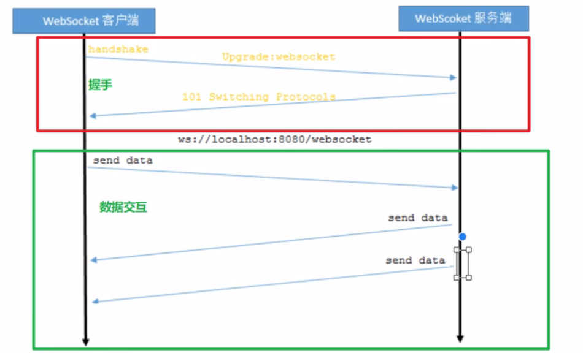

# WebSocket

​	WebSocket是一种网络通信协议。

​	WebSocket是HTML5开始提供的一种在单个TCP连接上进行全双工通讯的协议。

​	HTTP协议是一种无状态的，无连接的，单向的应用层协议。它采用了请求/响应模型。通信请求由客户端发起，服务端对请求作出应答处理。

​	这种通信模型有一个弊端：HTTP协议无法实现服务器主动向客户端发起消息。

​	这种单向请求的特点，注定了如果服务器有连续的状态变化，客户端要获知就非常麻烦。大多数Web应用程序将通过频繁的异步AJAX请求实现长轮询，轮询效率低，非常浪费资源

