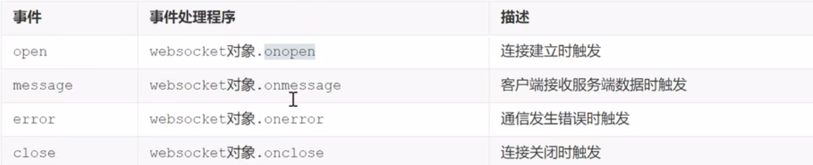
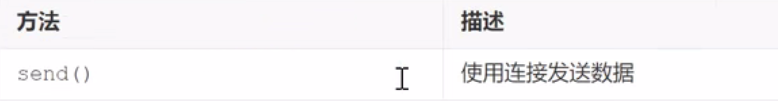
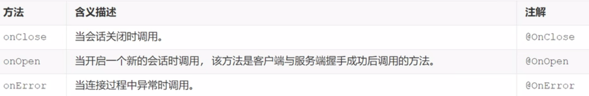

# WebSocket

​	WebSocket是一种网络通信协议。

​	WebSocket是HTML5开始提供的一种在单个TCP连接上进行全双工通讯的协议。

​	HTTP协议是一种无状态的，无连接的，单向的应用层协议。它采用了请求/响应模型。通信请求由客户端发起，服务端对请求作出应答处理。

​	这种通信模型有一个弊端：HTTP协议无法实现服务器主动向客户端发起消息。

​	这种单向请求的特点，注定了如果服务器有连续的状态变化，客户端要获知就非常麻烦。大多数Web应用程序将通过频繁的异步AJAX请求实现长轮询，轮询效率低，非常浪费资源


## WebSocket浏览器端

### WebSocket对象

​	实现websocket得web浏览器通过websocket对象公开所有必需的客户端功能（主要指HtML5的浏览器）

```js
var ws = new WebSocket(url);
```

### webSocket事件



### webSocket方法



## WebSocket服务端

​	Endpoint是一个java对象，代表WebSocket链接的一端，对于服务端，我们可以视为处理具体WebSocket消息的接口，就像Servlet与http请求一样。

可以通过两种方式定义EndPoint：

- 编程式，即继承`javax.websocket.EndPoint`并实现其方法
- 注解式，定义一个POJO，添加`@ServerEndpoint`相关注解



**服务端如何接受客户端发送的数据呢？**

​	通过为`Session`添加`MessageHandler`消息处理器来接受消息，当采用注解方式定义`EndPoint`时，我们还可以通过`@OnMessage`注解指定接受消息的方法

**服务端如何推送数据给客户端？**

​	发送消息由`RemoteEndpoint`来完成，其实例由`Session`维护，根据使用情况，可以通过`Session.getBasicRemote`获取同步消息发送的实例，然后调用其`sendXXX()`方法就可以发送消息，可以通过`Session.getAsyncRemote`获取异步消息发送实例。
