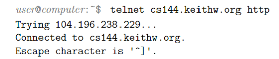
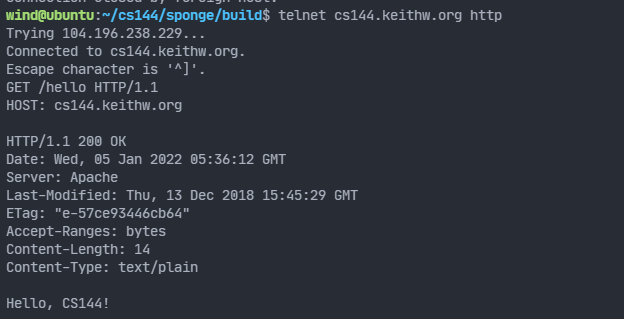
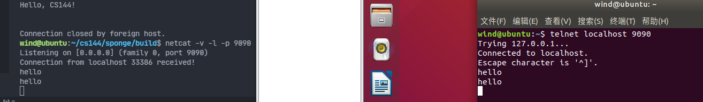
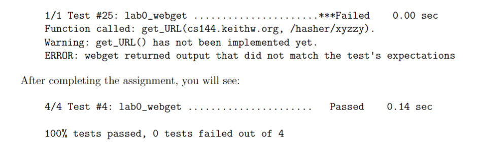

# Lab0： 网络 预热

​	欢迎来到 CS144：计算机网络简介。在这个预热中，您将在您的计算机上安装 Linux，学习如何通过 Internet 手动执行一些任务，用 C++ 编写一个通过 Internet 获取网页的小程序，并实现（在内存中）网络的关键抽象：写入者和读取者之间的可靠字节流。我们预计此热身将花费您 2 到 6 个小时来完成（未来的实验将花费您更多的时间）。关于实验室作业的三个要点：

- 在深入研究之前阅读整个文档是个好主意
- 在这个由 8 部分组成的实验作业的过程中，您将构建自己对 Internet 的重要部分的实现——路由器、网络接口和 TCP 协议（将不可靠的数据报转换为可靠的字节流），大多数周将建立在您之前完成的工作的基础上，即您在本季度的过程中逐渐建立自己的实施，并且您将在未来几周继续使用您的工作。这使得很难“跳过”检查点
- 实验室文件不是“规范”——这意味着它们不打算以单向方式使用。它们的编写更接近软件工程师从老板或客户那里获得的详细程度。我们希望您能从参加实验室会议并提出澄清问题中受益，如果您发现某些事情有歧义并且您认为答案很重要。（如果您认为某些事情可能没有完全说明，有时事实是这并不重要——您可以尝试一种或另一种方法，看看会发生什么。）

## 0 合作政策

​	编程作业必须是您自己的工作：您必须编写为编程作业提交的所有代码，除了我们作为作业的一部分提供给您的代码。请不要从 Stack Overflow、GitHub 或其他来源复制和粘贴代码。如果您根据在 Web 或其他地方找到的示例编写自己的代码，请在提交的源代码的注释中引用 URL。

​	与他人合作：您不得向其他人展示您的代码、查看其他人的代码或查看前几年的解决方案。您可以与其他学生讨论作业，但不要复制任何人的代码。如果您与其他学生讨论作业，请在您提交的源代码的评论中命名他们。请参阅课程管理讲义了解更多详情，如有任何不清楚之处，请在 Piazza 上询问。

​	Piazza：请随时在 Piazza 上提问，但请不要发布任何源代码。

## 1 环境搭建

## 2 手动联网

​	让我们开始使用网络。您将手动完成两项任务：检索网页（就像 Web 浏览器一样）和发送电子邮件消息（就像电子邮件客户端一样）。这两项任务都依赖于称为可靠双向字节流的网络抽象：您将在终端中键入一个字节序列，并且相同的字节序列最终将以相同的顺序传送到另一台计算机（服务器）上运行的程序。服务器以自己的字节序列进行响应，并将其传送回您的终端。

### 2.1 获取网页

1. 在 Web 浏览器中，访问 http://cs144.keithw.org/hello 并观察结果

2. 现在，您将手动执行浏览器所做的相同操作

    - 在您的 VM 上，运行 `telnet cs144.keithw.org http `。这告诉 telnet 程序在您的计算机和另一台计算机（名为 cs144.keithw.org）之间打开一个可靠的字节流，并在该计算机上运行一个特定的服务：“http”服务，用于超文本传输协议，被万维网使用。

        如果您的计算机已正确设置并在 Internet 上，您将看到

        

    - `GET /hello HTTP/1.1`。这告诉服务器 URL 的路径部分

    - `Host: cs144.keithw.org`。这告诉服务器 URL 的主机部分。 （http:// 和第三个斜杠之间的部分。）

    - `Connection: close `。这告诉服务器你已经完成了请求，它应该在完成回复后立即关闭连接

    - 再按一次 Enter 键： 。这会发送一个空行并告诉服务器您的 HTTP 请求已完成

    - 如果一切顺利，您将看到与浏览器看到的相同的响应，前面是 HTTP 标头，告诉浏览器如何解释响应。



### 2.2 发送给自己邮箱（需要斯坦福账号，暂不演示）

### 2.3 监听和连接

​	您已经了解了可以使用telnet进行的操作：一个客户端程序，该客户端程序与其他计算机上运行的程序建立了传出连接。 现在该尝试做一个简单的服务器了：一种等待客户端连接到它的程序。

1.在一个终端窗口中，在VM上运行netcat -v -l -p 9090。 您应该看到：

```text
user@computer:~$ netcat -v -l -p 9090
Listening on [0.0.0.0] (family 0, port 9090)
```

2.使netcat运行。 在另一个终端窗口中，运行telnet localhost 9090（也在您的VM上）。

3.如果一切顺利，则netcat将打印类似“收到来自localhost 53500的连接！”的信息。

4.现在尝试在终端窗口中输入-netcat（服务器）或telnet（客户端）。

请注意，您在一个窗口中键入的任何内容都会显示在另一个窗口中，反之亦然。

您必须点击才能传输字节。

5.在netcat窗口中，通过键入ctrl -C退出程序。 请注意，telnet程序也会立即退出。



## 3 使用 OS 流套接字编写网络程序

​	在此热身实验的下一部分中，您将编写一个简短的程序，该程序通过Internet来获取网页。 您将利用Linux内核和大多数其他操作系统提供的功能：在两个程序之间创建可靠的双向有序字节流的能力，一个程序在您的计算机上运行，另一个程序在另一台计算机上运行。 Internet（例如，Web服务器，例如Apache或Nginx，或netcat程序）。

​	**此功能称为流套接字。 对于您的程序和Web服务器，套接字看起来像一个普通的文件描述符（类似于磁盘上的文件，或者类似于stdin或stdout I / O流）。 当连接两个流套接字时，写入一个套接字的任何字节最终将以相同的顺序从另一台计算机上的另一个套接字中输出**。

​	但是，实际上，互联网不提供可靠的字节流服务。 相反，Internet真正唯一要做的就是尽其最大的努力将称为**Internet数据报**的短数据传递到目的地。 每个数据报都包含一些**元数据（头部）**，这些元数据指定了诸如源地址和目标地址（它来自哪台计算机，以及它指向哪台计算机）之类的内容，以及一些要传递到目标的有效载荷数据（最多约1500字节）。 电脑。

​	尽管网络尝试传递每个数据报，但实际上，数据报可能会（1）丢失，（2）乱序发送，（3）内容更改后传递，甚至（4）重复并传递不止一次。 通常，连接两端的操作系统都会将“尽力而为数据报”（Internet提供的抽象）转换为“**可靠的字节流**”（应用程序通常需要的抽象）。

​	两台计算机必须合作，以确保流中的每个字节最终在适当的位置最终传递到另一侧的流套接字。 他们还必须告诉对方他们准备从另一台计算机接受多少数据，并确保发送的数据不超过另一方愿意接受的数据。 所有这些操作都是通过1981年制定的协议达成的，该协议称为传输控制协议或TCP。

​	在本实验中，您将仅使用操作系统对传输控制协议的先前支持。 **您将编写一个名为“ webget”的程序，该程序将创建一个TCP流套接字，连接到Web服务器并获取一个页面**，就像在本实验前面所做的那样。 在以后的实验中，您将自己实现传输控制协议，以从不太可靠的数据报中创建可靠的字节流，从而实现此抽象的另一面。	

### 3.1 让我们开始吧-获取并构建入门代码

1.实验室作业将使用称为“海绵”的入门级代码库。 在您的VM上，运行git clone [https://github.com/cs144/sponge](https://link.zhihu.com/?target=https%3A//github.com/cs144/sponge)来获取实验室的源代码。

2.可选：随时将您的存储库备份到私有GitHub / GitLab / Bitbucket存储库（例如，使用[https://stackoverflow.com/questions/10065526/github-how-to-make-a-fork-](https://link.zhihu.com/?target=https%3A//stackoverflow.com/questions/10065526/github-how-to-make-a-fork-) -of-public-repository-private），但请绝对确保您的工作保持私有状态。

3.进入Lab 0目录：cd海绵

4.创建一个目录以编译实验室软件：mkdir build

5.输入构建目录：cd build

6.设置构建系统：cmake ..

7.编译源代码：make（可以运行make -j4以使用四个处理器）。

### 3.2 现代C ++：大部分是安全的，但仍然是快速和低级

实验室作业将以当代的C ++风格完成，该风格使用最新（2011年）的功能来尽可能安全地进行编程。 这可能与过去要求您编写C ++的方式不同。 有关此样式的参考，请参见C ++核心准则（[http://isocpp.github.io/CppCoreGuidelines/CppCoreGuidelines](https://link.zhihu.com/?target=http%3A//isocpp.github.io/CppCoreGuidelines/CppCoreGuidelines)）。

基本思想是确保将每个对象设计为具有尽可能小的公共接口，进行大量内部安全检查并且很难使用不当，并且知道如何自行清理。 我们希望避免“成对”的操作（例如malloc / free或new / delete），这可能导致该对的后半部分不发生（例如，如果函数提前返回或引发异常）。 相反，**操作在对象的构造函数中发生，而相反的操作在析构函数中发生**。 这种样式称为“资源获取是初始化”或RAII。

特别是，我们希望您：

- 使用位于[https://en.cppreference.com](https://link.zhihu.com/?target=https%3A//en.cppreference.com)的语言文档作为资源。

- 切勿使用malloc()或free()。

- 切勿使用new或delete

- 基本上不要使用原始指针（*），仅在必要时使用“智能”指针（(unique_ptr或shared_ptr）。 （您将不需要在CS144中使用它们。）

- 避免使用模板，线程，锁和虚函数。 （您将不需要在CS144中使用它们。）

- 避免使用C样式的字符串（char * str）或字符串函数（strlen（），strcpy（））。 这些都是容易出错的。 请改用std :: string。

- 切勿使用C样式的强制类型转换（例如（FILE *）x）。 如有必要，请使用C ++静态转换（在CS144中通常不需要这样做）。

- 最好使用const引用传递函数参数（例如：const Address＆address）。

- 使每个变量为const，除非需要对其进行突变。

- 使每个方法都为const，除非它需要改变对象。

- 避免使用全局变量，并给每个变量尽可能小的范围。

- 上交作业之前，请运行make format规范编码风格。

### 3.3 阅读Sponge文档

为了支持这种编程风格，Sponge的类将操作系统功能（可以从C调用）包装为“现代” C ++。

1. 使用Web浏览器，将文档阅读到[https://cs144.github.io/doc/lab0](https://link.zhihu.com/?target=https%3A//cs144.github.io/doc/lab0)上的入门代码。

2. 特别注意FileDescriptor，Socket，TCPSocket和地址类。 （请注意，套接字是FileDescriptor的一种，而TCPSocket是套接字的一种。）

3. 现在，在libsponge / util目录中找到并读取描述这些类的接口的头文件：文件`descriptor.hh`，`socket.hh`和`address.hh`。

### 3.4 编写Webget

​	现在该实现webget了，这是一个==使用操作系统的TCP支持和流套接字抽象在Internet上提取网页==的程序，就像您在本实验之前所进行的操作一样。

1. 从构建目录中，在文本编辑器或IDE中打开文件../apps/[http://webget.cc](https://link.zhihu.com/?target=http%3A//webget.cc)。

2. 在“获取URL”功能中，找到以“ //您的代码在这里”开头的注释。

3. 使用您先前使用的HTTP（Web）请求的格式，按照此文件中所述实现简单的Web客户端。 使用TCPSocket和Address类。

4. 提示：

    - 请注意，在HTTP中，每行必须以“ \ r \ n”结尾（仅使用“ \ n”或endl是不够的）。

    - 将请求写入套接字后，请结束输出字节流（从套接字到服务器套接字的字节流），以告知服务器已完成请求。 您可以通过调用关机来完成此操作带SHUT WR参数的TCPSocket的方法。 作为响应，服务器将向您发送一个答复，然后结束其自己的传出字节流（从服务器的套接字到您的套接字的一个）。 您会发现传入的字节流已结束，因为当您读取了来自服务器的整个字节流时，套接字将达到“ EOF”（文件末尾）。 （如果您不关闭传出字节流，则服务器将等待一段时间，以便您发送其他请求，也不会结束其传出字节流。）

    - 确保读取并打印服务器的所有输出，直到套接字达到“ EOF”（文件末尾）为止，单次调用读取是不够的。

    - 我们希望您需要编写大约十行代码。

5. 通过运行make来编译程序。 如果看到错误消息，则需要对其进行修复，然后再继续。

6. 通过运行./apps/webget [http://cs144.keithw.org](https://link.zhihu.com/?target=http%3A//cs144.keithw.org) / hello来测试您的程序。 这与您在[http://cs144.keithw.org/hello](https://link.zhihu.com/?target=http%3A//cs144.keithw.org/hello)中以网页浏览器？ 与2.1节的结果相比如何？ 随时尝试-使用您喜欢的任何http URL进行测试！

7. 如果它似乎正常运行，请运行make check webget来运行自动化测试。 在实现get URL函数之前，您应该期望看到以下内容：

    

8. 评分员将使用不同于make check运行的主机名和路径来运行您的webget程序，因此请确保它不仅与make check使用的主机名和路径一起使用。

```cpp
// sponge>apps>webget.cc
void get_URL(const string &host, const string &path) {
    // Your code here.

    // You will need to connect to the "http" service on
    // the computer whose name is in the "host" string,
    // then request the URL path given in the "path" string.

    // Then you'll need to print out everything the server sends back,
    // (not just one call to read() -- everything) until you reach
    // the "eof" (end of file).

//    cerr << "Function called: get_URL(" << host << ", " << path << ").\n";
//    cerr << "Warning: get_URL() has not been implemented yet.\n";
    TCPSocket socket;
    socket.connect(Address(host, "http"));
    string info =   "GET " + path + " HTTP/1.1\r\n" +
                  "Host: " + host + "\r\n" +
                  "Connection: close\r\n\r\n";
    socket.write(info);
    socket.shutdown(SHUT_WR); // 不太确定与Connection: close作用是否重复
    for (auto recvd = socket.read(); !socket.eof(); recvd = socket.read())
        cout << recvd;
    socket.close();
}
```

## 4 内存中可靠的字节流

到目前为止，您已经了解了可靠的有序字节流的抽象如何在Internet上进行通信时有用，即使Internet本身仅提供“尽力而为”（不可靠）数据报的服务。

为了完成本周的实验，您将在一台计算机的内存中实现一个提供此抽象的对象。 （您可能在CS 110中做了类似的操作。）字节

写入在“输入”侧，并且可以以相同的顺序从“输出”侧读取。 字节流是有限的：写入器可以结束输入，然后不能再写入任何字节。 当阅读器读取到流的末尾时，它将到达“ EOF”（文件末尾），无法再读取更多字节。

您的字节流也将受到流控制：它具有特定的容量进行初始化：它愿意存储在自己的内存中的最大字节数。 字节流将限制写入者可以写入字符串的时间，以确保该字节流不会超出其存储容量。 当读取器读取字节并将其从流中清空时，允许写入器写入更多字节。

您的字节流仅用于单个线程中-您不必担心并发的编写器/读取器，锁定或竞争条件。

编写者的界面如下所示：

```c++
// Write a string of bytes into the stream. Write as many
// as will fit, and return the number of bytes written.
size_t write(const std::string &data);
// Returns the number of additional bytes that the stream has space for
size_t remaining_capacity() const;
// Signal that the byte stream has reached its ending
void end_input();
// Indicate that the stream suffered an error
void set_error();
```

这是读者的界面：

```c++
// Peek at next "len" bytes of the stream
std::string peek_output(const size_t len) const;
// Remove ``len'' bytes from the buffer
void pop_output(const size_t len);
// Read (i.e., copy and then pop) the next "len" bytes of the stream
std::string read(const size_t len);
bool input_ended() const; // `true` if the stream input has ended
bool eof() const; // `true` if the output has reached the ending
bool error() const; // `true` if the stream has suffered an error
size_t buffer_size() const; // the maximum amount that can currently be peeked/read
bool buffer_empty() const; // `true` if the buffer is empty
size_t bytes_written() const; // Total number of bytes written
size_t bytes_read() const; // Total number of bytes popped
```

​	请打开libsponge / byte stream.hh和libsponge / byte [http://stream.cc](https://link.zhihu.com/?target=http%3A//stream.cc)文件，并实现提供此接口的对象。 在开发字节流实现时，可以使用make check lab0运行自动化测试。

`byte_stream.cc`

```cpp
#include "byte_stream.hh"

#include <algorithm>

// Dummy implementation of a flow-controlled in-memory byte stream.

// For Lab 0, please replace with a real implementation that passes the
// automated checks run by `make check_lab0`.

// You will need to add private members to the class declaration in `byte_stream.hh`

template <typename... Targs>
void DUMMY_CODE(Targs &&... /* unused */) {}

using namespace std;

ByteStream::ByteStream(const size_t capa)
    : buffer(), capacity(capa), end_write(false), end_read(false), written_bytes(0), read_bytes(0) {}

size_t ByteStream::write(const string &data) {
    size_t canWrite = capacity - buffer.size();
    size_t realWrite = min(canWrite, data.length());
    for (size_t i = 0; i < realWrite; i++) {
        buffer.push_back(data[i]);
    }
    written_bytes += realWrite;
    return realWrite;
}

//! \param[in] len bytes will be copied from the output side of the buffer
string ByteStream::peek_output(const size_t len) const {
    size_t canPeek = min(len, buffer.size());
    string out = "";
    for (size_t i = 0; i < canPeek; i++) {
        out += buffer[i];
    }
    return out;
}

//! \param[in] len bytes will be removed from the output side of the buffer
void ByteStream::pop_output(const size_t len) {
    if (len > buffer.size()) {
        set_error();
        return;
    }
    for (size_t i = 0; i < len; i++) {
        buffer.pop_front();
    }
    read_bytes += len;
}

//! Read (i.e., copy and then pop) the next "len" bytes of the stream
//! \param[in] len bytes will be popped and returned
//! \returns a string
std::string ByteStream::read(const size_t len) {
    string out = "";
    if (len > buffer.size()) {
        set_error();
        return out;
    }
    for (size_t i = 0; i < len; i++) {
        out += buffer.front();
        buffer.pop_front();
    }
    read_bytes += len;
    return out;
}

void ByteStream::end_input() { end_write = true; }

bool ByteStream::input_ended() const { return end_write; }

size_t ByteStream::buffer_size() const { return buffer.size(); }

bool ByteStream::buffer_empty() const { return buffer.empty(); }

bool ByteStream::eof() const { return buffer.empty() && end_write; }

size_t ByteStream::bytes_written() const { return written_bytes; }

size_t ByteStream::bytes_read() const { return read_bytes; }

size_t ByteStream::remaining_capacity() const { return capacity - buffer.size(); }
```

`byte_stream.hh`

```cpp
#ifndef SPONGE_LIBSPONGE_BYTE_STREAM_HH
#define SPONGE_LIBSPONGE_BYTE_STREAM_HH

#include <deque>
#include <string>
//! \brief An in-order byte stream.

//! Bytes are written on the "input" side and read from the "output"
//! side.  The byte stream is finite: the writer can end the input,
//! and then no more bytes can be written.
class ByteStream {
  private:
    // Your code here -- add private members as necessary.

    // Hint: This doesn't need to be a sophisticated data structure at
    // all, but if any of your tests are taking longer than a second,
    // that's a sign that you probably want to keep exploring
    // different approaches.
    std::deque<char> buffer;
    size_t capacity;
    bool end_write;
    bool end_read;
    size_t written_bytes;
    size_t read_bytes;
    bool _error{};  //!< Flag indicating that the stream suffered an error.

  public:
    //! Construct a stream with room for `capacity` bytes.
    ByteStream(const size_t capacity);

    //! \name "Input" interface for the writer
    //!@{

    //! Write a string of bytes into the stream. Write as many
    //! as will fit, and return how many were written.
    //! \returns the number of bytes accepted into the stream
    size_t write(const std::string &data);

    //! \returns the number of additional bytes that the stream has space for
    size_t remaining_capacity() const;

    //! Signal that the byte stream has reached its ending
    void end_input();

    //! Indicate that the stream suffered an error.
    void set_error() { _error = true; }
    //!@}

    //! \name "Output" interface for the reader
    //!@{

    //! Peek at next "len" bytes of the stream
    //! \returns a string
    std::string peek_output(const size_t len) const;

    //! Remove bytes from the buffer
    void pop_output(const size_t len);

    //! Read (i.e., copy and then pop) the next "len" bytes of the stream
    //! \returns a string
    std::string read(const size_t len);

    //! \returns `true` if the stream input has ended
    bool input_ended() const;

    //! \returns `true` if the stream has suffered an error
    bool error() const { return _error; }

    //! \returns the maximum amount that can currently be read from the stream
    size_t buffer_size() const;

    //! \returns `true` if the buffer is empty
    bool buffer_empty() const;

    //! \returns `true` if the output has reached the ending
    bool eof() const;
    //!@}

    //! \name General accounting
    //!@{

    //! Total number of bytes written
    size_t bytes_written() const;

    //! Total number of bytes popped
    size_t bytes_read() const;
    //!@}
};

#endif  // SPONGE_LIBSPONGE_BYTE_STREAM_HH
```

