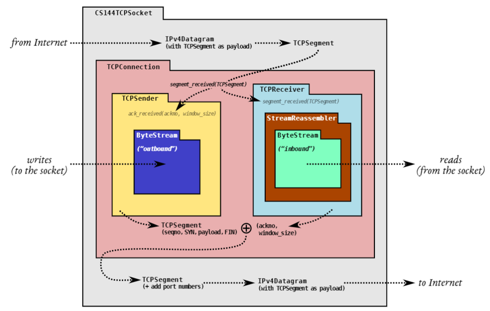
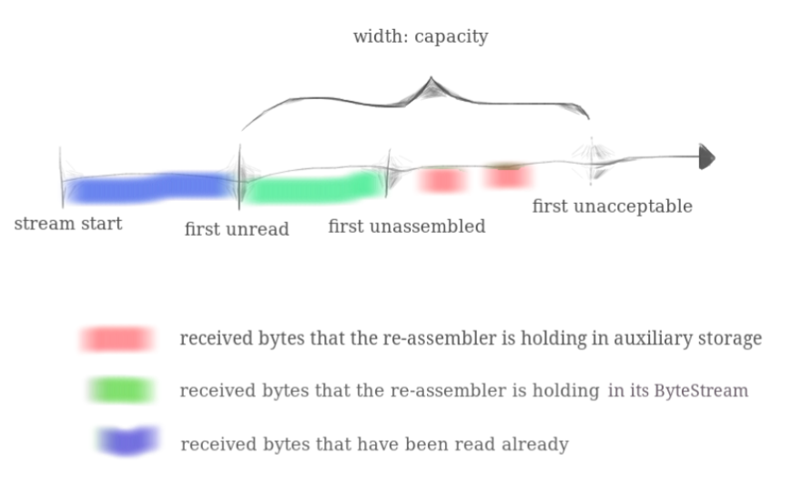

# Lab1 将子串拼接成字节流

## 1. 概貌

建议：在实施之前阅读整个实验室文档

​	在实验 0 中，您使用 Internet 流套接字从网站获取信息并发送电子邮件消息，并使用 Linux 的传输控制协议 (TCP) 的内置实现。 TCP 实现设法产生了一对可靠的有序字节流（一个从你到服务器，一个在相反的方向），即使底层网络只提供“尽力而为”的数据报。我们的意思是：可以丢失、重新排序、更改或复制的短数据包。您还自己在一台计算机的内存中实现了字节流抽象。在接下来的四个星期中，您将实现 TCP，以在由不可靠的数据报网络分隔的一对计算机之间提供字节流抽象。



​																							图 1 TCP 实现中模块和数据流的排列。

​	`ByteStream `是 Lab 0中的。TCP 的工作是通过不可靠的数据报网络传送两个 `ByteStreams`（每个方向一个），以便写入连接一侧套接字的字节作为可以在对等端读取的字节出现，反之亦然。实验 1 是 `StreamReassembler`，在实验 2、3 和 4 中，您将实现 `TCPReceiver`，`TCPSender`，然后是 `TCPConnection `以将它们连接在一起。

> 我为什么要这样做？
>
> ​	在不同的不太可靠的服务之上提供服务或抽象解释了网络中的许多有趣问题。在过去的 40 年里，研究人员和从业者已经找到了如何通过互联网传达各种事物——消息和电子邮件、超链接文档、搜索引擎、声音和视频、虚拟世界、协作文件共享、数字货币。TCP自身的作用，即利用不可靠的数据报提供一对可靠的字节流，是这方面的典型例子之一。一个合理的观点认为 TCP 实现被认为是地球上使用最广泛的非平凡计算机程序。

​	实验作业将要求您以模块化方式构建 TCP 实现.。还记得你刚刚在 Lab 0 中实现的 ByteStream 吗？在接下来的四个实验中，你最终将在网络上传达其中的两个：一个是 "出站 "ByteStream，用于本地应用程序写入套接字的数据，你的TCP将把这些数据发送给对等体；另一个是 "入站 "ByteStream，用于来自对等体的数据，将被本地应用程序读取。图 1 显示了这些部分是如何组合在一起的。

1. 在实验1中，你将实现一个流重组器--一个将字节流的小片段（称为子串，或段）按正确的顺序缝合成连续的字节流的模块。
2. 在实验室2中，你将实现TCP中处理入站字节流的部分：`TCPReceiver`。这涉及到考虑TCP将如何表示每个字节在数据流中的位置，即所谓的 "序列号"。`TCPReceiver`负责告诉发送方(a)它已经成功地组装了多少入站字节流（这被称为 "确认"）和(b)发送方现在允许再发送多少字节（"流量控制"）。
3. 在实验3中，你将实现TCP中处理出站字节流的部分：TCPSender。当发送方怀疑其发送的片段在途中丢失，并且从未到达接收方时，发送方应如何应对？它应该在什么时候再次尝试并重新发送一个丢失的片段？
4. 在第4个实验中，你将结合前几个实验的工作，创建一个有效的TCP实现：一个`TCPConnection`，其中包含一个`TCPSender`和`TCPReceiver`。你将用它来与世界各地的真实服务器对话。

## 2. 入门

​	您的 TCP 实现将使用您在实验室 0 中使用的相同 Sponge 库，以及额外的类和测试。首先：

1. 确保您已将所有解决方案提交给 Lab 0。请不要修改 libsponge 目录或 webget.cc 顶层之外的任何文件。否则，您可能无法合并 Lab 1 入门代码
2. 在实验室作业的存储库中，运行 git fetch 以检索最新版本的实验室作业。
3. 通过运行 `git merge origin/lab1-startercode `下载实验 1 的入门代码
4. 在您的构建目录中，编译源代码：make
5. 在构建目录外，打开并开始编辑`writeups/lab1.md`文件。这是你的实验报告的模板，将包括在你提交的报告中

## 3. 将子串按顺序排列

​	在本实验和下一个实验中，您将实现一个 TCP 接收器：该模块接收数据报并将它们转换为可靠的字节流，以便应用程序从套接字读取——就像您的 webget 程序从 Web 服务器读取字节流一样。

​	TCP 发送方将其字节流分成短段（每个子串不超过约 1,460 字节），以便每个段都适合数据报。但是网络可能会重新排序这些数据报，或者丢弃它们，或者不止一次地传送它们。接收器必须将这些段重新组装成它们开始时的连续字节流。

​	在本实验中，您将编写负责重新组装的数据结构：**StreamReassembler**。它将接收子字符串，由一串字节组成，以及该字符串在较大流中的第一个字节的索引。流的每个字节都有自己唯一的索引，从零开始向上计数。**StreamReassembler**将拥有一个 ByteStream 用于输出：一旦重组器知道流的下一个字节，它就会将它写入 ByteStream。所有者可以随时访问和读取 ByteStream。

​	这是界面的样子：

```cpp
// Construct a `StreamReassembler` that will store up to `capacity` bytes.
StreamReassembler(const size_t capacity);
// Receive a substring and write any newly contiguous bytes into the stream,
// while staying within the memory limits of the `capacity`. Bytes that would
// exceed the capacity are silently discarded.
//
// `data`: the substring
// `index` indicates the index (place in sequence) of the first byte in `data`
// `eof`: the last byte of this substring will be the last byte in the entire stream
void push_substring(const string &data, const uint64_t index, const bool eof);
// Access the reassembled ByteStream (your code from Lab 0)
ByteStream &stream_out();
// The number of bytes in the substrings stored but not yet reassembled
size_t unassembled_bytes() const;
// Is the internal state empty (other than the output stream)?
bool empty() const;
```

> 我为什么要这样做？
>
> ​	TCP 对重新排序和重复的鲁棒性来自其将字节流的任意摘录拼接回原始流的能力。在离散的可测试模块中实现这一点将使处理传入的段变得更加容易

​	重组器的完整（公共）接口由流 `reassembler.hh` 标头中的 `StreamReassembler `类描述。你的任务是实现这个类。您可以向 `StreamReassembler `类添加您想要的任何私有成员和成员函数，但不能更改其公共接口。

### 3.1 什么是“容量”？

​	您的 push substring 方法将忽略会导致 StreamReassembler 超出其“容量”的字符串的任何部分：内存使用限制，即允许存储的最大字节数。这可以防止重组器使用无限量的内存，无论 TCP 发送方决定做什么。我们在下图中对此进行了说明。 “容量”是两者的上限：

	1. 重组后的 `ByteStream`中的字节数（下图绿色显示）
	1. “未组装”子字符串可以使用的最大字节数（以红色显示）



​	当您实现 `StreamReassembler `并完成测试时，您可能会发现这张图片很有用 - “正确”的行为并不总是很自然

### 3.2 FAQs

- 整个流中第一个字节的索引是什么？

    0

- 我的实施应该有多高效？

    ​	请不要把这看作是对建立一个空间或时间效率极低的数据结构的挑战，这个数据结构将是你的TCP实现的基础。一个粗略的期望是，每个新的实验室1的测试可以在半秒内完成。

- 如何处理不一致的子串？

    ​	你可以假设它们不存在。也就是说，你可以假设有一个唯一的底层字节流，而所有的子串都是它的（精确）切片。

- 我可以使用什么？

    ​	你可以使用你认为有帮助的标准库的任何部分。特别是，我们希望你至少使用一个数据结构

- 什么时候应该将字节写入流？

    ​	尽快。一个字节不应该出现在流中的唯一情况是，当它前面有一个字节尚未被“推送”时.。

- 提供给 push substring() 函数的子串可能重叠？

    ​	是的

- 我是否需要将私有成员添加到 StreamReassembler？

    ​	是的。子字符串可能以任何顺序到达，因此您的数据结构必须“记住”子字符串，直到它们准备好放入流中——也就是说，直到它们之前的所有索引都被写入。

- 我们重新组装的数据结构可以存储重叠的子串吗？

    ​	不可以。可以实现存储重叠子字符串的“接口正确”重组器。但是允许重新组装器这样做会破坏“容量”作为内存限制的概念。我们将在评分时将重叠子串的存储视为样式违规。

## 实验步骤

弄清楚几个概念

Q1：`unassembled bytes`是什么？

​	是还未传递给但是要传递给`ByteStream`的存储在`StreamReassembler`的字符数，其中如果不同的字符串如果有重叠，重叠部分只能算一次

​	举个例子，假设我们有两个字符串，一个是 `Happy`，它的 index 是 0，另一个是 `py anniversary`，它的 index 是 3，那么可想而知，整个算下来应该是 `Happy anniversary`，此时 `unassembled bytes` 值为17。

​	再举个例子，假设我们还是有两个字符串，一个是 `Ha`，它的 index 是 0，另一个是 `y anniversary`, 它的 index 是 3，此时的 `unassembled bytes` 值为 15，因为整个算下来是 `Ha??y anniversary`，我们不知道也没有存 `??` 位置的字符，所以这两个位置是不计数的。

Q2：`capacity`是对什么容量的限制？

​	`StreamReassembler` 里储存的 index 最大的字符的 index 减去在 `ByteStream` 里还没有被读取的 index 最小的字符的 index 的上限加一


```cpp
#include "stream_reassembler.hh"

// Dummy implementation of a stream reassembler.

// For Lab 1, please replace with a real implementation that passes the
// automated checks run by `make check_lab1`.

// You will need to add private members to the class declaration in `stream_reassembler.hh`

template <typename... Targs>
void DUMMY_CODE(Targs &&... /* unused */) {}

using namespace std;

StreamReassembler::StreamReassembler(const size_t capacity) : _output(capacity),_capacity(capacity),bytes({}),state({}),unassembled_bytes_cnt(0),input_end_index(-1),last_read_index(0) {
    for (size_t i = 0; i < capacity; i ++) {
        bytes.push_back(0);
        state.push_back(false);
    }
}

//! \details This function accepts a substring (aka a segment) of bytes,
//! possibly out-of-order, from the logical stream, and assembles any newly
//! contiguous substrings and writes them into the output stream in order.
/*

n1 已经读出的字节数
n2 已经写入的字节数

StreamReasembler: 
    relative    idx 0-----------------------------------capacity
    absolute    idx n1----------------------------------n1 + capacity
_output:
                    n1 ----------------------n2
data:
    realative   idx index-n1 ---------------------index-n1+data.length
    absolute    idx index -----------------------index + data.length

注意：n1，n2，index在本lab都是全局（绝对）的，也就是不是在重组器中的坐标，它们都是递增的
n1,n2与index的不同是，n1,n2是已经读出（或写入）的字节数，index是一个子串插入的第一个字符在TCP流（绝对）的位置
*/
void StreamReassembler::push_substring(const string &data, const size_t index, const bool eof) {
    DUMMY_CODE(data, index, eof);

    size_t i, j;
    size_t len = data.length() + index;
    size_t n1 = _output.bytes_read(); // 读出的字节数
    size_t n2 = _output.bytes_written(); // 写入的字节数
    len = (len > n1 + _capacity) ? n1 + _capacity : len; // 可以写入的字节数（不是数量，是右边界，绝对）

    for (size_t k = last_read_index; k < n1; k ++) { // 弹出已经读出的字节数
        bytes.pop_front();
        bytes.push_back(0);
        state.pop_front();
        state.push_back(false);
    }
    last_read_index = n1;   // last_read_index是上一次调用已经被读的索引，这里修改

    if (index <= n2) {  // 插入子串位置小于写入字节数，也就是即将插入的子串会覆盖前面还未读出的字节，出现了重叠情况 例如 hello world写进去，下次有world hhhh
        std::string s = "";
        // n1----------index---------- n2
        for (i = n2, j = n2 - n1; i < len; i ++, j ++) { // n2-n1是为了从重叠部分的最后开始写，相对
            bytes[j] = data[i - index]; // i - index是也重叠部分的 也是就 hhhh
            s += bytes[j];
            if (state[j]) unassembled_bytes_cnt --; // 如果该位置有字节写入，减少未重组数量，因为这些字节即将读出去
            state[j] = false;   // false表示这里没有使用过
        }
        for (;i < _capacity + n1 && state[j]; j ++, i ++) { // 尽可能多的将字节写入
            s += bytes[j];
            unassembled_bytes_cnt --;
            state[j] = false;
        }
        _output.write(s);
        if (eof) input_end_index = index + data.length();
        if (i == input_end_index) _output.end_input();
    } else {    // 这些是新写入的
        for (i = index, j = index - n1; i < len; i ++, j ++) {  // index - n1相对位置，已经读出去的字节数开始
            bytes[j] = data[i - index]; // 
            if (!state[j]) { // 如果是未使用的字节
                state[j] = true;
                unassembled_bytes_cnt ++; // 未重组字节增加
            }
        }
        if (eof) input_end_index = index + data.length();
    }
}

size_t StreamReassembler::unassembled_bytes() const { return unassembled_bytes_cnt; }

// 未重组字节数为0，就说明已经空了
bool StreamReassembler::empty() const { return unassembled_bytes_cnt == 0; }

```


```cpp
class StreamReassembler {
  private:
    // Your code here -- add private members as necessary.
    ByteStream _output;  //!< The reassembled in-order byte stream
    size_t _capacity;    //!< The maximum number of bytes
    std::deque<char> bytes;
    std::deque<bool> state;
    size_t unassembled_bytes_cnt;
    size_t input_end_index;
    size_t last_read_index;
}
```


