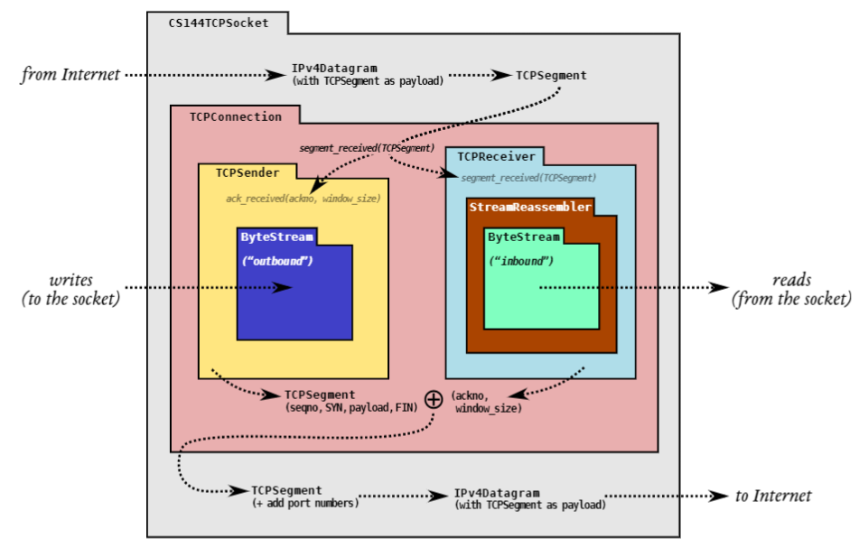
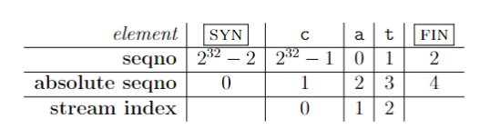
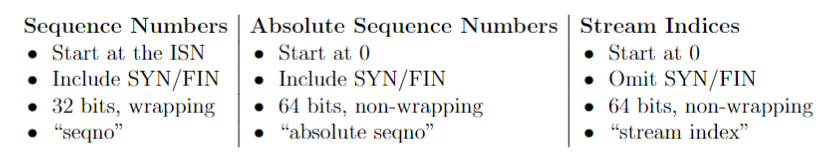
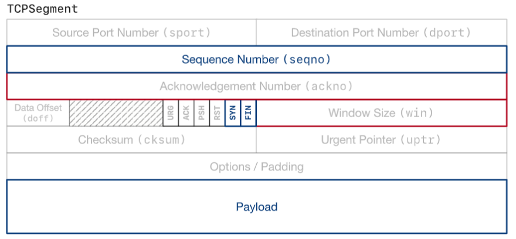
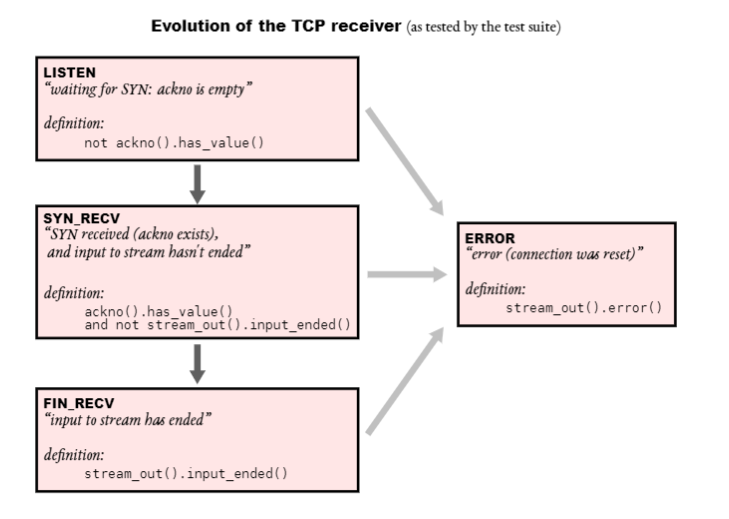
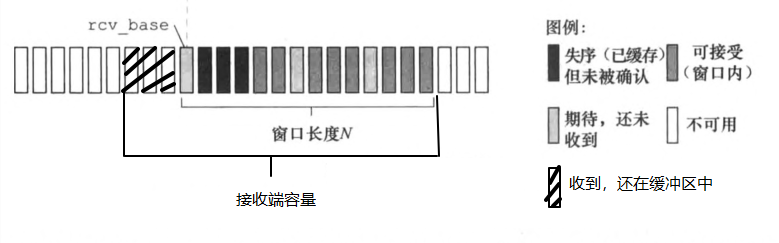

# Lab2：TCP接受方

## 1. 概述

​	在 Lab 0 中，您实现了流控字节流 (`ByteStream`) 的抽象。在实验 1 中，您创建了一个 `StreamReassembler`，它接受一系列子字符串，所有子字符串都摘自同一个字节流，然后将它们重新组装回原始流。

​	这些模块将证明在您的 TCP 实现中很有用，但它们中没有任何内容特定于传输控制协议的细节。现在改变了。在实验 2 中，您将实现 TCPReceiver，它是处理传入字节流的 TCP 实现的一部分。`TCPReceiver` 在传入的 TCP 段（通过 `Internet `传输的数据报的有效载荷）和传入的字节流之间进行转换。

​	这是上次实验室的图表。 `TCPReceiver` 从 `Internet` 接收段（通过 `segment received() `方法）并将它们转换为对 `StreamReassembler `的调用，后者最终写入传入的 `ByteStream`。应用程序从这个 `ByteStream `中读取，就像你在实验室 0 中通过从 `TCPSocket` 读取一样



​	除了写入传入的流之外，TCPReceiver 还负责告诉发送者两件事：

-  第一个未组装的 "字节的索引，它被称为 "确认号 "或 "ackno"。这是接收方需要从发送方获得的第一个字节。
- 第一个未组装的 索引与 "第一个不可接受的 "索引之间的距离。这称为“窗口大小”。

​	**ackno**和**窗口大小**一起描述了接收方的窗口：TCP发送方被允许发送的索引范围。使用窗口，接收方可以控制传入数据的流量，使发送方限制其发送的数量，直到接收方准备好接受更多的数据。我们有时将ackno称为窗口的 "左边缘"（TCPReceiver感兴趣的最小索引），将ackno+窗口大小称为 "右边缘"（刚好超过TCPReceiver感兴趣的最大索引）。

​	当你编写`StreamReassembler`和`ByteStream`时，你已经完成了实现`TCPReceiver`的大部分算法工作。这个实验室是关于将这些一般的课程与TCP的细节连接起来。最难的部分是考虑**TCP如何表示每个字节在数据流中的位置**，即 "序列号"。

## 2. 开始

​	你对`TCPReceiver`的实现将使用与你在实验室0和1中使用的相同的Sponge库，并增加了类和测试。要开始使用

1. 请确保你已经把所有的解决方案提交给实验室1。请不要修改 `libsponge `目录顶层以外的任何文件，或 `webget.cc`。否则，你在合并 Lab 1 的启动代码时可能会遇到麻烦。
2. 当你在实验作业的仓库里，运行`git fetch`来检索实验作业的最新版本。
3. 通过运行`git merge origin/lab2-startercode`下载实验室2的启动代码。
4. 在您的构建目录中，编译源代码：`make`

## 3. Lab2：TCP Receiver

​	TCP是一个协议，通过不可靠的数据报可靠地传递一对流量控制的字节流（每个方向一个）。两方参与TCP连接，每一方同时充当 "发送方"（自己发出的字节流）和 "接收方"（传入的字节流）。这两方被称为连接的 "端点"，或 "对等体"。本周，你将实现TCP的 "接收器 "部分，负责接收TCP段（实际的数据报有效载荷），重新组装字节流（包括它的结束，当它发生时），并确定应该送回发送方的确认和流量控制信号。

> 我为什么要这样做？
>
> ​	这些信号对TCP在不可靠的数据报网络上提供流量控制、可靠的字节流服务的能力至关重要。在TCP中，确认意味着 "接收方需要的下一个字节的索引是什么，以便它可以重新组装更多的ByteStream"？这告诉发送方它需要发送或重新发送哪些字节。流量控制的意思是，"接收器对什么范围的指数感兴趣并愿意接收？" (通常是其剩余容量的一个函数）。这告诉发送方允许发送多少信息

### 3.1 在 64 位索引(indexes)和 32 位序列号(seqnos)之间转换

​	作为热身，我们需要实现TCP表示索引的方式。上周你创建了一个`StreamReassembler`，它可以重新组装子串，其中**每个单独的字节都有一个64位的流索引，而流中的第一个字节的索引始终为`0`**。一个64位的索引足够大，我们可以把它当作永远不会溢出的。然而，在 TCP 标头中，空间是宝贵的，流中每个字节的索引不是用 64 位索引表示，而是用 32 位“序列号”或“`seqno`”表示。这增加了三个复杂性：

1. **你的实现需要为32位的整数规划**。TCP中的流可以是任意长的--通过TCP发送的`ByteStream`的长度没有限制。但$2^{32}$字节只有4GB，并不算大。一旦一个32位的序列号数到$2^{32}-1$，流中的下一个字节的序列号将是0。
2. **TCP 序列号以随机值开始**。为了提高安全性，避免被属于同一端点之间早期连接的旧段所混淆，TCP试图确保序列号不能被猜到，并且不太可能重复。所以一个流的序列号并不是从零开始的。流中的第一个序列号是一个随机的32位数字，称为初始序列号（ISN）。这是代表SYN（流的开始）的序列号。其余的序列号在这之后表现正常：第一个字节的数据将有ISN+1（mod $2^{32}$）的序列号，第二个字节将有ISN+2（mod $2^{32}$），等等。
3. **逻辑上的开始和结束各占一个序列号**。除了确保接收所有字节的数据外，TCP还确保可靠地接收流的开始和结束。因此，在TCP中，SYN（流的开始）和FIN（流的结束）控制标志被分配了序列号。每一个都占用一个序列号。(SYN标志所占用的序列号是ISN。）流中的每个字节的数据也占用一个序列号。请记住，SYN和FIN不是流本身的一部分，也不是 "字节"--它们代表了字节流本身的开始和结束。

​	这些序列号（`seqnos`）在每个TCP段的头中传输。（而且，同样，有两个数据流，每个方向都有一个。每个流都有独立的序列号和不同的随机ISN。）。谈论 "绝对序列号 "的概念（它总是从零开始，并且不被包裹）和 "流索引"（你已经在你的`StreamReassembler`中使用：流中每个字节的索引，从零开始）有时也很有帮助。

​	为了使这些区别具体化，考虑只包含三个字母的字符串 "cat "的字节流。如果SYN碰巧有seqno $2^{32} -2$，那么每个字节的`seqnos`、绝对`seqnos`和流索引是：



​	该图显示了TCP中涉及的三种不同类型的索引：



​	在绝对序列号和流索引之间转换很容易——只需加或减一个。不幸的是，序列号和绝对序列号之间的转换有点困难，将两者混淆会产生棘手的错误。为了系统地防止这些错误，我们将用自定义类型表示序列号：WrappingInt32，并写出它和绝对序列号之间的转换（用 uint64 t 表示）。`WrappingInt32` 是包装器类型的一个示例：包含内部类型（在本例中为 uint32 t）但提供一组不同的函数/运算符的类型。

​	我们已经为您定义了类型并提供了一些辅`助函数（see wrapping integers.hh)，但您将在 wrapping integers.cc 中实现转换：

1. `WrappingInt32 wrap(uint64 t n, WrappingInt32 isn)`

    ​	转换`绝对seqno`→`seqno`。 给定绝对序列号（n）和初始序列号（isn），请生成n的（相对）序列号。

2. `uint64 t unwrap(WrappingInt32 n, WrappingInt32 isn, uint64 t checkpoint)`

    ​	转换`seqno`→`绝对seqno`。 给定序列号（n），初始序列号（isn）和绝对检查点序列号，请计算与最接近检查点的n对应的绝对序列号。

（注意：因为任何seqno都对应于许多绝对seqno，所以需要一个检查点。例如，seqno“ 17”对应于17的绝对seqno，而且还对应$2^{32}+ 17$或$2^{33} + 17$或$2^{34} + 17$等。 有助于解决歧义：这是一个最近解开的绝对seqno，此类的用户知道此seqno与所需的解开的绝对seqno接近。在您的TCP实现中，您将使用最后一个重组字节的索引作为检查点。 提示：最干净/最简单的实现将使用包装integers.hh中提供的辅助函数。 包装/展开操作应保留偏移量-两个相差17的seqno将对应于两个相差17的绝对seqno。

因此，尝试（a）包装检查点，（b）计算包装空间中n和检查点之间的差异，（c）在展开空间中添加该差异，以及（d）处理下溢（负）结果。

您可以通过运行`WrappingInt32`测试来测试实现。 在构建目录中，运行`ctest -R wrap`

### 3.2 实现

​	恭喜您获得正确的包装和展开逻辑。如果可以的话，我们会和你握手的。在本实验室的其余部分，你将实现TCPReceiver。它将(1)接收来自其对等体的段，(2)使用你的`StreamReassembler`重新组装`ByteStream`，以及(3)计算确认号(`ackno`)和窗口大小。`ackno`和窗口大小最终将在传出段中传回给对等体。首先，请回顾一下TCP段的格式。这是两个端点相互发送的信息；它是低级数据报的有效载荷。非网格化的字段代表本实验室感兴趣的信息：序列号、有效载荷、SYN和FIN标志。这些是由发送方写入的字段，由接收方读取和处理。



​	TCPSegment类在C++中代表这种信息。请查看TCPSegment的文档 (https://cs144.github.io/doc/lab2/class_t_c_p_segment.html)和 TCPHeader (https://cs144.github.io/doc/lab2/struct_t_c_p_header.html)。你可能对`sequence space()`方法中的长度感兴趣，它计算出一个段占据多少个序列号（包括SYN和FIN标志各占据一个序列号，以及有效载荷的每个字节）。

​	接下来，让我们谈谈你的`TCPReceiver`将提供的接口。

```cpp
// Construct a `TCPReceiver` that will store up to `capacity` bytes
TCPReceiver(const size_t capacity); // implemented for you in .hh file
// Handle an inbound TCP segment
void segment_received(const TCPSegment &seg);
// The ackno that should be sent to the peer
//
// returns empty if no SYN has been received
//
// This is the beginning of the receiver's window, or in other words,
// the sequence number of the first byte in the stream
// that the receiver hasn't received.
std::optional<WrappingInt32> ackno() const;
// The window size that should be sent to the peer
//
// Formally: this is the size of the window of acceptable indices
// that the receiver is willing to accept. It's the distance between
// the ``first unassembled'' and the ``first unacceptable'' index.
//
// In other words: it's the capacity minus the number of bytes that the
// TCPReceiver is holding in the byte stream.
size_t window_size() const;
// number of bytes stored but not yet reassembled
size_t unassembled_bytes() const; // implemented for you in .hh file
// Access the reassembled byte stream
ByteStream &stream_out(); // implemented for you in .hh file
```

`TCPReceiver`是围绕你的`StreamReassembler`建立的。我们已经在.hh文件中为你实现了`con-structor`和未组装的字节和流输出方法。以下是你需要做的其他事情

#### 3.2.1 segment_received()

​	这是一个主要的工作方法。TCPReceiver::segment received()将在每次从pee收到新段时被调用。

​	该方法需要：

- 如有必要，设置初始序列号。设置了SYN标志的第一个到达段的序列号是初始序列号。你要跟踪它，以便在32位包装的`seqnos/acknos`和它们的绝对等价物之间不断转换。(注意，SYN标志只是头中的一个标志。同样的段也可以携带数据，甚至可以设置FIN标志）。
- 向`StreamReassembler`推送任何数据或流结束标记。如果在一个`TCPSegment`的头中设置了FIN标志，这意味着有效载荷的最后一个字节是整个流的最后一个字节。请记住，`StreamReassembler`希望流的索引从零开始；你将不得不解开`seqnos`来产生这些索引

#### 3.2.2 ackno()

​	返回一个可选的<WrappingInt32>，包含接收方尚未知道的第一个字节的序列号。这就是窗口的左边缘：接收方感兴趣的第一个字节。如果ISN还没有被设置，返回一个空的可选值。

#### 3.2.3 window_size()

​	返回 "第一个未装配的 "索引（与`ackno`对应的索引）和 "第一个不可接受的 "索引之间的距离。

### 3.3 TCPReceiver 在连接生命周期中的演变

​	在一个TCP连接的过程中，你的`TCPReceiver`将经历一连串的状态：从等待SYN（空ackno），到一个正在进行的流，到一个完成的流，意味着`ByteStream`的输入已经结束。测试套件将检查你的`TCPReceiver`是否正确处理传入的`TCPSegments`，并通过这些状态进行演变，如下所示。(你不必担心错误状态或RST标志，直到实验4）。



## 实验步骤

本实验的第一个要求是实现索引的转化

总共 有三种索引：

- 序列号`seqno`。从ISN起步，包括SYN和FIN，32位循环计数
- 绝对序列号`absolute seqno`。从0起步，包含SYN和FIN，64位非循环计数
- 流索引 `stream index`。从0起步。排除SYN和FIN，64位非循环计数

这里我们主要实现的是序列号和绝对序列号之间的转化

QA：为什么会有这种转化要求

​	在我们的`StreamReassembler`中，索引始终从零开始并具有64位-足够我们不必担心会耗尽所有可能的64位索引。 但是，在TCP中，传输的序列号为32位，如果流足够长，则将环绕。 （TCP中的流可以任意长-可以发送的`ByteStream`的长度没有限制TCP。 因此包装非常常见。）

```cpp
// 绝对 -> 相对
WrappingInt32 wrap(uint64_t n, WrappingInt32 isn) {
    DUMMY_CODE(n, isn);
    return WrappingInt32(static_cast<uint32_t>(n) + isn.raw_value());
}
// 相对 -> 绝对
uint64_t unwrap(WrappingInt32 n, WrappingInt32 isn, uint64_t checkpoint) {
    DUMMY_CODE(n, isn, checkpoint);
    uint32_t offset = n.raw_value() - isn.raw_value();
    uint64_t t = (checkpoint & 0xFFFFFFFF00000000) + offset;
    uint64_t ret = t;
    if (abs(int64_t(t + (1ul << 32) - checkpoint)) < abs(int64_t(t - checkpoint))) {
        ret = t + (1ul << 32);
    }
    if (t >= (1ul << 32) && abs(int64_t(t - (1ul << 32) - checkpoint)) < abs(int64_t(ret - checkpoint))) {
        ret = t - (1ul << 32);
    }
    return ret;
}
```

下一个是实现一些函数来完善TCPReceiver

- `segment_received()`: 该函数将会在每次获取到 TCP 报文时被调用。该函数需要完成：

    - 如果接收到了 SYN 包，则设置 ISN 编号。

        注意：SYN 和 FIN 包**仍然可以携带用户数据并一同传输**。同时，**同一个数据包下既可以设置 SYN 标志也可以设置 FIN 标志**。

    - 将获取到的数据传入流重组器，并在接收到 FIN 包时终止数据传输。

- `ackno()`：返回接收方**尚未获取到的第一个字节的字节索引**。如果 ISN 暂未被设置，则返回空。

- `window_size()`：返回接收窗口的大小，即**第一个未组装的字节索引**和**第一个不可接受的字节索引**之间的长度。

对于 TCPReceiver 来说，除了错误状态以外，它一共有3种状态，分别是：

- LISTEN：等待 SYN 包的到来。若在 SYN 包到来前就有其他数据到来，则**必须丢弃**。
- SYN_RECV：获取到了 SYN 包，此时可以正常的接收数据包
- FIN_RECV：获取到了 FIN 包，此时务必终止 ByteStream 数据流的输入。

在每次 TCPReceiver 接收到数据包时，我们该如何知道当前接收者处于什么状态呢？可以通过以下方式快速判断：

- 当 isn 还没设置时，肯定是 LISTEN 状态
- 当 ByteStream.input_ended()，则肯定是 FIN_RECV 状态
- 其他情况下，是 SYN_RECV 状态

Window Size 是当前的 capacity 减去 ByteStream 中尚未被读取的数据大小，即 reassembler 可以存储的尚未装配的子串索引范围。



​	ackno 的计算必须考虑到 SYN 和 FIN 标志，因为这两个标志各占一个 seqno。故在返回 ackno 时，务必判断当前 接收者处于什么状态，然后依据当前状态来判断是否需要对当前的计算结果加1或加2。而这条准则对 push_substring 时同样适用。

```cpp
void TCPReceiver::segment_received(const TCPSegment &seg) {
    DUMMY_CODE(seg);
    TCPHeader header = seg.header();
    if (!_set_syn_flag) { // 如果没设置syn
        if (!header.syn) { // 如果不是syn包
            return ;
        }
        _isn = header.seqno; // 设置初始序列号
        _set_syn_flag = true; 
    }
    uint64_t abs_ackno = _reassembler.stream_out().bytes_written() + 1; // 绝对序列号
    uint64_t curr_abs_seqno = unwrap(header.seqno, _isn, abs_ackno); // 将相对序列号转化为绝对

    uint64_t stream_index = curr_abs_seqno - 1 + (header.syn);
    _reassembler.push_substring(seg.payload().copy(), stream_index, header.fin);
}

optional<WrappingInt32> TCPReceiver::ackno() const { 
    if (!_set_syn_flag) {
        return nullopt;
    }
    // 如果在listen状态，还需要加上一个syn标志的长度
    uint64_t abs_ack_no = _reassembler.stream_out().bytes_written() + 1;
    if (_reassembler.stream_out().input_ended()) {
        ++ abs_ack_no;
    }
    return WrappingInt32(_isn) + abs_ack_no;
}

size_t TCPReceiver::window_size() const { return _capacity - _reassembler.stream_out().buffer_size(); }

```


