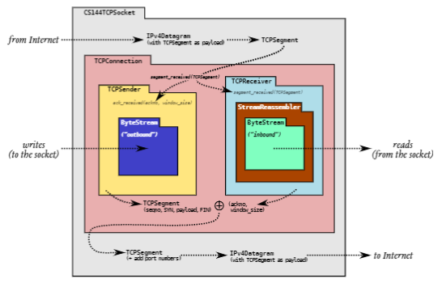
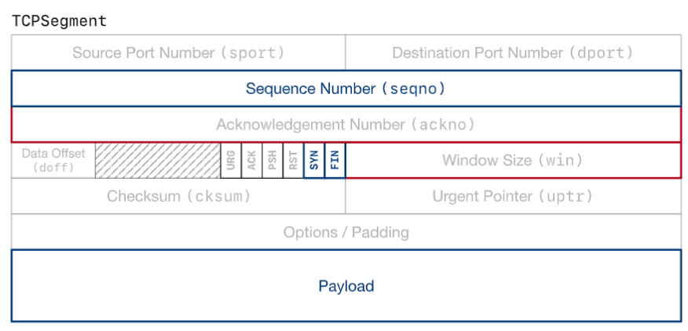
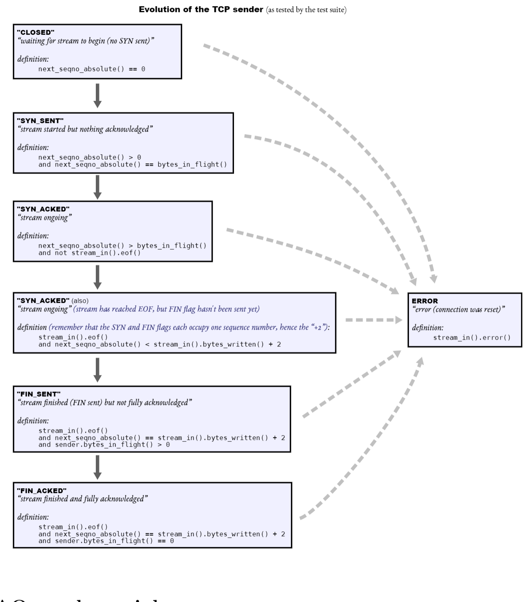

# lab3: TCP发送方

## 1. 概述

​	在 Lab 0 中，您实现了流控制字节流（ByteStream）。在实验 1 和 2 中，您实现了将不可靠数据报中携带的段转换为传入字节流的工具：**StreamReassembler **和 **TCPReceiver**。

​	现在，在实验 3 中，您将实现连接的另一端。TCPSender 是一种工具，可将传出字节流转换为将成为不可靠数据报有效负载的段。最后，在第4个实验中，你将结合前面几个实验的工作，创建一个有效的TCP实现：一个包含TCPSender和TCPReceiver的TCPConnection。您将使用它与 Internet 上的真实服务器通信。

## 2. 开始

​	您的 TCPSender 实现将使用您在实验 0-2 中使用的同一个 Sponge 库，以及额外的类和测试。开始：

- 确保您已将所有解决方案提交给 Lab 2。请不要修改 libsponge 目录或 webget.cc 顶层之外的任何文件。否则，您可能无法合并 Lab 3 入门代码。
- 在实验室作业的存储库中，运行 `git fetch `以检索最新版本的实验室作业。
- 通过运行 `git merge origin/lab3-startercode` 下载 Lab 3 的起始代码
- 几天后，我们将发布一些额外的测试来帮助您避免一些常见错误——要包含它们，您将重复上述两个步骤
- 在您的构建目录中，编译源代码：make
- 在构建目录外，打开并开始编辑`writeups/lab3.md`文件。这是你的实验报告的模板，将包括在你提交的报告中

## 3. TCP发送方

​	TCP是一个协议，通过不可靠的数据报可靠地传递一对流量控制的字节流（每个方向一个）。两方参与TCP连接，每一方同时充当 "发送方"（自己发出的字节流）和 "接收方"（传入的字节流）。这两方被称为连接的 "端点"，或 "对等体"。

​	本周，你将实现TCP的 "发送方 "部分，负责从ByteStream（由一些发送方应用程序创建和写入）中读取数据，并将该数据流转化为一连串发出的TCP段。在远端，TCP接收方（`重要的是要记住，接收器可以是任何有效的TCP接收器的实现，而不一定是你自己的TCPReceiver。互联网标准的价值之一是它们如何在可能以其他方式行事的端点之间建立一种共同语言。`）将这些片段（那些到达的片段--它们可能不会全部到达）转换为原始字节流，并将确认和窗口广告送回发送方。

​	TCP发送方和接收方各自负责TCP段的一部分。TCP发送方写入实验室2中与TCP接收方有关的TCPSegment的所有字段：即序列号、SYN标志、有效载荷和FIN标志。然而，TCP发送方只读取由接收方写入段中的字段：ackno和窗口大小。下面是一个TCP网段的结构，只强调了将由发送方读取的字段：

​		您的 TCPSender 将负责：

- 追踪接收器的窗口（处理传入的acknos和窗口大小）
- 尽可能通过读取 ByteStream、创建新的 TCP 段（包括 SYN 和 FIN 标志，如果需要）并发送它们来填充窗口。发送方应继续发送段，直到窗口已满或 ByteStream 为空
- 跟踪哪些段已发送但接收方尚未确认——我们将这些段称为“未完成”段
- 如果自发送后经过足够的时间，并且尚未确认它们，则重新发送未完成的段

> ​	我为什么要这样做？
>
> ​	基本原则是发送接收方允许我们发送的任何内容（填充窗口），并继续重传，直到接收方确认每个段。这称为“自动重复请求”（ARQ）。发送者将字节流分成多个段并发送它们，只要接收者的窗口允许。感谢您上周的工作，我们知道远程 TCP 接收器可以重建字节流，只要它至少接收每个带索引标记的字节一次 — 无论顺序如何。发送者的工作是确保接收者至少获得每个字节一次

### 3.1 TCPSender 如何知道一个段是否丢失？

​	您的 TCPSender 将发送一堆 TCPSegments。每个将包含来自传出 ByteStream 的（可能为空的）子字符串，用序列号索引以指示其在流中的位置，并在流的开头用 SYN 标志标记，在结尾用 FIN 标志标记。除了发送这些段，TCPSender还必须跟踪其未完成的段，直到它们占用的序列号被完全确认。TCPSender的拥有者会定期调用TCPSender的tick方法，表示时间流逝。TCPS发送方负责查看其未完成的TCPSegments集合，并决定最古老的已发送的段是否已经过长时间未被确认（即没有其所有的序列号被确认）。如果是这样，它需要被重新发送（再次发送）。

​	以下是关于 "未完成的时间过长 "的含义。你要实现这个逻辑，它有点详细，但我们不希望你担心隐藏的测试用例试图绊倒你，或把它当作SAT考试中的文字问题。本周我将给你一些合理的单元测试，一旦你完成了整个TCP的实现，将在实验4中进行更全面的集成测试。只要你100%地通过这些测试，并且你的实现是合理的，你就可以了。

> ​	我为什么要这样做？
>
> ​	总的目标是让发送方及时检测到段丢失并需要重新发送的情况。重发前的等待时间是很重要的：你不希望发件人等待太长时间来重发一个网段（因为这会延迟流向接收应用程序的字节），但你也不希望它重发一个如果发件人再等一会儿就会被确认的网段--那会浪费互联网的宝贵容量。

1. 每隔几毫秒，你的TCPSender的`tick`方法就会被调用，其参数告诉它从上次调用该方法到现在已经过了多少毫秒。使用这个方法来保持`TCPSender`活着的总的毫秒数的概念。请不要试图从操作系统或CPU调用任何 "时间 "或 "时钟 "函数--`tick`方法是你对时间流逝的唯一访问。这样可以保持事物的确定性和可测试性。
2. 当TCPSender被构建时，它被赋予一个参数，告诉它重传超时（RTO）的 "初始值"。RTO是指在重新发送一个未完成的TCP段之前要等待的毫秒数。RTO的值会随时间变化，但 "初始值 "保持不变。启动代码将RTO的 "初始值 "保存在一个名为初始重传超时的成员变量中。
3. 你将实现重传定时器：一个可以在某个时间启动的警报，一旦RTO过了，警报就会响起（或 "过期"）。我们强调，这种时间流逝的概念来自于被调用的tick方法--而不是通过获得一天中的实际时间
4. 每次发送一个包含数据的段（序列空间中的非零长度）时（无论是第一次还是重传），如果定时器没有运行，则启动它，使其在 RTO 毫秒后到期（对于当前值为RTO)。通过 "过期"，我们的意思是，时间将在未来的某一毫秒内用完。
5. 当所有未完成的数据都被确认时，停止重传定时器。
6. 如果调用了 tick 并且重传计时器已过期
    - 重新发送尚未被TCP接收方完全确认的最早的（最低序列号）段。你需要在一些内部数据结构中存储未发送的段，以便能够做到这一点。
    - 如果窗口大小不为零：
        - 追踪连续重传的数量，并因为你刚刚重传了什么而将其递增。你的`TCPConnection`将使用这些信息来决定连接是否无望（连续重传次数过多）并需要中止
        - 将RTO的值增加一倍。这被称为 "指数回退"--它在糟糕的网络上放慢了重传速度，以避免进一步堵塞工作。
    - 重置重传定时器并启动它，使其在RTO毫秒后失效（考虑到你可能刚刚把RTO的值增加了一倍！）。
7. 当接收方给发送方一个确认成功收到新数据的ackno（该ackno反映了一个绝对的序列号，大于之前的任何ackno）：
    - 将 RTO 设置回其“初始值”。
    - 如果发送方有任何未完成的数据，重新启动重传定时器，使其在RTO毫秒后失效（对于RTO的当前值）。
    - 将“连续重传”的计数重置为零

​	我们建议在单独的类中实现重传计时器的功能，但这取决于您。如果这样做，请将其添加到现有文件（`tcp_sender.hh` 和 `tcp_sender.cc`）

### 3.2 实现TCP发送方

​	好了！我们已经讨论了TCP发送方所做的基本概念（给定一个传出的字节流（ByteStream），将其分割成若干段发送到接收方。我们已经讨论了TCP发送方所做工作的基本思路（给定一个传出的ByteStream，将其分割成若干段，发送给接收方，如果它们没有很快得到确认，就继续重发）。我们还讨论了何时得出结论，认为一个未完成的段丢失了，需要重新发送。

​	现在是你的TCPSender将提供的具体接口的时候了。有四个重要的事件需要它来处理，每一个事件都可能最终发送一个TCPSegment。

1. `void fill window()`

    ​	`TCPSender`被要求填满窗口：它从其输入的`ByteStream`中读取并以`TCPSegments`的形式发送尽可能多的字节，只要有新的字节被读取并且窗口中还有可用空间。

    ​	你要确保你发送的每一个`TCPSegment`都完全适合在接收器的窗口内。使每个单独的`TCPSegment`尽可能大，但不能大于`TCPConfig::MAX_PAYLOAD_SIZE`（1452字节）所给的值。

    ​	你可以使用`TCPSegment::length_in_sequence_space()`方法来计算一个段所占用的序列号的总数。记住，SYN和FIN标志也各占用一个序列号，这意味着它们在窗口中占用了空间。

    > ​	如果窗口大小为零，我应该怎么做？
    >
    > ​	如果接收方宣布窗口大小为零，填充窗口的方法应该像窗口大小为一一样。发送方最终可能会发送一个字节，被接收方拒绝（并且没有确认），但这也会激起接收方发送一个新的确认段，显示出它的窗口有更多空间。如果没有这一点，发件人将永远不会知道它被允许再次开始发送。

2. `void ack_received( const WrappingInt32 ackno, const uint16 t window size)`

    ​     从接收方收到一个段，传达窗口的新左（= ackno）和右（= ackno+窗口大小）边缘。`TCPSender`应该查看其未完成的段的集合，并删除任何现在已经被完全确认的段（ackno大于段中的所有序列号）。如果有新的空间出现，TCPSender应该再次填充窗口。

3. `void tick( const size_t ms_since_last_tick )`

    ​	时间已过--自上次调用此方法以来的一定毫秒数。发送方可能需要重新发送一个未完成的片段

4. `void send_empty_segment()`

    ​	TCPSender应该生成并发送一个在序列空间中长度为零的TCPSegment，并且序列号设置正确。如果所有者（你下周要实现的TCPConnection）想发送一个空的ACK段，这就很有用。

    注意：像这样一个不占用序列号的段，不需要作为 "未完成 "来跟踪，也不会被重传。

​	完成实验 3，请查看文档中的完整界面，网址为 https://cs144.github.io/doc/lab3/class_t_c_p_sender.html，并在`tcp sender.hh`和`tcp sender.cc`文件中实现完整的TCPSender公共接口。我们希望您想要添加私有方法和成员变量，可能还有一个辅助类。

### 3.3 测试理论

​	为了测试你的代码，测试套件将期望它通过一系列的情况演变--从发送第一个SYN段，到发送所有数据，到发送FIN段，最后让FIN段得到确认。我们认为你不需要制作更多的状态变量来跟踪这些 "状态"--这些状态只是由你的`TCPSender`类中已经暴露的公共接口来定义。但为了帮助你理解测试输出，这里有一个`TCPSender`在流的生命周期中的预期演变图。（你不必担心错误状态或RST标志，直到实验4。）

### 3.4 FAQs 和 特例

- 我如何“发送”一个片段？

    ​	把它推到段出队列中。就你的TCPSender而言，当你把它推到这个队列时，就认为它已经发送了。很快，所有者就会来弹出它（使用公共 `segments_out()` 访问器方法），并真正发送它。

- 等等，我如何既“发送”一个段，又如何跟踪同一段未完成，这样我就知道以后要重新传输什么？那我不是必须复制每个片段吗？这很浪费吗？

    ​	当你发送一个包含数据的网段时，你可能想把它推到网段输出队列中，同时在内部保留一个数据结构的副本，让你跟踪未完成的网段，以便可能进行重传。这并不是很浪费，因为段的有效载荷被存储为一个参考计数的只读字符串（一个Buffer对象）。所以不用担心，它实际上不是在复制有效载荷数据。

- 在我收到接收方的ACK之前，我的TCPSender应该假定接收方的窗口大小是多少？

    ​	一字节

- 如果一个确认只是部分地确认了一些未完成的片段，我应该怎么做？我是否应该尝试剪掉被确认的字节？

    ​	TCP发送者可以这样做，但就本课而言，没有必要搞得太花哨。将每个网段视为完全未完成，直到它被完全确认--它所占用的所有序列号都小于ackno。

- 如果我发送了三个包含 "a"、"b "和 "c "的独立段，但它们从未被确认，我可以在以后将它们重传到一个包含 "abc "的大段吗？还是我必须单独重发每个片段？

    ​	再次强调：TCP发送器可以做到这一点，但就本课而言，没有必要搞得太花哨。只要单独跟踪每个未完成的网段，当重传计时器到期时，再次发送最早的未完成网段即可。

- 我是否应该在我的 "未完成 "数据结构中存储空段，并在必要时重新传输？

    ​	不--唯一应该被跟踪的、可能被重传的网段是那些传递一些数据的网段，即在序列空间中消耗一些长度的网段。一个不占用序列号的网段（没有有效载荷、SYN或FIN）不需要被记住或重传。

- 如果此 PDF 发布后还有更多常见问题解答，我在哪里可以阅读？

    ​	请定期查看网站（https://cs144.github.io/lab_faq.html）和Ed

## 实验步骤

定义定时器`timecount`，`timeout`，若`timecount`超过`timeout`则说明超时

定义哈希表存储发送的`Segment`，键为序列号，值为`seg`

定义 发送字节数

定义 上一个窗口大小

定义 重传次数

`fill_window`:

1. 判断远程窗口大小
2. 循环填充窗口，若当前窗口大小大于正在发送的字节数
    - 构建单个数据包，设置syn，seqno，payload
    - 判断是否满足发送FIN的条件（未发送过FIN，输入字节流处于EOF，仍然放得下FIN）
    - 将payload设置到seg中，判断是否有数据
    - 判断是否有正在等待的数据包，如果没有，重设更新时间
    - 发送
    - 追踪数据包，增加发送字节数，将next_seqno，seg插入哈希表
    - 更新next_seqno
    - 如果设置了FIN，则直接退出填充window的操作

`ack_received`

1. 判断传入的ackno是否可靠
1. 遍历哈希表，将已经收到的数据包丢弃，如果一个发送的数据包已经接收，则发送字节数减少，哈希表删除该数据包，清空超时时间
1. 如果当前遍历还未接收，则说明后面均为接受，直接返回
1. 重传次数赋值0
1. 重置窗口大小，再次填充窗口

`tick`

1. 定时器增加

2. 如果存在发送的数据包，并且定时器超时

    - 如果窗口大小不为0超时，说明网络堵塞，增大timeout

    定时器归0，重发，重传计数器++

 

