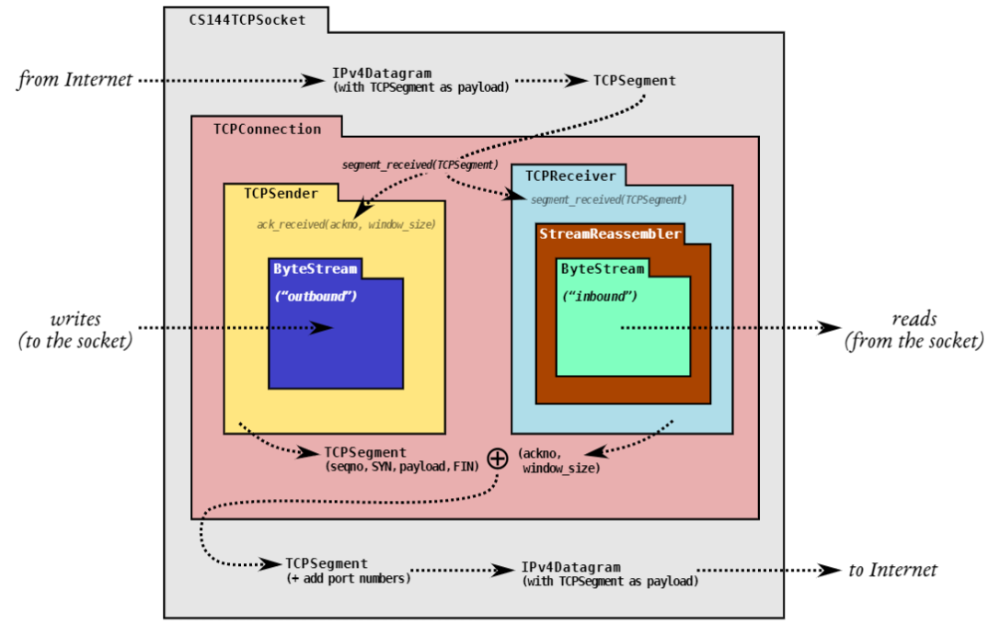

# Lab4

## 1. 概述

​	在实验室0中，你实现了流量控制的字节流（ByteStream）的抽象概念。在实验室1、2和3中，你实现了在该抽象概念和互联网提供的抽象概念之间双向转换的工具：不可靠的数据报。

​	现在，在实验4中，你将制作一个总体模块，称为`TCPConnection`，它结合了你的`TCPSender`和`TCPReceiver`，并处理连接的总体内务。该连接的TCP段可以被封装到用户（TCP-in-UDP）或互联网（TCP/IP）数据包的有效载荷中，从而使你的代码能够与互联网上数十亿台使用相同TCP/IP语言的其他计算机对话。图1再次显示了整体设计。

​	一个简短的提醒：`TCPConnection`主要是将你在前面的实验中实现的发送器和接收器模块结合起来--TCPConnection本身可以用不到100行的代码实现。如果你的发送器和接收器都很强大，这将是一个简短的实验。如果不是，你可能需要在测试失败信息的帮助下，花时间进行调试。(我们不鼓励你尝试阅读测试的源代码，除非是作为最后的手段）。根据去年学生们的双模经验，我们强烈建议你早点开始，直到截止日期前一天晚上才离开这个实验。

​	

​																									图 1：TCP 实现中模块和数据流的排列。

## 2.开始

​	你对TCPConnection的实现将使用与你在实验室0-3中使用的相同的Sponge库，并增加了类和测试。我们会给你支持代码，将TCP段读写到用户和互联网数据报的有效载荷中。我们还将给你一个类（CS144TCPSocket），它可以包装你的TCPConnection，使其表现得像一个正常的流套接字，就像你在实验0中用来实现webget的TCPSocket一样。在本实验结束时，你将稍微修改你的webget以使用你的TCP实现--CS144TCPSocket而不是TCPSocket。要开始了：

- 请确保你已经把所有的解决方案提交给实验室3。请不要修改 libsponge 目录顶层以外的任何文件，或 webget.cc。否则，你在合并实验室4的启动代码时可能会遇到麻烦。
- 当你进入实验作业的仓库时，运行`git fetch`来获取实验作业的最新版本
- 通过运行`git merge origin/lab4-startercode`下载实验室3的启动代码。
- 在您的构建目录中，编译源代码：`make`

## 3. Lab4：TCP连接

​	本周，你将完成建立一个工作的TCP实现。你已经完成了大部分的工作：你已经实现了发送方和接收方。本周你的工作是将它们 "连接 "起来，成为一个对象（TCPConnection），并处理一些对连接来说是全局性的管家任务。

​	回顾一下。TCP可靠地传递一对流量控制的字节流，每个方向一个。两方参与TCP连接，每一方同时充当 "发送方"（自己的出站字节流）和 "接收方"（入站字节流）：


​	双方（上图中的 "A "和 "B"）被称为连接的 "端点"，或 "对等体"。你的TCPConnection作为其中一个对等体。它负责接收和发送段，确保发送方和接收方被告知并有机会对他们关心的传入和传出段的字段作出贡献。

​	以下是 TCPConnection 必须遵循的基本规则：

​	**接收段**。如图1所示，当`TCPConnection`的段接收方法被调用时，`TCPConnection`从互联网接收`TCPSegments`。当这种情况发生时，`TCPConnection`会查看该段并：

- 如果`rst`（复位）标志被设置，则将入站和出站流都设置为错误状态，并永久地终止连接。否则它. . .

- 将段交给`TCPReceiver`，这样它就可以检查它所关心的传入段的字段：`seqno`, `syn` , `payload` 和 `fin` 。

- 如果设置了`ack`标志，告诉`TCPSender`它所关心的传入段的字段：`ackno`和窗口大小。

- 如果传入段占用了任何序列号，`TCPConnection`确保至少发送一个段作为回复，以反映`ackno`和窗口大小的更新。

- 在`TCPConnection`的`segment received()`方法中，有一个额外的特殊情况需要处理：响应一个 "keep-alive "段。对方可能会选择发送一个序列号无效的网段来查看你的TCP实现是否还活着（如果是的话，你的当前窗口是什么）。你的`TCPConnection`应该回复这些 "keep-alives"，即使它们不占用任何序列号。实现这一点的代码可以是这样的。

    ```cpp
    if (_receiver.ackno().has_value() and (seg.length_in_sequence_space() == 0)
    and seg.header().seqno == _receiver.ackno().value() - 1) {
    _sender.send_empty_segment();
    }
    ```

​	**发送段**。`TCPConnection`将通过Interne发送`TCPSegments`：

- 任何时候，`TCPSender`都会将一个段推到它的出站队列中，并在出站段上设置它所负责的字段。(`seqno,` `syn `, `payload`, and `fin` )。
- 在发送段之前，`TCPConnection`将要求`TCPReceiver`提供它负责的出站段的字段：`ackno`和`window_size`。如果有一个`ackno`，它将设置`ack`标志和`TCPSegment`中的字段。

当时间过去时。TCPConnection有一个tick方法，将被操作系统定期调用。当这种情况发生时，TCPConnection需要：

- 告诉 TCPSender 时间的流逝
- 如果连续重传的次数超过上限TCPConfig::MAX RETX ATTEMPTS，则中止连接，并向对等体发送一个复位段（一个设置了rst标志的空段）。
- 如果有必要，请将连接结束干净（请见第5节）。

因此，每个TCPSegment的整体结构看起来是这样的，"发送方写的 "和 "接收方写的 "字段以不同颜色显示。


​	`TCPConnection`的完整接口在类的文档中。请花些时间来阅读这个。你的大部分实现将涉及将`TCPConnection`的公共API与`TCPSender`和`TCPReceiver`中的适当例程 "连接 "起来。尽可能地，你想把任何繁重的工作交给你已经实现的发送器和接收器。也就是说，并不是所有的事情都那么简单，还有一些涉及整个连接的 "全局 "行为的微妙因素。最困难的部分将是决定何时完全终止一个TCPConnection并宣布它不再 "活动"。

​	以下是您需要处理的一些常见问题解答和边缘案例的详细信息

## 4. FAQs 和 特殊值

- 你期待多少代码？

    ​	总的来说，我们预计这个实现（在tcp connection.cc中）总共需要大约100-150行代码。当你完成后，测试套件将广泛地测试你与你自己的实现以及Linux内核的TCP实现的互操作性。

- 我应该如何开始？

  ​	最好的办法可能是将一些 "普通 "方法与TCPSender和TCPReceiver中的适当调用联系起来。这可能包括像`remaining outbound capacity(), bytes in flight(), and unassembled bytes()`等。
  
  ​	然后你可以选择实现“writer”方法：`connect()`, `write()`, 和 `end_input_stream()`。其中一些方法可能需要对出站的ByteStream（由TCPSender拥有）做一些事情，并告诉TCPSender这件事情。
  
  ​	你可以选择在你完全实现每个方法之前开始运行测试套件（`make check`）；测试失败的信息可以给你一个线索或指导，让你知道下一步该如何处理。
  
- 应用程序如何从入站流中读取？

    `	TCPConnection::inbound_stream()`已经在头文件中实现了。您无需再做任何事情来支持应用程序阅读。

- TCPConnection是否需要任何花哨的数据结构或算法？

    ​	不，它真的不需要。繁重的工作都是由你已经实现的TCPSender和TCPReceiver完成的。这里的工作实际上只是把所有的东西连接起来，并处理一些不容易被考虑到发送方和接收方的连接范围内的微妙问题。

- TCPConnection 是如何实际发送一个段的？

    ​	与TCPSender类似，把它推到段出队列中。就你的TCPConnection而言，当你把它推到这个队列上时，就认为它已经被发送了。很快，所有者就会过来弹出它（使用公共的 segments out() 访问器方法），并真正发送它。

- TCPConnection 如何了解时间的流逝？

    ​	与 TCPSender 类似——tick() 方法将被定期调用。请不要使用任何其他方式来告诉时间 - 滴答法是您唯一可以了解时间流逝的方法。这使事情具有确定性和可测试性。

- 如果一个传入段的rst标志被设置，TCPConnection会做什么？

    ​	这个标志（"重置"）意味着连接的即时死亡。如果你收到一个带有`rst`的段，你应该在入站和出站的`ByteStreams`上设置错误标志，并且任何后续对`TCPConnection::active()`的调用都应该返回`false`。

- 我应该什么时候发送一个设置了第一个标志的段？

    ​	在两种情况下，您需要中止整个连接：

    1. 如果发送方连续发送了太多的重传而没有成功（超过`TCPConfig::MAX RETX ATTEMPTS`，即8）。
    2. 如果TCPConnection的析构函数在连接仍处于活动状态时被调用（active()返回true）

    在设置了rst的情况下发送一个段，与接收一个段的效果类似：连接已死，不再活动()，两个ByteStreams都应该被设置为错误状态。

- 等等，但我甚至如何制作一个可以设置rst标志的段？序列号是什么？

    ​	任何传出的段都需要有适当的序列号。你可以通过调用它的`send_empty_segment()`方法强制`TCPSender`生成一个具有适当序列号的空段。或者你可以通过调用它的`fill_window()`方法使它填充窗口（如果它有未完成的信息要发送，例如，来自流的字节或SYN/FIN），生成段。

- `ack`标志的作用是什么？难道不是一直都有一个`Ackno`？

    ​	几乎每个`TCPSegment`都有一个ackno，并设置了`ack`标志。例外的情况是在连接的最开始，在接收方有任何需要确认的东西之前。

    ​	在传出段上，你要尽可能地设置ackno和ack标志。也就是说，只要TCPReceiver的ackno()方法返回一个std::optional<WrappingInt32>，并有一个值，你可以用has_value()测试。

    ​	在传入段中，只有当ack字段被设置时，你才会想看ackno。如果是这样，就把这个ackno（和窗口大小）给TCPSender

- 我如何解读这些 "状态 "名称（如 "流开始 "或 "流正在进行"）？

    ​	请参阅实验 2 和实验 3 讲义中的图表。

    ​	我们想再次强调，"状态 "对于测试和调试很有用，但我们并不要求你在代码中把这些状态具体化。你不需要制作更多的状态变量来记录这些。状态 "只是你的模块已经公开的公共接口的一个功能。

- 如果TCPReceiver想宣传的窗口尺寸大于`TCPSegment::header().win`字段所能容纳的尺寸，我应该发送什么窗口尺寸？

    ​	尽可能发送最大的价值。您可能会发现 std::numeric 限制类很有帮助。

- TCP连接何时最终 "完成"？什么时候active()可以返回false?

    ​	请看下一节

## 5. TCP 连接的结束：共识需要工作

​	`TCPConnection`的一个重要功能是决定TCP连接何时完全 "完成"。当发生这种情况时，实现将释放对`local port`号的独占声明，停止发送应答以响应传入的段，将连接视为历史记录，并使其active（）方法返回`false`

​	有两种方式可以结束连接。在非正常关闭中，TCPConnection 发送或接收设置了 rst 标志的段。在这种情况下，出站和入站 ByteStreams 应该都处于错误状态，并且 active() 可以立即返回 false

​	干净关闭是我们如何“完成”（active() = false）而不会出现错误。这更复杂，但它是一件美好的事情，因为它尽可能确保两个 ByteStream 中的每一个都已完全可靠地传递给接收对等方。在下一节（§§5.1）中，我们给出了干净关机发生时的实际结果，所以如果您愿意，请随意跳过。

​	酷，你还在这里。由于二将问题，不可能保证两个对等体都能实现干净的关闭，但TCP已经非常接近了。情况是这样的。从一个对等体（一个TCPConnection，我们称之为 "本地 "对等体）的角度来看，在其与 "远程 "对等体的连接中，有四个先决条件可以实现干净关闭：

**Prereq #1** 入站流已完全组装并已结束。

**Prereq #2** 出站流已被本地应用程序结束，并完全发送（包括它结束的事实，即一个带fin的段）到远程对等体。

**Prereq #3** 出站流已被远程对等体完全确认。

**Prereq #4** 本地TCPConnection确信，远程对等体可以满足前提条件#3。这是令人头疼的部分。这有两种可能发生的方式：

- 选项A：在两个流结束后徘徊。先决条件 #1 到 #3 为真，并且远程对等点似乎已获得本地对等点对整个流的确认。本地对等点并不确定这一点——TCP 不能可靠地传递确认（它不确认确认）。但是本地对等点非常确信远程对等点已经得到了它的确认，因为远程对等点似乎没有重新传输任何东西，而本地对等点已经等待了一段时间来确定。

    ​	具体来说，当前提条件#1到#3得到满足，并且本地对等体从远程对等体收到任何网段后，至少有10倍的初始重传超时（cfg.rt timeout），连接就完成了。这被称为在两个数据流结束后的 "徘徊"，以确保远程对等体没有试图重传我们需要确认的东西。这确实意味着TCP连接需要保持活动一段时间，以保持
    对本地端口号的独占声明，并可能发送ack以响应传入的段，即使在TCPSender和tcpreciver完全完成其工作并且两个流都已结束之后。

- 选项 B：被动关闭。前提条件#1到#3都是真的，而且本地对等体100%确定远程对等体可以满足前提条件#3。如果TCP不确认确认，这怎么可能呢？因为远程对等体是第一个结束其流的人。

    > 为什么这条规则有效？
    >
    > ​	这是脑筋急转弯，你不需要进一步阅读就能完成这个实验，但思考起来很有趣，而且能触及两将军问题的深层原因，以及在不可靠的网络中对可靠性的固有限制。这样做的原因是，在收到并组装了远程对等体的fin（先决条件1）后，本地对等体发送了一个序列号比它以前发送的更大的段（至少，它必须发送自己的fin段以满足先决条件2），该段也有一个ackno，承认远程对等体的fin位。远程对等体承认该段（满足前提条件#3），这意味着远程对等体一定也看到了本地对等体对远程对等体的fin的ack。这就保证了远程对等体一定能够满足它自己的先决条件#3。所有这些都意味着本地对等体可以满足前提条件#4，而不需要徘徊。呜呼! 我们说过这是一个脑筋急转弯。在你的实验报告中加分：你能找到一个更好的方法来解释这个问题吗？

​	底线是，如果TCPConnection的入站流在TCPConnection发送翅片段之前就结束了，那么TCPConnection就不需要在两个流都结束后逗留了

### 5.1 TCP连接的结束（实战总结）

​	实际上，这意味着你的`TCPConnection`有一个成员变量，在流结束后被称为`_linger_after_streams_finish`，通过`state()`方法暴露给测试设备。这个变量一开始是真。如果在`TCPConnection`的出站流达到EOF之前，入站流就结束了，这个变量需要被设置为`false`。

​	在满足前提条件#1到#3的任何一点上，如果`linger_after_streams_finish`为`false`，那么连接就 "完成 "了（并且`active()`应该返回`false`）。否则，你需要徘徊：只有在收到最后一个网段后经过足够的时间（`10 ×cfg.rt_timeout`），连接才会完成。

## 6. 测试

​	除了自动测试外，我们鼓励你 "玩一玩 "你的TCP实现，并用`wireshark`进行调试。这里有一些说明:

​	下面是一个如何手动运行的例子。你需要打开两个窗口，都在sponge/build目录下。

​	在一个窗口中，运行：`./apps/tcp ipv4 -l 169.254.144.9 9090`

​	这将把你的TCPConnection作为一个服务器来运行（在互联网（IPv4）数据报中进行分段），监听一个本地地址（169.254.144.9），端口为9090。你应该看到：

```
DEBUG: Listening for incoming connection...
```

​	现在你可能想开始捕获发送和接收的段，这样你就可以在以后用wireshark检查它们。在另一个窗口中，运行`sudo tshark -Pw /tmp/debug.raw -i tun144 .2 `这将捕获服务器发送或接收的所有TCP段，并将它们保存在一个名为"/tmp/debug.raw "的文件中。你以后可以用Wireshark打开这个文件（在你的电脑上，不一定在虚拟机内），以查看每个网段的全部细节.

​	在第三个窗口中，运行客户端：`./apps/tcp ipv4 -d tun145 -a 169.254.145.9 169.254.144.9 9090`

​	这将使你的TCPConnection作为一个客户端运行，连接到服务器正在监听的地址上。

​	在服务器窗口中，您现在应该会看到类似：

```
New connection from 169.254.144.1:52518.
```

​	在客户端窗口中，您现在应该看到：

```
Successfully connected to 169.254.144.9:9090
```

​	现在试着在任何一个窗口（客户机或服务器）中输入一些东西，然后点击ENTER。你应该看到同样的文字出现在另一个窗口。

​	现在试着结束其中一个数据流。在客户端窗口，输入Ctrl-D。这将结束客户端的出站流。现在，客户端窗口应该是这样的：

```
DEBUG: Outbound stream to 169.254.144.9:9090 finished (1 byte still in flight).
DEBUG: Outbound stream to 169.254.144.9:9090 has been fully acknowledged.
```

​	并且服务器窗口应包含以下内容：

```
DEBUG: Inbound stream from 169.254.144.1:52518 finished cleanly
```

​	最后，在服务器窗口中，再次按 Ctrl-D 以结束该方向的流。服务器窗口现在应该打印如下内容，并立即将您返回到命令行（没有延迟）：

```
DEBUG: Waiting for clean shutdown... DEBUG: Outbound stream to 169.254.144.1:52518 finished (1 byte still in flight).
DEBUG: Outbound stream to 169.254.144.1:52518 has been fully acknowledged.
DEBUG: TCP connection finished cleanly.
done.
```

​	并且客户端窗口应该打印这样的内容：

```
DEBUG: Inbound stream from 169.254.144.9:9090 finished cleanly.
DEBUG: Waiting for lingering segments (e.g. retransmissions of FIN) from peer...
DEBUG: Waiting for clean shutdown...
```

​	等待 10 秒后，客户端窗口应打印其余部分并将您返回到命令行：

```
DEBUG: TCP connection finished cleanly.
done
```

​	如果这些步骤中有一个出了问题，这表明你可以从你的终止逻辑（关于何时停止报告active()=true的决定）中寻找答案。或者，请随时在这里再次发帖，我们可以尝试帮助你进一步调试。

​	用一个很小的窗口进行测试：如果你担心你的TCPSender在接收方公布零窗口的情况下是否会被卡住，可以尝试运行上述命令并在tcp ipv4程序中使用"-w 1 "参数。这将使它使用TCPReceiver的容量为1，这意味着当你在一边输入 "hello "时，只能发送一个字节，然后接收方将公告一个零窗口。

​	请确保你的实现不会卡在这里 它应该能够成功地发送一个任意长度的字符串（例如 "hello how are you doing"），即使接收器的容量是1字节。

## 7. 性能

​	在你完成了你的 TCP 实现之后，并且在你通过了 `make check_lab4` 运行的所有测试之后，请提交！然后，测量系统的性能并将其提高到至少每秒 100 兆比特。

​	从构建目录，运行 ./apps/tcp benchmark 。如果一切顺利，您将看到如下所示的输出:

```
user@computer:~/sponge/build$ ./apps/tcp benchmark
CPU-limited throughput : 1.78 Gbit/s
CPU-limited throughput with reordering: 1.21 Gbit/s
```

​	为了获得实验的全部学分，你的性能需要在两条线上至少达到 "0.10Gbit/s"（每秒100兆比特）。你可能需要对你的代码进行剖析，或者推理出它在哪些方面比较慢，你可能需要改进一些关键模块（如ByteStream或StreamReassembler）的实现来达到这一点。

​	在你的文章中，请报告你达到的速度数据（有和没有重新排序)

​	如果你愿意，我们欢迎你尽可能地优化你的代码，但请不要以牺牲CS144的其他部分为代价，包括本实验的其他部分。如果你的性能超过100Mbit/s，我们不会给你加分--你所做的任何超出这个最低限度的改进都只是为了你自己的满意和学习。如果你在不改变任何公共接口的情况下实现了比我们快的速度3，我们很愿意向你了解你是如何做到的。

## 8. 重构webget 

​	是时候来个胜利大转弯了! 还记得你在实验0中写的webget.cc吗？它使用了由Linux内核提供的TCP实现（TCPSocket）。我们希望你能把它改成使用你自己的TCP实现，而不需要改变任何其他东西。我们认为你所需要做的就是:

- 将`#include“socket.hh”`替换为`#include“tcp_sponge_socket.hh”`
- 将` TCPSocket `类型替换为 `CS144TCPSocket`
- 在 `get_URL() `函数的末尾，添加对` socket.wait until closed()` 的调用

> ​	我为什么要这样做？
>
> ​	通常情况下，Linux内核会负责等待TCP连接达到 "清洁关闭"（并放弃它们的端口保留），即使在用户进程退出之后。但由于你的TCP实现都在用户空间，除了你的程序，没有其他东西可以跟踪连接状态。添加这个调用使套接字等待，直到你的TCPConnection报告active() = false

​	重新编译，并运行`make check_webget`来确认你已经走了一圈：你已经在你自己完整的TCP实现之上写了一个基本的Web获取器，而且它仍然成功地与一个真正的`Webserver`对话。如果你有问题，试着手动运行程序：`./apps/webget cs144.keithw.org /hasher/xyzzy `。你会在终端上得到一些调试输出，可能会有帮助。

## 9. 开发和调试建议

1. 在`tcp_connection.cc`文件中实现`TCPConnection`的公共接口（以及任何你想要的私有方法或函数）。你可以在`tcp_connection.hh`中向`TCPConnection`类添加任何你喜欢的私有成员。
2. 我们预计总共有大约 100-150 行代码。你不需要任何花哨的数据结构或算法
3. 你可以用`make_check`来测试你的代码（编译后）。这将运行一个相当全面的测试套件（159个测试）。许多测试证实你的TCP实现可以与Linux的TCP实现或其本身一起无错误地传输文件，在每个方向上都有不同的丢包和数据传输组合
4. 请重新阅读Lab 0文档和在线FAQ中关于 "使用Git "的部分，并记住将代码保存在主分支上发布的Git仓库中。做一些小的提交，使用好的提交信息，明确哪些地方发生了变化，为什么要这样做
5. 请努力使你的代码对将对其进行风格评分的CA来说是可读的。对变量使用合理和清晰的命名规则。使用注释来解释复杂或微妙的代码片段。使用 "防御性编程"--明确地检查函数的先决条件或不变量，如果有任何错误，就抛出一个异常。在设计中使用模块化识别常见的抽象和行为，并在可能的情况下将其考虑在内。重复的代码块和庞大的功能将使您难以遵循您的代码
6. 也请遵守Lab 0文件中描述的 "现代C++"风格。cppreference网站（https://en.cppreference.com）是一个很好的资源，尽管你不需要C++的任何复杂功能来做这些实验。(你有时可能需要使用move()函数来传递一个不能被复制的对象)。
7. 如果你得到一个分段故障，那就真的出问题了 我们希望你的写作风格是使用安全的编程实践，使segfaults极不寻常（不使用malloc()，不使用new，不使用指针，在你不确定的地方进行安全检查，抛出异常，等等）。也就是说，要进行调试，您可以使用 `cmake .. -DCMAKE BUILD TYPE=RelASan `配置您的构建目录，以启用编译器的“清理程序”来检测内存错误和未定义的行为，并在它们发生时为您提供一个很好的诊断。您也可以使用 valgrind 工具。您还可以使用 `cmake .. -DCMAKE BUILD TYPE=Debug `进行配置并使用 GNU 调试器 (gdb)。请记住仅将这些设置用于调试——它们会大大减慢程序的编译和执行速度。恢复到“发布”模式的最可靠/万无一失的方法就是吹走构建目录并创建一个新目录


## 实验步骤


`segment_received`

- 调用`segment_received`读取并处理收到的数据
- 如果是`rst`包，直接终止
- 如果收到`ack`包，更新`_sender`状态并补充发送数据
- 如果是 LISTEN 到了 SYN
- 判断TCP是否应该断开
- 如果到了准备断开的时候，服务端先断


`write`

- 向将要传输的字节流写入数据
- 返回ack


`tick`

- 调用`sender`的`tick`函数
- 如果重传次数过大，则清空可能重新发送的数据包
- 


```cpp
size_t TCPConnection::remaining_outbound_capacity() const { return _sender.stream_in().remaining_capacity(); }

size_t TCPConnection::bytes_in_flight() const { return _sender.bytes_in_flight(); }

size_t TCPConnection::unassembled_bytes() const { return _receiver.unassembled_bytes(); }

size_t TCPConnection::time_since_last_segment_received() const { return _time_since_last_segment_received_ms; }

void TCPConnection::segment_received(const TCPSegment &seg) {
    _time_since_last_segment_received_ms = 0;
    // 如果发来的是一个 ACK 包，则无需发送 ACK
    bool need_send_ack = seg.length_in_sequence_space();

    // 读取并处理接收到的数据
    // _receiver 足够鲁棒以至于无需进行任何过滤
    _receiver.segment_received(seg);

    // 如果是 RST 包，则直接终止
    //! NOTE: 当 TCP 处于任何状态时，均需绝对接受 RST。因为这可以防止尚未到来数据包产生的影响
    if (seg.header().rst) {
        _set_rst_state(false);
        return;
    }

    // 如果收到了 ACK 包，则更新 _sender 的状态并补充发送数据
    // NOTE: _sender 足够鲁棒以至于无需关注传入 ack 是否可靠
    assert(_sender.segments_out().empty());
    if (seg.header().ack) {
        _sender.ack_received(seg.header().ackno, seg.header().win);
        // _sender.fill_window(); // 这行其实是多余的，因为已经在 ack_received 中被调用了，不过这里显示说明一下其操作
        // 如果原本需要发送空ack，并且此时 sender 发送了新数据，则停止发送空ack
        if (need_send_ack && !_sender.segments_out().empty())
            need_send_ack = false;
    }

    // 如果是 LISEN 到了 SYN
    if (TCPState::state_summary(_receiver) == TCPReceiverStateSummary::SYN_RECV &&
        TCPState::state_summary(_sender) == TCPSenderStateSummary::CLOSED) {
        // 此时肯定是第一次调用 fill_window，因此会发送 SYN + ACK
        connect();
        return;
    }

    // 判断 TCP 断开连接时是否时需要等待
    // CLOSE_WAIT
    if (TCPState::state_summary(_receiver) == TCPReceiverStateSummary::FIN_RECV &&
        TCPState::state_summary(_sender) == TCPSenderStateSummary::SYN_ACKED)
        _linger_after_streams_finish = false;

    // 如果到了准备断开连接的时候。服务器端先断
    // CLOSED
    if (TCPState::state_summary(_receiver) == TCPReceiverStateSummary::FIN_RECV &&
        TCPState::state_summary(_sender) == TCPSenderStateSummary::FIN_ACKED && !_linger_after_streams_finish) {
        _is_active = false;
        return;
    }

    // 如果收到的数据包里没有任何数据，则这个数据包可能只是为了 keep-alive
    if (need_send_ack)
        _sender.send_empty_segment();
    _trans_segments_to_out_with_ack_and_win();
}

bool TCPConnection::active() const { return _is_active; }

size_t TCPConnection::write(const string &data) {
    size_t write_size = _sender.stream_in().write(data);
    _sender.fill_window();
    _trans_segments_to_out_with_ack_and_win();
    return write_size;
}

//! \param[in] ms_since_last_tick number of milliseconds since the last call to this method
void TCPConnection::tick(const size_t ms_since_last_tick) {
    assert(_sender.segments_out().empty());
    _sender.tick(ms_since_last_tick);
    if (_sender.consecutive_retransmissions() > _cfg.MAX_RETX_ATTEMPTS) {
        // 在发送 rst 之前，需要清空可能重新发送的数据包
        _sender.segments_out().pop();
        _set_rst_state(true);
        return;
    }
    // 转发可能重新发送的数据包
    _trans_segments_to_out_with_ack_and_win();

    _time_since_last_segment_received_ms += ms_since_last_tick;

    // 如果处于 TIME_WAIT 状态并且超时，则可以静默关闭连接
    if (TCPState::state_summary(_receiver) == TCPReceiverStateSummary::FIN_RECV &&
        TCPState::state_summary(_sender) == TCPSenderStateSummary::FIN_ACKED && _linger_after_streams_finish &&
        _time_since_last_segment_received_ms >= 10 * _cfg.rt_timeout) {
        _is_active = false;
        _linger_after_streams_finish = false;
    }
}

void TCPConnection::end_input_stream() {
    _sender.stream_in().end_input();
    // 在输入流结束后，必须立即发送 FIN
    _sender.fill_window();
    _trans_segments_to_out_with_ack_and_win();
}

void TCPConnection::connect() {
    // 第一次调用 _sender.fill_window 将会发送一个 syn 数据包
    _sender.fill_window();
    _is_active = true;
    _trans_segments_to_out_with_ack_and_win();
}

TCPConnection::~TCPConnection() {
    try {
        if (active()) {
            cerr << "Warning: Unclean shutdown of TCPConnection\n";
            _set_rst_state(false);
        }
    } catch (const exception &e) {
        std::cerr << "Exception destructing TCP FSM: " << e.what() << std::endl;
    }
}

void TCPConnection::_set_rst_state(bool send_rst) {
    if (send_rst) {
        TCPSegment rst_seg;
        rst_seg.header().rst = true;
        _segments_out.push(rst_seg);
    }
    _receiver.stream_out().set_error();
    _sender.stream_in().set_error();
    _linger_after_streams_finish = false;
    _is_active = false;
}

void TCPConnection::_trans_segments_to_out_with_ack_and_win() {
    // 将等待发送的数据包加上本地的 ackno 和 window size
    while (!_sender.segments_out().empty()) {
        TCPSegment seg = _sender.segments_out().front();
        _sender.segments_out().pop();
        if (_receiver.ackno().has_value()) {
            seg.header().ack = true;
            seg.header().ackno = _receiver.ackno().value();
            seg.header().win = _receiver.window_size();
        }
        _segments_out.push(seg);
    }
}
```


