# datalab
## 1. 异或
 ```c
//1
/* 
 * bitXor - x^y using only ~ and & 
 *   Example: bitXor(4, 5) = 1
 *   Legal ops: ~ &
 *   Max ops: 14
 *   Rating: 1
 */
int bitXor(int x, int y) {
  
  return ~(~x&~y)&~(x&y);
}
```
**1. 先通过画真值表发现规律**
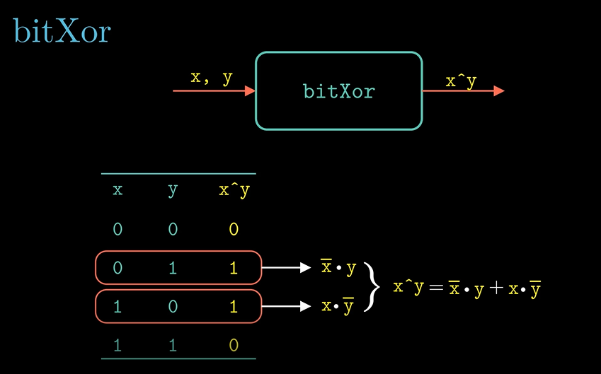
**2. 使用DeMorgan（狄摩根定律）进行化简**
对结果进行两次非运算，先取出一次非进行进行计算
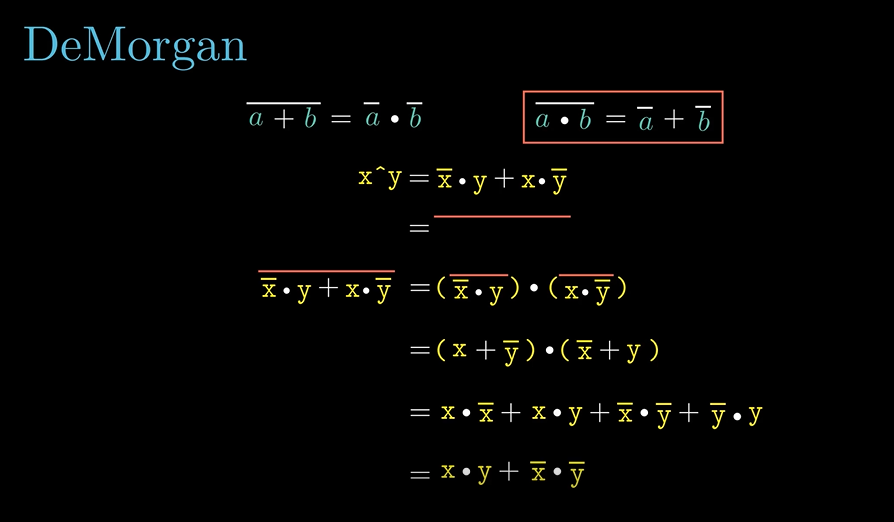
**3. 将结果返回到原始表达式中，继续使用DeMorigan定律**
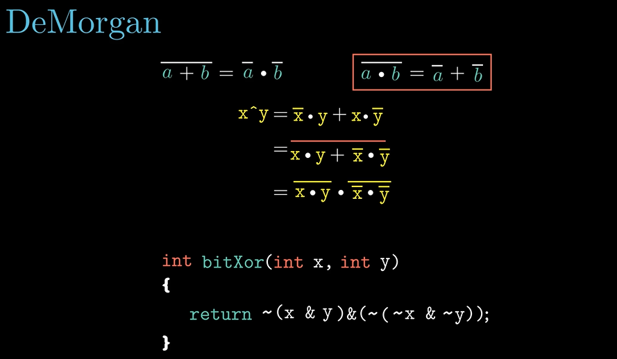
## 2.求整型补码所表示的最小值
```c
/* 
 * tmin - return minimum two's complement integer 
 *   Legal ops: ! ~ & ^ | + << >>
 *   Max ops: 4
 *   Rating: 1
 */
int tmin(void) {
  return 0x1 << 31;
}
```
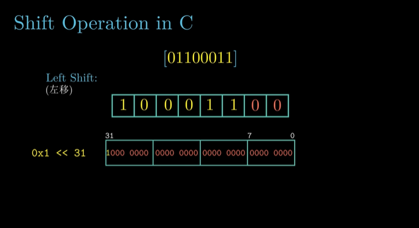
## 3.判断x是不是补码表示的最大值
```c
//2
/*
 * isTmax - returns 1 if x is the maximum, two's complement number,
 *     and 0 otherwise 
 *   Legal ops: ! ~ & ^ | +
 *   Max ops: 10
 *   Rating: 1
 */
int isTmax(int x) {
  int tmin = x + 1;
  int equal = tmin ^ (~x);
  return (!!tmin) & (!equal);
}
```
**1. 补码最大值+1和最大值取得到得到的结果是一致的**
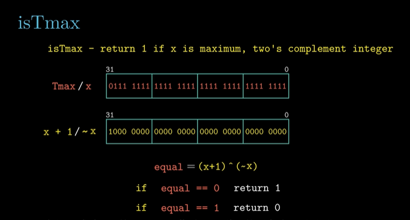
**2. 排除-1的情况**
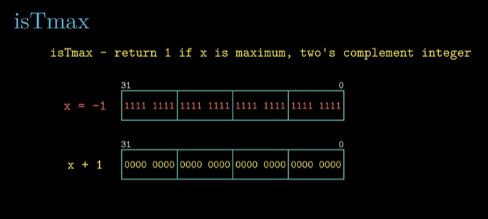
## 4.判断x的所有奇数位是不是都是1
```c
/* 
 * allOddBits - return 1 if all odd-numbered bits in word set to 1
 *   where bits are numbered from 0 (least significant) to 31 (most significant)
 *   Examples allOddBits(0xFFFFFFFD) = 0, allOddBits(0xAAAAAAAA) = 1
 *   Legal ops: ! ~ & ^ | + << >>
 *   Max ops: 12
 *   Rating: 2
 */
int allOddBits(int x) {
  int mask_16 = (0xAA << 8) | 0xAA;
  int mask_32 = (mask_16 << 16) | mask_16;
  int ret = (x & mask_32) ^ mask_32;
  return !ret;
}
```
**1.构造一个偶数位都是0的数**
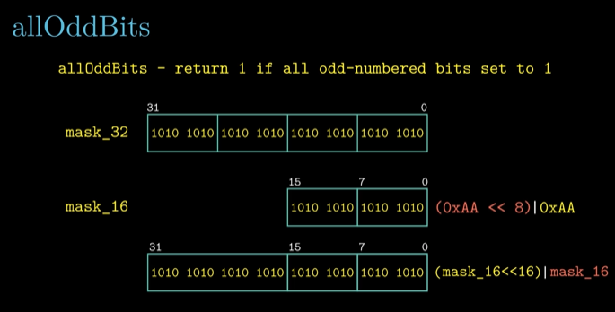
**2.x与mask进行与运算再进行异或运算即可**
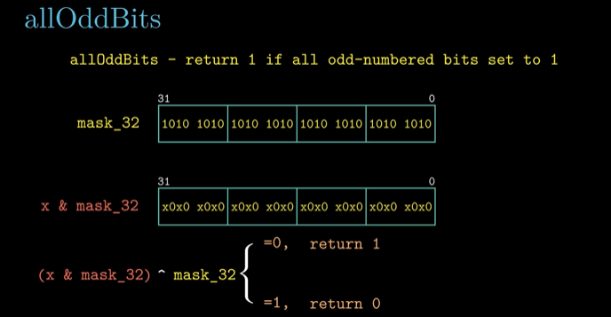
## 5.返回-x
```c
/* 
 * negate - return -x 
 *   Example: negate(1) = -1.
 *   Legal ops: ! ~ & ^ | + << >>
 *   Max ops: 5
 *   Rating: 2
 */
int negate(int x) {
  return ~x + 1;
}
```
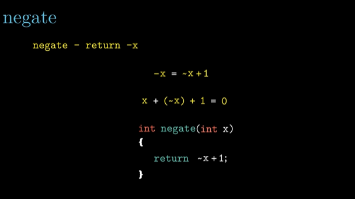
## 6.判断x是否在0x30和0x39之间
```c
//3
/* 
 * isAsciiDigit - return 1 if 0x30 <= x <= 0x39 (ASCII codes for characters '0' to '9')
 *   Example: isAsciiDigit(0x35) = 1.
 *            isAsciiDigit(0x3a) = 0.
 *            isAsciiDigit(0x05) = 0.
 *   Legal ops: ! ~ & ^ | + << >>
 *   Max ops: 15
 *   Rating: 3
 */
int isAsciiDigit(int x) {
  int sign_1 = x + (~0x30) + 1;
  int sign_2 = 0x39 + (~x) + 1;

  return (!(sign_1 >> 31)) & (!(sign_2 >> 31));
}
```
**将x减去（做异或加1操作）0x30，将0x39减去x，判断是否大于0（右移31位取反判断）**
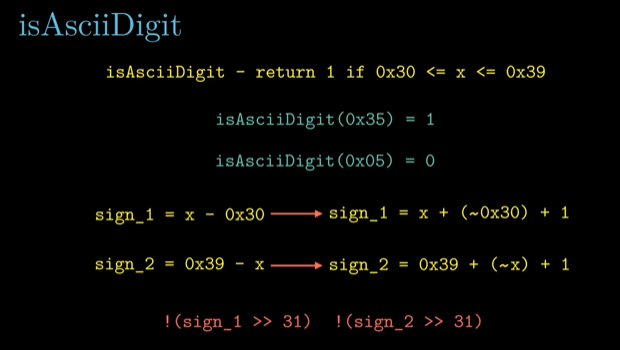
## 7.使用位运算实现C语言中的三目运算符x?y:z
```c
/* 
 * conditional - same as x ? y : z 
 *   Example: conditional(2,4,5) = 4
 *   Legal ops: ! ~ & ^ | + << >>
 *   Max ops: 16
 *   Rating: 3
 */
int conditional(int x, int y, int z) {
  int condition = !!x;
  int flag = ~condition + 1;
  int ret_y = flag & y;
  int ret_z = ~flag & z;
  return ret_y | ret_z;
}
```
**这里有三步，先将x进行两次非运算，得出condition（用于判断当前x是否为1），然后对condition进行取反加1，当其为1时，取反加1会得到全1，为0时，取反加1会得到全0，接下来，在和y，z进行与运算取或即可**
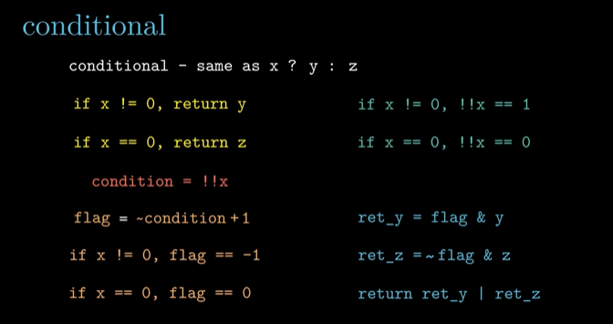
## 8.判断x是否小于y
```c
**1. 判断y-x是否大于0**
```c
/* 
 * isLessOrEqual - if x <= y &nbsp;then return 1, else return 0 
 * Example: isLessOrEqual(4,5) = 1.
 * Legal ops: ! ~ & ^ | + << >>
 * Max ops: 24
 * Rating: 3
 */
int isLessOrEqual(int x, int y) {
    int sign = y + (~x) + 1;
    int s_x = x >> 31;
    int s_y = y >> 31;
    int of_1 = (!s_x) & s_y;
    int of_2 = s_x & (!s_y);
    return of_2 | ((!of_1) & (!(sign >> 31)));
}
```
**1.使用y-x判断**
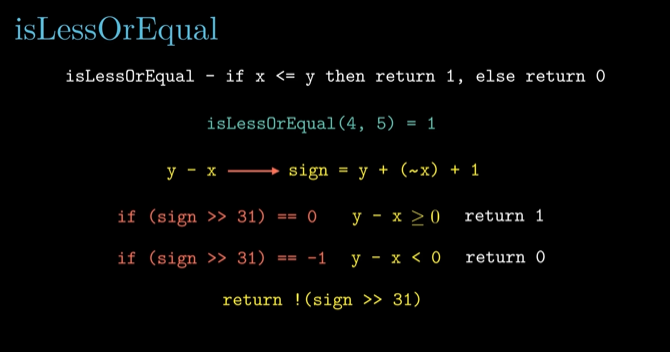
**2.处理x>0, y < 0的溢出情况**
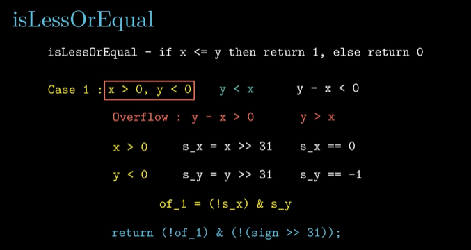
**3.处理x>0，y<0的溢出情况（这里不需要加~号，因为x < y）**
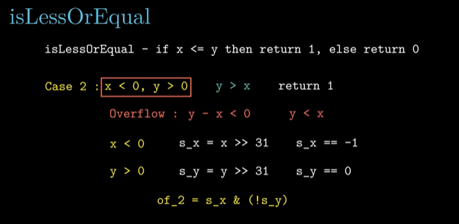
## 9.使用除逻辑非之外操作符来实现逻辑非的功能
```c
//4
/* 
 * logicalNeg - implement the ! operator, using all of 
 * &nbsp;&nbsp;&nbsp;&nbsp;&nbsp;&nbsp;&nbsp;&nbsp;&nbsp;&nbsp;&nbsp;&nbsp;&nbsp;the legal operators except !
 * &nbsp;&nbsp;Examples: logicalNeg(3) = 0, logicalNeg(0) = 1
 * &nbsp;&nbsp;Legal ops: ~ & ^ | + << >>
 * &nbsp;&nbsp;Max ops: 12
 * &nbsp;&nbsp;Rating: 4 
 */
int logicalNeg(int x) {
 &nbsp;int negate_x = ~x + 1;
 &nbsp;int sign = (x | negate_x) >> 31;
 &nbsp;return sign + 1;
}
```
**当x为0时，-x与它进行按位或运算右移31位是0，当x不为0时，-x与它进行按位或运算右移31位一定是-1**
x=0
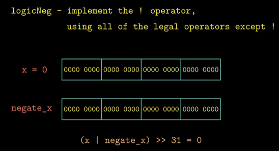
x>0
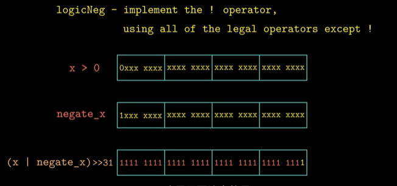
## 10.当使用补码来表示一个数时，最少需要多少比特位
```c
/* howManyBits - return the minimum number of bits required to represent x in
 *             two's complement
 *  Examples: howManyBits(12) = 5
 *            howManyBits(298) = 10
 *            howManyBits(-5) = 4
 *            howManyBits(0)  = 1
 *            howManyBits(-1) = 1
 *            howManyBits(0x80000000) = 32
 *  Legal ops: ! ~ & ^ | + << >>
 *  Max ops: 90
 *  Rating: 4
 */
int howManyBits(int x) {
  int flag;
  int cnt_16, cnt_8, cnt_4, cnt_2, cnt_1, cnt_0;
  int sign = x >> 31; // 判断该数是否为负数
  x = (sign & (~x)) | (~sign & x);  // 如果是负数，则转化为对称的正数~x，通过sign=0xfffffffff将其赋给x

  // 高16位
  flag = !!(x >> 16); // 逻辑非！只会出现0/1
  cnt_16 = flag << 4; // 如果flag为1，则说明高16位是有1的，偏移量+16
  x = x >> cnt_16; // 将高16位移到低16位，继续判断

  flag = !!(x >> 8);
  cnt_8 = flag << 3;
  x = x >> cnt_8;

  flag = !!(x >> 4);
  cnt_4 = flag << 2;
  x = x >> cnt_4;

  flag = !!(x >> 2);
  cnt_2 = flag << 1;
  x = x >> cnt_2;

  flag = !!(x >> 1);
  cnt_1 = flag;
  x = x >> cnt_1;

  cnt_0 = x;
  return cnt_16 + cnt_8 + cnt_4 + cnt_2 + cnt_1 + cnt_0 + 1;
}
```
**此题可以转化为最高位1的位置，再加上符号位使用类似二分的思想解决，例如，取高16位，通过两次逻辑非运算判断该段是否会有1，若有，则加上16（说明最高位的1在前16位），然后将高16移到后面进行相同操作，若否，那么flag会是0，则不会加上，x也不会移动**
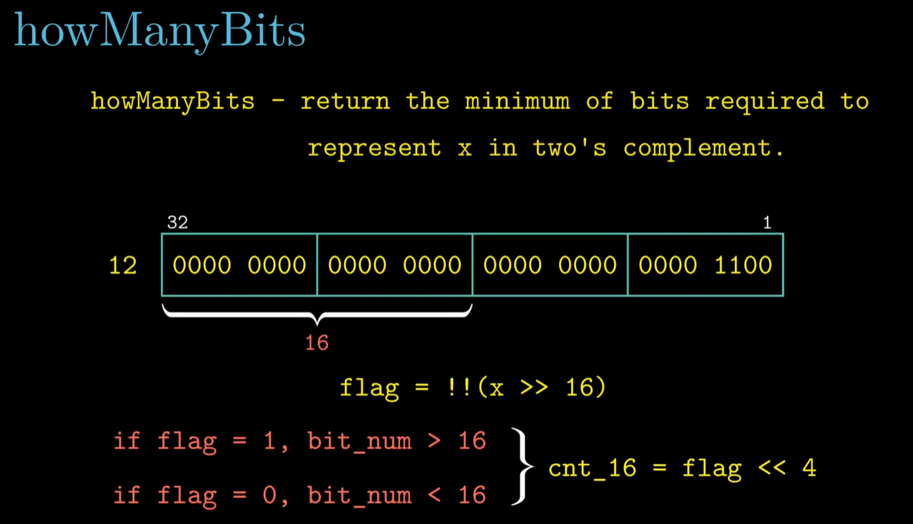
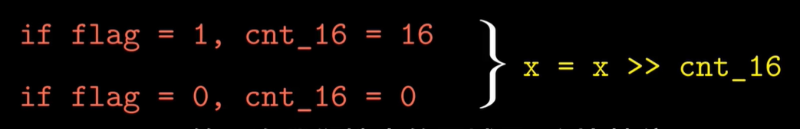
**对于负数的处理，需要转化为其`对称`的正数，由于负数转化为正数表示是取反+1，而如果负数包含0，那么他们是不对称（也就是取反+1不会直接得到对称的数）的，需要再-1**
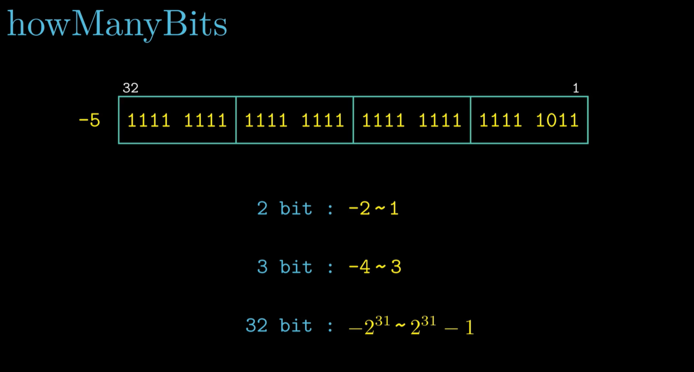