[VPN概念，技术原理和误区_哔哩哔哩_bilibili](https://www.bilibili.com/video/BV1KY411t75D)

# VPN概念，技术原理和误区

## 1. 什么是VPN

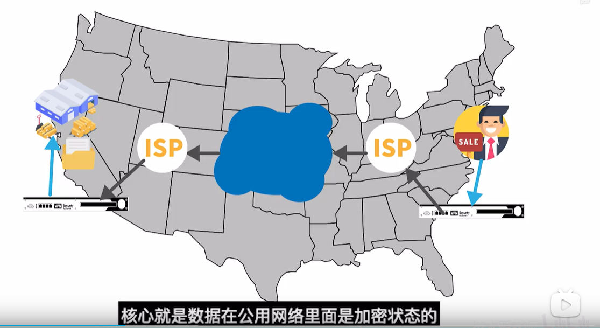

## 2. VPN类型

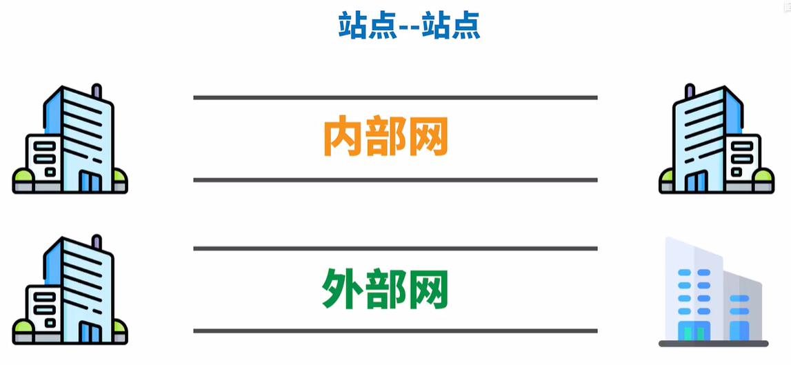

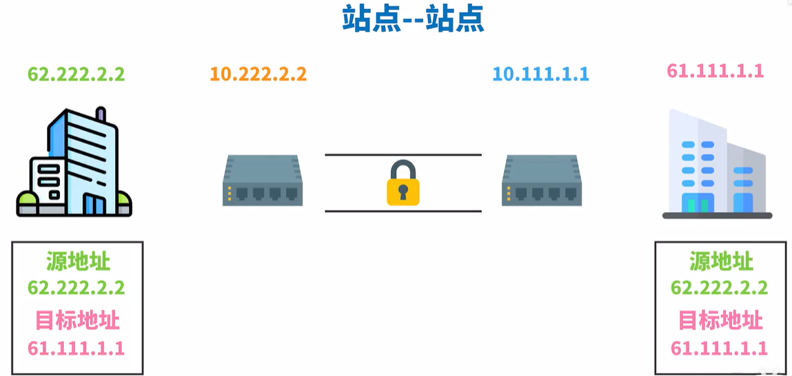

这中间VPN器会对其地址进行加密解密

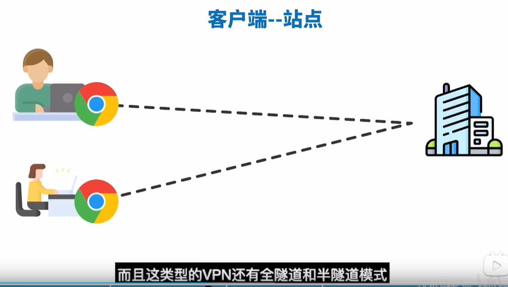

	## 3. VPN职责

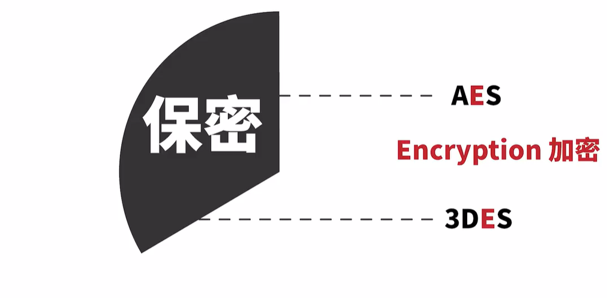

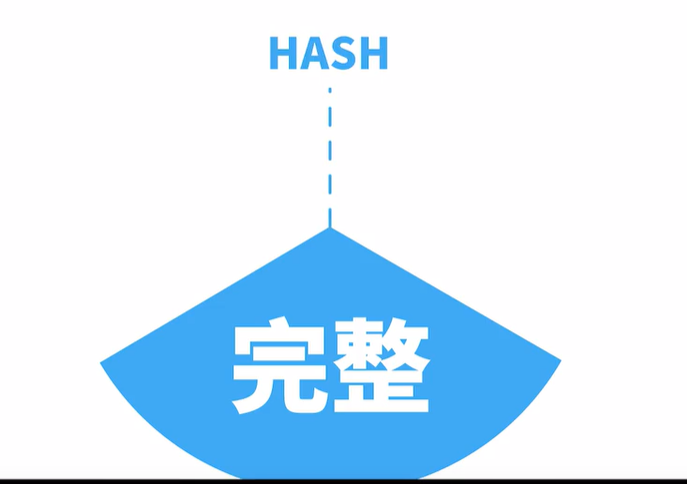

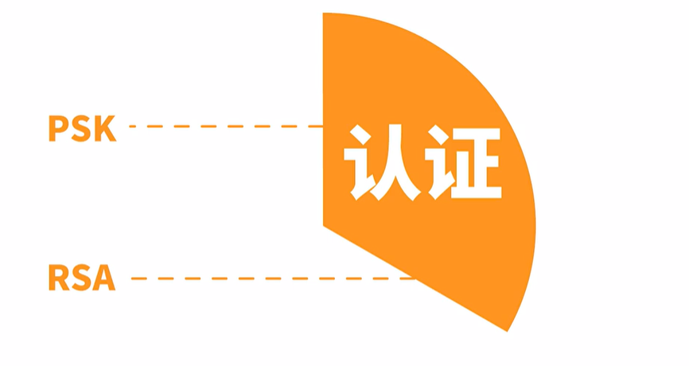

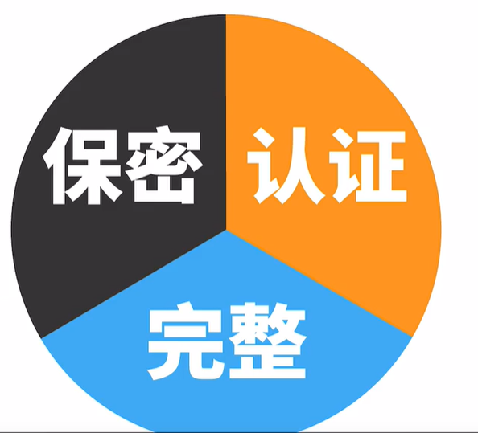

## 4. IPsec和SLL/TLS

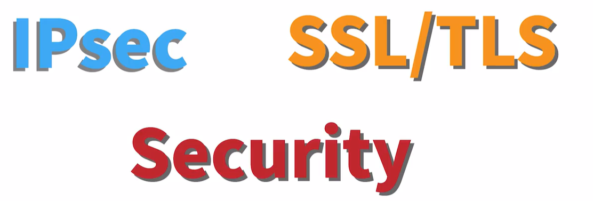

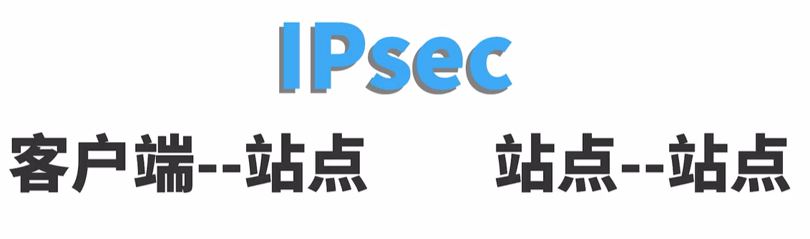

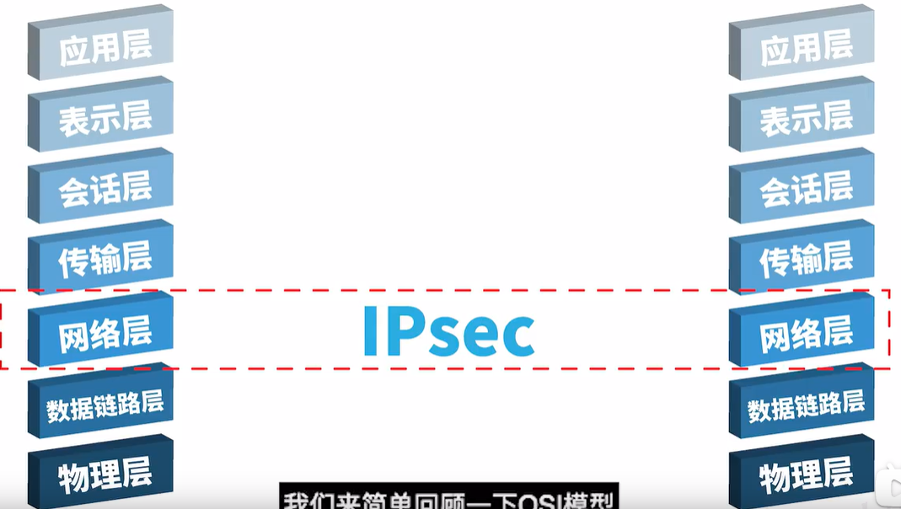

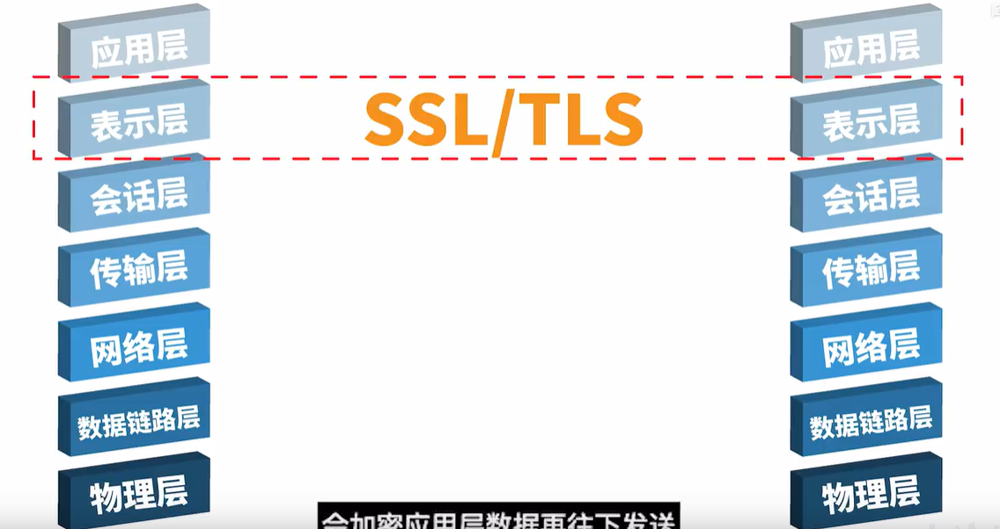

## 5. 误区

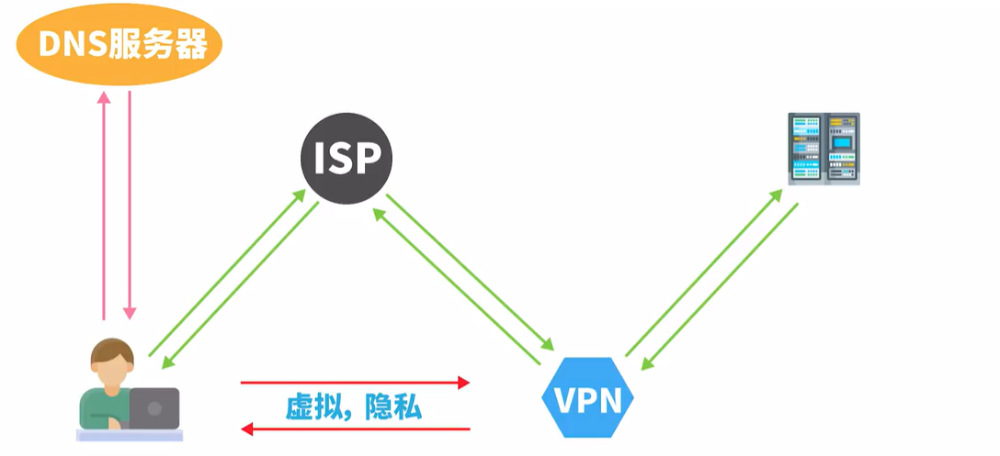

- 误区：VPN完美隐藏了自己的IP地址

