[【硬核】公网访问？内网穿透！零经验上手！_哔哩哔哩_bilibili](https://www.bilibili.com/video/BV1Qq4y1w7F5?spm_id_from=333.851.b_7265636f6d6d656e64.10)

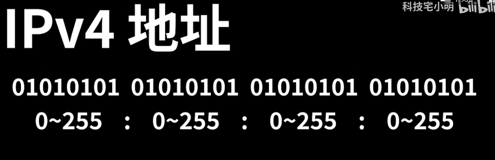

IPV4在20世纪就差不多分完了

网络工程师们提出两种解决方案

- NAT地址转化技术（在IPV4基础上改进）
- IPV6

## NAT地址转化

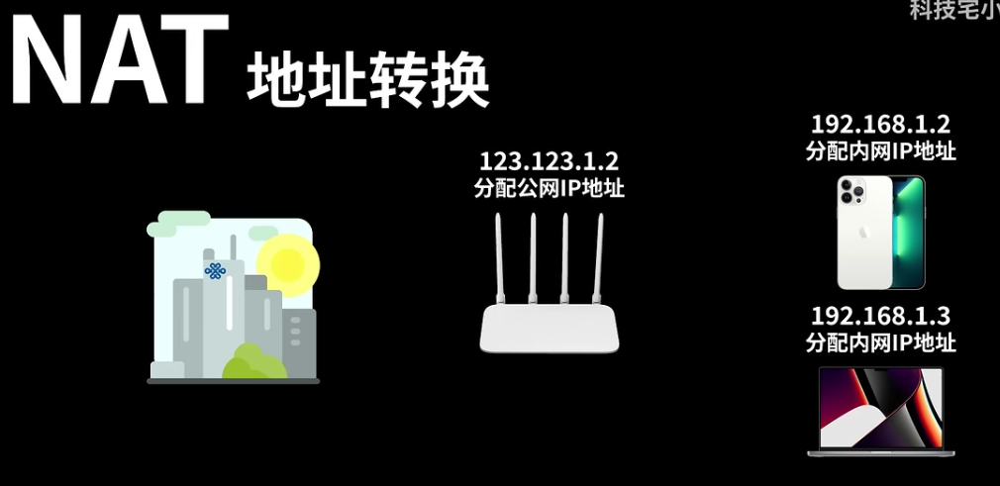

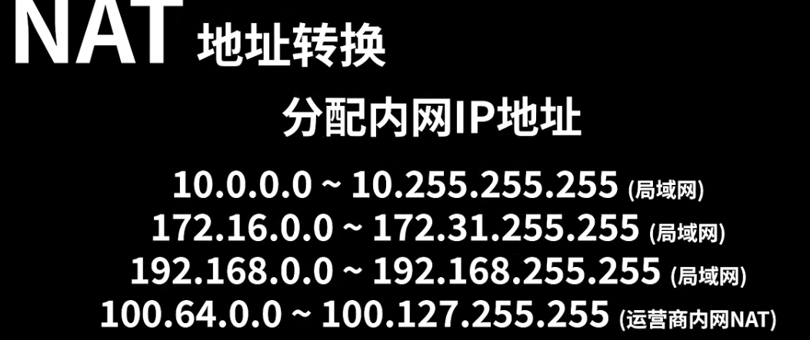

### NAT如何实现内外网地址转换？

举一个看b站电影的例子来说

手机想要看b站电影

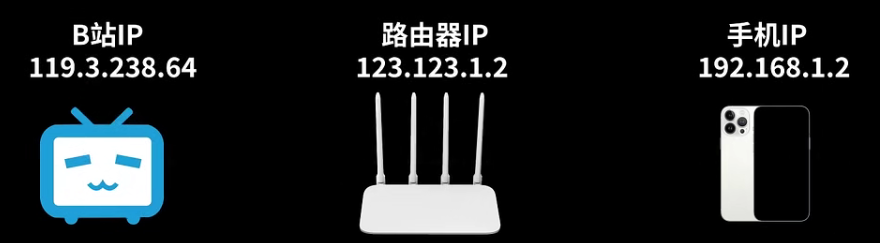

会发送寄件人信息，和端口50，每个机器都有65536个端口

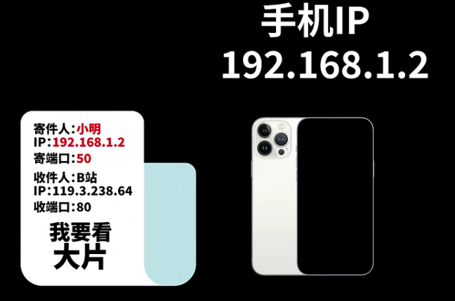

路由器在后台把寄件人IP及端口改为自己的公网IP及**随机空闲端口**

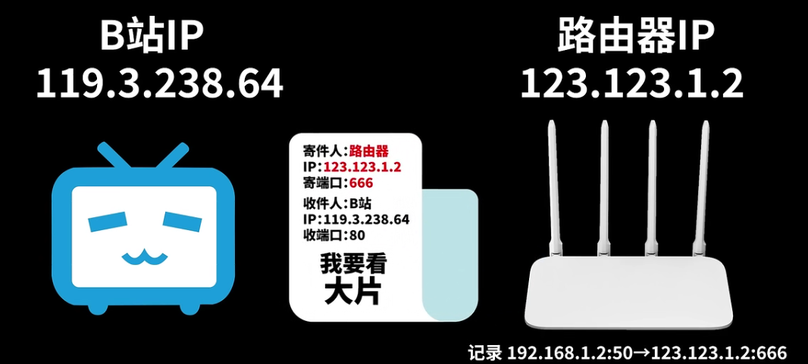

服务器收到看电影的请求发送电影到路由器IP及端口

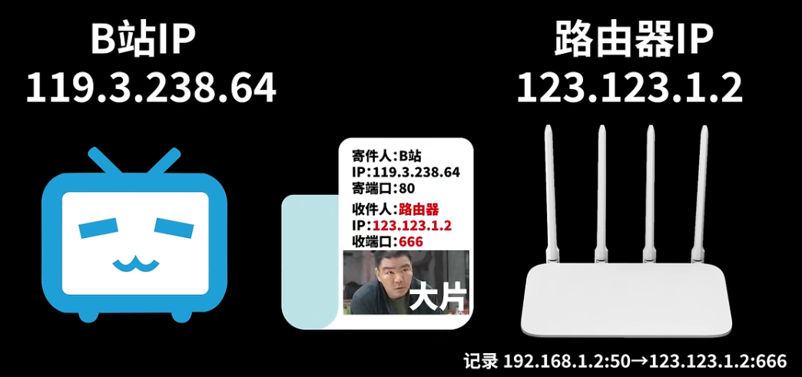

路由器依照之前的记录把包裹返回

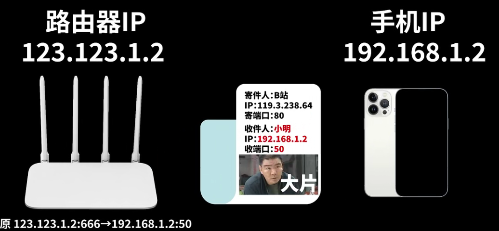

### 内网机器访问

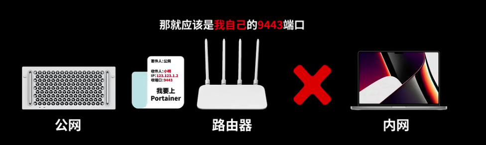

这时候需要在路由器设置端口转发（映射）

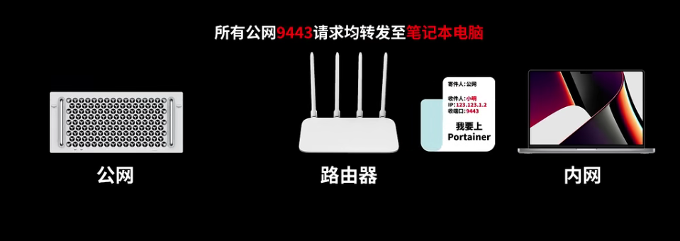

但随着入网设备的增多，分配给路由器的独立IP也会不够用

使用多层NAT

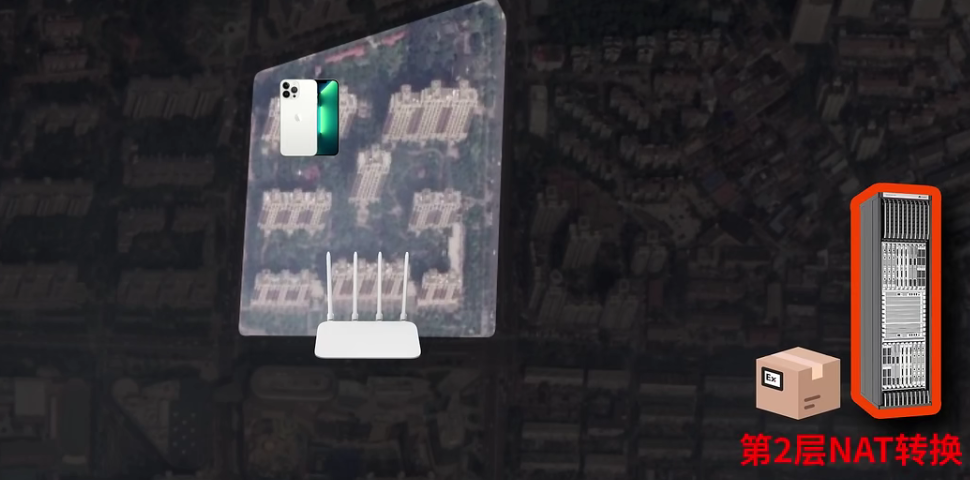

但这种方案会导致效率低，并且无法设置端口转发

对于这种情况，只能用内网穿透

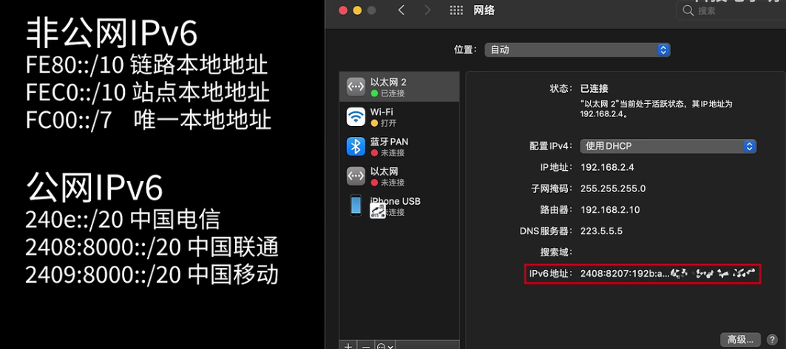

