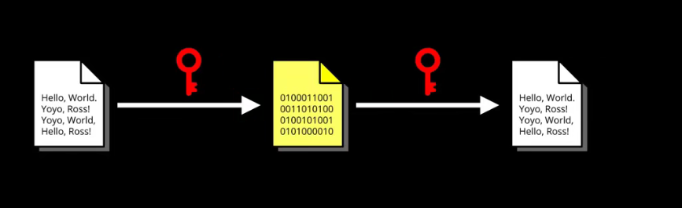

[视频连接](https://www.bilibili.com/video/BV14y4y1272w?spm_id_from=333.999.0.0)
### 对称加密

 &nbsp;&nbsp;&nbsp;信息收发方会通过事先商定好的密钥对数据进行加密和解密
### 非对称加密

`模运算 => 单向函数`
原始数据

密钥（公钥）

### 公式
d是私钥

变化

得出公钥与私钥关系

\$(n)难以计算，需要质因数分解

每个人自己选取一组质因数相乘，得到\$(n)，只要其他人不知道这组用于计算\$(n)的质因数，那么就无法求解出私钥

> 双方都生成私钥和公钥，
双方只首次建立链接时互相交换公钥，
然后双方互相用对面的公钥进行数据加密，
双方互相发送加密后的密文，
然后双方自己用自己本地的私钥进行解密
也就是说整个过程中：网络中交换数据时用对面给的公钥加密；本地自己收到加密后的密文后自己用私钥解密。
如果上面写的，还不明白的话，可以只单方面思考：
> 1) 我给你我自己的公钥
> 2) 你必须用我给你的公钥，加密信息
> 3) 你用我的公钥加密密文后，再发回来还给我
> 4) 我自己再用私钥解密
> 因为整个过程只有公钥加密后的密文，还有公钥在网络上传递，而该密文因为即时你知道公钥，也由于大数无法质数分解的原因无法反推，必须用私钥解密，所以是很安全的
