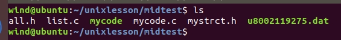
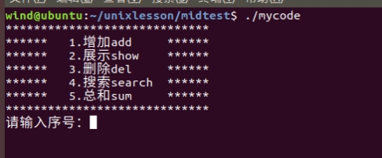
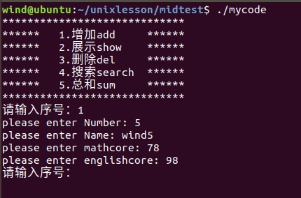
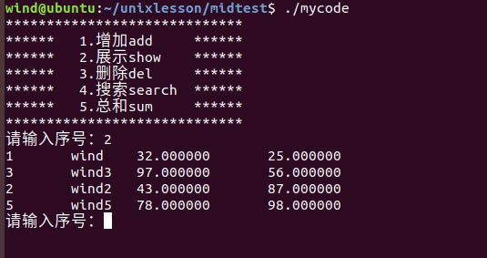
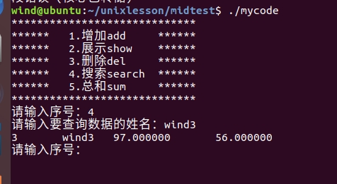
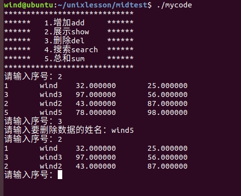
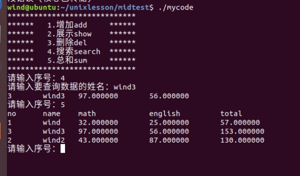

# 使用c的低级IO+链表实现一个具有增删改查的系统



All.h  库文件，存放程序所需库和声明函数

Mystruct.h 存放结构体和全局变量

List.c 存放链表操作相关函数

Mycode.c 存放主程序代码以及相应操作逻辑函数

U8002119275.data 存放数据

```c
#ifndef ALL
#define ALL

#include <unistd.h>
#include <fcntl.h>
#include <stdlib.h>
#include <stdio.h>
#include <sys/types.h>
#include <sys/stat.h>
#include <string.h>

void init();
int add();
float sum(float a, float b);
void display();
void menu();
void show();
void del();
void create_list();
void write_file();
void search();
void total();

#endif
```


```c
#ifndef MYSTRCT
#define MYSTRCT

typedef struct telinfo {
    int no;
    char *name;
    float math;
    float eng;
    float total;
    struct telinfo *next;
} Info, *PInfo;

typedef struct SList {
    PInfo pHead; // 链表头节点
} SList;

SList *list;

int TITLE_LEN; // 标题长度
int DATA_LEN; //总数据的最大长度

#endif

```


```c
#include "all.h"
#include "mystrct.h"
#include "mycode.c"

void main(int argc, char *argv[]) {
    menu();
}

```


```c
#include "all.h"
#include "mystrct.h"
#include "list.c"

/**
 * @brief 初始化
 * 
 */
void init() {
    char buf[128];
    sprintf(buf, "no\tname\tmathcore\tenglishcore\n");
    size_t len = strlen(buf);
    int fd;
    if ((fd = open("u8002119275.dat", O_WRONLY|O_CREAT)) == -1) {
        perror("Error: open file error");
        exit(1);
    }
    write(fd, buf, len);
    init_list();
    TITLE_LEN = len;
    DATA_LEN = 1024;
    close(fd);
}

/**
 * @brief 菜单
 * 
 */
void menu() {
    init();
    create_list();    
    display();
    while (1) {
        printf("请输入序号：");
        char c;
        c = getchar();
        getchar();
        switch (c)
        {
            case '1':
                add();
                getchar();
                break;
            case '2':
                show();
                break;
            case '3':
                del();
                break;
            case '4':
                search();
                break;
            case '5':
                total();
                break;
            default:
                break;
        }
    }
    free_list();
}

/**
 * @brief 添加数据
 * 
 * @return int 
 */
int add () {
    Info per;
    printf("please enter Number: ");
    scanf("%d", &per.no);

    printf("please enter Name: ");
    getchar();
    char buffer[20];
    fgets(buffer, sizeof(buffer), stdin);
    size_t len = strlen(buffer) - 1;  // 这里-1是防止读入空格长度
    per.name = (char *) malloc(len);
    memcpy(per.name, buffer, len);
    
    printf("please enter mathcore: ");
    scanf("%f", &per.math);

    printf("please enter englishcore: ");
    scanf("%f", &per.eng);
    
    int fd = open("./u8002119275.dat", O_WRONLY|O_APPEND);
    if (fd == -1) {
        return -1;
    } 
  
    char str[80];
    sprintf(str, "%d\t%s\t%f\t%f\n", per.no, per.name, per.math, per.eng);
    size_t len1 = strlen(str);
    write(fd, str, len1);
    if (list->pHead != NULL) {
        free_list();
    }
    create_list();
    free(per.name); // 释放内存
    close(fd);
    return 0;
}

/**
 * @brief 展示数据
 * 
 */
void show() {
    show_list();
}

/**
 * @brief 删除数据
 * 
 */
void del() {
    printf("请输入要删除数据的姓名：");
    char buffer[20];
    fgets(buffer, sizeof(buffer), stdin);
    size_t len = strlen(buffer) - 1;  // 这里-1是防止读入空格长度
    char *name = (char *) malloc(len);
    memcpy(name, buffer, len);
    del_list(name);
    write_file();
}   

/**
 * @brief 查询数据
 * 
 */
void search() {
    printf("请输入要查询数据的姓名：");
    char buffer[20];
    fgets(buffer, sizeof(buffer), stdin);
    size_t len = strlen(buffer) - 1;  // 这里-1是防止读入空格长度
    char *name = (char *) malloc(len);
    memcpy(name, buffer, len);
    PInfo per = search_list(name);
    if (per == NULL) printf("没有查询到!\n");
    else {
        printf("%d\t%s\t%f\t%f\n", per->no, per->name, per->math, per->eng);
    }
}

/**
 * @brief 填入总和
 * 
 */
void total() {
    addTotal_list();
    PInfo cur = list->pHead;
    printf("no\tname\tmath\t\tenglish\t\ttotal\n");
    while (cur != NULL) {
        printf("%d\t%s\t%f\t%f\t%f\n", cur->no, cur->name, cur->math, cur->eng, cur->total);
        cur = cur->next;
    }
}

/**
 * @brief 将文件数据读入链表
 * 
 */
void create_list() {
    int fd;
    if ((fd = open("./u8002119275.dat", O_RDONLY)) == -1) {
        perror("open file error!");
        exit(1);
    }
    char buffer[DATA_LEN];
    lseek(fd, TITLE_LEN, SEEK_SET); // 跳过标题
    read(fd, buffer, sizeof(buffer));
    // 拆分数据，放入结构体
    int i = 0, j = 0;
    while (buffer[i] != '\0') {
        int flag = 0;
        char data[10];
        memset(data, '\0', sizeof data);
        j = 0;
        Info per;
        while (buffer[i] != '\n') {
            if (buffer[i] == '\t') {
                if (flag == 0) { // 编号
                    int no;
                    sscanf(data, "%d", &no);
                    per.no = no;
                }
                else if (flag == 1) { // 名称
                    size_t len = strlen(data);
                    per.name = (char *) malloc(len);
                    memcpy(per.name, data, len);
                }
                else if (flag == 2) { // 数学
                    per.math = atof(data);
                }
                j = 0;  // 重置
                memset(data, '\0', sizeof data);
                i ++,flag ++; // 跳过/t
            }
            if(flag == 3 && buffer[i + 1] == '\n') { // 英语
                per.eng = atof(data);
            }
            data[j] = buffer[i];
            i ++, j ++;
        }
        // printf("%d, %s, %f, %f\n", per.no, per.name, per.math, per.eng);
        i ++;   // 跳过/n
        add_list(&per); // 添加到链表
    }
    // printf("i = %d\n", i);
    close(fd);
}

/**
 * @brief 将链表数据写入文件
 * 
 */
void write_file() {
    PInfo cur = list->pHead;
    int fd = open("./u8002119275.dat", O_WRONLY|O_APPEND|O_TRUNC);
    if (fd == -1) return ;

    char buf[128];
    sprintf(buf, "no\tname\tmathcore\tenglishcore\n");
    size_t len = strlen(buf);
    write(fd, buf, len);

    while (cur != NULL) {
        char str[80];
        sprintf(str, "%d\t%s\t%f\t%f\n", cur->no, cur->name, cur->math, cur->eng);
        size_t len = strlen(str);
        write(fd, str, len);
        cur = cur->next;
    }

    close(fd);
}

/**
 * @brief 显示函数
 * 
 */
void display() {
    printf("*****************************\n");
    printf("******   1.增加add     ******\n");
    printf("******   2.展示show    ******\n");
    printf("******   3.删除del     ******\n");
    printf("******   4.搜索search  ******\n");
    printf("******   5.总和sum     ******\n");
    printf("*****************************\n");
}   
```

```c
#include "all.h"
#include "mystrct.h"

void init_list() {
    list = (SList *) malloc(sizeof(SList));
    list->pHead = NULL;
}

/**
 * @brief 向链表内添加元素
 * 
 * @param p 
 */
void add_list(PInfo p) {
    PInfo buf = (Info *) malloc(sizeof(Info));
    memcpy(buf, p, sizeof(Info));
    if (list->pHead == NULL) {
        list->pHead = buf;
        list->pHead->next = NULL;
    } 
    else {
        PInfo cur = list->pHead;
        while (cur->next != NULL) {
            cur = cur->next;
        }
        cur->next = buf;
        cur->next->next = NULL;
    }
}

/**
 * @brief 删除链表元素
 * 
 * @param name 
 */
void del_list(char *name) {
    if (list->pHead == NULL) return ; // 空链表，返回
    PInfo cur = list->pHead->next, pre = list->pHead;
    if (cur == NULL) {
        list->pHead = NULL;
        return ;
    }
    while (cur != NULL) {
        // printf("%s %s\n", cur->name, name);
        if (!strcmp(cur->name, name)) {
            break;
        }
        cur = cur->next;
        pre = pre->next;
    }
    if (cur == NULL) return ; // 没找到，返回
    // printf("pre: %s, cur: %s\n", pre->name, cur->name);
    pre->next = cur->next;
}

/**
 * @brief 查找链表元素
 * 
 * @param name 
 * @return PInfo 
 */
PInfo search_list(char *name) {
    if (list->pHead == NULL) return NULL; // 空链表，返回
    PInfo cur = list->pHead;
    while (cur != NULL) {
        if (!strcmp(cur->name, name)) break;
        cur = cur->next;
    }
    return cur;
}

/**
 * @brief 算出总和
 * 
 */
void addTotal_list() {
    if (list->pHead == NULL) return ; // 空链表，返回
    PInfo cur = list->pHead;
    while (cur != NULL) {
        cur->total = cur->math + cur->eng;
        cur = cur->next;
    }
}

/**
 * @brief 展示链表元素
 * 
 */
void show_list() {
    PInfo cur = list->pHead;
    while(cur != NULL) {
        printf("%d\t%s\t%f\t%f\n", cur->no, cur->name, cur->math, cur->eng);
        cur = cur->next;
    }
}

void free_list() {
    PInfo cur = list->pHead;
    while (cur != NULL) {
        PInfo p = cur->next;
        free(cur);
        cur = p;
    }
    list->pHead = NULL;
}
```











