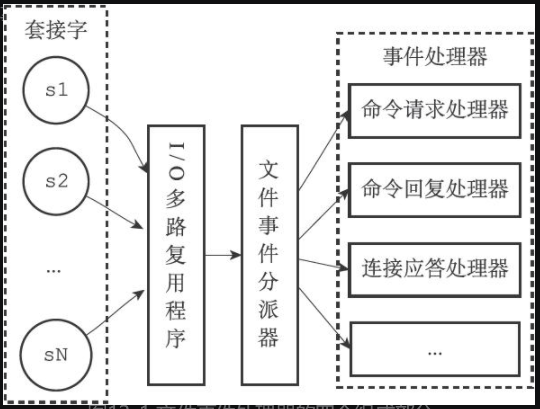

# 事件

Redis服务器是一个事件驱动程序

- 文件事件：Redis通过套接字与客户端建立链接，而**文件事件就是服务器对套接字操作的抽象**。服务器与客户端的通信会产生一系列相应的文件事件
- 时间事件：对定时操作的抽象

## 1. 文件事件

​	基于Reactor模式创建了自己的网络事件处理器，称为文件事件处理器：

- 使用I/O多路复用同时监听多个套接字，根据套接字的不同选择不同的事件处理器
- 当监听的套接字准备好执行操作时，相应的文件事件就会发生。

文件事件处理器以**单线程方式**运行，但通过使用I/O多路复用程序来监听多个套接字

### 文件事件处理器的构成

​	

​	套接字 -> I/O多路复用 -> 文件事件分派器 -> 事件处理器

- 文件事件是对套接字操作的抽象，每当套接字准备好执行操作时，就会产生一个文件事件，因为一个服务器通常会连接多个套接字，所以多个文件事件会并发的出现
- I/O多路复用程序监听多个套接字，向文件事件分派器传送被“激活”的套接字

I/O多路复用程序会将所有产生事件的套接字都放到一个队列里，通过该队列，有序，同步的到达文件事件分派器

### I/O多路复用程序的实现

​	

