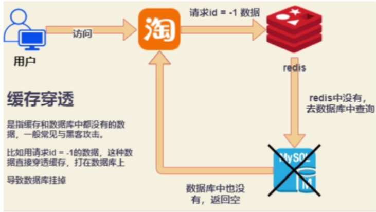
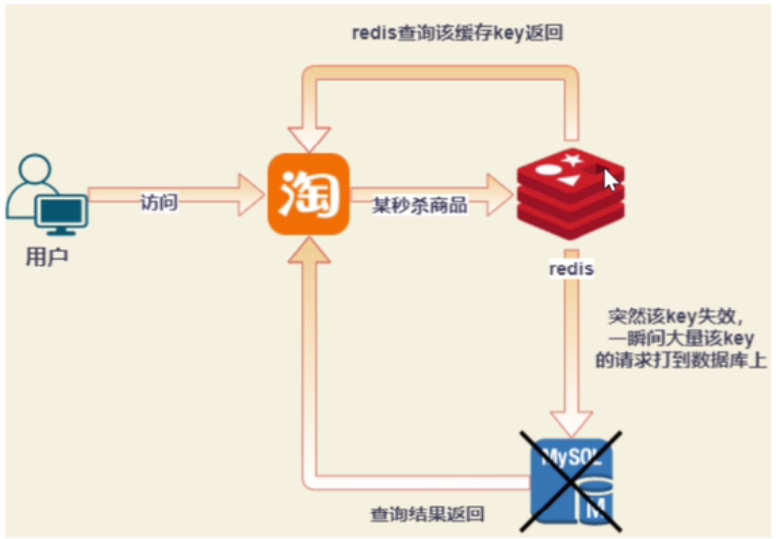
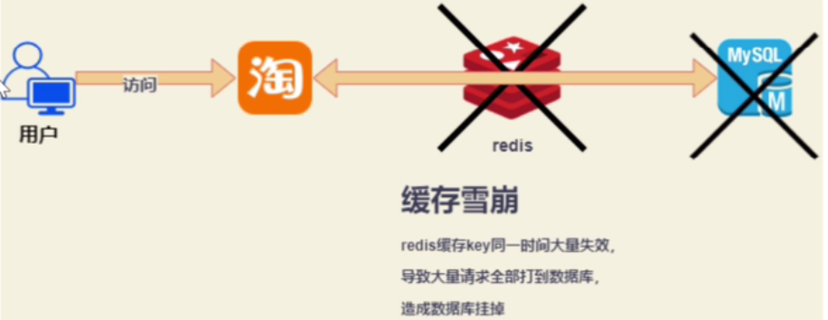

# 缓存穿透，雪崩，击穿

## 缓存穿透

​	大量查询缓存和数据库中都没有的数据

**解决方式**

1. 缓存空值

2. 拉黑ip

3. 对参数的合法性校验

4. 布隆过滤器（推荐）

    

## 缓存击穿

​	某个key突然失效，大量请求打到数据库上

**解决方式**

1. 分布式锁，当请求达到数据库时，加锁

## 缓存雪崩

​	redis缓存key同一时间大量失效，导致全部请求全部打到数据库，造成数据库挂掉

**解决方式**

1. 设置缓存时间，让不同key不要在同一时间大量失效
2. 集群分布情况下，让热点key放到不同的redis节点上
3. 定时任务，定时刷新缓存

