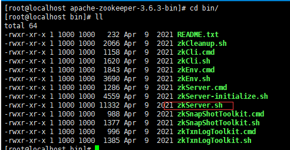

# Zookeeper

## 1. ZK简介

​	一个分布式的，开放源码的分布式应用程序协调服务。

## 2. ZK数据模型

### 2.1 模型结构

​	

### 2.2 模型的特点

- 每个子目录如/node1都被称作一个znode（节点）。这个znode是它所在的路径唯一标识
- znode可以有子节点目录，并且每个znode可以存储数据
- znode是有有版本的，每个znode中存储的数据可以有多个版本，也就是一个访问路径中可以存储多份数据
- znode是可以被监控，包括这个目录节点中存储的数据的修改，子节点目录的变化等，一旦变化可以通知设置监控的客户端

## 3. 节点的分类

### 3.1  持久节点（PERSISTENT）

​	指在节点创建后，就一直存在，知道有删除操作来主动删除这个节点--会因为创建该节点的客户端会话失效而消失

### 3.2 持久顺序节点（PERSISTENT_SEQUENTIAL）

​	这类节点的基本特性和上面的节点类型是一致的。额外的特性是，在ZK中，每个父节点会为他的第一级子节点维护一份时序，会记录每个子节点创建的先后顺序。基于这个特性，在创建子节点的时候，可以设置这个属性，那么在创建节点过程中，ZK会自动为给定节点名加上一个数字后缀，作为新的节点名。这个数字后缀的范围是整型的最大值。

### 3.3 临时节点（EPHEMERAL）

​	和持久节点不同的是，临时节点的生命周期和客户端会话绑定。也就是说，如果客户端会话失效，那么这个节点就会自动被清除掉。注意，这里提到的是会话失效，而非连接断开。另外，在临时节点下面不能创建子节点。

### 3.4 临时顺序节点（EPHEMERAL_SEQUENTIAL）

​	具有临时节点特点额外的特性是，每个父节点会为他的第一级子节点维护一份时序。这点和刚才提到的持久顺序节点类似

## 4. 安装

### 4.1 linux系统安装

- 安装JDK

```bash
 tar -zxvf jdk-8u171-linux-x64.tar.gz 
 mv ./jdk1.8.0_171/ /usr/java/
```

```bash
vim /etc/profile
source /etc/profile
```


- 安装ZK

```bash
tar -zxvf apache-zookeeper-3.6.3-bin.tar.gz
```


```bash
cd conf/
```


由于zk默认加载的是`zoo.cfg`，所以需要改名

```bash
mv zoo_sample.cfg zoo.cfg
```


由于zookeeper加载要将节点加载到磁盘，所以需要预先新建一个磁盘目录

```bash
mkdir /tmp/zookeeper
```

- 启动ZK



```bash
[root@localhost bin]# ./zkServer.sh start /root/apache-zookeeper-3.6.3-bin/conf/zoo.cfg 
ZooKeeper JMX enabled by default
Using config: /root/apache-zookeeper-3.6.3-bin/conf/zoo.cfg
Starting zookeeper ... STARTED

# 查看是否启动
jps
```


​	QuorumPeerMain就是zk

- 连接ZK

```bash
./zkCli.sh -server 192.168.9.3:2181
```

如果是本机，-server后可不加

## 5. 配置文件说明


- `tickTime`：集群节点心跳时间，
- `initLimit`：初始化集群时集群节点同步超时时间20s
- `syncLimit`：集群在运行过程中，同步数据超时时间为10s（这里5是指5次心跳）
- `dataDir`：默认数据存储位置
- `clientPort`：zk服务监听端口号
- `maxClientCnxns`：线程池线程数量

## 6. 客户端基本指令

- 查看节点

```bash
ls / # 根节点
```


- 创建节点

```bash
create path data # 创建一个节点，并给节点绑定数据（默认是持久性节点）
- create path data # 持久节点
- create -s path data # 持久性顺序节点
- create -e path data # 临时性节点
- create -e -s path data # 临时顺序节点
```


`quit`：会直接导致会话断开，会话失效，其他ctrl+c会导致触发倒计时

注：临时节点上不能创建**任何**节点

- 查看节点状态

```bash
stat /node1
```


`cZxid`：创建事务ID

`ctime`：创建时间

`mZxid`：修改ID

`mtime`：修改时间

`pZxid`：父结点版本号

`cversion`：创建版本号

`dataVersion`：数据版本号

`aclVersion`：

`ephemerslOwner`：是否是临时节点

`dataLength`：存储数据长度

`numChildren`：子节点数量

- 获得节点上绑定的数据信息

```bash
get /node1
```


- 删除节点

```bash
delete /node1
```


只能删除没有子节点的节点，如果有子节点，则无法删除

若想删除有子节点的，则需要`deleteall`


## 7. watch节点监听机制  

监听分为**节点目录监听**和**节点数据监听**

- 目录监听是监听节点目录的变化
- 数据监听是监听当前节点数据的变化

两种监听都是一次性的，也就是发现一个修改，下次修改则不会触发监听机制

- 目录监听

```bash
ls -w /node
```


再次创建，无触发


- 数据监听

```bash
get -w /node 
```


