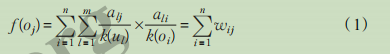
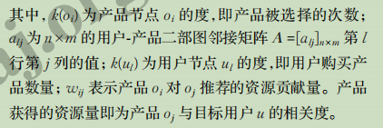

样例说明

`train_click_log.csv`：训练集用户点击日志

| user_id | click_article_id | click_timestamp | click_environment | click_deviceGroup | click_os | click_country | click_region | click_referrer_type |
| ------- | ---------------- | --------------- | ----------------- | ----------------- | -------- | ------------- | ------------ | ------------------- |
| 199999  | 160417           | 1.50703E+12     | 4                 | 1                 | 17       | 1             | 13           | 1                   |
| 199999  | 5408             | 1.50703E+12     | 4                 | 1                 | 17       | 1             | 13           | 1                   |
| 199999  | 50823            | 1.50703E+12     | 4                 | 1                 | 17       | 1             | 13           | 1                   |

1. `user_id`: 用户的唯一标识
2. `click_article_id`: 用户点击的文章唯一标识
3. `click_timestamp`: 用户点击文章时的时间戳
4. `click_environment`: 用户点击文章的环境
5. `click_deviceGroup`: 用户点击文章的设备组
6. `click_os:` 用户点击文章时的操作系统
7. `click_country`: 用户点击文章时的所在的国家
8. `click_region`: 用户点击文章时所在的区域
9. `click_referrer_type`: 用户点击文章时，文章的来源

`testA_click_log.csv`：测试集用户点击日志

| user_id | click_article_id | click_timestamp | click_environment | click_deviceGroup | click_os | click_country | click_region | click_referrer_type |
| ------- | ---------------- | --------------- | ----------------- | ----------------- | -------- | ------------- | ------------ | ------------------- |
| 249999  | 160974           | 1.50696E+12     | 4                 | 1                 | 17       | 1             | 13           | 2                   |
| 249999  | 160417           | 1.50696E+12     | 4                 | 1                 | 17       | 1             | 13           | 2                   |
| 249998  | 160974           | 1.50696E+12     | 4                 | 1                 | 12       | 1             | 13           | 2                   |

`articles.csv`：新闻文章信息数据表

| article_id | category_id | created_at_ts | words_count |
| ---------- | ----------- | ------------- | ----------- |
| 0          | 0           | 1.51314E+12   | 168         |
| 1          | 1           | 1.40534E+12   | 189         |
| 2          | 1           | 1.40867E+12   | 250         |

`articles_emb.csv`：新闻文章enbedding向量表示

| article_id | emb_0       | emb_1       | emb_2       | emb_3       | emb_4      | emb_5      | emb_6       | emb_7       |
| ---------- | ----------- | ----------- | ----------- | ----------- | ---------- | ---------- | ----------- | ----------- |
| 0          | -0.16118301 | -0.95723313 | -0.13794445 | 0.050855342 | 0.83005524 | 0.90136534 | -0.33514765 | -0.55956066 |
| 1          | -0.52321565 | -0.974058   | 0.73860806  | 0.15523443  | 0.626294   | 0.48529708 | -0.71565676 | -0.8979958  |
|            |             |             |             |             |            |            |             |             |

YouTuBe

NBI

基于网络结构的推荐算法不考虑用户和项目的内容特 征，而仅仅把它们看成抽象的节点，因此算法利用的信息都藏在用户和项目的选择关系中。

​	基于网络结构的推荐算法把用户和项目看成抽象顶点，算法利用的信息都隐藏在用户和项目的关联关系中。在一般的基于网络结构推荐系统中，通过计算用户和项目之间的相关度来排序得到推荐项目，那么给用户*u* 推荐项目可以转化为度量用户顶点 *u* 和与此用户没有直接边相连的项目顶点在图上的相关度，相关度越高的项目在推荐列表上的权重就越高，推荐位置越靠前。假设用户 *u* 选择过的所有产品都具有某种向用户 *u* 推荐其他产品的能力，这个抽象的能力看作相关产品上某种可分资源。存在 *n* 个用户和 *m* 个产品，经过两个阶段的资源传递，产品 $o_j$ 获得的资源量为：

​	

长尾效应：是指那些原来不受到重视的销量小但种类多的产品或服务由于总量巨大，累积起来的总收益超过主流产品的现象

