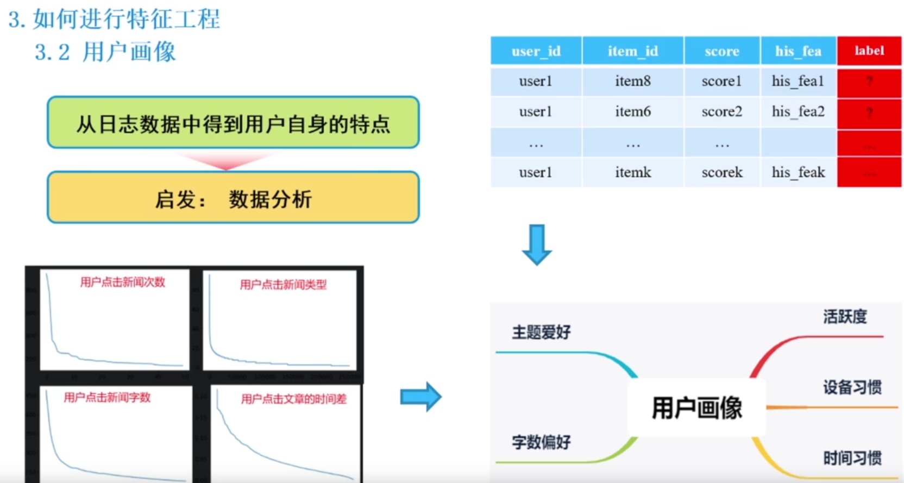
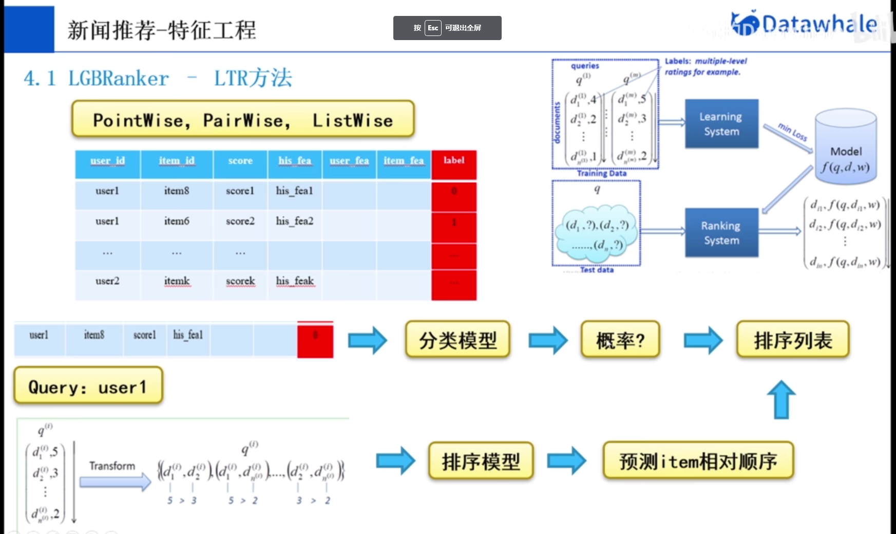

# 新闻推荐

## 3 赛题理解

### 3.3 赛题数据

### 3.4 评价指标

### 3.5 基线方案

#### 召回

**为什么需要召回？**

从海量文章中获取少量文件

**如何做召回？**

**基于商品的协同过滤**：给用户推荐与用户历史喜欢商品相似的商品

**问题就是：如何度量两个物品之间的相似度？**

​	两个物品同时被同一个用户喜欢的用户数量

对于这种，我们通过**余弦相似度**去做

​	这种方法会有问题，因为大多数商品是没有人点击的，那么会存在许多空值，如果这样遍历，时间复杂度就是$O(n^2)$。

​	**优化方法**

​	

​	通过计算每个用户对应的商品集合，

问题：存在两个商品没有相似度

**如何获取用户的候选文章？**

#### 排序

## 4. 特征工程

