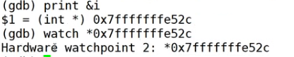
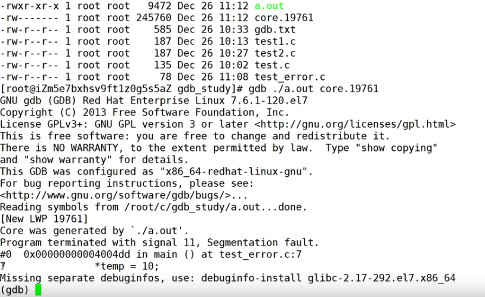

# GDB

官网

[GDB: The GNU Project Debugger (sourceware.org)](https://www.sourceware.org/gdb/)


## 1.GDB是什么

​	调试器

## 2. 使用

将c文件编译为能被gdb调试的文件

`gcc -g test.c`

```c
r // 使程序执行
quit // 退出
b main // 在主函数打端点
    
b 行数 // 给行数打端点
info b // 查看断点信息
n // 下一步
p x // 打印
step // 进入函数

```

可以通过`shell`调用终端命令

`set loggin on`  ：打开日志功能，记录gdb过程


`watchpoint`：观察点



`watch *地址`

`info watchpoints`


调试一个挂掉的程序，会生成不了`core`文件，可以使用ulimit进行设置

```c
ulimit -c unlimited
ulimit -a
```



调试正在运行的程序

`gdb -p 进程号`