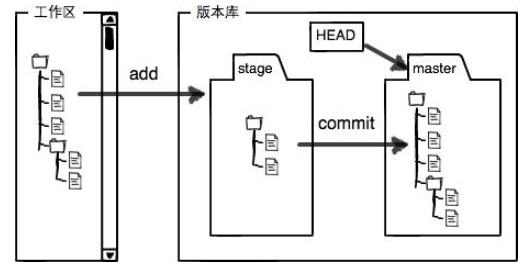
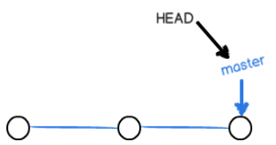
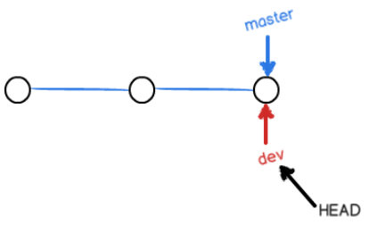
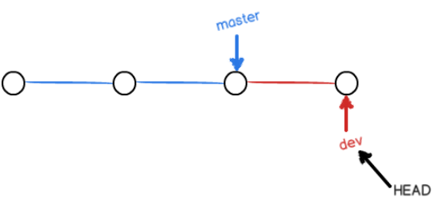
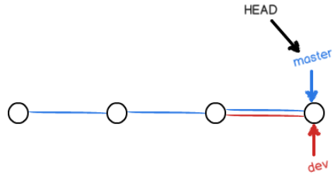
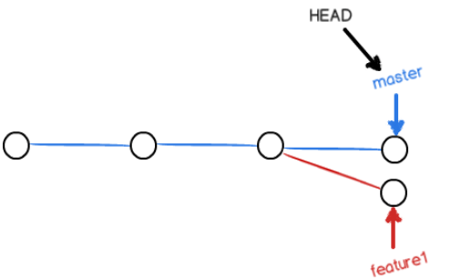
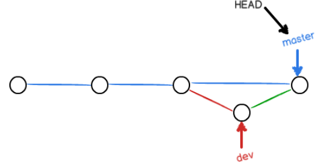
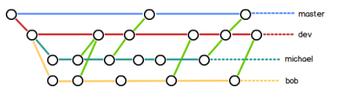
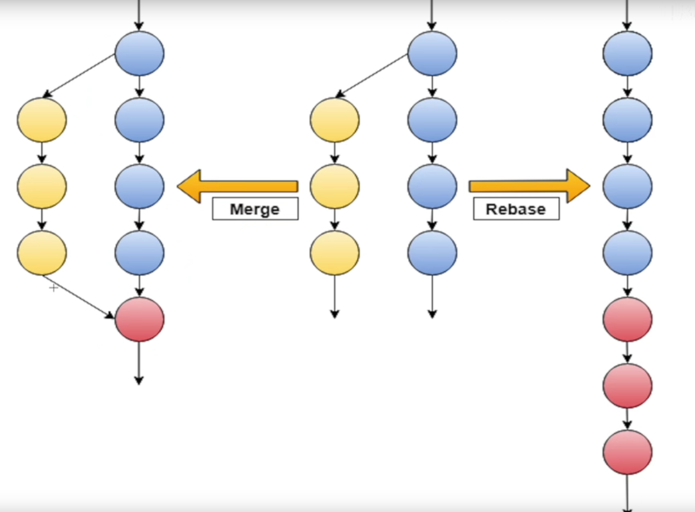

# Git

Git 是一个分布式版本控制系统

## 集合式 VS 分布式

​	SVN以及CVS都是集中式的，而Git是分布式版本控制系统，那么这两者有什么区别呢？

​	集中式会有一个中央服务器，每个人都需要从中获取最新的版本进行修改，再推送会中央服务器，必须联网才能工作

​	分布式版本控制没有中央服务器，每个人的电脑都是一个完整的版本库，只要有人修改了文件，再推送给另外一个人，互相都可以看到对方的修改。但通常，分布式也有一台充当“中央处理器”的电脑，为的是方便交换大家的修改，

## Linux上安装Git

```shell
sudo apt-get install git
# 设置用户名邮箱
git config --global user.name "Your Name"
git config --global user.email "email@example.com"
```

## 创建版本库

一个目录，所有文件都能被Git管理起来

```shell
git init
ls -ah # 查看隐藏文件
```

**把文件添加进版本库**

​	可以跟踪文本文件的改动，无法跟踪二进制文件，图片的改动

第一步

把文件添加到仓库

```shell
git add readme.txt
```

第二步

把文件提交到仓库

```shell
git commit -m "message"
```

`git add`提交不同的文件，`git commit`可以一次提交很多文件

## 查看状态

```shell
git status  # 仓库当前的状态
git diff readme.txt # 查看对文件做了哪些修改
git diff HEAD -- readme.txt # 查看工作区和版本库里最新版本的区别
```

## 版本回退

```shell
git log # 显示从最近到最远的提交日志
git log --pretty=online
```

在Git中，用`HEAD`表示当前版本，上一个版本就是`HEAD^`，上上一个就是`HEAD^^`，太多了可以写成`HEAD~100`

```shell
git reset --hard HEAD^ # 回到上一个版本
```

如果回去，在命令行窗口没有关掉时，可以指定对应的commit ID回去

```shell
git reset --hard 1094a
```

```shell
git reflog # 查看命令历史，方便重返未来
```

## 工作区和暂存区

工作区就是电脑上能看到的目录

.git是Git的版本库，有个称为stage的暂存区，还有git为我们创建的第一个分支`master`.以及指向`master`的一个指针`HEAD`



​	`git add`将文件添加进去，也就是将文件添加到暂存区

​	`git commit`提交更改，将暂存区的所有内容提交到当前分支

	## 撤销修改

```shell
git checkout -- readme.txt # 将在工作区的修改全部撤销
```

​	如果`readme.txt`放到暂存区，撤销修改就回到和版本库一样的状态

​	已经添加到暂存区，又作了修改，则回到添加到暂存区的状态

如何将第二种情况的撤销呢？使它回到和版本库一样

1. `git reset HEAD readme.txt`，将暂存区的修改撤销掉
2. `git checkout -- readme.txt`，丢弃工作区的修改

## 删除文件

```shell
git rm test.txt # 删除版本库中的文件
```

如果误把工作区的删了

```shell
git checkout -- test.txt # 用版本库里的版本替换工作区的版本
```

## 添加远程仓库

```shell
git remote add origin git@github.com:michaelliao/learngit.git
git push -u origin master # 推送到远程仓库上，-u关联本地master分支和远程master分支
```

查看远程库信息

```shell
git remote -v
```

删除远程仓库

```shell
git remote rm origin
```

克隆远程仓库

```shell
git clone 
```

## 创建并合并分支



`master`分支是一条线，`Git`用`master`指向最新的提交，再用`HEAD`指向`master`



创建一个新的分支，则是新建了一个指针`dev`，指向`master`相同的提交，再把`HEAD`指向`dev`，就表示当前分支在`dev`上



`dev`指针往前移动一步，而`master`指针不变



Git怎么合并呢？最简单的方法，就是直接把`master`指向`dev`的当前提交

```shell
git checkout -b dev # 创建dev分支，然后切换到dev分支
= 
git branch dev
git checkout dev
```

```shell
git branch # 查看当前分支
git checkout # 切换分支
git merge dev # 在master分支执行，将dev合并进来
```

删除分支

```shell
# 对于已经合并的分支
git branch -d dev
# 对于未合并的分支
git branch -D feature-vunlcan
```

**switch**

创建并切换到新的分支

```shell
git switch -c dev
```

直接切换到已有的分支

```shell
git switch master
```

**总结**

查看分支：`git branch`

创建分支：`git branch <name>`

切换分支：`git checkout <name>`或者`git switch <name>`

创建+切换分支：`git checkout -b <name>`或者`git switch -c <name>`

合并某分支到当前分支：`git merge <name>`

删除分支：`git branch -d <name>`

## 解决冲突

冲突产生的原因：`master`分支和`feature1`分支各自都分别有新的提交



使用`git status`查看冲突的文件

Git用`<<<<<<<`，`=======`，`>>>>>>>`标记出不同分支的内容

用带参数的`git log`可以看到分支的合并情况

```shell
git log --graph --pretty=oneline --abbrev-commit
```

用`git log --graph`命令可以看到分支合并图。

## 分支管理策略

如果禁用了`Fast forward`模式，Git就会在`merge`时生成一个新的`commit`.

准备合并`dev`分支，请注意`--no-ff`参数，表示禁用`Fast forward`:

```shell
git merge --no-ff -m "merge with no-ff" dev
```

```shell
git log --graph --pretty=oneline --abbrev-commit
```



一般在`dev`上干活，预发布时在合并到`master`分支上：



## BUG分支

在维修Bug时，通常需要新建一个临时分支

如果当前自己在`dev`上进行的工作还没有提交，可以通过`stash`来进行储藏现场，等以后恢复现场继续工作

```shell
git stash
```

此时就可以切换到临时分支

```shell
git checkout -b issue-101
# 修复完成后，切换为master分支，完成合并
git switch master
git merge --no-ff -m "merge buf fix 101" issue-101
```

返回dev分支

```shell
git switch dev
# 查看隐藏空间
git stash list
# 恢复
git stash apply 
# 删除
git stash drop
# 此处应该进行一次提交，保证恢复的现场得以保存
```

由于dev分支是从master分支分出来的，所以，该bug在当前dev分支也会存在

使用`cherry-pick`命令，复制一个特定的提交到当前分支：

```shell
git cherry-pick [commit ID]
```

[为什么要用stash]([(77条消息) 为什么要用git stash_ForMyQianDuan的博客-CSDN博客_git stash有什么用](https://blog.csdn.net/ForMyQianDuan/article/details/78750434))

## 多人协作

```shell
# 查看远程库的信息
git remote
# 显示更加详细的信息
git remote -v
```

**推送分支**

```shell
git push origin master
git push origin dev
```

- `master`分支是主分支，要时刻与远程同步
- `dev`分支是开发分支，团对所有成员都需要在上面工作，需要与远程同步
- 其他分支看心情

**抓取分支**

如果另一个将`dev`分支`push`到远程后，而我也对同样的文件作了修改，并试图推送，会推送失败，会产生冲突

此时需要用`git pull`将最新的提交从`origin/dev`抓下来，然后，在本地合并，解决冲突，再推送

如果`git pull`失败了，原因是没有指定本地`dev`分支与远程`origin/dev`分支的链接，根据提示，指定即可

```shell
git branch --set-upstream-to=origin/dev dev
```

再`pull`：

这会`pull`成功，但合并有问题，与前面解决冲突完全一样


多人协作的工作模式通常是这样：

1. 首先，可以试图用`git push origin <branch-name>`推送自己的修改；
2. 如果推送失败，则因为远程分支比你的本地更新，需要先用`git pull`试图合并；
3. 如果合并有冲突，则解决冲突，并在本地提交；
4. 没有冲突或者解决掉冲突后，再用`git push origin <branch-name>`推送就能成功！

如果`git pull`提示`no tracking information`，则说明本地分支和远程分支的链接关系没有创建，用命令`git branch --set-upstream-to <branch-name> origin/<branch-name>`。

**总结**

- 查看远程库信息，使用`git remote -v`；
- 本地新建的分支如果不推送到远程，对其他人就是不可见的；
- 从本地推送分支，使用`git push origin branch-name`，如果推送失败，先用`git pull`抓取远程的新提交；
- 在本地创建和远程分支对应的分支，使用`git checkout -b branch-name origin/branch-name`，本地和远程分支的名称最好一致；
- 建立本地分支和远程分支的关联，使用`git branch --set-upstream branch-name origin/branch-name`；
- 从远程抓取分支，使用`git pull`，如果有冲突，要先处理冲突。

## Rebase

[Git - 变基 (git-scm.com)](https://git-scm.com/book/zh/v2/Git-分支-变基)



​	`merge`会将两个分支合并并生成一个新的提交

​	`rebase`会在合并前，检测另一个分支修改的东西，将它放到主分支后。

## 创建标签

切换到需要打标签的分支上，执行以下命令

```shell
# 打一个标签
git tag v1.0
# 查看所有标签
git tag
```

```shell
# 为相应的commit id打上标签
git log --pretty=oneline --abbrev-commit
git tag v0.9 [commit ID]
git show <tagname> # 查看标签信息
```

创建带有说明的标签，用`-a`指定标签名，`-m`指定说明文字

```shell
git tag -a v0.1 -m "version 0.1 released" <commit ID>
```

## 操作标签

- 命令`git push origin <tagname>`可以推送一个本地标签；
- 命令`git push origin --tags`可以推送全部未推送过的本地标签；
- 命令`git tag -d <tagname>`可以删除一个本地标签；
- 命令`git push origin :refs/tags/<tagname>`可以删除一个远程标签。

## 忽略特殊文件

使用`.gitignore`文件

确实想添加该文件，使用`-f`强制添加到Git：

```shell
git add -f App.class
```

检查哪行忽略了该文件

```shell
git check-ignore -v App.class
```


