# MySql高级：sql调优，数据库优化

[[尚硅谷MySQL数据库高级，mysql优化，数据库优化_哔哩哔哩_bilibili](https://www.bilibili.com/video/BV1KW411u7vy?p=3&spm_id_from=pageDriver)]

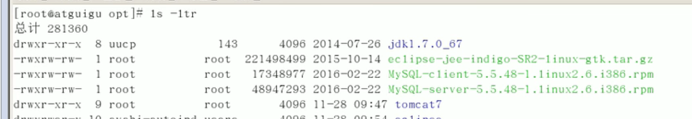

linux中第三方软件包放在opt目录下

linux下操作数据库一些linux命令：

```shell
rpm -qa | grep -i mysql # 检查是否安装mysql
rpm -ivh # 安装rpm包
id 用户名 # 是否存在该用户
/use/bin/mysqladmin -u root password 123456 #设置密码
chkconfig mysql on # 设置mysql开机自启
chkconfig --list | grep mysql
cat /etc/inittab
ntsysv  # 查看开启的服务（原始方式）

# 数据库创建的数据库存放位置
/var/lib/mysql
cp /etc/init.d/mysql/my.default.cnf /etc/my.cnf # 拷贝配置文件
```

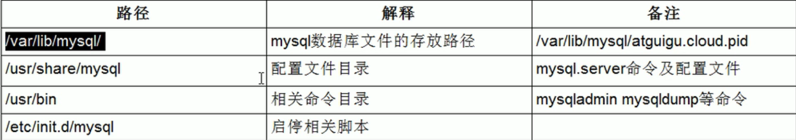

```shell
show variables like '%char'; # 查看字符集
vim my.cnf # 修改配置文件
```

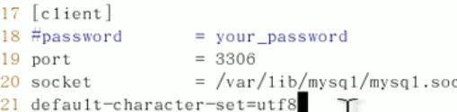

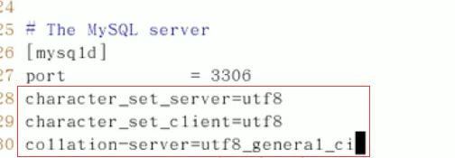

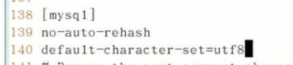

修改完配置文件需要重启MySql

已经建好的库，修改完字符集对其依然不会生效

## MySql逻辑架构


插件式的存储引擎架构将查询处理和其他系统任务以及数据的存储提取相分离

## 存储引擎简介

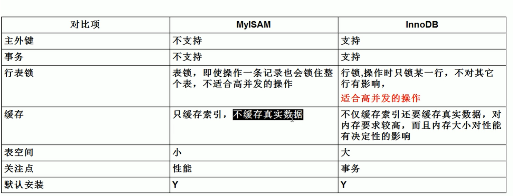

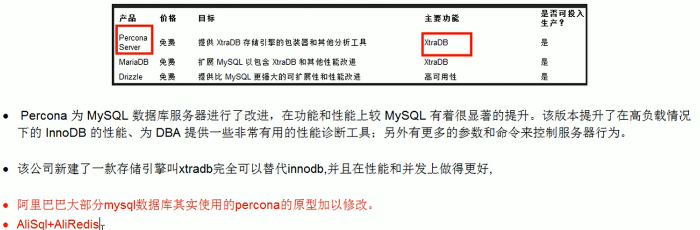

## Sql性能下降原因


## Sql执行加载顺序

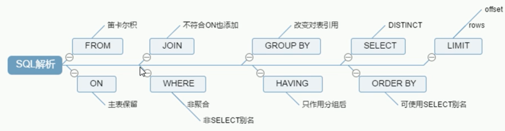

## 七种JOIN理论

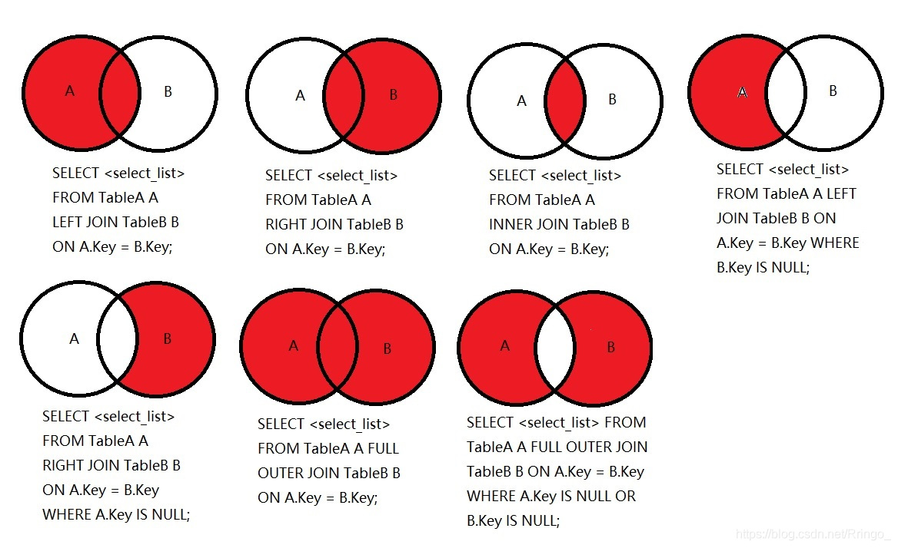

[结合该博文会更好理解]([(73条消息) 图解MySQL 内连接、外连接、左连接、右连接、全连接……太多了_plg17的专栏-CSDN博客_左连接右连接](https://blog.csdn.net/plg17/article/details/78758593))

第七种full在mysql中不支持，可以使用`union`

## 索引是什么

MySQL官方对索引的定义为：**索引（INDEX）是帮助MySQL高效获取数据的数据结果。**

从而可以获得索引的本质：索引是排好序的快速查找数据结构。

```java
# Linux下查看磁盘空间命令 df -h 
[root@Ringo ~]# df -h
Filesystem      Size  Used Avail Use% Mounted on
/dev/vda1        40G   16G   23G  41% /
devtmpfs        911M     0  911M   0% /dev
tmpfs           920M     0  920M   0% /dev/shm
tmpfs           920M  480K  920M   1% /run
tmpfs           920M     0  920M   0% /sys/fs/cgroup
overlay          40G   16G   23G  41%
```

### 索引的优势和劣势

**优势**

- 查找：类似大学图书馆的书目索引，**提高数据检索的效率，降低数据库的IO成本**
- 排序：通过索引対数据进行排序，**降低数据排序的成本，降低了CPU的消耗**

**劣势**

- 实际上索引也是一张表，该表保存了主键与索引字段，并指向实体表的记录，所以**索引列也是要占用空间的**
- 虽然索引大大提高了查询速度，但是同时**会降低表的更新速度**，例如对表频繁的进行`INSERT`、`UPDATE`和`DELETE`。因为更新表的时候，MySQL不仅要保存数据，还要保存一下索引文件每次更新添加的索引列的字段，都会调整因为更新所带来的键值变化后的索引信息。

- 索引只是提高效率的一个因素，如果MySQL有大数据量的表，就需要花时间研究建立最优秀的索引。

## 索引分类

- **单值索引**：一个索引只包含单个列，一个表可以有多个单列索引。
- **唯一索引**：索引列的值必须唯一，但是允许空值。

- **复合索引**：一个索引包含多个字段。

**建议：一张表建的索引最好不要超过5个！**

```sql
/* 1、该语句添加一个主键，这意味着索引值必须是唯一的，并且不能为NULL */
ALTER TABLE tabName ADD PRIMARY KEY(column_list);

/* 2、该语句创建索引的键值必须是唯一的(除了NULL之外，NULL可能会出现多次) */
ALTER TABLE tabName ADD UNIQUE indexName(column_list);

/* 3、该语句创建普通索引，索引值可以出现多次 */
ALTER TABLE tabName ADD INDEX indexName(column_list);

/* 4、该语句指定了索引为FULLTEXT，用于全文检索 */
ALTER TABLE tabName ADD FULLTEXT indexName(column_list);
```

## 索引大致结构

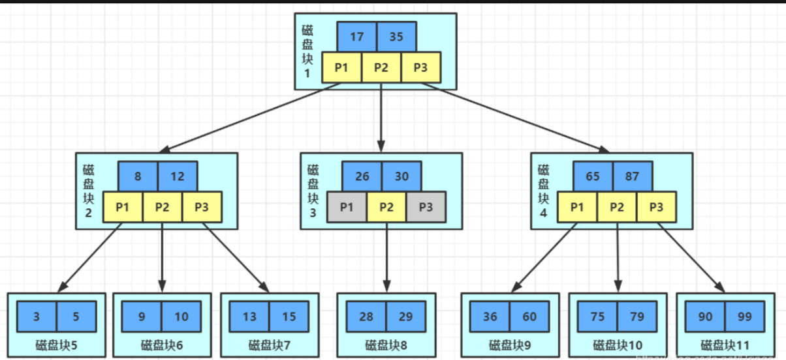

## 哪些情况需要建索引或不能建索引

**需要建索引**

- 主键**自动建立主键**索引（唯一 + 非空）
- **频繁作为查询条件的字段**应该创建索引

- 查询中与其他表关联的字段，**外键**关系建立索引
- 查询中**排序的字段**，排序字段若通过索引去访问将大大提高排序速度，建的复合索引尽量与Order by 一致

- 查询中**统计或者分组字段**（group by也和索引有关）

**不能建索引**

- 记录太少的表。 
- 经常增删改的表。 

- 频繁更新的字段不适合创建索引。 
- Where条件里用不到的字段不创建索引。 

- 假如一个表有10万行记录，有一个字段A只有true和false两种值，并且每个值的分布概率大约为50%，那么对A字段建索引一般不会提高数据库的查询速度。索引的选择性是指索引列中不同值的数目与表中记录数的比。如果一个表中有2000条记录，表索引列有1980个不同的值，那么这个索引的选择性就是1980/2000=0.99。一个索引的选择性越接近于1，这个索引的效率就越高。 

## 性能分析

## MySQL Query Optimizer

​	MySQL中专门负责优化SELECT语句的优化器模块

​	主要功能：通过计算分析系统中收集到的统计信息，为客户端请求的Query提供它认为最优的执行计划（它认为最优的数据检索方式，但不见得是DBA认为最优的，这部分最耗费时间）

​	当客户端像MySQL请求一条Query，命令解析器模块完成请求分类，去别处是SELECT并转发给MySQL Query Optimizer ，MySQL Query Optimizer首先会对整条Query进行优化，处理掉一些常量表达式的预算，直接换算成常量值。并对Query中的查询条件进行简化和转换，如去掉一些无用或显而易见的条件，结构调整等。然后分析Query中的Hint信息（如果有），看显示Hint信息是否可以完全确定该Query的执行计划。如果没有Hint或Hint信息还不足以完全确定执行计划，则会读区所涉及对象的统计信息，根据Query进行写相应的计算分析，然后再得出最后的执行计划。

## MySQL常见瓶颈

**CPU**：CPU再饱和的时候一般发生再数据装入内存或从磁盘上读区数据的时候

**IO**：磁盘IO瓶颈发生再装入数据远大于内存容量的时候

**服务器硬件的性能瓶颈**：top free iostat和vmstat来查看系统的性能状态

## EXPLAIN

**EXPLAIN是什么**

- EXPLAIN：SQL的执行计划，使用EXPLAIN关键字可以模拟优化器执行SQL查询语句，从而知道MySQL是如何处理SQL语句的。

语法：`explain + SQL语句`

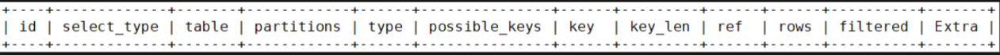

**EXPLAIN能干嘛**

可以查看以下信息

- - `id`：表的读取顺序
    - `select_type`：数据读取操作的操作类型

- - `possible_keys`：哪些索引可以使用
    - `key`：哪些索引被实际使用

- - `ref`：表之间的引用
    - `rows`：每张表有多少行被优化器查询

### EXPLAIN字段

**id**：值有以下三种情况

- - id相同，执行顺序由上至下
    - id不同，如果是子查询，id的序号会递增，**id值越大优先级越高，越先被执行**

- - id相同不同，同时存在。**永远是id大的优先级最高，id相等的时候顺序执行**

- 

**select_type**：数据查询的类型，主要是用于区别，普通查询、联合查询、子查询等的复杂查询。

- `SIMPLE`：简单的`SELECT`查询，查询中不包含子查询或者`UNION`。
- `PRIMARY`：查询中如果包含任何复杂的子部分，最外层查询则被标记为`PRIMARY`。

- `SUBQUERY`：在`SELECT`或者`WHERE`子句中包含了子查询。
- `DERIVED`：在`FROM`子句中包含的子查询被标记为`DERIVED(衍生)`，MySQL会递归执行这些子查询，把结果放在临时表中。

- `UNION`：如果第二个`SELECT`出现在`UNION`之后，则被标记为`UNION`；若`UNION`包含在`FROM`子句的子查询中，外层`SELECT`将被标记为`DERIVED`。
- `UNION RESULT`：从`UNION`表获取结果的`SELECT`。


**type**：访问类型排列

从最好到最差依次是：`system` > ` const ` > ` eq_ref ` > ` ref ` > ` range ` > ` index ` > ` ALL `。除了`ALL`没有用到索引，其他级别都用到索引了。

一般来说，得保证查询至少达到` range `级别，最好达到` ref `

- ` system `

    表只有一行记录（等于系统表），这是`const`类型的特例，平时不会出现，这个可以忽略不计。

- ` const `

    表示通过索引一次就找到了，`const`用于比较`primary key`或者`unique`索引。因为只匹配一行数据，所以很快。如将主键置于`where`中，MySQL就能将该查询转化为一个常量 

- ` eq_ref `

    唯一性索引扫描，对于每个索引键，表中只有一条记录与之匹配，常见于主键或唯一索引扫描。除了 `system` 和`const` 类型之外, 这是最好的联接类型。 

- `ref`

    非唯一性索引扫描，返回本表和关联表某个值匹配的所有行，查出来有多条记录。 

- ` range `

    只检索给定范围的行，一般就是在`WHERE`语句中出现了`BETWEEN`、`< >`、`in`等的查询。这种范围扫描索引比全表扫描要好，因为它只需要开始于索引树的某一点，而结束于另一点，不用扫描全部索引。 

- ` index `

    `Full Index Scan`，全索引扫描，`index`和`ALL`的区别为`index`类型只遍历索引树。

​		 也就是说虽然 ` ALL ` 和 ` index ` 都是读全表，但是 ` index ` 是从索引中读的， ` ALL ` 是从磁盘中读取的。  

- ` ALL `

    `Full Table Scan`，没有用到索引，全表扫描。

- 

**possible_keys**

显示可能应用在这张表中的索引，一个或者多个。

查询涉及到的字段上若存在索引，则该索引将被列出，**但不一定被查询实际使用。**


**key**

实际使用的索引。如果为`NULL`，则没建或没有使用索引，即索引失效。

**查询中如果使用了覆盖索引，则该索引仅仅出现在**`key`**列表中。**与Extra有关


**key_len**

表示索引中使用的字节数，可通过该列计算查询中使用的索引的长度。

`key_len`显示的值为索引字段的最大可能长度，并非实际使用长度，即`key_len`是根据表定义计算而得，不是通过表内检索出的。在不损失精度的情况下，长度越短越好。


**ref**

显示索引的哪一列被使用了，如果可能的话，是一个常数。哪些列或常量被用于查找索引列上的值。


**rows**

根据表统计信息及索引选用情况，大致估算出找到所需的记录需要读取的行数。


**Extra**

包含不适合在其他列中显示但**十分重要的额外信息**。

- **Using filesort**

​		说明MySQL会对数据使用一个外部的索引排序，而不是按照表内的索引顺序进行读取。

- **Using temporary**
    使用了临时表保存中间结果，MySQL在対查询结果排序时使用了临时表。常见于排序order by和分组查询group by。临时表対系统性能损耗很大。
- **Using index**

​		表示相应的`SELECT`操作中使用了**覆盖索引**，避免访问了表的数据行，效率不错！如果同时出现`Using where`，表示索引被用来执行索引键值的查找；如果没有同时出现`Using where`，表明索引用来读取数据而非执行查找动作。 

- **Using where**：表明使用了`WHERE`过滤。

- **Using join buffer**：使用了连接缓存。

- **impossible where**：`WHERE`子句的值总是false，不能用来获取任何元组。

## 索引分析

### 单表索引分析

```sql
DROP TABLE IF EXISTS `article`;

CREATE TABLE IF NOT EXISTS `article` (
    `id`          INT(10) UNSIGNED NOT NULL PRIMARY KEY AUTO_INCREMENT COMMENT '主键',
    `author_id`   INT(10) UNSIGNED NOT NULL COMMENT '作者id',
    `category_id` INT(10) UNSIGNED NOT NULL COMMENT '分类id',
    `views`       INT(10) UNSIGNED NOT NULL COMMENT '被查看的次数',
    `comments`    INT(10) UNSIGNED NOT NULL COMMENT '回帖的备注',
    `title`       VARCHAR(255)     NOT NULL COMMENT '标题',
    `content`     VARCHAR(255)     NOT NULL COMMENT '正文内容'
) COMMENT '文章';

INSERT INTO `article`(`author_id`, `category_id`, `views`, `comments`, `title`, `content`)
VALUES (1, 1, 1, 1, '1', '1'),
       (2, 2, 2, 2, '2', '2'),
       (3, 3, 3, 3, '3', '3'),
       (1, 1, 3, 3, '3', '3'),
       (1, 1, 4, 4, '4', '4');
			 
EXPLAIN SELECT id, author_id FROM article WHERE category_id = 1 AND comments > 1 ORDER BY views DESC LIMIT 1;
/**
1	SIMPLE	article		ALL					5	20.00	Using where; Using filesort
**/
CREATE INDEX idx_article_ccv ON article(category_id, comments, views);
EXPLAIN SELECT id, author_id FROM article WHERE category_id = 1 AND comments > 1 ORDER BY views DESC LIMIT 1;
/**
1	SIMPLE	article		range	idx_article_ccv	idx_article_ccv	8		2	100.00	Using index condition; Using filesort
// 还是会有using filesort，需要将comments改为=才合适= =（所以希望前端一般传固定值较好）
范围会导致覆盖索引失效
**/
DROP INDEX idx_article_ccv ON article;
CREATE INDEX idx_article_ccv ON article(category_id, views);
SHOW INDEX FROM article;
EXPLAIN SELECT id, author_id FROM article WHERE category_id = 1 AND comments > 1 ORDER BY views DESC LIMIT 1;
```

### 两表索引分析

```sql
CREATE TABLE IF NOT EXISTS `class`(
`id` INT(10) UNSIGNED NOT NULL PRIMARY KEY AUTO_INCREMENT,
`card` INT (10) UNSIGNED NOT NULL
);
CREATE TABLE IF NOT EXISTS `book`(
`bookid` INT(10) UNSIGNED NOT NULL PRIMARY KEY AUTO_INCREMENT,
`card` INT (10) UNSIGNED NOT NULL
);
INSERT INTO class(card)VALUES(FLOOR(1+(RAND()*20)));
INSERT INTO class(card)VALUES(FLOOR(1+(RAND()*20)));
INSERT INTO class(card)VALUES(FLOOR(1+(RAND()*20)));
INSERT INTO class(card)VALUES(FLOOR(1+(RAND()*20)));
INSERT INTO class(card)VALUES(FLOOR(1+(RAND()*20)));
INSERT INTO class(card)VALUES(FLOOR(1+(RAND()*20)));
INSERT INTO class(card)VALUES(FLOOR(1+(RAND()*20)));
INSERT INTO class(card)VALUES(FLOOR(1+(RAND()*20)));
INSERT INTO class(card)VALUES(FLOOR(1+(RAND()*20)));
INSERT INTO class(card)VALUES(FLOOR(1+(RAND()*20)));
INSERT INTO class(card)VALUES(FLOOR(1+(RAND()*20)));
INSERT INTO class(card)VALUES(FLOOR(1+(RAND()*20)));
INSERT INTO class(card)VALUES(FLOOR(1+(RAND()*20)));
INSERT INTO class(card)VALUES(FLOOR(1+(RAND()*20)));
INSERT INTO class(card)VALUES(FLOOR(1+(RAND()*20)));
INSERT INTO class(card)VALUES(FLOOR(1+(RAND()*20)));
INSERT INTO class(card)VALUES(FLOOR(1+(RAND()*20)));
INSERT INTO class(card)VALUES(FLOOR(1+(RAND()*20)));
INSERT INTO class(card)VALUES(FLOOR(1+(RAND()*20)));
INSERT INTO class(card)VALUES(FLOOR(1+(RAND()*20)));
 
INSERT INTO book(card)VALUES(FLOOR(1+(RAND()*20)));
INSERT INTO book(card)VALUES(FLOOR(1+(RAND()*20)));
INSERT INTO book(card)VALUES(FLOOR(1+(RAND()*20)));
INSERT INTO book(card)VALUES(FLOOR(1+(RAND()*20)));
INSERT INTO book(card)VALUES(FLOOR(1+(RAND()*20)));
INSERT INTO book(card)VALUES(FLOOR(1+(RAND()*20)));
INSERT INTO book(card)VALUES(FLOOR(1+(RAND()*20)));
INSERT INTO book(card)VALUES(FLOOR(1+(RAND()*20)));
INSERT INTO book(card)VALUES(FLOOR(1+(RAND()*20)));
INSERT INTO book(card)VALUES(FLOOR(1+(RAND()*20)));
INSERT INTO book(card)VALUES(FLOOR(1+(RAND()*20)));
INSERT INTO book(card)VALUES(FLOOR(1+(RAND()*20)));
INSERT INTO book(card)VALUES(FLOOR(1+(RAND()*20)));
INSERT INTO book(card)VALUES(FLOOR(1+(RAND()*20)));
INSERT INTO book(card)VALUES(FLOOR(1+(RAND()*20)));
INSERT INTO book(card)VALUES(FLOOR(1+(RAND()*20)));
INSERT INTO book(card)VALUES(FLOOR(1+(RAND()*20)));
INSERT INTO book(card)VALUES(FLOOR(1+(RAND()*20)));
INSERT INTO book(card)VALUES(FLOOR(1+(RAND()*20)));
INSERT INTO book(card)VALUES(FLOOR(1+(RAND()*20)));

--  右边一定都有，左边是关键，建立索引优化更好，左连接做右边索引，右连接做左边索引
EXPLAIN SELECT * FROM class RIGHT JOIN book ON class.card = book.card;
ALTER TABLE class ADD INDEX Y(card);
SHOW INDEX FROM class;
DROP INDEX Y ON class;
```

### 三张表索引分析

```sql
CREATE TABLE IF NOT EXISTS `phone`(
`phoneid` INT(10) UNSIGNED NOT NULL PRIMARY KEY AUTO_INCREMENT,
`card` INT (10) UNSIGNED NOT NULL
)ENGINE = INNODB;

INSERT INTO phone(card)VALUES(FLOOR(1+(RAND()*20)));
INSERT INTO phone(card)VALUES(FLOOR(1+(RAND()*20)));
INSERT INTO phone(card)VALUES(FLOOR(1+(RAND()*20)));
INSERT INTO phone(card)VALUES(FLOOR(1+(RAND()*20)));
INSERT INTO phone(card)VALUES(FLOOR(1+(RAND()*20)));
INSERT INTO phone(card)VALUES(FLOOR(1+(RAND()*20)));
INSERT INTO phone(card)VALUES(FLOOR(1+(RAND()*20)));
INSERT INTO phone(card)VALUES(FLOOR(1+(RAND()*20)));
INSERT INTO phone(card)VALUES(FLOOR(1+(RAND()*20)));
INSERT INTO phone(card)VALUES(FLOOR(1+(RAND()*20)));
INSERT INTO phone(card)VALUES(FLOOR(1+(RAND()*20)));
INSERT INTO phone(card)VALUES(FLOOR(1+(RAND()*20)));
INSERT INTO phone(card)VALUES(FLOOR(1+(RAND()*20)));
INSERT INTO phone(card)VALUES(FLOOR(1+(RAND()*20)));
INSERT INTO phone(card)VALUES(FLOOR(1+(RAND()*20)));
INSERT INTO phone(card)VALUES(FLOOR(1+(RAND()*20)));
INSERT INTO phone(card)VALUES(FLOOR(1+(RAND()*20)));
INSERT INTO phone(card)VALUES(FLOOR(1+(RAND()*20)));
INSERT INTO phone(card)VALUES(FLOOR(1+(RAND()*20)));
INSERT INTO phone(card)VALUES(FLOOR(1+(RAND()*20)));

EXPLAIN SELECT * FROM class LEFT JOIN book ON class.card = book.card LEFT JOIN phone ON book.card = phone.card;
ALTER TABLE phone ADD INDEX X(card);
ALTER TABLE book ADD INDEX Y(card);
--  尽量减少join语句的netstedloop的循环总数：“永远用小结果集驱动大结果集”
```

## 索引优化

准备表

```sql
CREATE TABLE `staffs`(
`id` INT(10) PRIMARY KEY AUTO_INCREMENT,
`name` VARCHAR(24) NOT NULL DEFAULT '' COMMENT '姓名',
`age` INT(10) NOT NULL DEFAULT 0 COMMENT '年龄',
`pos` VARCHAR(20) NOT NULL DEFAULT '' COMMENT '职位',
`add_time` TIMESTAMP NOT NULL DEFAULT CURRENT_TIMESTAMP COMMENT '入职时间'
)COMMENT '员工记录表';

INSERT INTO `staffs`(`name`,`age`,`pos`) VALUES('Ringo', 18, 'manager');
INSERT INTO `staffs`(`name`,`age`,`pos`) VALUES('张三', 20, 'dev');
INSERT INTO `staffs`(`name`,`age`,`pos`) VALUES('李四', 21, 'dev');

/* 创建索引 */
CREATE INDEX idx_staffs_name_age_pos ON `staffs`(`name`,`age`,`pos`);
```

### 1.全值匹配我最爱，最左前缀要遵守，带头大哥不能死，中间兄弟不能断

```sql
EXPLAIN SELECT * FROM staffs WHERE `name` = 'Ringo';
1	SIMPLE	staffs		ALL					3	33.33	Using where

-- 全值匹配
EXPLAIN SELECT * FROM staffs WHERE `name` = 'Ringo' AND age = 18;
-- 1	SIMPLE	staffs		ref	idx_staffs_name_age_pos	idx_staffs_name_age_pos	78	const,const	1	100.00	
-- 头字段需要存在，需要遵守最左前缀原则
EXPLAIN SELECT * FROM staffs WHERE age = 18 AND pos = 'manager';
-- 1	SIMPLE	staffs		ALL					3	33.33	Using where
EXPLAIN SELECT * FROM staffs WHERE `name` = 'Ringo' AND pos = 'dev';
-- 中间索引不能断
-- 1	SIMPLE	staffs		ref	idx_staffs_name_age_pos	idx_staffs_name_age_pos	74	const	1	33.33	Using index condition
```

### 2. 索引列上少计算

```sql
-- 索引列上计算会导致没用到索引
EXPLAIN SELECT * FROM staffs WHERE LEFT(name,4) = 'Ring';
-- 1	SIMPLE	staffs		ALL					3	100.00	Using where
```

### 3. 范围之后全失效

```sql
-- 范围后的索引会失效
EXPLAIN SELECT * FROM staffs WHERE `name` = 'Ringo' AND age > 15 AND pos = 'manager';
-- 1	SIMPLE	staffs		range	idx_staffs_name_age_pos	idx_staffs_name_age_pos	78		1	33.33	Using index condition
```

### 4. 覆盖索引不写星

```sql
-- etrax多了using index， 效率提升
EXPLAIN SELECT `name`, age, pos FROM staffs WHERE `name` = 'Ringo' AND age = 18 AND pos = 'manager';
-- 1	SIMPLE	staffs		ref	idx_staffs_name_age_pos	idx_staffs_name_age_pos	140	const,const,const	1	100.00	Using index
```

### 5. 不等空值还有or

```sql
-- 不等号<> != 会导致索引失效
EXPLAIN SELECT * FROM staffs WHERE `name` != 'Ringo';
-- 1	SIMPLE	staffs		ALL	idx_staffs_name_age_pos				3	100.00	Using where
-- is not null , != null 会导致索引失效
EXPLAIN SELECT * FROM staffs WHERE `name` IS NOT NULL;
-- 1	SIMPLE	staffs		ALL	idx_staffs_name_age_pos				3	66.67	Using where
-- 左右有% ，左有%都会导致索引失效，右边有不会
EXPLAIN SELECT * FROM staffs WHERE `name`  LIKE '%ing%';
-- 1	SIMPLE	staffs		ALL					3	33.33	Using where
```


