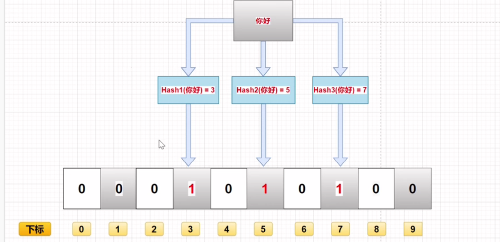

# 布隆过滤器

​	布隆过滤器是Redis中用于解决缓存穿透的一种方案

## 1. 什么是布隆过滤器？

​	这是由一个名为布隆的老哥发明的。其实就是用一个二进制数组和多个哈希函数组成的数据结构。

​	优点：由于是二进制串，故占用空间少，查询和增加效率高

​	缺点：容易产生哈希碰撞，不容易删除

## 2. 原理

​	当向布隆过滤器中添加元素时，会执行以下操作：

1. 使用布隆过滤器中的哈希函数对添加元素值进行计算，得到哈希值（有一个或多个哈希函数得到多个哈希值）
2. 根据得到的哈希值，在位数组中把对应下标的值置为1



​	当判断布隆过滤器中是否存在某一元素时，会执行以下操作：

1. 对给定元素进行相同的哈希计算（多个哈希运算）
2. 得到对应值后判断数组中对应位置上的值是否都为1，如果值都为1，则说明该值在布隆过滤器中，如果存在一个不为1，则说明不在

**不同的字符串可能哈希出来的位置相同，这种情况我们可以适当增加位数组大小或者调整我们的哈希函数。**

综上，得出：**布隆过滤器说某个元素存在，小概率会误判。布隆过滤器说某个元素不在，那么这个元素一定不在。**

## 3. 使用场景

判断数据是否存在

去重

## 4. 实现一个简易的布隆过滤器

```java
package DataStructure;

import org.junit.Test;

import java.util.BitSet;

public class MyBloomFilter {
    /**
     * 位数组的大小
     */
    private static final int DEFAULT_SIZE = 2 << 24;

    /**
     * 通过这个数组可以创建6个不同的哈希函数
     */
    private static final int[] SEEDS = new int[]{3, 13, 46, 71, 91, 134};

    /**
     * 位数组。数组的元素只能是0或者1
     */
    private BitSet bits = new BitSet(DEFAULT_SIZE);

    /**
     * 存放包含hash函数的类的数组
     */
    private SimpleHash[] func = new SimpleHash[SEEDS.length];

    /**
     * 初始化多个包含 hash 函数的类的数组，每个类中的hash函数都不一样
     */
    public MyBloomFilter() {
        // 初始化多个不同的Hash函数
        for (int i = 0; i < SEEDS.length; i ++) {
            func[i] = new SimpleHash(DEFAULT_SIZE, SEEDS[i]);
        }
    }

    /**
     * 添加元素到位数组
     */
    public void add(Object value) {
        for (SimpleHash f : func) {
            bits.set(f.hash(value), true);
        }
    }

    /**
     * 判断指定元素是否存在于位数组
     */
    public boolean contains(Object value) {
        boolean ret = true;
        for (SimpleHash f: func) {
            ret = ret && bits.get(f.hash(value));
        }
        return ret;
    }


    /**
     * 静态内部类，用于hash操作
     */
    public static class SimpleHash {
        private int cap;
        private int seed;

        public SimpleHash(int cap, int seed) {
            this.cap = cap;
            this.seed = seed;
        }

        /**
         * 计算hash值
         */
        public int hash(Object value) {
            int h;
            return (value == null) ? 0 : Math.abs(seed * (cap - 1) & ((h = value.hashCode())) ^ (h >> 16));
        }
    }

    public static void main(String[] args) {
        String value1 = "https://javaguide.cn/";
        String value2 = "https://github.com/Snailclimb";
        MyBloomFilter filter = new MyBloomFilter();
        System.out.println(filter.contains(value1));
        System.out.println(filter.contains(value2));
        filter.add(value1);
        filter.add(value2);
        System.out.println(filter.contains(value1));
        System.out.println(filter.contains(value2));

    }
}
```


