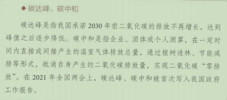

# 毛概期末复习

## 毛泽东思想

### 第一章

1. 毛泽东思想的含义？

2. 毛泽东思想的形成的时代背景？

    革命与战争

3. 战胜敌人的三大法宝？

    统一战线，武装斗争，党自身的建设

4. 毛泽东思想活的灵魂？

    实事求是，群众路线，独立自主

5. 毛泽东思想的历史地位？

    - 马克思主义中国化的第一个重大理论成果
    - 中国革命和建设的科学指南
    - 中国共产党和中国人民宝贵的精神财富

### 第四章

1. 《论十大关系》的基本方针？

    ​	努力把党内党外，国内国外的一切积极的因素，直接的，间接的积极因素全部调动起来

2. 毛泽东指出的矛盾？

    ​	生产关系和生产力之间的矛盾，上层建筑和经济基础之间的矛盾。这是非对抗性的矛盾

3. 党的八大指出的矛盾？

    ​	人民对于建立先进的工业国的要求同落后的农业国的现实之间的矛盾

    ​	人民对于经济文化迅速发展的需要同当前经济文化不能满足人民需要的状况之间的矛盾

4. 两类不同性质的矛盾？

    ​	敌我矛盾和人民内部矛盾。

    ​	敌我矛盾是人民同反抗社会主义革命，敌视和破坏社会主义建设的社会势力和社会集团的矛盾，这是根本利益对立基础上的矛盾，因而是对抗性的矛盾

    ​	人民内部矛盾是在人民根本利益一致基础上的矛盾，因而是非对抗性的矛盾。

5. 处理两类不同性质社会矛盾的基本方法？

    ​	专政和民主

6. 社会主义初步探索的意义？

    - 巩固和发展了我国的社会主义制度
    - 为开创中国特色社会主义提供了宝贵经验，理论准备，物质基础
    - 丰富了科学社会主义的理论和实践

7. 社会主义初步探索的经验教训？

    - 必须把马克思主义与中国实际相结合，探索符合中国特点的社会主义建设道路
    - 必须正确认识社会主义社会的主要矛盾和根本任务，集中力量发展生产力
    - 必须从实际触发进行社会主义建设，建设规模和速度要和国立相适应，不能急于求成
    - 必须发展社会主义民主，健全社会主义法制
    - 必须坚持党的民主集中制和集体领导制度，加强执政党建设
    - 必须坚持对外开放，借鉴和吸收人类文明成果建设社会主义，不能关起门来搞建设

## 邓小平理论，“三个代表”重要思想，科学发展观

### 第五章

1. 邓小平理论形成的时代背景，历史根据，现实依据？

    ​	和平与发展，社会主义建设的经验教训，改革开放和现代化建设的实践

2. 邓小平理论的基本理论问题？

    ​	“什么是社会主义，怎么样建设社会主义”是建设有中国特色社会主义理论的首要的基本理论问题

3. 邓小平理论的精髓？

    ​	解放思想，实事求是

4. 党的基本路线是啥？

    - 建设“富强，民主，文明的社会主义现代化国家”。
    - “一个中心，两个基本点”。
    - “领导和团结全国各族人民”
    - “自力更生，艰苦创业”

5. 社会主义的本质是什么？

    ​	社会主义的本质，是解放生产力，发展生产力，消灭剥削，消除两级分化，最终达到共同富裕

6. 改革是中国的第二次革命

### 第六章

1. "三个代表"重要思想的核心观点
    - 始终代表中国先进生产力的发展要求
    - 始终代表中国先进文化的前进方向
    - 始终代表中国最广大人民的根本利益

### 第七章

1. 科学发展观的科学内涵有哪些？

    - 推动经济社会发展是科学发展观的**第一要义**
    - 以人为本是科学发展观的**核心立场**
    - 全面协调可持续是科学发展观的**基本要求**
    - 统筹兼顾是科学发展观的**根本方法**

2. 科学发展观的精神实质是什么？

    ​		解放思想，实事求是，与时俱进，求真务实

3. 构建社会主义和谐社会的总要求是什么？

    ​		民主法治，公平正义，诚信友爱，充满活力，安定有序，人与自然和谐相处

## 习近平新时代中国特色社会主义思想

### 第八章

1. 中国特色社会主义进入新时代的意义有哪些？

    - 从中华民族复兴的历史进程来看，中国特色社会主义进入新时代，意味着近代以来久经磨难的中华民族迎来了从站起来，富起来到强起来的伟大飞跃，迎来了实现中华民族伟大复兴的光明前景
    - 从科学社会主义发展进程来看，中国特色社会主义进入新时代，意味着科学社会主义在21世纪的中国焕发出强大生机活力，在世界上高高举起了中国特色社会主义伟大旗帜
    - 从人类文明进程来看，中国特色社会主义进入新时代，意味着中国特色社会主义道路，理论，制度，文化不断发展，拓展了发展中国家走向现代化的途径，给世界上那些既希望加快发展又希望保持自身独立性的国家和民族提供了全新选择，为解决人类问题贡献了中国智慧和中国方案。                      

2. 社会主要矛盾的变化？

    ​	党的十九大指出，我国社会主要矛盾已经转化为人民日益增长的美好生活需要和不平衡不充分的发展之间的矛盾

3. 社会主要矛盾变化的依据？

    - 一是经过改革开放40年的发展，我国社会生产力总体上显著提高，很多方面进入世界前列
    - 二是人民生活水平显著提高，对美好生活的向往更加强烈，不仅对物资文化生活提出了更高要求，而且在民主，法治，公平，正义，安全，环境等方面的要求日益增长
    - 三是影响满足人们美好生活需要的因素很多，但主要是发展的不平衡不充分问题         

4. 习近平新时代中国特色社会主义思想的理论特质是啥？

    - 坚持以马克思主义为指导
    - 立足时代之基推进理论创新
    - 坚持以人民为中心
    - 彰显世界眼光和人类情怀

### 第九章

1. 中国梦的科学内涵是什么？

    ​	国家富强，民族振兴，人民幸福

2. 中国梦的实现途径是什么？

    - 实现中国梦必须走**中国道路**，这就是中国特殊社会主义道路。没有正确的道路，再美好的愿景，再伟大的梦想，都不能实现
    - 实现中国梦必须弘扬**中国精神**，这就是以爱国主义为核心的民族精神和以改革创新为核心的时代精神
    - 实现中国梦必须凝聚**中国力量**，这就是全国各族人民大团结的力量

3. 实现社会主义现代化强国“两步走”战略的具体安排是什么？

    1）从2020年到2035年，基本实现社会主义现代化的目标要求

    2）从2035年到本世纪中叶建成社会主义现代化强国的目标要求

    - 一是拥有高度的物质文明,社会生产力水平大幅提高，核心竞争力名列世界前茅，经济总量和市场规模超越其他国家,建成富强的社会主义现代化强国。
    - 二是拥有高度的政治文明,形成又有集中又有民主、又有纪律又有自由、又有统一意志又有个人心情舒畅生动活泼的政治局面,依法治国和以德治国有机结合，建成民主的社会主义现代化强国。
    - 三是拥有高度的精神文明,践行社会主义核心价值观成为全社会自觉行动，国民素质显著提高，中国精神、中国价值、中国力量成为中国发展的重要影响力和推动力,建成文明的社会主义现代化强国。
    - 四是拥有高度的社会文明,城乡居民将普遍拥有较高的收入、富裕的生活、健全的基本公共服务，享有更加幸福安康的生活,全体人民共同富裕基本实现,公平正义普遍彰显,社会充满活力而又规范有序,建成和谐的社会主义现代化强国。
    - 五是拥有高度的生态文明,天蓝、地绿、水清的优美生态环境成为普遍常态，开创人与自然和谐共生新境界,建成美丽的社会主义现代化强国。

4. 新发展理念是什么？

    ​	创新，协调，绿色，开放，共享

5. 构建新发展格局的关键是什么？

    ​	经济循环的畅通无阻

6. 构建新发展格局最本质的特征是什么？

    ​	高水平的自立自强

### 第十章

1. 习近平经济思想的主要内容？

    - 坚持加强党对经济工作的集中统一领导
    - 坚持以人民为中心的发展思想
    - 坚持适应把握引领经济发展新常态
    - 坚持使市场在配置中起决定性作用，更好地发挥政府作用，推动有效市场和有为政府更好结合
    - 坚持适应我国经济发展主要矛盾变化完善宏观调控
    - 坚持问题导向部署经济发展新战略
    - 坚持正确工作策略和方法

2. 三去一降一补是什么？

    ​	**去产能**（减少或关闭高污染高耗能企业，减少大量资金流入）

    ​	**去库存**（去除房地产的库存，为新产能提供空间）

    ​	**去杠杆**（降低金融风险，压缩金融泡沫）

    ​	**降成本**（提高效率）

    ​	**补短板**（短板就是高科技行业及中小型创新型企业）

3. 深化供给侧改革是什么（理解即可）

    [到底什么是供给侧结构性改革？ - 知乎 (zhihu.com)](https://zhuanlan.zhihu.com/p/334015245)

4. 我国经济运行面临的突出矛盾和问题的原因？

    ​	有周期性，总量性因素，根源是重大结构性失衡，即实体经济结构性供需失衡，金融和实体经济失衡，房地产和实体经济失衡。

5. 如何推进供给侧结构性改革？

    ​	推进供给侧结构化改革，重点是解放和发展社会生产力

    1. 第一，推进增长动能转换，加快实施创新驱动发展战略
    2. 第二，深化要素市场化配置改革，实现由以价取胜向以质取胜的转变
    3. 第三，加大人力资源培育力度，更加注重调动和保护人的积极性
    4. 第四，激发各类市场主体活力，加快建设世界一流企业
    5. 第五，持续推进“三去一降一补”，优化市场供求结构

6. 哪些政治制度维护我国人民当家作主制度体系？

    - 坚持和完善人民代表大会制度这一根本政治制度
    - 坚持和完善中国共产党领导的多党合作和政治协商制度
    - 坚持和完善民族区域自治制度
    - 健全充满活力的基层群众自治制度

7. 社会主义协商民主

8. 如何坚持马克思主义在意识形态领域指导地位的根本制度

    - 实施马克思主义理论研究和建设工程
    - 加强和改进学校思想政治教育
    - 落实意识形态工作责任制

9. 社会主义核心价值观的基本要求？

    ​	富强，民主，文明，和谐，自由，平等，公正，法治，爱国，敬业，诚信，友善

10. 如何培育和践行社会主义核心价值观？

    - 培育和践行社会主义核心价值观，要把社会主义核心价值观融入社会生活各个方面
    - 培育和践行社会主义核心价值观，要坚持全民行动，干部带头，从家庭做起，从娃娃做起
    - 培育和践行社会主义核心价值观，必须立足中华优秀文化和革命文化
    - 培育和践行社会主义核心价值观，还必须发扬中国人民在长期奋斗中培育，继承，发展起来的伟大民族精神

11. 发展经济与改善民生的关系？

    - 经济发展是改善民生的前提，离开了经济发展，改善民生就会成为无源之水，无本之水。
    - 要紧紧抓住经济建设这个中心，在推动经济高质量发展中进一步把“蛋糕”做大，为改善民生奠定更加坚实的物质基础
    - 同时，抓民生就是在抓发展。持续不断增进民生福祉，能够有效解决广大人民群众后顾之忧,这样既能调动人民发展生产的积极性,又可以提升社会消费预期,扩大内需,催生新的经济增长点,实现民生与发展的有效对接、良性循环、相得益彰。

12. 如何解决人民最关心最直接最现实的利益问题？

    - 第一，建设高质量教育体系
    - 第二，实施就业优先战略
    - 第三，优化收入分配结构
    - 第四，健全多层次社会保障体系
    - 第五，全面推进健康中国建设

13. 新时代枫桥经验

14. 如何推动绿色发展，促进人与自然和谐共生？

    - 第一，加快构建生态文明体系
    - 第二，全面推动绿色发展
    - 第三，深入推进生态文明体制改革
    - 第四，有效防范生态环境风险
    - 第五，提高环境治理水平

15. 碳达峰，碳中和

