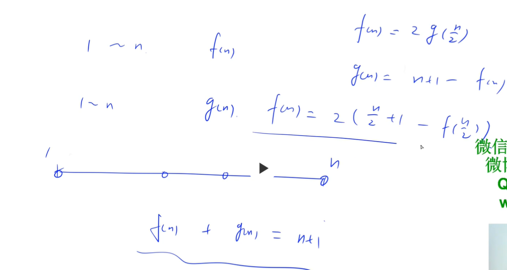

# 序列DP

[334. 递增的三元子序列 - 力扣（LeetCode） (leetcode-cn.com)](https://leetcode-cn.com/problems/increasing-triplet-subsequence/)

```cpp
class Solution {
public:
    bool increasingTriplet(vector<int>& nums) {
        int small = INT_MAX, big = INT_MAX;
        for (int x: nums) {
            if (x <= small) {
                small = x;
            } else if (x <= big) {
                big = x;
            } else {
                return true;
            }
        }
        return false;
    }
};
```

```cpp
class Solution {
public:
    bool increasingTriplet(vector<int>& nums) {
        int n = nums.size();
        vector<int> f(n + 1, INT_MAX); // f[len] = x 表示 以 长度为 len 的序列的最小尾元素为x
        int ans = 1;
        for (int i = 0; i < n; i ++) {
            int l = 1, r = i + 1;
            int x = nums[i];
            while (l < r) { // 二分查找小于nums[i]的最小元素
                int mid = l + r >> 1;
                if (f[mid] >= x) r = mid;
                else l = mid + 1; 
            }
            f[r] = x;
            ans = max(ans, r);
        }
        return ans >= 3;
    }
};
```

[354. 俄罗斯套娃信封问题 - 力扣（LeetCode） (leetcode-cn.com)](https://leetcode-cn.com/problems/russian-doll-envelopes/)

```cpp
class Solution {
public:
    int maxEnvelopes(vector<vector<int>>& envelopes) {
        int n = envelopes.size();
        vector<int> f(n, 0); // 以 i 结尾的最大信封
        sort(envelopes.begin(), envelopes.end());
        int res = 0;
        for (int i = 0; i < n; i ++) {
            f[i] = 1;
            for (int j = 0; j < i; j ++) {
                if (envelopes[i][0] > envelopes[j][0] && envelopes[i][1] > envelopes[j][1]) 
                    f[i] = max(f[i], f[j] + 1);
            }
            res = max(res, f[i]);
        }
        return res;
    }
};
```

[368. 最大整除子集 - 力扣（LeetCode） (leetcode-cn.com)](https://leetcode-cn.com/problems/largest-divisible-subset/)

```cpp
class Solution {
public:
    vector<int> largestDivisibleSubset(vector<int>& nums) {
        int n = nums.size();
        vector<int> f(n, 0); // f[i] 表示 前i个数中以a[i]结尾的整除子集的最长序列的元素个数
        sort(nums.begin(), nums.end());
        int k = 0; // 整除序列最后一个元素下标
        for (int i = 0; i < n; i ++) {
            f[i] = 1;
            for (int j = 0; j < i; j ++) 
                if (nums[i] % nums[j] == 0) 
                    f[i] = max(f[i], f[j] + 1);
            if (f[k] < f[i]) k = i;
        }

        vector<int> res; // 逆推得出答案
        while (true) {
            res.push_back(nums[k]);
            if (f[k] == 1) break; // 只剩一个元素
            for (int i = 0; i < k; i ++) {
                if ((nums[k] % nums[i] == 0) && f[k] == f[i] + 1) {
                    k = i;
                    break;
                }
            }
        }
        return res;
    }
};
```

[390. 消除游戏 - 力扣（LeetCode） (leetcode-cn.com)](https://leetcode-cn.com/problems/elimination-game/)



```cpp
class Solution {
public:
    int lastRemaining(int n) {
        if (n == 1) return 1;
        return 2 * (n / 2 + 1 - lastRemaining(n / 2));
    }
};
```

[446. 等差数列划分 II - 子序列 - 力扣（LeetCode） (leetcode-cn.com)](https://leetcode-cn.com/problems/arithmetic-slices-ii-subsequence/submissions/)

[LeetCode 446. 等差数列划分 II - 子序列 - AcWing](https://www.acwing.com/solution/content/61868/)

```cpp
class Solution {
public:
    int numberOfArithmeticSlices(vector<int>& a) {
        typedef long long LL;
        int n = a.size();
        // 由于每个数可能都会在不同等差数列中，需要用哈希表来存
        vector<unordered_map<LL, int>> f(n); // f[i][j] 表示 考虑以第 i 个数结尾 公差为j的等差数列的个数
        int res = 0;
        for (int i = 0; i < n; i ++)
            for (int k = 0; k < i; k ++) {
                LL j = (LL)a[i] - a[k];
                auto it = f[k].find(j); // 查找a[k]结尾公差为j的等差数列的个数
                int t = 0;
                if (it != f[k].end()) {
                    t = it->second;
                    res += t;
                }
                f[i][j] += t + 1;
            }
        return res;
    }
};
```

[472. 连接词 - 力扣（LeetCode） (leetcode-cn.com)](https://leetcode-cn.com/problems/concatenated-words/)

```cpp
class Solution {
public:

    typedef unsigned long long ULL;
    unordered_set<ULL> hash;
    const int P = 131;

    vector<string> findAllConcatenatedWordsInADict(vector<string>& words) {
        // 初始化字符串哈希表
        for (auto &s: words) {
            ULL t = 0;
            for (auto &c: s) {
                t = t * P + c;
            }
            hash.insert(t);
        }

        vector<string> res;
        for (auto &s: words) 
            if (check(s)) res.push_back(s);
        return res;
    }

    bool check(string str) {
        int n = str.size();
        vector<int> f(n + 1, -1); // f[i] 表示 在i前面的连接词的个数
        f[0] = 0;

        for (int i = 0; i <= n; i ++) {
            if (f[i]== -1) continue;
            ULL cur = 0;
            for (int j = i + 1; j <= n; j ++) {
                cur = cur * P + str[j - 1];
                if (hash.count(cur)) {
                    f[j] = max(f[j], f[i] + 1);
                }
            }
            if (f[n] >= 2) return true;
        }
        return false;
    }
};
```

[583. 两个字符串的删除操作 - 力扣（LeetCode） (leetcode-cn.com)](https://leetcode-cn.com/problems/delete-operation-for-two-strings/submissions/)

```cpp
class Solution {
public:
    int minDistance(string word1, string word2) {
        int n = word1.size(), m = word2.size();
        vector<vector<int>> f(n + 1, vector<int>(m + 1, 0));
        for (int i = 0; i <= n; i ++) f[i][0] = 1; 
        for (int j = 0; j <= m; j ++) f[0][j] = 1;
        for (int i = 1; i <= n; i ++)
            for (int j = 1; j <= m; j ++) {
                f[i][j] = max(f[i][j - 1], f[i - 1][j]);
                if (word1[i - 1] == word2[j - 1]) {
                    f[i][j] = max(f[i][j], f[i - 1][j - 1] + 1);
                }
            }
        int maxn = f[n][m] - 1;
        return n + m - 2 * maxn;
    }
};
```

[629. K个逆序对数组 - 力扣（LeetCode） (leetcode-cn.com)](https://leetcode-cn.com/problems/k-inverse-pairs-array/)

[LeetCode 629. K个逆序对数组 - AcWing](https://www.acwing.com/solution/content/18355/)

```cpp
class Solution {
public:
    const int MOD = 1e9 + 7;
    int kInversePairs(int n, int k) {
        // f[i][j] 表示 所有由数字 1 ~ i 组成的含有 j 个 逆序对的数组个数
        vector<vector<int>> f(n + 1, vector<int>(k + 1, 0));
        f[1][0] = 1;
        for (int i = 2; i <= n; i ++) {
            long long s = 0;
            for (int j = 0; j <= k; j ++) {
                s += f[i - 1][j];
                if (j >= i) s -= f[i - 1][j - i];
                f[i][j] = s % MOD;
            }
        } 
        return (f[n][k] + MOD) % MOD;
    } 
};
```

