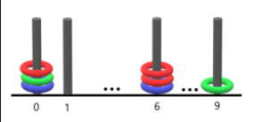
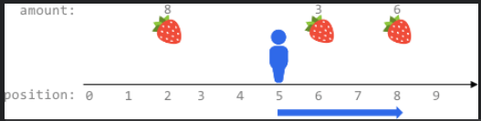
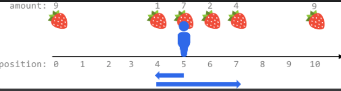

# 第 271 场周赛

#### [5952. 环和杆](https://leetcode-cn.com/problems/rings-and-rods/)

总计有 n 个环，环的颜色可以是红、绿、蓝中的一种。这些环分布穿在 10 根编号为 0 到 9 的杆上。

给你一个长度为 2n 的字符串 rings ，表示这 n 个环在杆上的分布。rings 中每两个字符形成一个 颜色位置对 ，用于描述每个环：

第 i 对中的 第一个 字符表示第 i 个环的 颜色（'R'、'G'、'B'）。
第 i 对中的 第二个 字符表示第 i 个环的 位置，也就是位于哪根杆上（'0' 到 '9'）。
例如，"R3G2B1" 表示：共有 n == 3 个环，红色的环在编号为 3 的杆上，绿色的环在编号为 2 的杆上，蓝色的环在编号为 1 的杆上。

找出所有集齐 全部三种颜色 环的杆，并返回这种杆的数量。

**示例 1：**



```
输入：rings = "B0B6G0R6R0R6G9"
输出：1
解释：
- 编号 0 的杆上有 3 个环，集齐全部颜色：红、绿、蓝。
- 编号 6 的杆上有 3 个环，但只有红、蓝两种颜色。
- 编号 9 的杆上只有 1 个绿色环。
因此，集齐全部三种颜色环的杆的数目为 1 。
```

**解法1：位运算**

```cpp
class Solution {
public:
    int num[10];
    int countPoints(string rings) {    
        for (int i = 0; i < rings.size(); i += 2) {
            num[rings[i + 1] - '0'] |= rings[i] == 'B' ? 1 : rings[i] == 'R' ? 2 : 4; 
        }

        int cnt = 0;
        for (int i : num) {
            if (i == 7) cnt ++;
        }
        return cnt;
    }
};
```

**解法2：哈希表**

```cpp
class Solution {
public:
    int countPoints(string rings) {
        unordered_map<int, vector<char>> hash;
        for (int i = 1; i < rings.size(); i += 2) {
            hash[rings[i] - '0'].push_back(rings[i - 1]);
        }
        int cnt = 0;
        for (auto &[num, vec]: hash) {
            unordered_set<char> tmp;
            for (auto v: vec) {
                tmp.insert(v);
            }
            if (tmp.size() == 3) cnt ++;
        }
        return cnt;
    }
};
```

#### [5953. 子数组范围和](https://leetcode-cn.com/problems/sum-of-subarray-ranges/)

给你一个整数数组 nums 。nums 中，子数组的 范围 是子数组中最大元素和最小元素的差值。

返回 nums 中 所有 子数组范围的 和 。

子数组是数组中一个连续 非空 的元素序列。==（注意是连续子序列）==

**示例 1：**

```
输入：nums = [1,2,3]
输出：4
解释：nums 的 6 个子数组如下所示：
[1]，范围 = 最大 - 最小 = 1 - 1 = 0 
[2]，范围 = 2 - 2 = 0
[3]，范围 = 3 - 3 = 0
[1,2]，范围 = 2 - 1 = 1
[2,3]，范围 = 3 - 2 = 1
[1,2,3]，范围 = 3 - 1 = 2
所有范围的和是 0 + 0 + 0 + 1 + 1 + 2 = 4
```

**示例 2：**

```
输入：nums = [1,3,3]
输出：4
解释：nums 的 6 个子数组如下所示：
[1]，范围 = 最大 - 最小 = 1 - 1 = 0
[3]，范围 = 3 - 3 = 0
[3]，范围 = 3 - 3 = 0
[1,3]，范围 = 3 - 1 = 2
[3,3]，范围 = 3 - 3 = 0
[1,3,3]，范围 = 3 - 1 = 2
所有范围的和是 0 + 0 + 0 + 2 + 0 + 2 = 4
```

**提示：**

- `1 <= nums.length <= 1000`
- `-109 <= nums[i] <= 109`

**解法1：dp**

```cpp
class Solution {
public:
    long long subArrayRanges(vector<int>& nums) {
        long long res = 0;
        for (int i = 0; i < nums.size(); i ++) {
            int minn = nums[i];
            int maxn = nums[i];
            for (int j = i; j < nums.size(); j ++) {
                minn = min(minn, nums[j]);
                maxn = max(maxn, nums[j]);
                res += maxn - minn;
            }
        }
        return res;
    }
};
```

#### [5954. 给植物浇水 II](https://leetcode-cn.com/problems/watering-plants-ii/)

Alice 和 Bob 打算给花园里的 n 株植物浇水。植物排成一行，从左到右进行标记，编号从 0 到 n - 1 。其中，第 i 株植物的位置是 x = i 。

每一株植物都需要浇特定量的水。Alice 和 Bob 每人有一个水罐，最初是满的 。他们按下面描述的方式完成浇水：

- Alice 按 从左到右 的顺序给植物浇水，从植物 0 开始。Bob 按 从右到左 的顺序给植物浇水，从植物 n - 1 开始。他们 同时 给植物浇水。
- 如果没有足够的水 完全 浇灌下一株植物，他 / 她会立即重新灌满浇水罐。
- 不管植物需要多少水，浇水所耗费的时间都是一样的。
- 不能 提前重新灌满水罐。
- 每株植物都可以由 Alice 或者 Bob 来浇水。
- 如果 Alice 和 Bob 到达同一株植物，那么当前水罐中水更多的人会给这株植物浇水。如果他俩水量相同，那么 Alice 会给这株植物浇水。

​	给你一个下标从 0 开始的整数数组 plants ，数组由 n 个整数组成。其中，plants[i] 为第 i 株植物需要的水量。另有两个整数 capacityA 和 capacityB 分别表示 Alice 和 Bob 水罐的容量。返回两人浇灌所有植物过程中重新灌满水罐的 次数 。

**示例 1：**

```
输入：plants = [2,2,3,3], capacityA = 5, capacityB = 5
输出：1
解释：
- 最初，Alice 和 Bob 的水罐中各有 5 单元水。
- Alice 给植物 0 浇水，Bob 给植物 3 浇水。
- Alice 和 Bob 现在分别剩下 3 单元和 2 单元水。
- Alice 有足够的水给植物 1 ，所以她直接浇水。Bob 的水不够给植物 2 ，所以他先重新装满水，再浇水。
所以，两人浇灌所有植物过程中重新灌满水罐的次数 = 0 + 0 + 1 + 0 = 1 。
```

**示例 2：**

```
输入：plants = [2,2,3,3], capacityA = 3, capacityB = 4
输出：2
解释：
- 最初，Alice 的水罐中有 3 单元水，Bob 的水罐中有 4 单元水。
- Alice 给植物 0 浇水，Bob 给植物 3 浇水。
- Alice 和 Bob 现在都只有 1 单元水，并分别需要给植物 1 和植物 2 浇水。
- 由于他们的水量均不足以浇水，所以他们重新灌满水罐再进行浇水。
所以，两人浇灌所有植物过程中重新灌满水罐的次数 = 0 + 1 + 1 + 0 = 2 。
```

**提示：**

- `n == plants.length`
- `1 <= n <= 105`
- `1 <= plants[i] <= 106`
- `max(plants[i]) <= capacityA, capacityB <= 109`

**解法1：双指针模拟**

```cpp
class Solution {
public:
    int minimumRefill(vector<int>& plants, int capacityA, int capacityB) {
        int n = plants.size();
        int a = capacityA, b = capacityB, cnt = 0;
        int i = 0, j = n - 1;
        for (;i < j;) {
            if (a < plants[i]) {
                a = capacityA;
                cnt ++;
            }
            if (b < plants[j]) {
                b = capacityB;
                cnt ++;
            }    
            a -= plants[i ++];
            b -= plants[j --];
        }

        if (i == j) {
            if (a < plants[i] && b < plants[i]) cnt ++;
        }
        return cnt;
    }
};
```

#### [5955. 摘水果](https://leetcode-cn.com/problems/maximum-fruits-harvested-after-at-most-k-steps/)

在一个无限的 x 坐标轴上，有许多水果分布在其中某些位置。给你一个二维整数数组 fruits ，其中 fruits[i] = [positioni, amounti] 表示共有 amounti 个水果放置在 positioni 上。fruits 已经按 positioni 升序排列 ，每个 positioni 互不相同 。

另给你两个整数 startPos 和 k 。最初，你位于 startPos 。从任何位置，你可以选择 向左或者向右 走。在 x 轴上每移动 一个单位 ，就记作 一步 。你总共可以走 最多 k 步。你每达到一个位置，都会摘掉全部的水果，水果也将从该位置消失（不会再生）。

返回你可以摘到水果的 最大总数 。

**示例 1：**



```cpp
输入：fruits = [[2,8],[6,3],[8,6]], startPos = 5, k = 4
输出：9
解释：
最佳路线为：
- 向右移动到位置 6 ，摘到 3 个水果
- 向右移动到位置 8 ，摘到 6 个水果
移动 3 步，共摘到 3 + 6 = 9 个水果
```

**示例 2：**



```cpp
输入：fruits = [[0,9],[4,1],[5,7],[6,2],[7,4],[10,9]], startPos = 5, k = 4
输出：14
解释：
可以移动最多 k = 4 步，所以无法到达位置 0 和位置 10 。
最佳路线为：
- 在初始位置 5 ，摘到 7 个水果
- 向左移动到位置 4 ，摘到 1 个水果
- 向右移动到位置 6 ，摘到 2 个水果
- 向右移动到位置 7 ，摘到 4 个水果
移动 1 + 3 = 4 步，共摘到 7 + 1 + 2 + 4 = 14 个水果
```

**解法1：前缀和+二分**

[【很直观的思路】前缀和+二分 - 摘水果 - 力扣（LeetCode） (leetcode-cn.com)](https://leetcode-cn.com/problems/maximum-fruits-harvested-after-at-most-k-steps/solution/hen-zhi-guan-de-si-lu-qian-zhui-he-er-fe-sbjv/)

```cpp
class Solution {
public:
    int maxTotalFruits(vector<vector<int>>& fruits, int startPos, int k) {
        int n = fruits.size();
        vector<int> sum;
        sum.push_back(0);
        for (int i = 1; i <= n; i ++) {
            sum.push_back(fruits[i - 1][1] + sum[i - 1]);
        }
        
        vector<int> pos;
        for (int i = 0; i < n; i ++) pos.push_back(fruits[i][0]);

        /*
            由于可遍历的区间情况是：假设人向左走 y 步，再会到起点，再向右走 x 步，那么走了 2y + x 步
            2y + x <= k，也就是区间为[startPos - y, startPos + x]
        */

        int ans = 0;
        // 枚举所有可能达到的区间
        for (int x = k; x >= 0; x --) {
            int y = (k - x) / 2;

            int l = startPos - y, r = startPos + x;
            auto pl = lower_bound(pos.begin(), pos.end(), l) - pos.begin(), pr = upper_bound(pos.begin(), pos.end(), r) - pos.begin();
            ans = max(ans, sum[pr] - sum[pl]);
            
            l = startPos - x, r = startPos + y;
            pl = lower_bound(pos.begin(), pos.end(), l) - pos.begin(), pr = upper_bound(pos.begin(), pos.end(), r) - pos.begin();
            ans = max(ans, sum[pr] - sum[pl]);
        }
        return ans;
    }
};
```

