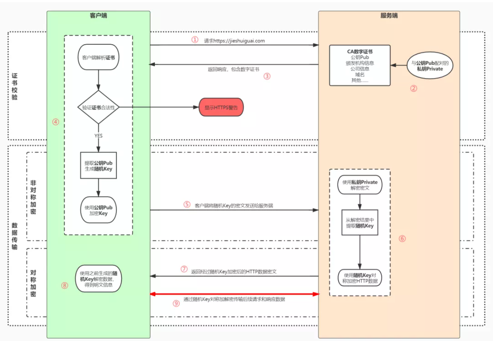
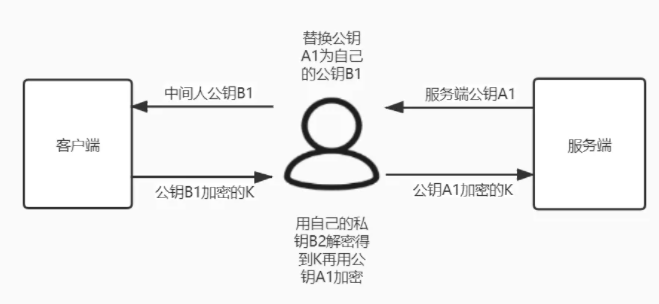

# Https详解

​	https = http + ssl/tls, 同时使用了**对称加密**，**非对称加密技术**。

​	SSL（Secure Sockets Layer）安全套接层和TLS（Transport Layer Security）传输层安全协议其实是**一套东西**。

​	非对称加密将密钥分为了两种：公钥和私钥。公钥通常放在客户端，私钥放在服务器。使用公钥加密了以后的数据，可以使用私钥解密。

​	对称加密是指只有一个密钥，用它可以对一段报文进行加密，也可用来对密文解密，但该密钥是存在于客户端和服务端，且绝对不会有其他人知道。

## 工作流程

1. 用户在浏览器发起Https请求（如https://w1ndcode.com），默认使用服务端`443`端口
2. Https需要使用一套`CA数字证书`，证书内会附带一个`公钥Pub`，而与之对应的`私钥Private`保留在客户端不公开。
3. 服务端收到请求，返回配置好的包含`公钥Pub`的`CA数字证书`给客户端。
4. 客户端收到证书，校验合法性，主要是包含有效期内，域名，请求的域名是否匹配，上一级证书是否有效（递归判断，直到判断到系统内置或浏览器配置好的根证书）如果不通过，则返回Https警告信息，如果通过则继续。
5. 客户端生成一个用于对称加密的`随机key`，并用证书的`公钥Pub`进行加密，发送给服务端。
6. 服务端收到`随机key`的密文，使用`私钥Private`进行解密，得到`随机key`
7. 后续服务端就可以使用`随机Key`对传输数据进行加密，将密文返回给客户端
8. 客户端再使用`随机Key`进行解密，得到数据报文
9. 将响应信息或后续请求使用`随机Key`进行加密传输。

**安全性与性能分析**

​	可以发现，这种方式解决http通过明文传输的问题，但由于传输过程中要不断进行加密解密，性能也会下降很多，尤其是加入了CA证书（后续会讲）

​	安全性方面，首先，由于后续的请求是通过`随机Key`进行传输的，而该密钥是存在于客户端上的，需要用户自己保证不泄露该密钥。

​	另外，这种方案，还是会出现**中间人攻击**的问题。考虑下述情况

​	当服务端向客户端返回`公钥A1`时，中间人可以替换为自己的`公钥B1`传输给客户端，而客户端对此一无所知，使用`公钥B1`进行加密以后将`随机Key`发送出去，又被`中间人劫持`，中间人利用自己的`私钥B2`解密，得到`随机Key`，再使用服务端的`公钥A1`加密传送给服务端，整个通信链路是正常的。但后续在客户端与服务端传输过程中，由于`随机Key`暴露了，那么整个传输内容对于中间人就是明文了。

## CA颁发机构

​	对于前面提到的安全性问题，前一个需要用户自己去保证，后一个则需要`CA证书`。出现这一个问题主要原因是因为**客户端无法确认收到的公钥是不是是真的服务端发来的**。那么我们可以引入一个权威机构，让它来为我们证明该公钥的可信度，也就是`CA`颁发机构

​	一个服务端在使用HTTPS之前，需要去CA机构申请一份数字证书。该证书包含`证书持有者`，`证书有效期`，`公钥`等信息，服务端将证书发送给客户端，客户端校验证书身份和要访问的网站身份确认一致再进行后续的加密操作。

 	那么此时又引入另一个问题了，如果中间人只改动了证书中的公钥部分，客户端依然不能知道证书是否有被修改了，这时就需要一些防伪技术了。

​	我们可以将**使用服务端的私钥来做数字签名**。

1. CA机构也拥有自己的一对公钥和私钥
2. CA机构在颁发证书时对`证书明文信息`进行哈希
3. 将哈希值用`私钥`进行`加签`，得到数字签名

将`明文数据`和`数字签名`组成证书，传递给客户端

1. 客户端得到证书，有着明文部分text和数字签名`sig1`
2. 用CA的`公钥`进行`解签`，得到`sig2`
3. 用证书声明的哈希算法对明文Text部分进行哈希得到T
4. 用计算得到的哈希值T与解密后的`sig2`进行比较，如果相等，表示证书可信，没有被篡改

​	通过这一流程，我们发现，如果中间人篡改了证书，但由于没有CA的私钥进行加签，那么数字签名一定无法与修改后的证书保持一致，那么当客户端收到该证书时，用`公钥`对数字签名进行解签得到的哈希值（也就是sig2），一定和证书哈希之后的哈希值不等（因为证书被修改了）。

​	但如果CA颁布机构的私钥泄露了，那么中间人就可以再伪造一个和修改后证书对应的数字签名，当客户端收到以后也就无法辨别了。

## 总结

​	所以通过上述这些流程，我们可以知道，这其实就是一条信任链，客户端，服务端，CA颁布机构都不能泄露自己的私钥，否则，会导致通信链路不安全。

​	HTTPS 的出发点是解决HTTP明文传输时信息被篡改和监听的问题。

- 为了兼顾性能和安全性，使用了非对称加密+对称加密的方案。
- 为了保证公钥传输中不被篡改，又使用了非对称加密的数字签名功能，借助CA机构和系统根证书的机制保证了HTTPS证书的公信力。

