# TCP/IP

## TCP/IP网络分层

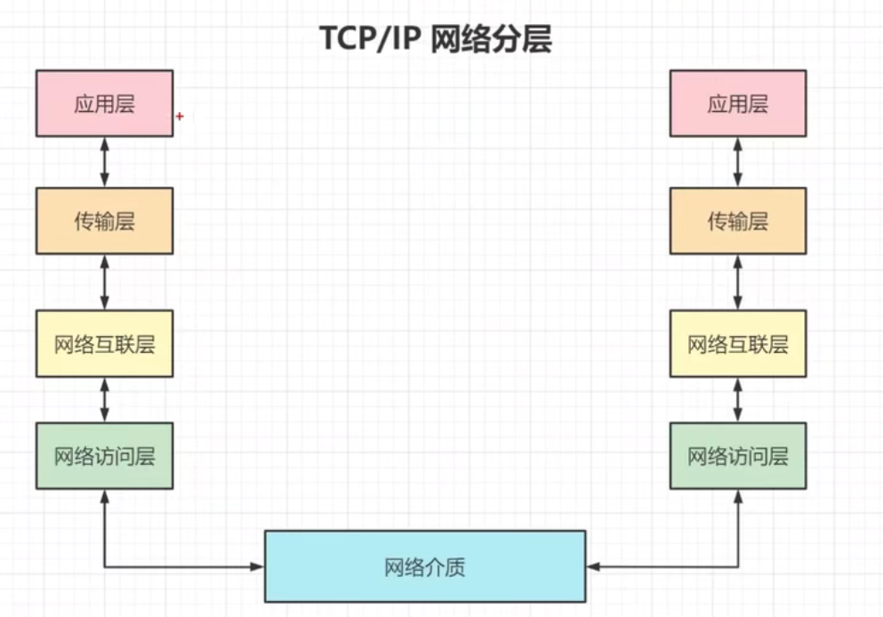

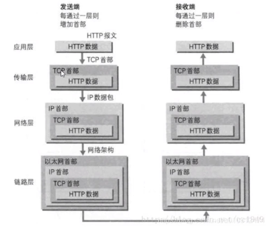

## 网络模型

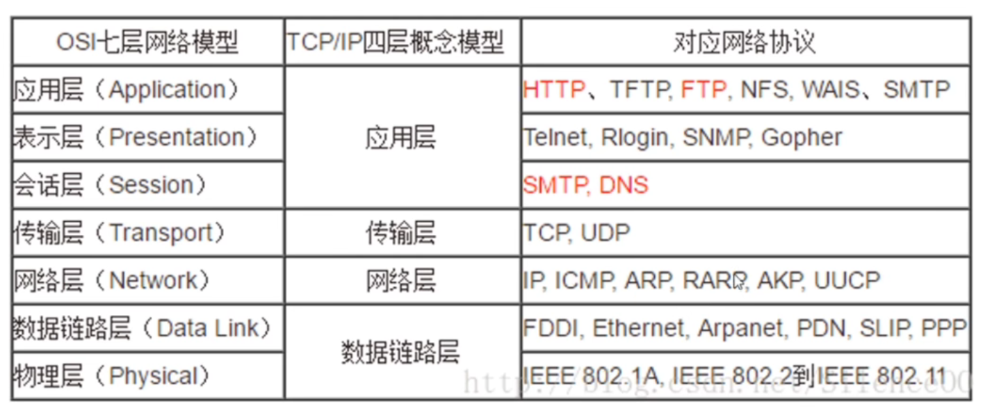

## 发送请求给baidu.com

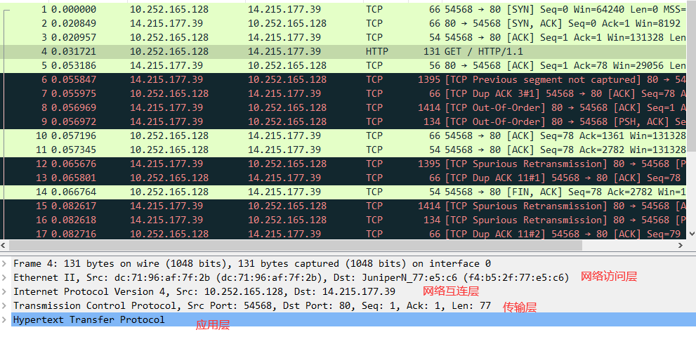

注：http/1.0是非持久性连接，http/1.1才开始持久性连接

## Ethernet标准的不同帧格式

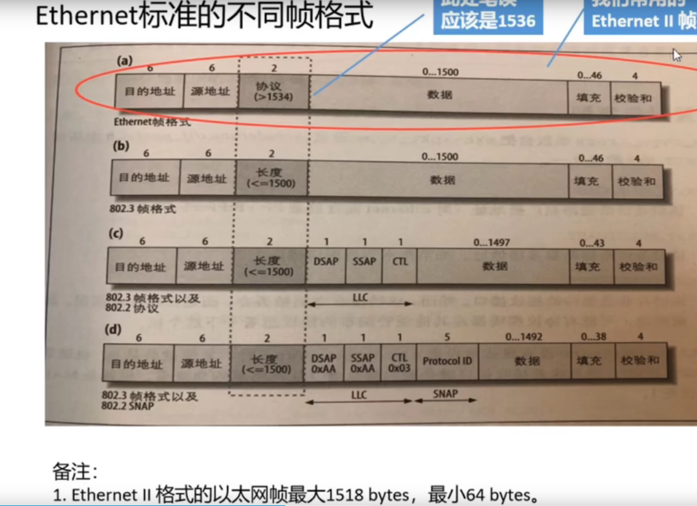

## socket 

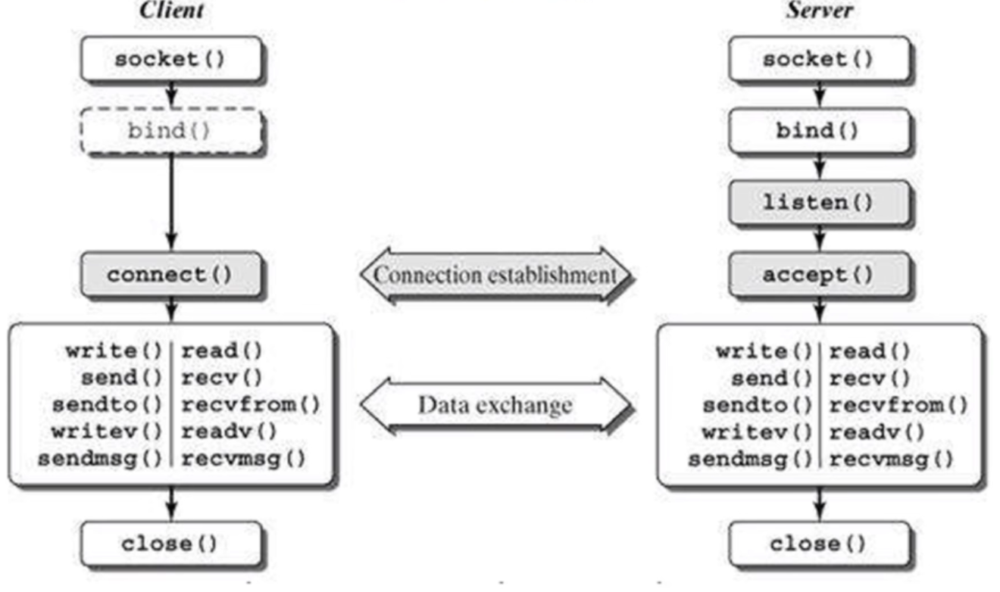

## syns queue(半连接队列)和 accept queue(全连接队列)

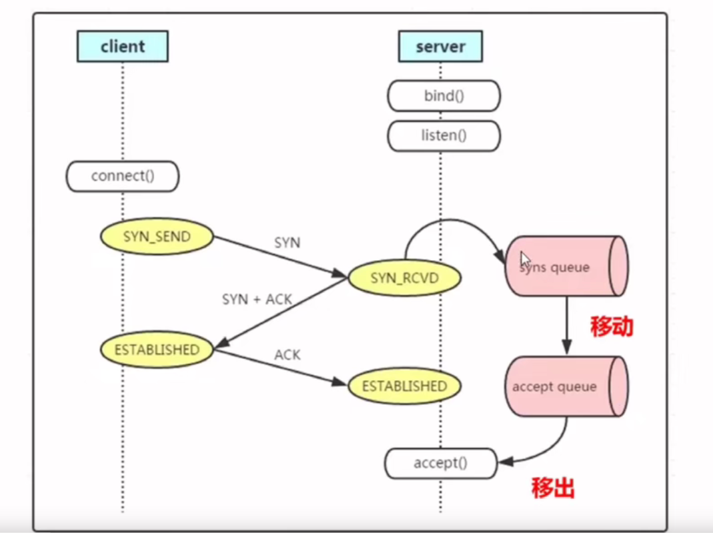

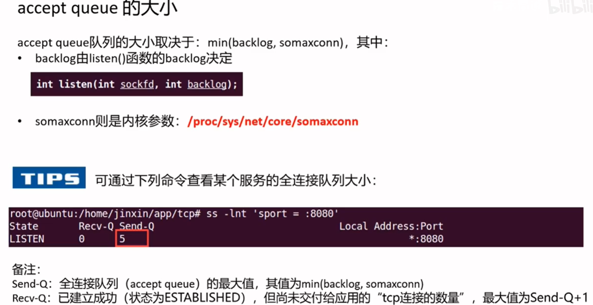

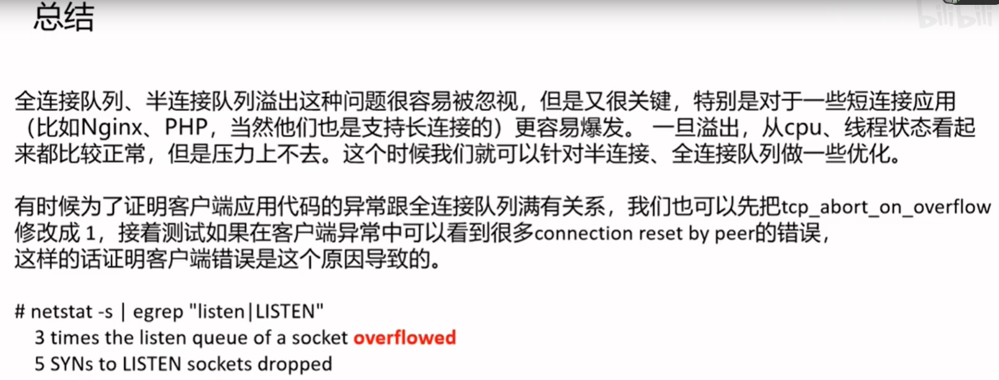

## tcp握手

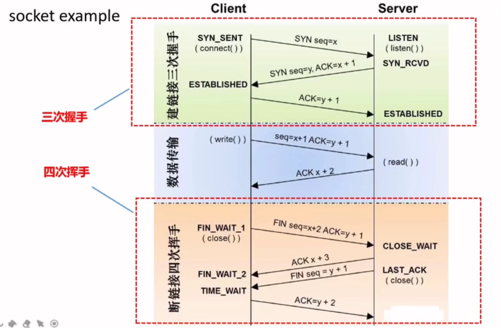

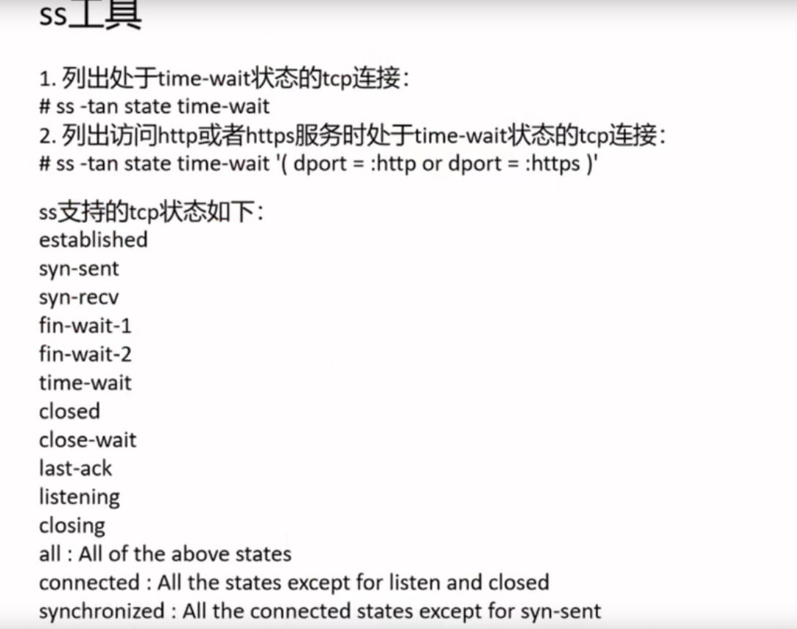

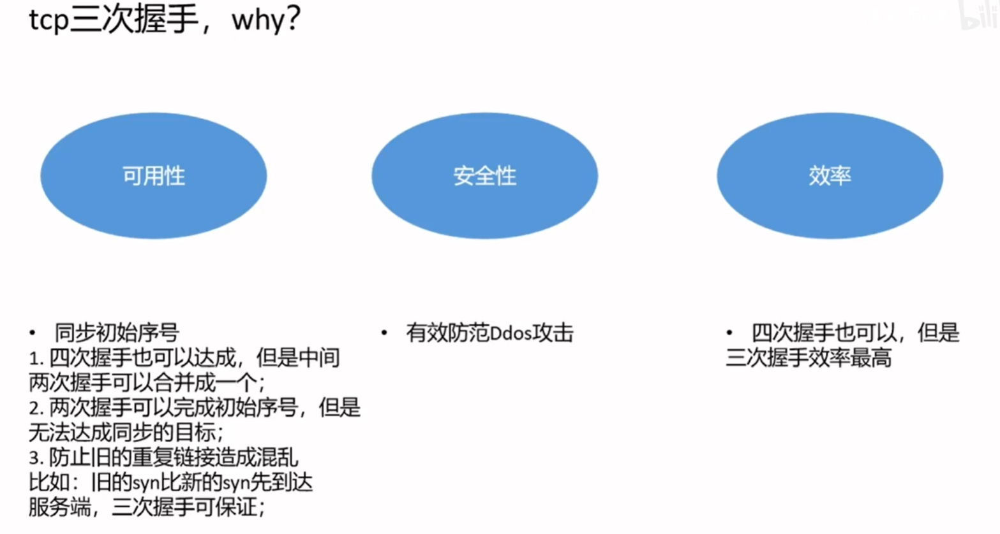

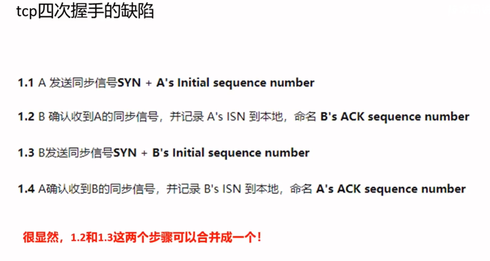

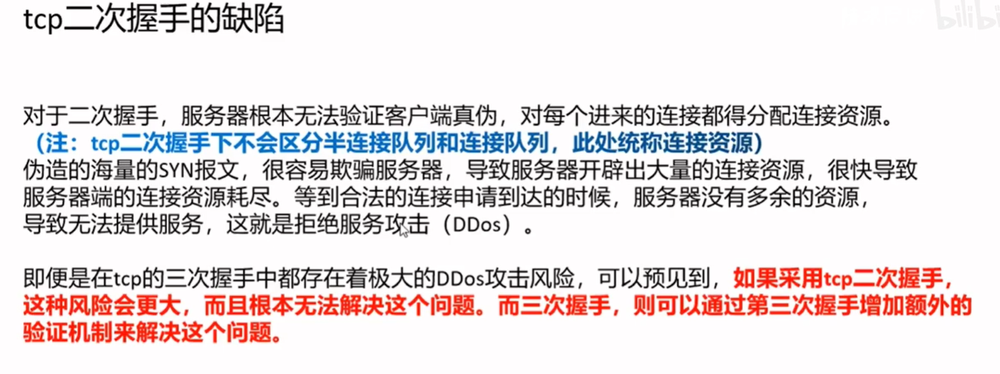

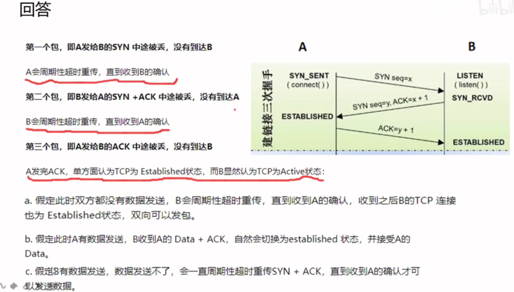

## tcp挥手

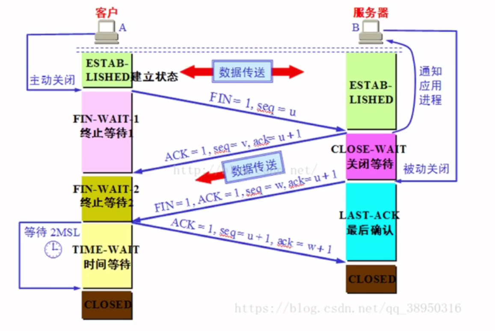

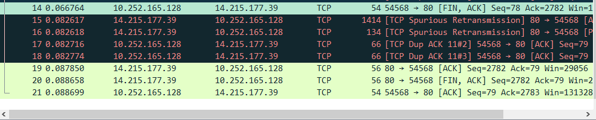

端口释放了，协议栈不一定释放

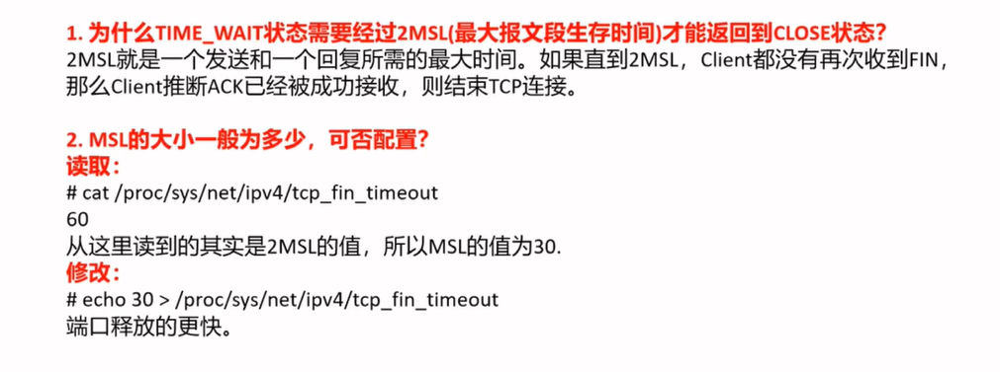
