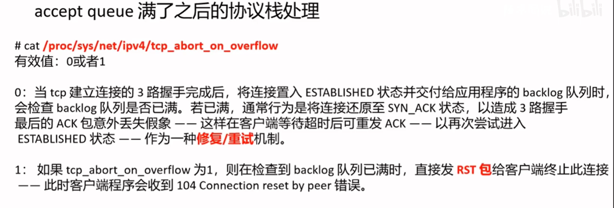
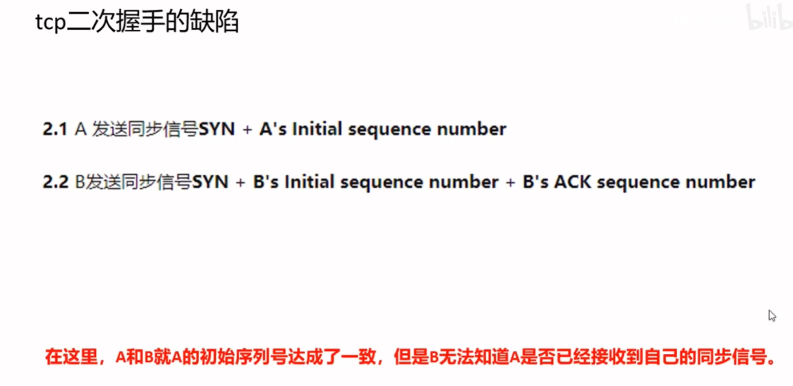

# TCP/IP

## TCP/IP网络分层

## 网络模型

## 发送请求给baidu.com

注：http/1.0是非持久性连接，http/1.1才开始持久性连接

## Ethernet标准的不同帧格式

## socket 

## syns queue(半连接队列)和 accept queue(全连接队列)

## tcp握手

## tcp挥手

端口释放了，协议栈不一定释放

