# 二分网络投影和个人推荐

[Bipartite network projection and personal recommendation (ncu.edu.cn)](http://cwres.ncu.edu.cn/s/net/cnki/schlr/G.https/en/Detail/index/GARJ0010_3/SJAPDCE5A2E7A5F37290C29E9339CE5EFF43)

## 一、引言

​	过去几年见证了致力于理解复杂网络的大量活动。一类特殊的网络是**二分网络**，其节点被分为两组 X 和 Y，并且只允许不同组中的两个节点之间的连接，如图 1 所示。许多系统自然建模为二分网络 ：人类性网络  由男性和女性组成，代谢网络  由化学物质和化学反应等组成。两种双向网络之所以重要，是因为它们在社会、经济和信息系统中具有特殊的意义。**所谓的协作网络，一般被定义为一个由共同协作行为连接起来的行为者网络**。这样的例子不胜枚举，包括科学家通过共同撰写科学论文，电影演员通过共同出演同一部电影而联系起来，等等。此外，合作网络的概念不一定局限于社会系统，例如，最近关于软件技术合作的报告和城市交通系统。尽管协作网络通常是通过对行动者的单模投影来显示的，见后面的定义，但它的完全表示法是一个二方网络。另一个被称为 "意见网络 "，其中用户集中的每个节点都与对象集中收集的对象相连。例如，听众与他们从音乐共享库中收集的音乐组相连，例如au- dioscrobbler.com，网络用户与他们在书签网站中收集的网页相连，例如 "美味 "，顾客与他们购买的书籍相连，例如Amazon.com。

​	最近，人们对分析和建模的二元网络给予了很大关注。然而，为了方便直接显示一组特定的节点之间的关系，二方网络通常通过单模投影进行压缩。一个只有X节点的网络，当两个X节点至少有一个共同的相邻Y节点时，它们是相连的。图1和图1c分别显示了X和Y投影的结果网络。最简单的方法是将二方网络投射到非加权网络上，而不考虑一个合作被重复的频率。尽管从这个未加权的版本中可以定性地获得一些拓扑逻辑属性，但信息的损失是明显的。例如，如果两个听众收集了100多个音乐组，每个听众在audioscrobbler.com收集的音乐组的平均数量为140个，而两个听众只选择了一个音乐组，人们可以得出结论，这两个听众可能有不同的音乐品味。相反，如果近100个音乐团体属于重叠，这两个听众很可能有非常相似的习惯。然而，在非加权听众投影中，这两种情况的图形表示完全相同。

​	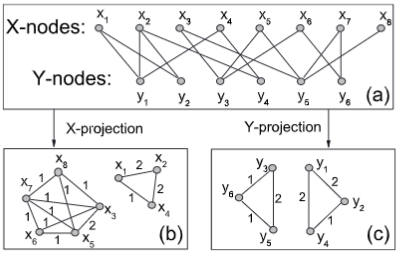

 1. 二分网络 

    a，以及它的 X 投影

    b，带 Y 投影

    c，带 cis 中的边权重分别设置为 Y 和 X 中共同邻居的数量。

​	由于单模投影的信息量总是小于原始的双胞胎网络，为了更好地反映网络的结构，我们必须使用双胞胎图来量化投影图中的权重。直截了当的方法是直接用相关的伙伴关系重复的次数来加权一条边。这个简单的规则用于获得图 1 和 2 中的权重。1band 1c 分别用于 X 和 Y 投影。这个加权网络比非加权网络信息量大得多，而且可以用非加权图的标准技术进行分析，因为它的权数都是整数。然而，这种方法在数量上也是有偏差的。Li等人37尝试性地研究了科学合作网络，并指出一篇额外的合作论文的影响应该取决于两个作者之间的原始权重。例如，对于之前只合作过一篇论文的两位作者来说，多一篇共同授权的论文应该比已经合作过100篇论文的两位作者的影响更大。这种饱和效应可以通过在合作次数的简单计数上引入双曲正切函数来加以考虑。纽曼指出，在一篇论文中与许多其他共同作者的名字一起出现的两位作者对彼此的了解，平均来说要比作为论文唯一作者的两位作者少，为了考虑这种影响，他引入了1/n-1的因素，以削弱涉及许多参与者的合作的贡献，其中n是参与者的数量，例如，论文的作者数量

​	如何权衡这些边缘是一模式推算及其使用的关键问题。然而，我们缺乏对这一问题的系统探索，迄今为止，还没有任何加权方法的坚实基础被报道。例如，人们可能会问，为什么使用双曲正切函数来解决饱和效应37，而不是其他无限可能的候选人的物理原因。此外，为了简单起见，加权相邻矩阵$w_{ij}$总是被设定为对称的，也就是说，$w_{ij}= w_{ji}$。然而，就像科学界的合作网络一样，不同的作者可能会给同一篇共同授权的论文分配不同的权重，可能是发表论文少的作者给的权重高，反之亦然。因此，一个更自然的加权方法可能是不对称的。先前方法的另一个缺陷是，相邻X节点Y节点为1度的边所包含的信息将在Y投影X投影中丢失。在一些真实的意见网络中，这种信息损失可能很严重。例如，在 "美味 "http://del.icio.us 的用户网络中，有一部分网络只被收集过一次，有一部分用户只收集了一个网络。因此，用户投射和网络投射都会浪费大量的信息。由于《数学评论》中一半以上的出版物只有一个作者31，所以在数学合作网络中情况更加糟糕。因此，用户投射和网络投射都会浪费大量的信息。由于《数学评论》中一半以上的出版物只有一个作者，所以在数学合作网络中情况更加糟糕。

​	与意见网络密切相关的一个核心问题是如何提取隐藏的信息并做个人推荐。互联网和万维网的指数式增长使人们面临着信息过载的问题。他们面对太多的数据和来源，能够找出那些与他最相关的数据。形成过滤的一个里程碑是使用搜索引擎，然而，它不能解决这个过载问题，因为它没有考虑到个性化，因此对习惯相差甚远的人来说，返回的结果是一样的。因此，如果用户的习惯与主流不同，他很难在无数的搜索结果中找到自己喜欢的东西。到目前为止，有效过滤信息过载的最有潜力的方法是亲自推荐。也就是说，**利用用户的个人信息，即该用户活动的历史轨迹来发现他的习惯，并在推荐中考虑这些习惯**。例如，Amazon.com使用一个人的购买历史来提供个人建议。如果你买了一本统计物理学的教科书，亚马逊可能会向你推荐一些其他的统计物理学书籍。基于发达的WEB2.0技术，推荐系统经常被用于基于网络的电影分享、音乐分享、图书分享等系统，基于网络的销售系统，书签网站，等等。在经济和社会意义的激励下，最近，高效推荐算法的设计成为从营销实践到数学分析，从工程科学到物理学界的共同焦点。

​	在这篇文章中，我们提出了一种加权方法，即不对称加权（i.e $w_{ij}≠w_{ji}$）并且允许的自我连接，即$w_{ii}>0$。此外，我们还产生了一个连接双方的桥梁：**双联网络投影和个人推荐**。数值模拟表明，直接应用所提出的预测方法，作为个人推荐算法，可以比广泛使用的全局排名方法GRM和协作过滤CF有明显的优势。

## 二、方法	

### A. 二分网络投影

​	在不丧失一般性的前提下，我们讨论如何确定`X`投影中的边的权重，其中**权重$w_{ij}$可以看作是节点`i`在`j`意义上的重要性**，它一般不等于$w_{ij}$。例如，在客户-图书意见网络的图书项目中，两本书i和j之间的权重$w_{ij}$有助于向客户推荐`i`书的强度，前提是他已经购买了`j`书。在科学合作网络中，**$w_{ij}$反映了`j`选择`i`作为一个新研究项目的贡献者的可能性有多大**。更笼统地说，我们假设**每一个`X`节点都有一定量的资源**，如推荐权、研究基金等，而权重$w_{ij}$代表`j`想分配给`i`的资源比例。为了推导出$w_{ij}$的解析表达式，我们回到二分表示。由于二分网络本身是未加权的，任意 `X` 节点中的资源应该平均分配给它在 `Y` 中的邻居。类似地，任何`Y`节点的资源都应该平均分配给其`X`邻居。如图2a所示，**三个X节点被初步分配了权重x、y和z**。资源分配过程包括两个步骤：首先从`X`到`Y`，然后再回到`X`。每一步之后的资源量分别在图2带2c中标出。将这两个步骤合二为一。

​	双向网络投影和个人

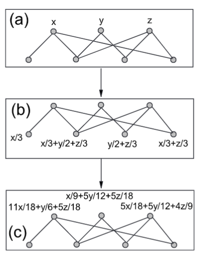

​																									图2. 二方网络中资源分配过程的说明。

​	上面的三个是`X`节点，下面的四个是`Y`节点。整个过程包括两个步骤。首先，资源从`X`流向`Y` (`a→b`)，然后返回`X` (`b→c`)。不同于现有的基于网络的资源分配动态，这里的资源只能从一个节点集流向另一个节点集，而不考虑一个节点集之间的渐进式稳定流动。

​	位于这三个`X`节点上的最终资源，用`x`、`y`和`z`表示，可以得到一个

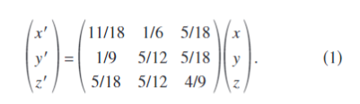

​	请注意，这个`3 x 3`矩阵是列标准化的，第`i`行和第`j`列的元素代表第`j`个`X`节点转移到第`i`个`X`节点的资源部分。根据上述描述，这个矩阵是我们想要的**非常加权的相邻矩阵。**

​	现在，考虑一个通用的二部网络 `G(X, Y , E)`，其中 `E `是边的集合。` X` 和` Y `中的节点由 `x1 、 x2 、  . . , xn` 和 `y1 , y2 , . . . , ym `分别。位于第 `i` 个` X` 节点上的初始资源是 $f(xi)>=0$。第一步后，`X`中的所有资源都流向`Y`，位于第`l`个`Y`节点上的资源读取

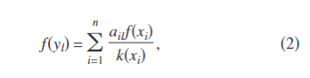

​	其中$k_{xi}$是$x_i$的度数，$a_{il}$是一个`nm`的相邻矩阵。

​	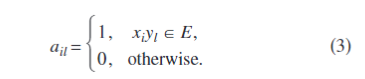

​	下一步，所有资源流回`X`，最终位于$x_i$上的资源读取

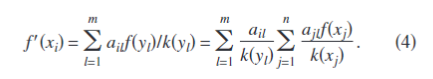

​	这可以改写为

​	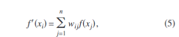

​	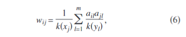

​	这是对$x_i$和$x_j$之间所有两步路径的贡献之和。矩阵$W=\{{wij\}_{nxn}}$代表我们正在寻找的加权X投影。资源分配过程可以写成矩阵形式，即$\vec{f'}= W\vec{f}$

​	值得强调的是这种加权方法的特殊性。为方便起见，我们以科学合作网络为例，但我们的陈述并不限于合作网络。首先，加权矩阵不是对称的，因为

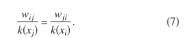

​	这符合我们的日常经验——**如果科学家已经发表了很多论文，那么一篇合作论文的权重就相对较小，反之亦然**。其次，`W`中的对角线元素是非零的，因此，与一度Y节点相关的连接所包含的信息不会丢失。实际上，对角线元素是每列中的最大元素。只有当所有 $x_i$ 的 `Y` 邻居都属于 $x_j$ 的邻居集时，$w_{ii}=w_{ji}$。它通常出现在科学合作网络中，因为有些学生与他们的导师共同撰写每篇论文。因此，比率$w_{ji}/ w_{ii}$1可以被认为是$x_i$对$x_j$的研究独立性，比率越小，研究者的独立性越强，反之亦然。$x_i$ 的独立性可以近似地测量为

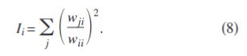

​	一般来说，经常单独发表论文，或经常与不同合著者发表多篇论文的作者更独立。因此，在这里介绍$I_i$的措施只是为了说明如何使用自重$w_{ii}$所包含的信息，而没有评论更独立是否更好，或相反。

### B. 个人推荐

​	基本上，一个推荐系统由用户和对象组成，每个用户都收集了一些对象。注意到对象设置为$ O= \{o1 , o2 , . . . , o_n \} $并且用户集为 $\{U = u1 , u2 , . . . ，u_m\}$。如果只允许用户收集他们不评价的对象，则推荐系统可以用一个 $nm$ 相邻矩阵 $a_{ij} $来完全描述，其中如果 $u_j$ 已经收集了 $o_i$，则 $a_{ij}$=1，否则 $a_{ij}=0$。一个合理的假设是，你已经收集的物品是你喜欢的，而推荐算法的目的是预测你的个人意见，你对那些你尚未收集的物品喜欢或讨厌到什么程度。	一个更复杂的例子是投票系统，其中每个用户都可以给对象评分，例如在雅虎音乐中，用户可以用五个离散的评分对每首歌曲进行投票，分别代表“不再播放”、“没关系， ” “喜欢它”，“喜欢它”和“不能得到足够的”，而推荐算法则集中于估计对象的未知评分。这两个问题是密切相关的，然而，在本文中，我们重点讨论前者（**预测个人意见**）的情况。

​	用$k(o_i)=\sum_{j=1}^m aij$表示对象$o_i$的程度。全球排名方法GRM将所有对象按程度递减的顺序进行排序，并推荐程度最高的对象。尽管**缺乏个性化**导致GRM的性能不尽如人意，见下一节的数字比较，但它被广泛使用，因为它很简单，**节省了计算资源**。例如，众所周知的 "雅虎百强MTV"、"亚马逊畅销榜"，以及许多科学期刊中下载量最大的文章排行榜，都可以被认为是GRM的结果。迄今为止，应用最广泛的**个人推荐算法是协同过滤 CF**，它基于用户之间的相似性度量。因此，对特定用户的预测主要是使用相似的用户。用户 $u_i$ 和 $u_j$ 之间的相似度可以用 Pearson-like 来衡量

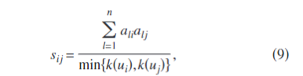

​	其中$k(u_i)= \sum_{l=1}^n a_{li}$是用户$u_i$的等级。对于任何用户-对象对$u_i-o_j$，如果$u_i$还没有收集到$o_j$，即$a_{ji}$=0，通过CF，预测的分数，$v_{ij}$在多大程度上喜欢$o_j$，给出为

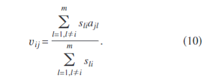

​	两个因素导致 $v_{ij}$ 的高值。首先，如果 $o_j$的度数较大，一般来说，方程的分子中有更多的非零项。其次，如果 $o_j$ 经常被与 $u_i$ 非常相似的用户收集，那么相应的项目将是重要的。前者尊重全局信息，后者体现个性化。对于任何一个用户ui来说，所有非零的vij与aji=0被按降序排序，那些在顶部的对象被推荐。

​	我们提出了一种推荐算法，它是上述二部网络加权方法的直接应用。布局很简单：**首先通过对象投影压缩二分用户 - 对象网络，我们标记为 G 的结果加权网络。然后，对于给定的用户 $u_i$，将一些资源放在 $u_i $已经收集的那些对象上**。为简单起见，我们将位于 G 的每个节点上的初始资源设置为

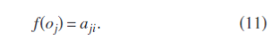

​	也就是说，如果对象$o_j$已经被$u_i$收集到了，那么它的初始资源就是unit，否则就是0。因此，捕获个人偏好的初始配置对不同的用户来说是不同的。初始资源可以不被理解为给每个收集的对象提供一个单位的推荐容量。根据上一节讨论的加权资源分配过程，最终的资源，用向量fI表示，就是$\vec{f'}$= $W\vec{f}$。因此，$f'$的组成成分

​	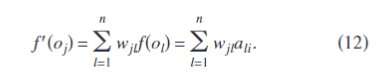

​	**对于任何用户 $u_i$，他所有未收集的对象 $o_j$$ (1 <= j <= n, a_{ji}=0 )$按照 $f'(o_j)$ 的降序排列，推荐最终资源值最高的那些对象**。将此方法称为**基于网络的推理 NBI**，因为它基于加权网络 G。注意，方程的计算。 12应该重复m次，因为不同用户的初始配置不同。

### C..数值结果

​	我们使用一个基准数据集，即 MovieLens，来判断所描述算法的性能。Movie-Lens 数据从 GroupLens Research 的网站下载 http://www.grouplens.org。这些数据包括1682部电影对象和943个用户。实际上，MovieLens是一个评分系统，每个用户对电影进行5个离散的评分，即1-5分。因此，我们应用了类似于参考文献中使用的粗粒度方法。原始数据包含105个评分，其中85.25%是3分，因此，粗略获得后的用户-电影二方网络包含85 250条边。为了测试推荐算法，将数据集，即 85 250 条边随机分为两部分：训练集包含 90% 的数据，其余 10% 的数据构成探针。**训练集被视为已知信息，而探针集的任何信息都不允许被用于预测。**

​	所有三种算法 GRM、CF 和 NBI 都可以为每个用户提供所有未收集电影的有序队列。对于任意用户 $u_i$，如果边缘 $u_i−o_j$ 根据训练集在探针集中，$o_j$ 是 $u_i$ 的未收集电影，我们测量 $o_j$ 在有序队列中的位置。例如，如果 $u_i$有 1500 个未收集的电影，并且 $o_j$是从顶部开始的第 30 个，我们说 $o_j$的位置是前 30/1500，用 $r_{ij}=0.02$ 表示。由于探针条目实际上是由用户收集的，因此期望一个好的算法给他们很高的建议，从而导致小的 r。 GRM、CF 和 NBI 对探头中条目的平均位置值的平均值分别为 0.139、0.120 和 0.106。图 3 报告了所有位置值的分布，从顶部位置 r→0 到底部位置 r→1 排列。显然，NBI 是最好的方法，而 GRM 的表现最差。

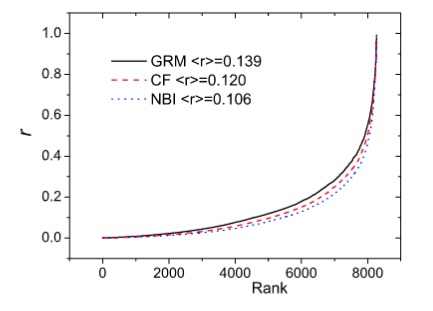

​	图3. 在线颜色探针中每个条目的预测位置按递增顺序排列。黑色、红色和蓝色的曲线，从上到下，分别代表GRM、CF和NBI的情况。平均值为前13.9%的GRM，前12.0%的CF，和前10.6%的NBI。

​	为了使这项工作与现实生活中的推荐系统更相关，我们引入了一种算法准确性的度量，该度量取决于推荐列表的长度。用户 $u_i$的推荐列表，如果长度为 L，则包含由算法产生的 L 个最高推荐电影。或者探测中的每个事件条目 ui−oj，如果 $o_j$ 在 $u_i$ 的推荐列表中，我们说条目 $u_i−o_j $被算法“命中”。命中条目与总体的比率称为“命中率”。对于给定的L，命中率越高的算法越好，反之亦然。如果 L 大于用户未收藏电影的总数，则推荐列表定义为他所有未收藏电影的集合。很明显，命中率随 L 单调增加，对于足够大的 L，上限为 1。在图 4 中，我们将不同算法的命中率报告为 L 的函数。根据图 3，算法的精度为 NBI CF GRM。一些典型推荐列表长度的命中率如表一所示。

​	总之，通过对基准数据集的数值计算，我们证明了 NBI 的性能明显优于 GRM 和 CF，这有力地保证了当前加权方法的有效性。

### D.结论与讨论

​	边的加权是构建二部网络投影的关键问题。本文我们提出了一种基于资源分配过程的加权方法。本方法有两个突出的特点。**首先，加权矩阵不对称，节点具有二分网络中较大的度数通常为其事件边缘分配较小的权重。其次，加权矩阵中的对角元素为正，这使得加权单模投影的信息量更大。**

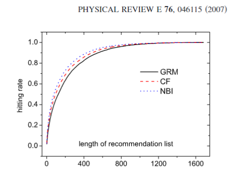

​	此外，我们提出了一种基于这种加权方法的个人推荐算法，其性能比最常用的全局排名方法以及协同过滤要好得多。 尤其是，该算法是无调谐的，即不依赖于任何控制参数，这对潜在用户来说是一个很大的优势。本文的主要目标是介绍一种加权方法，并提供从该方法到推荐系统的桥梁。所提出的推荐算法只是一个粗略的框架，其细节尚未得到详尽的探讨。例如，初始配置的设置可能过于简单，更复杂的形式，例如 foj= ajikoj，可能会导致比呈现的 = 0 更好的性能。还鼓励人们考虑资源分配过程 53 的渐近动态，这最终会导致某些特定的迭代推荐算法。虽然这样的算法需要更长的 CPU 时间，但它可能比现有算法给出更准确的预测。

​	如果我们用ku和k来表示用户和对象在二方网络中的平均程度，CF的计算复杂度为$Om^2<ku>+mn<k_o>$，其中第一项是用户之间相似度的计算，见公式9，第二项是预估分数的计算，见公式10。代入方程 n ko= m ku，我们只剩下 Om2 ku。 NBI 的计算复杂度为 Om ku2+ mn ku，其中两项分别用于计算加权矩阵和最终资源分配。这里 ku2 是二分网络中用户度分布的二阶矩。显然，ku2n ku，因此结果形式是 Omn ku。请注意，在许多推荐系统中，用户数量通常远大于对象数量。 例如，康柏公司提供的 "EachMovie "数据集包含m=72 916个用户和n=1628部电影，而Netflix公司为一百万用户提供了近2万部在线电影。音乐分享系统和在线书店也是如此，注册用户数比可用对象大一个数量级以上。因此，NBI 的运行速度比 CF 快得多。另外，NBI需要n2个内存来存储加权矩阵wij，而CF需要m2个内存来存储相似度矩阵sij。因此，NBI 能够在推荐算法的所有三个标准中击败 CF：准确性、时间和空间。然而，在一些推荐系统中，例如在书签共享网站中，对象的数量（例如网页）远远大于用户数量，因此 CF 可能更实用。

## 三、致谢

​	这项工作得到了 SBF Switzerland 通过项目编号 C05.0148 风险物理和瑞士国家科学基金会项目编号 205120-113842 的财政支持。 T.Z.感谢 Sang Hoon Lee 提出的宝贵建议，并感谢国家自然科学基金委员会的支持，资助号为 10635040。

